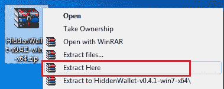
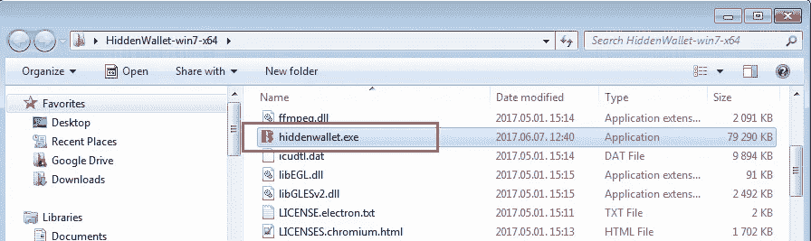
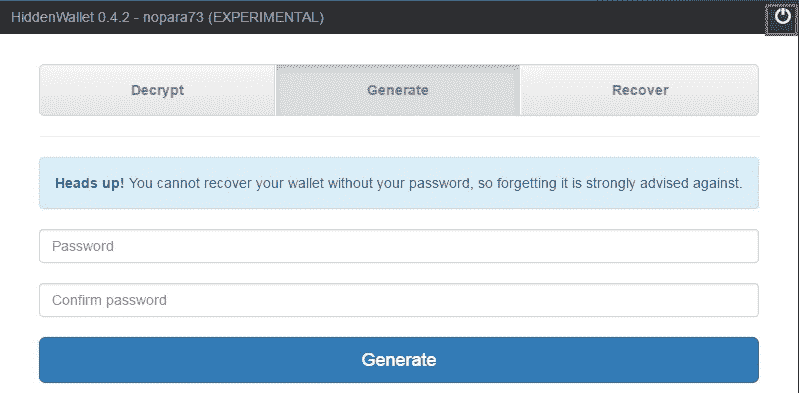
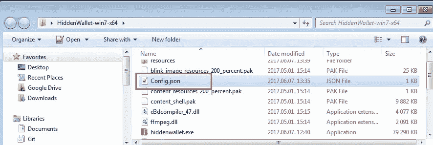
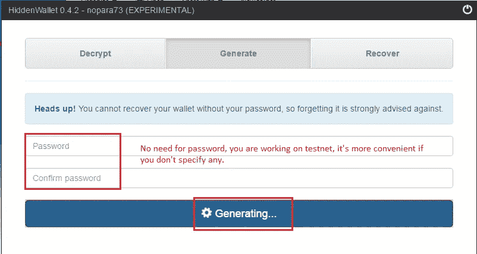
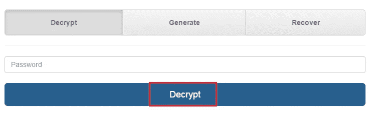
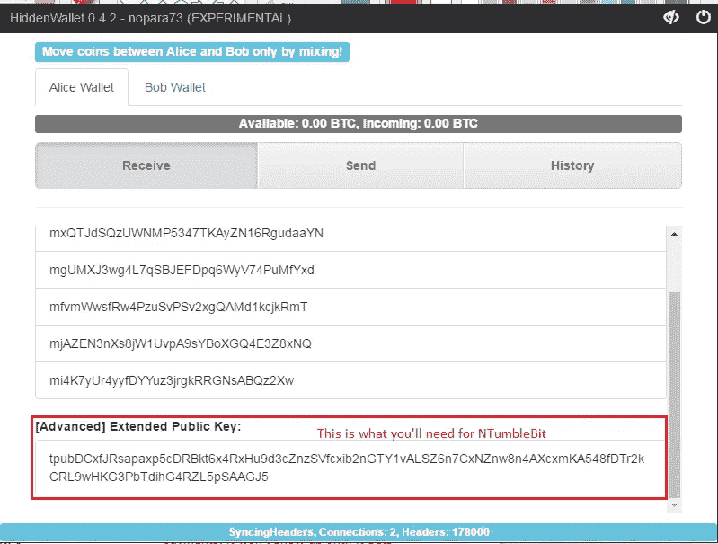
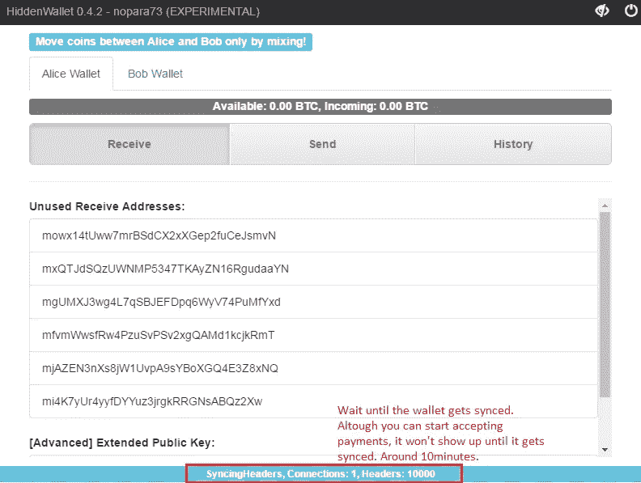

# 理解 TumbleBit 第 5 部分:尝试一下！

> 原文：<https://medium.com/hackernoon/understanding-tumblebit-part-5-try-it-out-65b7a8d21a96>


安德烈亚斯·安东诺普洛斯曾经提到，如果他被关进监狱，他会通过玩数独游戏来重新发明一种离线版本的比特币共识算法。在比特币聚会上进行这样的角色扮演比你最初想象的要有意义得多，让我来解释一下为什么。

在安迪·亨特的书中，[实用主义的思考和学习](https://pragprog.com/book/ahptl/pragmatic-thinking-and-learning)他讲述了一个他如何学习攀岩的故事。首先，他花了很多钱上了一堂课，然后老师告诉大家:“去爬墙”，然后去喝了杯咖啡。爬了半个小时的墙，骂了一句懒教官，回来就开始讲解怎么爬墙。在经历了一段时间后，这个解释比之前更有意义。原因是因为有**两种主要的学习方式:综合和分析。亲爱的读者，如果你不能在攀岩课上分辨出哪个是哪个，那你就是没有注意。**

角色扮演是一种类似的综合学习体验。既然玩数独需要人，而你只是屏幕前的孤家寡人，我就不下角色扮演兔子洞了，我只是提供一个类似的合成学习体验。我们将介绍如何在经典 Tumbler 模式下使用 TumbleBit 的 pre-alpha 版本，使用 HiddenWallet 作为接收输出钱包，而无需深入的理论知识。请跟随我，亲身体验一项实验技术。

在我们开始之前有几个注意事项。

*   是的，是的，我知道，如果我想以爬壁老师为榜样，我应该用这篇文章开始整个[理解 TumbleBit 系列](https://hackernoon.com/understanding-tumblebit-part-1-making-the-case-823d786113f3)，然而当时软件还没有。
*   如果你碰巧读到这篇文章，假设在文章发表半年后，你将会遇到额外的困难，或者我应该说是需要克服的挑战，这些困难是由这些快速发展的软件中的变化带来的。
*   HiddenWallet 不会以这种方式集成 TumbleBit。这将是一种方便用户的方式。这只是使用 HiddenWallet 作为 NTumbleBit 的输出钱包，你可以认为它类似于 TumbleBit 内核。
*   作为参考，NTumbleBit 的最新指令可在此处找到，HiddenWallet 的最新指令可在此处找到。你当然可以浏览它们，但是它们不像这篇文章那样有趣和通俗易懂。

# 1.安装一堆开发工具

是的，在这篇文章结束时，你将成为一个铁杆程序员，我们不会选择简单地运行可执行文件。

## (a-b) Git 和。网络核心

对于 HiddenWallet 和 NTumbleBit，你都需要 [Git](https://git-scm.com/downloads) 和[。NET Core](https://www.microsoft.com/net/core) 出现在你的系统上。。NET 核心是跨平台，开源。NET 框架。它使我们能够用我们最喜欢的语言 C#编写代码，而 Git 是一个超级复杂的工具，只有一个目的，就是让程序员之间的协调更加困难。

## (三)比特币核心

对于 NTumbleBit 你只需要[比特币核心](https://bitcoin.org/en/download)。不要就此停止，您将在 testnet 上使用它，它比 mainnet 要简单得多，因此您可以尝试一下。

安装并下载后，创建/编辑您的比特币. conf:

```
# Run on the test network instead of the real bitcoin network.
testnet=1# server=1 tells Bitcoin-Qt and bitcoind to accept JSON-RPC commands
server=1# RPC user and password
rpcuser=bitcoinuser
rpcpassword=bitcoinpassword
```

最后，执行 bitcoind 或 bitcoin-qt，允许它赶上网络并向它获取 3+ testnet 币。谷歌是你的朋友。

## Node.js

对于 HiddenWallet，您需要在您的系统上安装 [Node.js](https://nodejs.org/en/download/) ，因为它的图形用户界面是用 Electron 编写的，它是在 Node.js 中编写的。
在编写时，如果您在 Windows 上，您只需[下载 HiddenWallet](https://github.com/nopara73/HiddenWallet/releases) 的二进制文件，然后就不需要安装 Node 了。
节点是服务器端的 JavaScript。因为。NET Core 相对较新，没有好的方法来编写跨平台的 GUI，我被迫用另一种语言编写，因此给你增加了一个要求。

## 职权范围

Tor 是只有恋童癖恐怖分子才会使用的工具，下载它当然会让你成为他们中的一员。
在我写这篇文章的时候，Tor 还没有集成到 NTumbleBit 中，虽然过几天我有时间的时候可能会集成到 ntumble bit 中，但是它已经集成到 HiddenWallet 中了。
在 HiddenWallet 中，如果您使用的是 Windows 的[版本二进制文件](https://github.com/nopara73/HiddenWallet/releases)您可以跳过这一步，这些二进制文件附带了内置的 Tor 支持，但是如果您使用的是 OSX 或 Linux，您需要确保 Tor 位于您的路径中。

# 2.获取隐藏钱包

## (a)简单的方法:对于 Windows 用户

1.  [下载发布二进制文件](https://github.com/nopara73/HiddenWallet/releases)并解压存档文件夹:



2.运行 HiddenWallet，然后立即关闭它，不生成新的钱包。运行它一次将为您创建一个配置文件。因为你在测试网上工作，你必须事先编辑它，我会给你更多的说明。



## (b)不太容易的方法:对于非 Windows 用户

启动终端或命令行，用 Git 克隆 repo，恢复所需的包，用。NET Core，确保 Tor 在正确的位置，安装需要的 npm 包并启动 GUI。

1.  `git clone [https://github.com/nopara73/HiddenWallet.git](https://github.com/nopara73/HiddenWallet.git)`
2.  `cd HiddenWallet/HiddenWallet/HiddenWallet.API`
3.  `dotnet restore`
4.  `dotnet build`
5.  `dotnet publish -r win7-x64 --output bin/dist/current-target`
    在这里找到你的平台标识符[并替换`win7-x64`。如果这里出现错误，不要担心，只需将您的平台标识符添加到`HiddenWallet.API/HiddenWallet 中的`<RuntimeIdentifiers>`标签中。API.csproj 文件。](https://github.com/dotnet/docs/blob/master/docs/core/rid-catalog.md#windows-rids)
6.  仅在 Windows 上:—将`HiddenWallet.Packager/tor.zip`复制并解压缩到`HiddenWallet.API/bin/dist/current-target`目录。
    关于解压缩的快速说明，到 tor.exe 的最终路径必须是:`current-target/tor/Tor/tor.exe`而不是:`current-target/tor/tor/Tor/tor.exe`
7.  `cd ../HiddenWallet.GUI)`
8.  `npm install`
9.  `npm start`
10.  立即关闭它，而不产生新的钱包。运行它一次将为您创建一个配置文件。因为你在测试网上工作，你必须事先编辑它，我会给你更多的说明。

# 3.设置并运行 NTumbleBit

## (一)。克隆和恢复

启动终端或命令行，用 Git 克隆 repo。然后用。网络核心:

```
git clone [https://github.com/NTumbleBit/NTumbleBit/](https://github.com/NTumbleBit/NTumbleBit/)
cd NTumbleBit/
dotnet restore
```

## (b)运行客户端

运行客户端一次，它将生成您的默认配置文件。

```
cd NTumbleBit.CLI
dotnet run -testnet
```

## (c)编辑配置文件

客户端的配置文件可以在非 Windows 平台上的用户主目录中的`.ntumblebit/TestNet/client.config`处找到，在 Windows 平台上的用户主目录中的`%appdata%\NTumbleBit\TestNet\client.config`处找到。
根据您使用的 rpc 凭证，使您的配置文件看起来像这样:

```
rpc.url=[http://localhost:18332/](http://localhost:18332/)
rpc.user=bitcoinuser
rpc.password=bitcoinpassword
tumbler.server=[http://testnet.ntumblebit.metaco.com](http://testnet.ntumblebit.metaco.com)
outputwallet.extpubkey=tpubDCeHeZ4A66VU78YDJ1yKtnR7uVPf8rRU1thtCXtyzZ3XQXBqc3HFaqMPH1fxESjFvR4CyhyDqT3NuNKSnWc5HC6dD8cePbTaEUU6HF1MUND
outputwallet.keypath=
```

将 outputwallet.keypath 留空，从 HiddenWallet 中获取自己的 extpubkey，这样就可以更改 outputwallet.extpubkey 了。您已经运行了一次 HiddenWallet 并关闭了它，因此必须为您生成一个 Config.json 文件:



打开它:


将网络设置为 TestNet，并将 CanSpendUnconfirmed 设置为 True。尽管这很危险，但它使测试变得更容易，而且因为您是在 TestNet 上工作，所以您不需要关心安全性。

生成钱包:



解密它:



并获取您的 extpubkey:



HiddenWallet 是一个完整的块 spv 钱包，以保护您的隐私，它不会询问远程服务器或节点对什么交易感兴趣，而是询问比特币网络的所有交易，并在本地选择感兴趣的交易，因此不会将其暴露给第三方。这带来了长时间同步的不便:



现在您已经设置好了，可以在 testnet 上使用 TumbleBit 了！

# 4.翻滚！

确保你的比特币核心已经赶上了 testnet 链。[获得一些测试网硬币](http://lmgtfy.com/?q=get+testnet+faucet)，超过 1 tbtc，并开始翻滚:

```
cd NTumbleBit.CLI
dotnet run -testnet
```

通过运行 NTumbleBit。CLI，每次循环后 HiddenWallet 都会收到一些硬币。testnet 服务器的命名为 1 tbtc。需要 24 个街区才能将你的第一枚硬币放进你的隐藏钱包，之后每两个街区一枚硬币。
未来，根据流动性的不同，TumbleBit 的发展速度会比现在快得多，而且面额也可能会发生变化。我们还没有开始找出最佳点和最佳参数。

不要忘记，这是 TumbleBit 的经典不倒翁模式，支付中心模式将更强大，更快，更便宜。
按下`Enter`可以停止 NTumbleBit。CLI 处理并使用`dotnet run -testnet -onlymonitor`命令再次运行它，它将告诉 CLI 不要开始翻滚更多硬币，而是完成正在处理的硬币。
你可以通过检查比特币核心的 watch only 地址来查看资金是否仍在暴跌。一旦这个过程结束，手表地址上应该就没有钱了。

# 最终注释

就是这样！这就是我们今天的处境。我知道这仍然是可怕的，复杂的和繁琐的，但是它变得越来越容易，每天都在取得进展。我希望你至少喜欢它并且学到了一些东西。

[](http://bit.ly/HackernoonFB)[](https://goo.gl/k7XYbx)[](https://goo.gl/4ofytp)

> [黑客中午](http://bit.ly/Hackernoon)是黑客如何开始他们的下午。我们是 [@AMI](http://bit.ly/atAMIatAMI) 家庭的一员。我们现在[接受投稿](http://bit.ly/hackernoonsubmission)，并乐意[讨论广告&赞助](mailto:partners@amipublications.com)机会。
> 
> 如果你喜欢这个故事，我们推荐你阅读我们的[最新科技故事](http://bit.ly/hackernoonlatestt)和[趋势科技故事](https://hackernoon.com/trending)。直到下一次，不要把世界的现实想当然！

