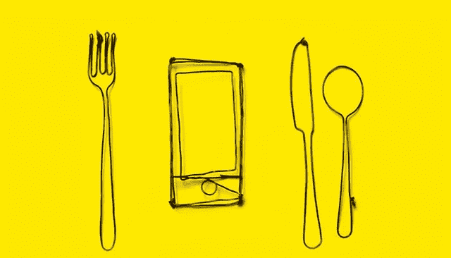
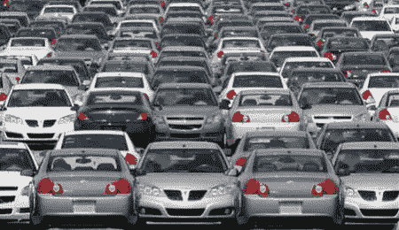
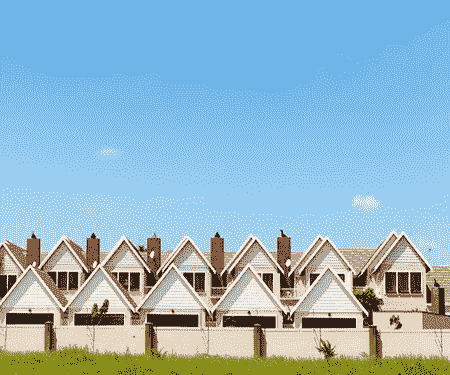
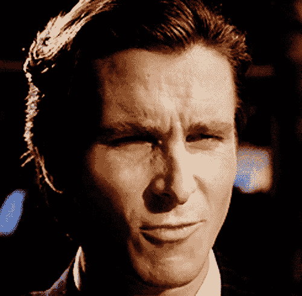

# 非设计:如果明天设计消失了会怎样？

> 原文：<https://medium.com/hackernoon/undesign-what-if-design-disappeared-tomorrow-f1e31e2fb25f>

> 一切都是设计好的，很少有东西是设计好的。

布莱恩·里德

人们经常抨击设计师。发生这种情况有很多原因——从不舒服的椅子到糟糕的脸书隐私政策设计，再到需要双捏才能使用的应用程序。

虽然这些东西应该被憎恨，但不应该被指责的是设计，而是设计师。

尽管他们有时会因为对概念的应用而名誉扫地，但这并不意味着设计是不必要的或邪恶的。大规模的设计决策和[微观用户体验](https://reinvently.com/blog/micro-ux-explained-8-examples/)对于人们将要看到或使用的几乎任何东西的成功都是至关重要的。

你一天中经历的任何事情都是在某个时刻被设计好的。当你今天早上开车或者坐公交车去上班的时候，你正在和各种各样的设计互动。

**现在，你正在与一个由许多工程师和工业设计师精心设计的显示器互动。**

看看你周围。你看到了什么？

是的，这都是设计。

我们和很多人谈过这个问题，其中不少是设计师；有人说，一个没有设计的世界“听起来是个不错的主意”，这实际上凸显了设计的主要问题。

没有设计的**世界会是田园诗般的概念完全颠覆了设计的本来面目。取消**设计**的想法并不新鲜。**

这个概念源于对设计经常被低估的挫折感。有一种普遍的误解，认为设计是关于泡沫和风格以及坐在上面的东西，而不是下面的深层结构。

> 没有设计的世界会是田园诗般的，这种想法完全颠覆了设计的初衷。

一种误导的观念认为，设计师从事的是操纵，而不是生产更好的东西来让世界变得更美好。后一点看起来有点太无私了，但是没有这个基础，就不会有设计，也不会有设计师。

> 人们倾向于认为设计师没有进入工程或法学院。这就是为什么他们会去设计学校。但是有些人真的想成为设计师。人们需要看到设计师只是让东西看起来漂亮的事实。约翰·谭

有一种普遍的误解，认为设计是关于泡沫、风格，关于坐在上面的东西，而不是下面的结构基础。但是让我们暂时忘记办公椅和应用程序，试着想象一个世界，在这个世界里，设计作为一个概念和一门学科都不存在。

**完全没有设计。我们会爱那个世界吗？**

无设计会成为设计问题的解决方案吗？

让我们试着通过列举一些后果来描述那个世界的一些方面。

# 人们会受苦

救护车、警察、消防员……让他们(无论从制服还是车辆设计上)在车流中清晰地脱颖而出，不仅仅是设计师的心血来潮。如果没有这个设计，这些拯救生命的打击犯罪的车辆看起来就像你在匆忙中的普通汽车。

交通甚至不知道某处有人正处于严重的困境中，需要他们的帮助。

By happymap

颜色、声音和汽车的整体概念都是专门设计的，以便在道路上变得可见和显示重要性。

**作为旁注:** [**设计一个手机 App 要多少钱？**](https://reinvently.com/blog/how-much-it-costs-to-design-a-mobile-app/)

# 决策将变得几乎不可能

从购物到选择银行(大学等)。)你将完全依赖自己的笔记，因为没有小册子或传单或任何品牌材料可以依赖。

你的日常超市购物将变成一个地狱——没有通道标志或产品标签,产品之间的差异几乎看不出来。

餐馆的菜单会是杂乱无章的，文本和图形信息只是分散在那里，没有特定的顺序。哦，是的，你可能甚至不知道你在哪家餐馆。

你阅读书籍、杂志和报纸的能力将被严重削弱或丧失，因为你很难把注意力集中在没有适当排版或布局的纯文本上。在整个出版物中缺乏可辨别的结构和任何有意义的解释性图表或照片会使每一次印刷/在线阅读成为一次可怕的经历。

# 一切都会变得丑陋

好吧，乔布斯先生，设计不仅仅是看起来怎么样，但是，嘿，那是最重要的。众所周知，美学上更有吸引力的产品更受顾客欢迎。

我们不仅根据功能，还根据外观和感觉来选择我们想要的东西。往往我们的选择更多的是被后者所驱使。但是忘掉华丽的衣服吧。没有漂亮新智能手机的广告。

艺术作品甚至也不存在于非设计的世界中。你的笔记本电脑只是一个尖角的盒子，所有的按钮都没有特定的顺序散落在那里。

# …和 booooooring

儿童游乐园不会存在，因为你需要设计师来设计设备。没有卡通和电视广告(这个还不错，嗯？)以及电视的其他很多方面。哦，是的，[互联网看起来就像](https://twitter.com/search?f=realtime&q=%23webdesign%20%23flashback%20%23Friday&src=typd)又回到了 1993 年，只有基于文本的浏览器来帮你导航。

制服的概念将会消失，婚纱和普通服装也会消失。一切都会变得平淡无奇，没有人会有独特的风格。

> 在一个没有设计的世界里，好消息是你的办公室会是一个更好的地方，没有墙上那烦人的“保持冷静和[在此插入活动]”的东西。

建筑物和街道都将是灰色的，无法居住和行走。园丁也是设计师，所以没有美丽的灌木和树木可以在阳光明媚的春日里欣赏花朵。

国家将没有旗帜，墙壁将没有海报，音乐专辑将没有艺术作品，使这个世界成为一个无色缺乏想象力的地方。好消息是你的办公室将会是一个更好的地方，没有墙上那烦人的“保持冷静和[在此插入活动]”的东西。

**为你推荐:** [**如何知道是否知道你的 App 有没有可用性问题**](https://reinvently.com/blog/how-to-detect-app-usability-issues/)

# 企业将陷入巨大的麻烦

没有品牌或独特风格，企业将无法开展任何营销活动:没有广告，没有创意活动，没有知名度。

智能手机上没有苹果。

销售会下降，因为这在很大程度上取决于设计。产品中的界面需要花很长时间来解读，没有人能给混乱的布局带来简单和秩序。

> 在《美国惊魂记》中，有一个场景是他们在谈论他们的名片有多棒。这是平面设计师做的。

Patrick Bateman (Christian Bale) in “American Psycho” (2000)

长话短说——没有设计，交流将会非常受阻，如果可能的话。人类创造的任何东西都是以这样或那样的方式设计的。因此，公平地说，即使没有设计的世界是可能的，那个世界也不是文明的，因为没有人类的干预(这就是设计)。

**你愿意生活在非设计的世界里吗？**

> 我们不是在非设计的世界里。
> 
> 需要为你的应用或网站设计 UI/UX 吗？
> 
> [**让我们让它发生**](https://reinvently.com/ui-ux-design/)

*原载于* [*脱胎换骨的见解*](https://reinvently.com/blog/)