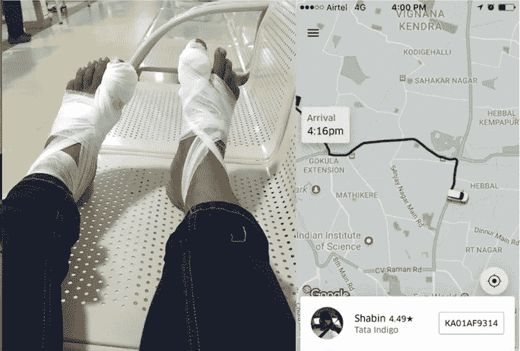
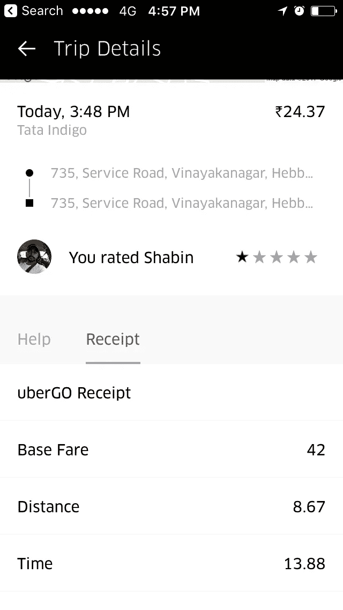
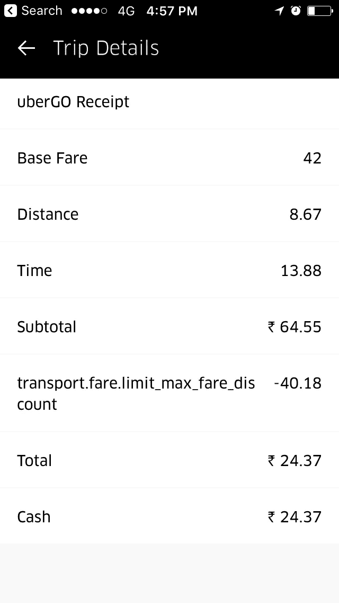
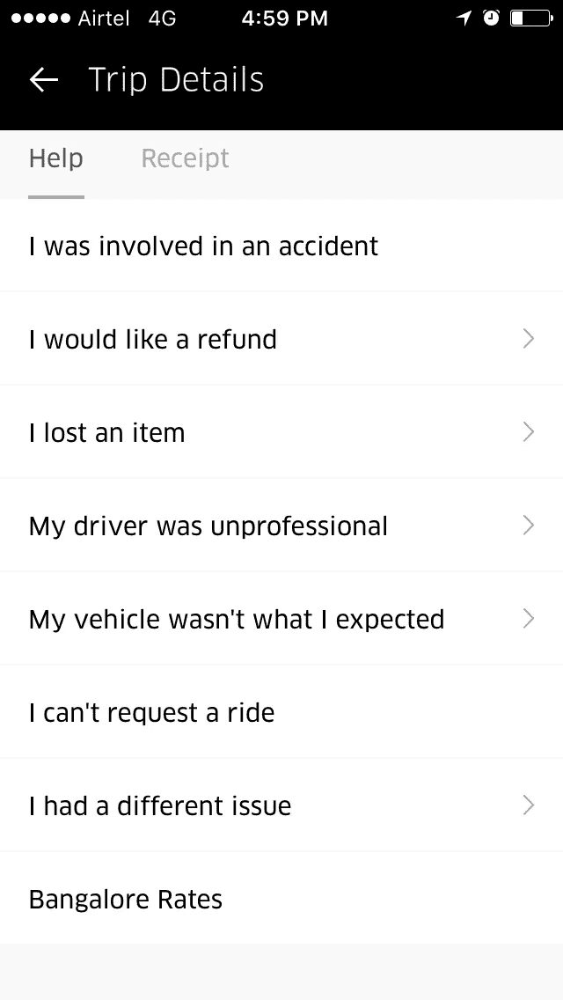

# 冷漠，粗鲁的优步司机，#ApniHiGaadi 是个笑话

> 原文：<https://medium.com/hackernoon/unempathetic-rude-uber-drivers-apnihigaadi-is-a-joke-614aca763ad3>

在班加罗尔浸信会医院做完手术后，我预约了优步。我预计 8 分钟后到达。它还告诉我，司机正在附近完成一次旅行。

我坐在轮椅上在医院门口等了将近 10 分钟。我看到车来了，他让乘客下车。我放开了对司机的手。他看见我了。他开车走了，没理我。

我可以原谅这一点，但这就是他所做的。他标明旅行已经开始。现在，我不能预订另一次乘坐，除非当前的旅行已经完成。我很无奈，只好等他完成了假行程。

现在，我该如何抱怨呢？去点击你有问题。他们对所有的问题都有现成的理由。

现在让我们看看他们是如何在印度宣传自己的。

多关心，多有同情心，对吗？他们声称这是你的车，你的方式#ApniHiGaadi(印度语)…

# 一个笑话