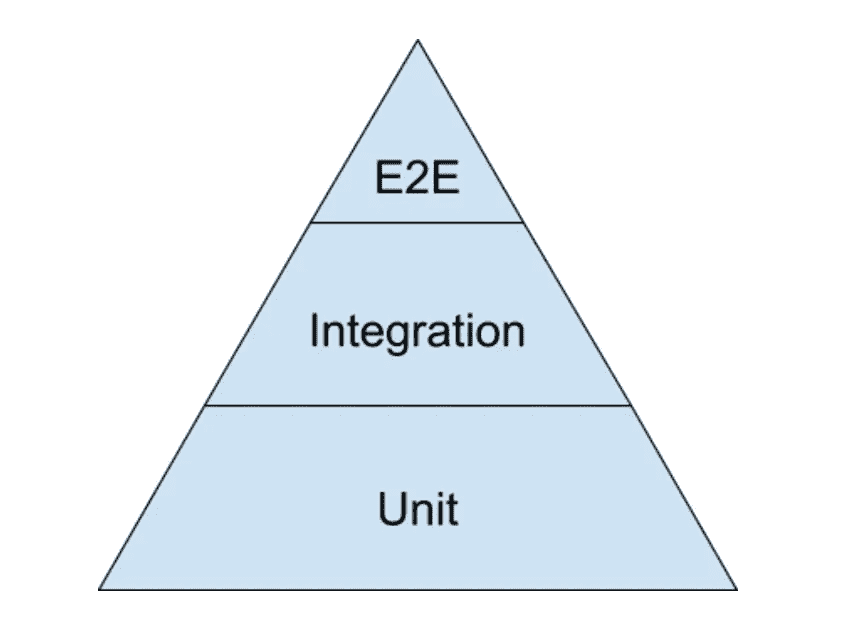
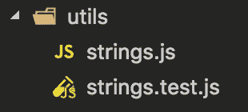
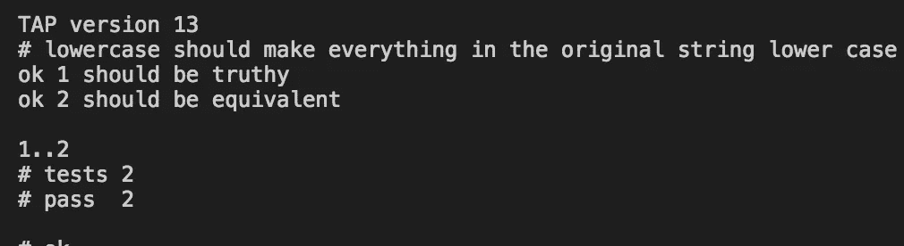

# 用磁带对 Node.js 进行单元测试

> 原文：<https://medium.com/hackernoon/unit-testing-node-js-38cf2b7e1a41>


[Guillaume Flandre](https://unsplash.com/@gflandre)

我觉得有一种倾向，那就是忘记我们，或者其他人，将不得不在代码创建几周、几个月甚至几年后维护我们的代码。迟早会出现一些问题或新特性，这将使你不得不在忘记它所做的所有细节后很久才修改你的代码库。

> 测试就像留下一份你的代码应该做什么的活文档

# 测试类型

我将特别关注单元测试，但只是给你一个思路:

*   单元测试——当代码依赖于数据库等外部资源时，通常使用虚假数据来测试功能；
*   集成——假设您有一个数据库连接，集成测试是指您测试从该连接获得的数据；
*   端到端——用于带有 UI 的应用程序，基本上是让[测试](https://hackernoon.com/tagged/test)模拟用户会做什么。



The distribution is usually like this, end to end are the less amount you do and unit the most

因此，根据图片，假设您已经实现了所有这三种类型的测试，您有 10 个测试 1 个应该是端到端的，2 个是集成的，剩下的 7 个是单元测试。

你不必忠实地遵循这个标准，它只是一个好的指导方针。

你可以广泛阅读由[马丁·福勒](https://martinfowler.com/articles/mocksArentStubs.html)撰写的关于测试的文章。

# 为什么要测试

测试项目代码很重要，原因如下:

*   逻辑是有文档记录的——不言自明的，只要通过阅读测试，你就可以对代码应该做什么有一个大致的了解；
*   更快的调试——如果出了问题，你将通过看到测试失败而得到即时反馈；
*   对新特性的担心更少——当开发可能对现有代码产生影响的新特性时，您可以改变逻辑，因为您知道如果您破坏了代码的任何部分，测试将会告诉您失败。

有一些有争议的缺点，比如:

*   开发需要更多的时间——我反驳说，你花在测试开发和调试上的时间比你本来要花的时间要多；
*   团队需要学习的另一件事是——项目中通常有相当大的技术堆栈，最终可能成为“我必须学习的另一件事”

# **行话**

您通常看到的与测试相关的一些术语是:

*   断言——这是你在测试中试图证明的，如果你在测试相等性和返回值的类型，你会说你有两个断言。每个测试可以有尽可能多的断言，但是为了简单和可读性，尽量保持每个测试有很少的断言；
*   间谍——间谍是指当你使用一个真实的方法，而你的测试代码依赖于这个方法来工作；
*   fixtures——模拟应用程序的特定状态的代码或文件，以便每当您想要评估特定状态时，总是有一个固定的环境来重复您的测试；
*   存根——您希望减少测试中的外部影响(如间谍),因此为了对测试有更多的控制，我们模拟了一种方法，这种方法是测试代码工作所必需的，而不是使用原来的方法。例如，假设我们使用第三方库来连接，我们会用自己的方法替换那个库的原始方法；
*   模拟——这些是您自己为测试工作而创建的硬编码值，其中一个例子是测试使用的服务器响应样本。

在这里你可以用例子[进行更详尽的解释。](https://blog.pragmatists.com/test-doubles-fakes-mocks-and-stubs-1a7491dfa3da)

# 例子

对于这个例子，我将使用一个轻量级的模块库来扩展它，用于单元测试，称为 [tape](https://github.com/substack/tape) ，但是你也可以选择 jest、jasmine 和 mocha。

理想情况下，你应该尝试使用 TDD(测试驱动开发)或者类似的方法，从创建测试开始，并且只在创建代码之后。当这是不可能的，并且你正在测试的方法已经被实现时，确保你改变你的方法，以便你看到你的测试失败。如果测试没有失败，那么你什么也没有测试。

让我们假设我们想要创建一个名为 *string* 的实用程序文件，它将有一个用于小写的方法和一个用于连接的方法。我们创建自己的文件



I prefer the tests near the file being tested approach but some people have all the tests in a separate folder, I leave it up to your preference to decide which approach to take

在我们的测试文件中，我们用两个断言创建了我们的第一个测试，一个用于检查一切是否运行“正常”,另一个调用小写函数并将结果与预期的硬编码值进行比较

```
const test = require('tape')
const stringUtils = require('./strings.js')test('lowercase should make everything in the original string lower case', function (t) {
  const result = stringUtils.lowercase('Testing lowerCase')
  const expected = 'testing lowercase' t.ok(result)
  t.deepEqual(result, expected) t.end()
});
```

这就是我们运行测试的地方，我们看到它悲惨地失败了，因为 lowercase 没有被定义，所以我们使用我们的 *string.js* 并让它返回一个带有方法 *lowercase* 的函数

```
function lowercase(value) {
  return value.toLowerCase()
}module.exports = {
  lowercase,
}
```

如果我们再次运行测试，应该会显示成功！万岁！第一次测试通过！



现在我们想“如果我给那个方法发送一个数字会怎么样？”在这种情况下，我们创建另一个测试来测试它，并根据我们的预期行为来实现，在这种情况下，我希望当一个无效类型被发送到我们的方法时抛出一个错误

测试

```
test('if we send a number it should throw an error from lowercase method', function(t) {
  const result = stringUtils.lowercase.bind(null, 1)
  t.throws(result)
  t.end()
})
```

我们看到测试失败后改变的函数

```
function lowercase(value) {
  try {
    return value.toLowerCase()
  } catch(e) {
    throw e
  }
}
```

一个很好的方法是改变你的测试代码的随机部分，这样你就可以确保你的测试确实是有用的。在这种情况下，您可以更改`return`的`throw`。

> 请注意，磁带中的测试必须有`t.plan([assertionsNumber])`或`t.end()`，否则测试将会挂起。

对于我们的 concatenate 方法，我们想测试它是否连接，当你发送一个对象时，我们希望它连接为{}而不是[object Object]。你可以自己试试，或者看看下面可能的解决方案

测试

```
test('concatenate should return the two strings concatenated', function (t) {
  const result = stringUtils.concatenate('test', 'concat')
  const expected = 'test concat'

  t.deepEqual(result, expected)
  t.end()
})test('concatenate should consider {} as a string', function (t) {
  const result = stringUtils.concatenate('test', {})
  const expected = 'test {}'
  t.deepEqual(result, expected)
  t.end()
});
```

该功能

```
function concatenate(start, end) {
  start = typeof start === 'string'
    ? start
    : JSON.stringify(start)
  end = typeof end === 'string'
    ? end
    : JSON.stringify(end) return `${start} ${end}`
}
```

现在用新方法出口

```
module.exports = {
  lowercase,
  concatenate
}
```

这是为简单起见而做的“琐碎”测试，您应该为每个方法添加您认为必要的数量，“越多越好”，只要它们是有用的(这意味着他们正在测试方法的核心内容，而不仅仅是“有更多的断言”)。

随着应用程序的增长，我们可以添加多个测试文件，并且我们可以使用下面的代码来运行它们

```
tape ./utils/*.test.js
```

> 这个例子的演示[在这里](https://github.com/daspinola/unit-test-node-sample)

对于现有的项目，您可以从为新功能添加测试开始，对于旧功能，在添加测试的同时重构代码，最终您将不得不传播到大部分代码库，如果不是全部的话。

> 记住总是看到测试失败

# 代码覆盖率

有像[伊斯坦堡](https://github.com/gotwarlost/istanbul)这样的工具来检查你的代码有多少被测试，我不喜欢过多地关注这个指标，因为它会让你拿你的代码冒险，不是因为你需要，而是因为你想有 100%的覆盖率，你想开发测试的新功能，而不必花太多时间来适应代码，只是为了达到 100%。

测试 10%的代码比什么都不测试要好，尽管如此，如果你想强加一个最小的覆盖率，我会说 70%是一个好的起点。

30 篇文章的第 9 篇，每周至少发表一篇文章的项目的一部分，从闲思到教程。留下评论，在[迪奥戈·斯皮诺拉](https://medium.com/u/fef03c291e56?source=post_page-----38cf2b7e1a41--------------------------------)上关注我，然后回到你的精彩项目中去！