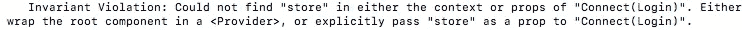

# 单元测试冗余连接组件

> 原文：<https://medium.com/hackernoon/unit-testing-redux-connected-components-692fa3c4441c>

## 模拟函数和冗余存储


Testing React+Redux with Jest+Enzyme

当我写上一篇[文章](https://hackernoon.com/implementing-basic-component-tests-using-jest-and-enzyme-d1d8788d627a)时，我故意忽略了如何测试连接的组件。对于连接到 Redux store 的组件，设置测试文件和编写测试需要花费更多的精力。对于这个例子，我使用 Jest 和 Enzyme 来做测试。我将谈一谈如何使用模拟存储和模拟函数来测试这些组件。

# 我们如何测试它们？

我将继续以我的登录组件为例。该组件的代码如下所示，

```
// app/src/components/Login.js
import React from 'react'
import { connect } from 'react-redux'
import { loginUser } from '../actions/users'class Login extends React.Component {constructor() {
  super()
  this.state = {
   username: '',
   password: ''
  }
 }handleInputChange = (event) => {
  this.setState({
   [event.target.name]: event.target.value
  })
 }handleSubmit = (event) => {
  event.preventDefault()
  this.props.login(this.state)
 }render() {
  return (
   <form id='loginForm' className='login' onSubmit={this.handleSubmit}>
    <label>Username</label>
    <input id='email' onChange={this.handleInputChange} name='email' type='text' />
    <label>Password</label>
    <input id='password' onChange={this.handleInputChange} name='password' type='password' />
    <button>Submit</button>
   </form>
  )
 }
}function mapDispatchToProps(dispatch) {
 return {
  login: (userparams, history) => {
   dispatch(loginUser(userparams, history))
  }
 }
}export default connect(mapDispatchToProps)(Login)
```

我将这个组件连接到我的 Redux 存储，并为调用 handleSubmit 函数的表单添加了一个 onSubmit 事件。我添加了 mapDispatchToProps 函数，它返回我的登录函数。这将调用我的操作创建者并分派我的登录用户操作。当表单提交后，它应该从 props 中调用我的登录函数，该函数将负责登录用户。

当试图为一个连接的组件编写一个测试时，您可能会遇到这个错误消息，



此消息是 Jest 试图找到您的 Redux 商店，但无法找到它的结果。这很有意义，因为我们的测试文件与应用程序是分开的，所以我们没有创建商店或设置 Redux。

## 我们如何解决这个问题？

在我研究的时候，我发现了解决这个问题的几种不同的方法。有两个主要选择，都得到不同团体的支持。我主要看到了在连接到 Redux 时测试组件和在没有连接到 Redux 时测试组件之间的分歧。我将简单介绍一下每种方法，并告诉您我更喜欢哪一种。

## 使用模拟存储测试组件

在我看来，这种测试组件的方式是不推荐的。当使用这种方法时，我们越过了单元测试的边界，而是开始测试集成。我将向您展示如何建立一个模拟商店，但我不会用这种方法展示任何测试。

正如你所看到的，上面的错误信息给了我们两种解决问题的方法。我们可以显式地创建一个存储，并将其传递给我们连接的登录组件，或者我们可以将登录组件包装在保存存储的 Redux 提供程序中。我建议使用第一种方法，因为这样就不需要安装我们的组件，我们可以用浅层渲染来代替。[挂载](https://github.com/airbnb/enzyme/blob/master/docs/api/mount.md)需要酵素渲染完整的 DOM，而[浅层渲染](https://github.com/airbnb/enzyme/blob/master/docs/api/shallow.md)只需要渲染组件。

集成商店的一种方法是使用 redux-mock-store 来创建它。将它添加到您的项目运行中

```
npm install redux-mock-store --save-dev
```

这将允许我们创建一个存储来传递给我们连接的组件。这就是我们如何创建一个模拟商店，

```
// app/src/components/__tests__/Login-test.jsimport configureStore from 'redux-mock-store' // create any initial state needed
const initialState = {}; // here it is possible to pass in any middleware if needed into //configureStore
const mockStore = configureStore();
let wrapper;
let store;beforeEach(() => { //creates the store with any initial state or middleware needed  
  store = mockStore(initialState)
  wrapper = *see below...*
 })
```

传递给组件的两种方式是这样的，

```
wrapper = shallow(<Login store={store}/>)
                        OR
// not suggested
wrapper = mount(<Provider store={store}<Login /></Provider>)
```

如果您查看 Redux 模拟商店文档，就会发现创建这个库的原因是为了测试动作创建者和中间件。当我们以一种不是最初设计的方式使用这个库时，这似乎已经是一个危险信号了。

有了这个模拟商店，我们可以测试通过动作创建者发送到我们商店的动作，看看它们是否与预期的动作相匹配。这更像是一个集成测试，测试我们组件的整个流程。这比单独测试应用程序的所有部分更复杂，也更没有必要。我觉得有一种更简单的方法来测试我们的组件，以确保它在 Redux 下正常工作。

## 测试没有冗余存储的组件

如果我们在组件没有连接到 Redux 存储时测试它，我们就不必担心创建模拟存储的额外工作。相反，我们只是测试组件的功能，看看它是否如我们所期望的那样运行。为此，我们可以简单地导出未连接的组件，以及连接组件的默认导出。我们通过在组件前添加导出来实现这一点，

```
// app/src/components/Login.js
import React from 'react'
import { connect } from 'react-redux'// add export here to export the unconnected component
**export** class Login extends React.Component { // ...code above
}function mapDispatchToProps(dispatch) {
 return {
  login: (userparams, history) => {
   dispatch(loginUser(userparams, history))
  }
 }
}export default connect(mapDispatchToProps)(Login)
```

现在，当我们将组件导入到测试中时，我们必须像这样编写它，

```
// app/src/components/__tests__/Login-test.js
import { Login } from '../Login'
```

这将导入未连接的元件，而不是默认的连接元件。

因为我们没有商店，所以用于登录的 mapDispatchToProps 函数没有提供给我们的组件。通过用 Jest 创建一个模拟函数，我们可以很容易地解决这个问题。这个函数将代替我们的动作创建者，我们将能够测试它是否被调用。为此，我们可以将此代码添加到我们的测试文件中，并将此函数作为我们的登录属性传递，

```
// app/src/components/__tests__/Login-test.jsdescribe('Login Component', () => {
  let wrapper;
  // our mock login function to replace the one provided by mapDispatchToProps
  const mockLoginfn = jest.fn();

   beforeEach(() => {
     // pass the mock function as the login prop 
     wrapper = shallow(<Login login={mockLoginfn}/>)
   })// ...tests here...
}
```

这取代了 mapDispatchToProps 传递给我们的组件的登录函数。没有必要测试我们的 mapDispatchToProps 是否正确地将我们的登录函数传递给连接的组件，因为 Redux 已经负责这个。现在我们的组件已经有了那个函数，我们可以测试当我们提交登录表单时我们的函数是否被调用。测试的代码如下所示，

```
// app/src/components/__tests__/Login-test.js\describe('When the form is submitted', () => {
  it('should call the mock login function', () => {
   wrapper.find('#loginForm').simulate(
     'submit', 
     {preventDefault() {}}
   )
   expect(mockLoginfn.mock.calls.length).toBe(1)
  })
})
```

当我们模拟表单的提交时，我们需要在事件对象中传递 preventDefault 函数，否则我们会得到一个错误。这是因为 handleSubmit 函数将调用 event.preventDefault()，如果我们不包含它，就会发生错误。一旦我们模拟了提交事件，我们就可以测试我们的模拟登录函数，看看它是否被调用了。我们的 mockLoginfn 本质上是一个间谍，就像您使用 Sinon 库一样。因此，通过检查以确保我们的 mockLoginfn 被调用一次，我们验证了当我们提交表单时，它将调用正确的 prop 函数并发送正确的动作。我们还可以添加一个测试，在这里我们填写用户名和密码字段，然后模拟提交。当我们这样做时，我们可以检查我们的 mockLoginfn，以确保它被传递了正确的参数。看起来像这样，

```
it('should be called with the email and password in the state as arguments', () => { // fill in email field with [blah@gmail.com](mailto:blah@gmail.com)     
   wrapper.find('#email').simulate(
     'change', 
     {target: 
       {name: 'email', value: '[blah@gmail.com](mailto:blah@gmail.com)'}
     }
   ) // fill in password field with cats  
   wrapper.find('#password').simulate(
     'change', 
     {target: 
        {name: 'password', value: 'cats'}
     }
   ) // simulate form submission   
   wrapper.find('#loginForm').simulate(
     'submit', 
     {preventDefault() {}}
   ) // test to see arguments used after its been submitted 
   expect(mockLoginfn.mock.calls[1][0]).toEqual(
     {email: '[blah@gmail.com](mailto:blah@gmail.com)', password: 'cats'}
   )
  })
```

我们检查 mockLoginfn.mock.calls[1],因为我们在之前的测试中已经调用了 mockLoginfn。Calls[1]给了我们一个传入的参数数组。我们只使用了一个对象，所以我们测试数组中的第一个索引。

# 摘要

在我看来，第二种测试方式要简单得多，可以减少代码和测试时间。通常在测试 react 应用程序时，我们可以将 Redux 部分与组件分开测试。因为我们的动作创建者和还原者本质上都是函数，所以我们可以像测试其他 Javascript 函数一样测试它们。在一次测试中测试从部件到动作到减速器再到悬挂物的整个流程并不重要。这将是一个集成测试，而不是我们组件的单元测试。如果我们能够通过自己的单元测试来确定每个部分都正常运行，那么我们就不需要任何其他东西。希望这有助于澄清您在编写连接组件的测试时可能遇到的任何问题！

# 来源:

 [## 编写测试冗余

### 编辑描述

redux.js.org](https://redux.js.org/docs/recipes/WritingTests.html) [](https://facebook.github.io/jest/docs/en/mock-functions.html) [## 模拟函数 Jest

### 模拟函数通过删除实际的

facebook.github.io](https://facebook.github.io/jest/docs/en/mock-functions.html) [](https://github.com/airbnb/enzyme/issues/1002) [## 使用 Enzyme Issue #1002 airbnb/enzyme 测试 Redux 连接的组件

### 酶 I)使用酶测试冗余连接组件时，最不容易出错的方法是什么？我查了很多链接…

github.com](https://github.com/airbnb/enzyme/issues/1002)  [## redux 模拟商店文档

### 最简单的用例是同步动作。在本例中，我们将测试 addTodo 操作是否返回…

arnaudbenard.com](http://arnaudbenard.com/redux-mock-store/) [](/netscape/testing-a-react-redux-app-using-jest-and-enzyme-b349324803a9) [## 使用 Jest 和 Enzyme 测试 React-Redux 应用程序

### 随着我们进入新的一年(2017 年)，我想暂停写一些让我兴奋的东西，比如开发…

medium.com](/netscape/testing-a-react-redux-app-using-jest-and-enzyme-b349324803a9) [](https://github.com/reactjs/redux/issues/1534) [## 不能引用包装在提供者中的容器或通过与 Enzyme 连接问题#1534 反应…

### 我好像引用不了什么包装在 a 和 a 中的 connect//test let component = shallow()；component.find('#abc…

github.com](https://github.com/reactjs/redux/issues/1534)