# unite js–角度/ Aurelia /预作用/反应/在 4 分钟内转化为电子

> 原文：<https://medium.com/hackernoon/unitejs-cli-angular-aurelia-preact-react-vue-to-electron-in-4-mins-22aea20ba7f9>

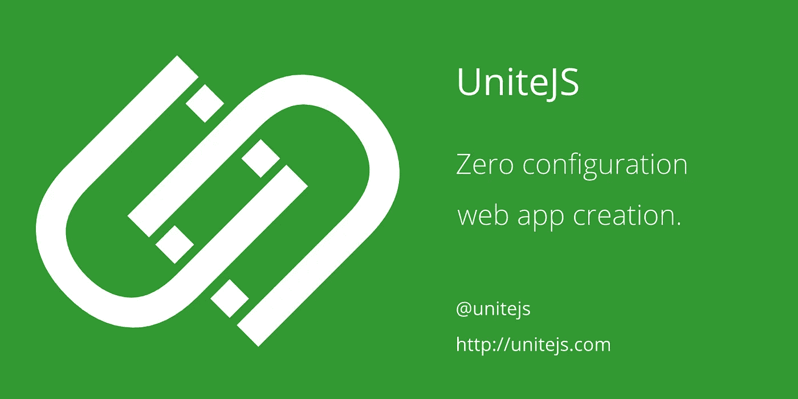

包括构建、单元测试、开发和生产的 E2E 测试。

众所周知，如今网页并不是水疗的唯一目的地。许多应用程序需要直接在设备上运行，而不需要浏览器。

这是一个简短的指南，展示了 UniteJS CLI 中可用的工具，使用您选择的框架(Angular/Aurelia/Preact/React/Vue)创建一个电子应用程序。

整个创建、构建、测试和打包过程只需 4 分钟(不包括节点模块安装，我们只安装一次)

在这个例子中，我们将使用 npm 进行节点模块管理，但是 yarn 也同样适用。

# 第一步

将 Unite JS CLI 作为全局包安装。

```
npm install -g unitejs-cli
```

添加其他全局先决条件。

```
npm install -g gulp
```

# 第二步

用你想要的配置创建一个应用程序，选项见[http://unitejs.com/#/cli](http://unitejs.com/#/cli)，或者使用在线 CLI 生成器[http://unitejs.com/#/generator](http://unitejs.com/#/generator)，在这个例子中我们将选择 Angular TypeScript

```
unite configure --profile=AngularTypeScript --packageName=unitejs-electron-test --title="Electron QuickStart"
```

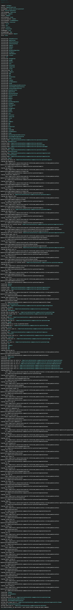

应用程序创建成功。

# 第三步

让我们添加电子作为平台目标，我们现在这样做，所以我们只需安装一次节点模块。您可以在开发过程中的任何时候和任何其他平台目标一起这样做，如果以后添加平台，您只需安装节点模块。

```
unite platform --operation=add --platformName=Electron
```

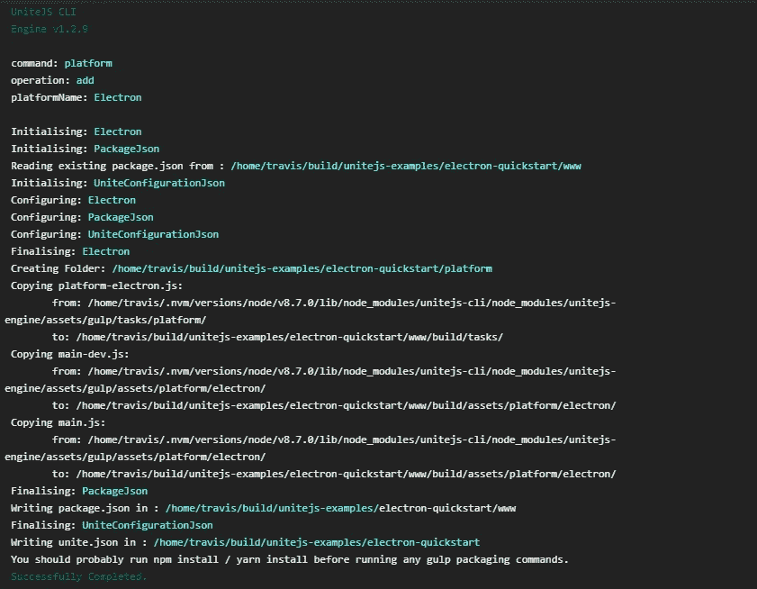

平台添加，这很简单。

# 第四步

进行节点模块安装(我们不将此计入总时间，因为这是一次性交易)。

```
cd www
npm install
```

所有的包都安装好了，让我们继续建造吧。

# 第五步

在我们构建任何代码之前，最好为我们的应用程序创建图标和主题，如果你愿意，可以跳过这一步。修改。中的 svg 文件。/www/assetSrc/theme/然后运行。

```
gulp theme-build
```

图标已创建，看起来不错。

# 第六步

只需构建应用程序。

```
gulp build
```

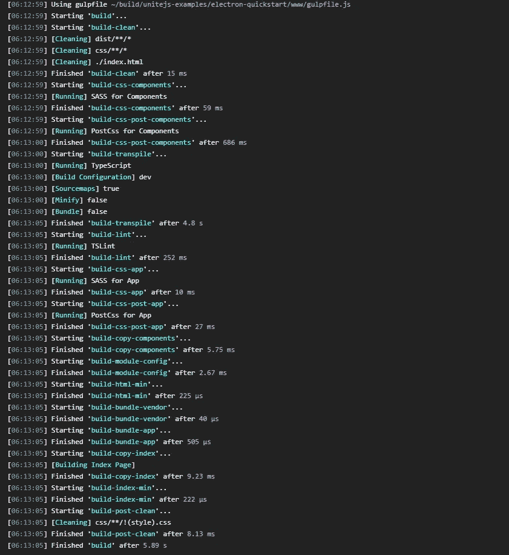

构建成功，此时您可以运行 gulp serve 并在浏览器中看到应用程序，但这不是我们这次的目标，让我们继续。

# 第七步

让我们运行单元测试。

```
gulp unit
```

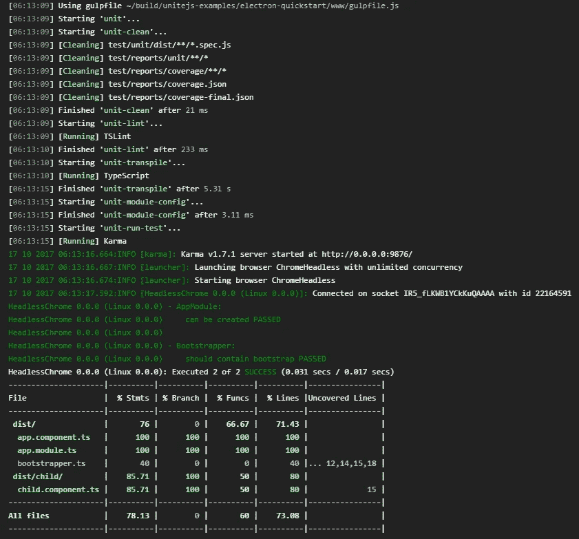

又成功了，嗯，我们需要增加代码覆盖率。

# 第八步

为 E2E 测试安装 selenium 驱动程序(这也是一次性交易，因此不包括在总时间内)

```
gulp e2e-install
```

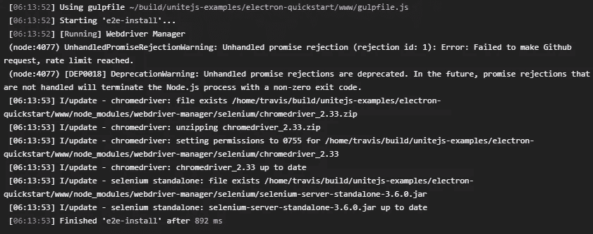

驱动程序安装完毕，让我们继续进行 E2E 测试。

# 第九步

做 E2E 测试。

```
gulp e2e
```

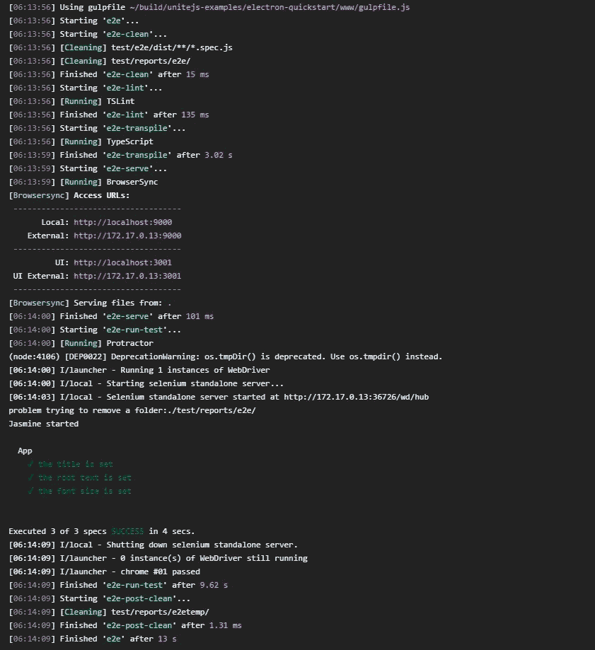

看起来它们工作得很好，这是代码加载和渲染正常的好迹象。

# 第十步

我们现在有一个开发构建，所以让我们使用电子创建一个开发包装，这将指向 www 文件夹，所以无论那里的代码是什么，你都会在电子应用程序(目前的开发构建)中看到。

```
gulp platform-electron-dev
```

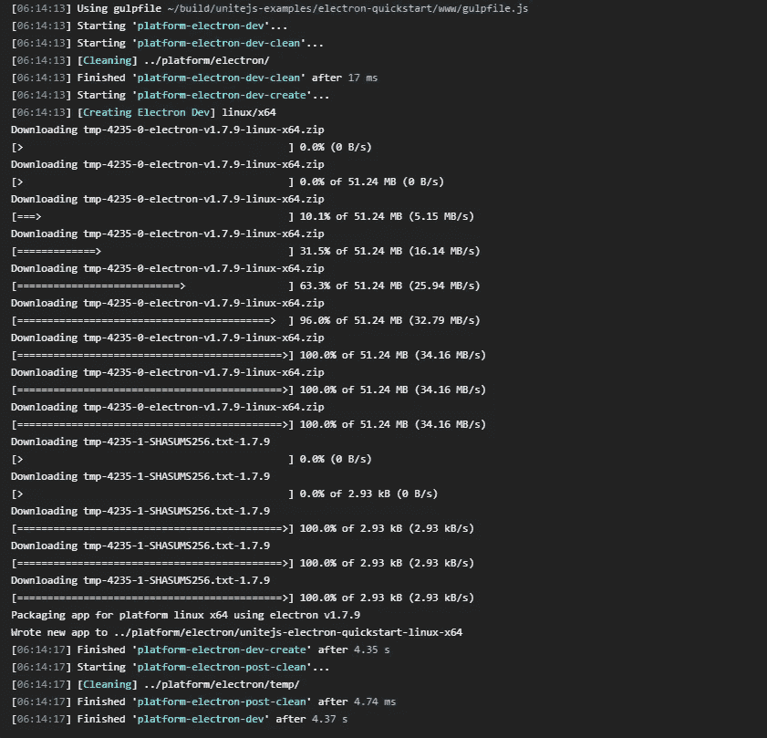

该任务试图确定您运行的平台，并相应地为 Electron 创建一个平台/架构组合。它将下载该平台的电子运行时，并在文件夹中构建它

```
./platform/electron/{platform}-{architecture}/.
```

可以覆盖平台/架构组合，或者通过修改 unite.json 可以拥有多个平台/架构组合，请参见。/www/readme.md 了解更多详细信息。

这个图标是 electronic 的默认图标，这使得区分这个开发版本和一个使用正确图标的生产版本变得更加容易。现在你应该能够运行该文件夹中的可执行文件，并看到你的应用程序的网页出现，以及开发工具。


Development Electron App

派对时间！！！！

# 步骤 11

对于开发来说一切都很好，但是让我们继续创建一个产品发布，它是捆绑的，缩小的，我们可以给其他人。

首先构建用于生产的代码。

```
gulp build --buildConfiguration=prod
```

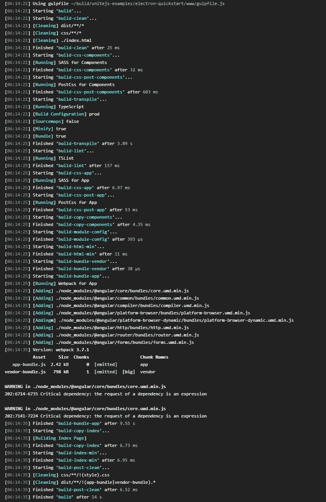

看起来不错，我们走吧。

# 步骤 12

我们不能针对生产版本运行单元测试，但是我们可以运行 E2E 测试。

```
gulp e2e
```

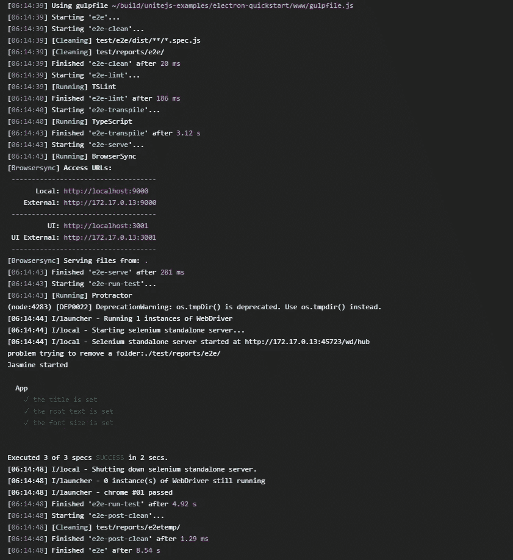

所有工作再次，一个好迹象，捆绑和缩小没有搞砸任何事情。

# 第十三步

让我们创建一个生产封装电子构建。

```
gulp platform-electron-package --buildConfiguration=prod
```

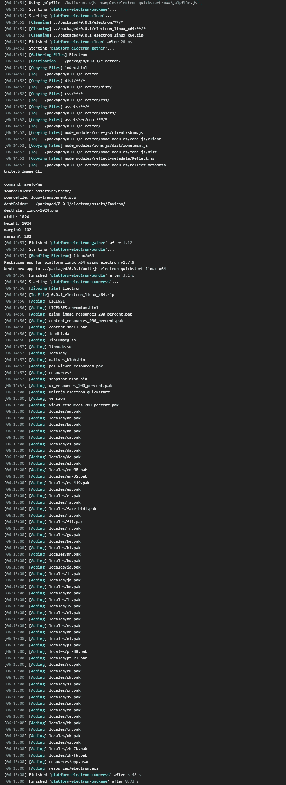

在此任务中，UniteJS 还将为您从。/www/assetSrc/theme/。svg 图像。

完成后，您应该会看到以下文件和文件夹

```
./packaged/{version}/electron/ – these are all the files that were packaged
```

对于您将拥有的每个平台/体系结构组合。

```
./packaged/{version}/electron_{platform}_{architecture}/ - standalone electron build
./packaged/{version}_electron_{platform}_{architecture}.zip – a zip of the build
```

该任务使用与平台-电子-开发步骤相同的过程来决定平台/架构组合，因此如果需要，您可以构建多个平台/架构。

Et voilà，一个完全捆绑，缩小和风格的电子应用程序，在 4 分钟内完成。

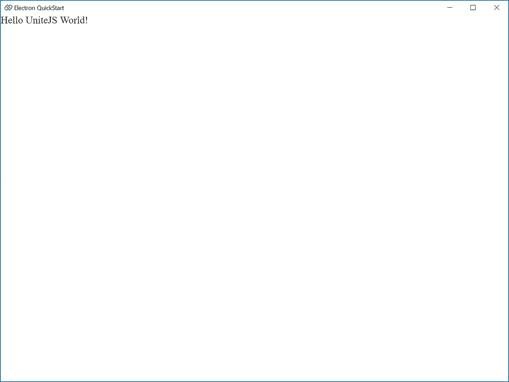

Production Electron App

# 结论

这就是全部内容，选择您的应用程序框架和配置选项，在短短几分钟内，您就可以让 Electron build 准备好在多个平台/架构上推出。

为了看到这一点，在[https://github.com/unitejs-examples/electron-quickstart](https://github.com/unitejs-examples/electron-quickstart)有一个 GitHub repo，这个 repo 只包含一个. travis.yml 脚本，它执行上述所有操作。

你可以在这里看到 travis 构建日志[https://travis-ci.org/unitejs-examples/electron-quickstart](https://travis-ci.org/unitejs-examples/electron-quickstart)，它强调了这个过程有多快，而且没有任何交互。

Martyn Janes @martynjanes
高级开发人员 [UniteJS](https://medium.com/u/46699679ef60?source=post_page-----22aea20ba7f9--------------------------------)

# 更多信息

有关更多信息、文档和在线 CLI 生成器，请访问网站:[http://unitejs.com](http://unitejs.com)Npm:[https://www.npmjs.com/package/unitejs-cli](https://www.npmjs.com/package/unitejs-cli)GitHub:[https://github.com/unitejs](https://github.com/unitejs)Gitter Chat:[https://gitter.im/unitejs/discuss](https://gitter.im/unitejs/discuss)Twitter:[https://twitter.com/UniteJS](https://twitter.com/UniteJS)