# 适用于浏览器、电子、NW.js、Node.js 和 Windows 的通用 JavaScript 控制台

> 原文：<https://medium.com/hackernoon/universal-javascript-console-for-browser-electron-nw-js-node-js-and-windows-272e4bd6f9d9>

我喜欢 JavaScript，也喜欢好的命令行界面带来的生产力和灵活性。如果你在这里读过我以前的文章:

[](https://hackernoon.com/@mikeptweet) [## 迈克·帕森斯-黑客正午

### 阅读麦克·帕森斯在《黑客正午》中的文章。软件研究极客。每天，迈克·帕森斯和成千上万的其他人…

hackernoon.com](https://hackernoon.com/@mikeptweet) 

您知道，我非常喜欢用几行代码完成大量工作。我大部分时间都在浏览器控制台中度过，虽然我喜欢开发工具的强大功能和表现力，但它们对我来说往往是多余的。我也喜欢有一个一致的 JavaScript 控制台界面，可以在任何地方使用，而不仅仅是在浏览器中。例如，有时我想在浏览器外使用 JavaScript 来自动化 Window 的 Office 应用程序或脚本 [Node.js](https://hackernoon.com/tagged/node-js) ，或者将浏览器与 SQL Server 等本机应用程序结合使用，以执行一些在浏览器沙箱内不可用的数据任务。我经常遇到的一个常见用例是从网页中抓取一些数据，并将其插入到 Microsoft Excel 等本地应用程序中，以便进行进一步的数据分析。

虽然标题中列出的每个环境都有自己的控制台环境和 REPL 环境，但我发现命令行界面在与主机操作系统的集成方面受到了限制。大多数都在一个沙箱中运行，这个沙箱对于普通用户来说很有意义，但是实际上限制了我作为超级用户或系统工程师想要的能力。

该控制台的另一个用途是在演示或现场编码会议期间，当您想要快速演示想法时。我经常用它来构建想法的原型，并验证浏览器或底层操作系统中的可用功能。

我的通用 JavaScript 控制台基于 Remy Sharp 出色的工作

[](https://github.com/remy/jsconsole) [## remy/jsconsole

### jsconsole -基于 Web 的控制台-用于演示和研讨会

github.com](https://github.com/remy/jsconsole) 

我采用了 Remy 的优秀控制台，并对其进行了扩展，增加了一些允许我在多种环境中托管控制台的功能。

让我们从浏览器界面开始，它位于:

 [## 安慰

### 通用 JavaScript 控制台

s3.amazonaws.com](https://s3.amazonaws.com/mparsons/jsconsole/index.html) 

当您第一次导航到控制台时，您会看到以下界面:

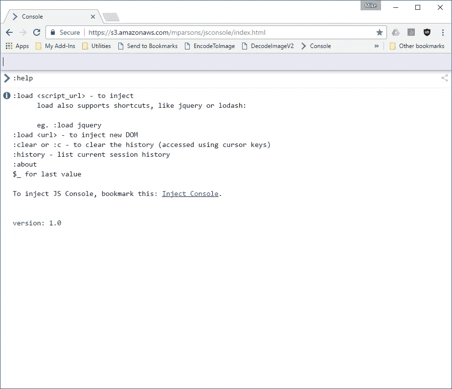

您可以开始输入任何有效的 JavaScript 命令，并立即看到输出。尝试输入几个命令:

```
Date()
location
navigator.userAgent
1+1
```

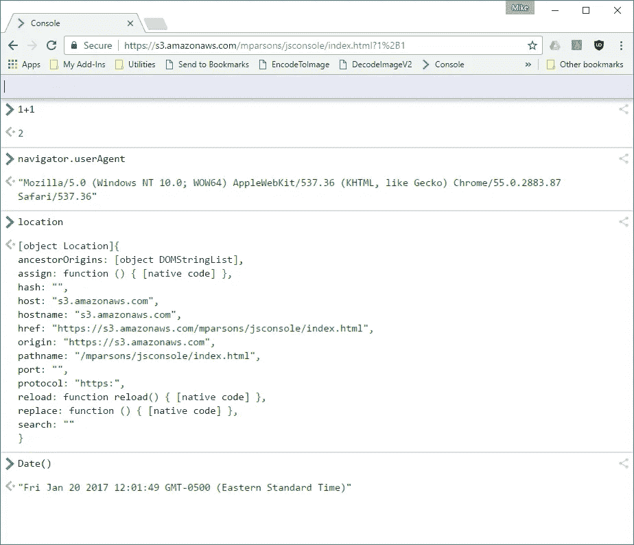

您可以输入任何有效的 JavaScript，包括设置变量和/或创建新函数。

很多时候，您希望利用现有的 JavaScript 库，如 jQuery、lodash 或令人惊叹的 ALASQL，它们允许您在浏览器中使用 SQL。您可以通过库的 URL 简单地加载库，例如:


我为我经常使用的库添加了一些快捷方式:

```
jquery
prototype
dojo
mootools
underscore
lodash
moment
yui
alasql
```

除了加载 JavaScript 库，您还可以从另一个网站加载 HTML 内容。这在抓取网页时很有用，例如:

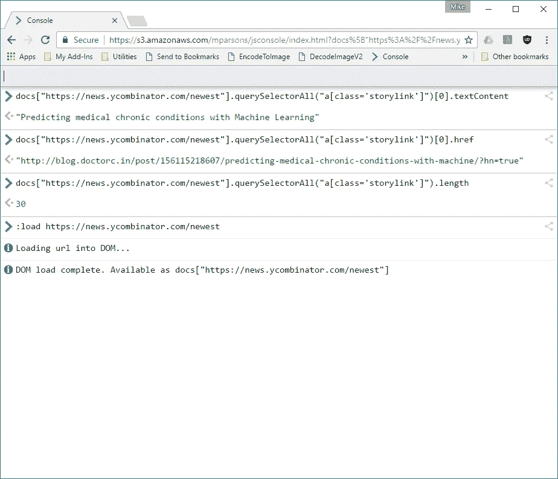

上述示例演示了如何在独立模式下使用控制台。

这很有用，但我对控制台的第一个用途是在现有网页或网站的上下文中利用它。在这种模式下，您基本上是在现有的 Web 页面中插入控制台，它获取页面的上下文，这样您就可以编写页面的内容，就像打开浏览器开发工具一样。然而，与通过网站设置沙箱化的浏览器控制台不同，通用控制台在将现有库引入现有网页和/或通过扩展的网络功能(如 WebSockets 或跨域 XMHttpRequest 调用)方面提供了更大的能力。这是通过使用一个 Bookmarklet 来完成的，您可以通过 **:help** 命令来访问它。简单地从帮助页面拖动书签到你的浏览器书签，它就可以在任何网站上使用了。


为了说明这一功能，我们将导航到 https://news.ycombinator.com/newest 的和将控制台注入到该页面中的**，这样我们就可以编写其内容了。在这个例子中，我们将使用控制台和我最喜欢的库之一(ALASQL)来获取 HackerNews 网站上所有新的链接列表，并将它们导出到 Excel。我们将用两行代码来实现这一点:**

```
:load alasqlalasql("select href,innerText INTO XLSX('news.xlsx',{headers:true}) from ? where className='storylink'",[[...page.document.all]])
```

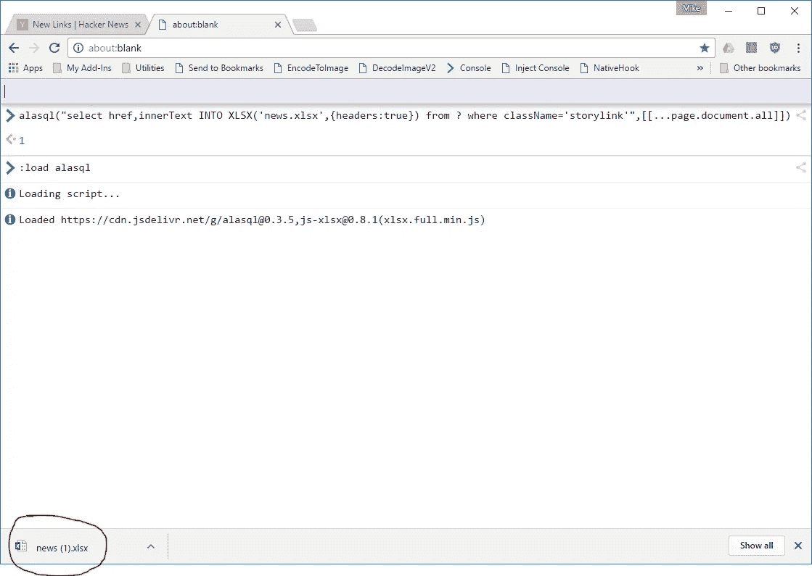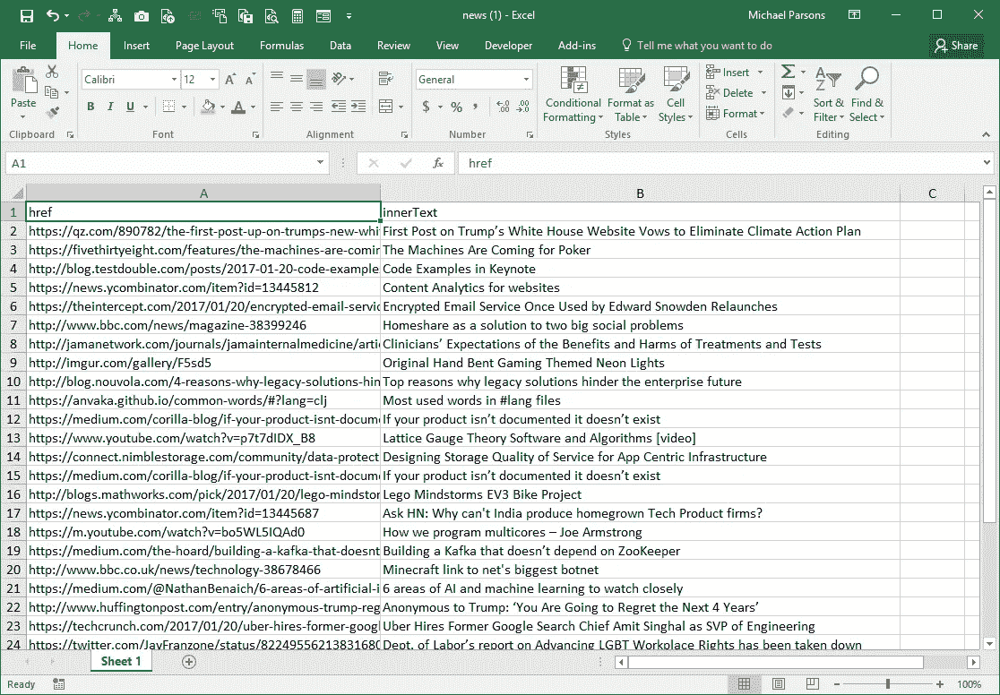

那很酷！

当您将控制台插入页面时，它会加载一个外部页面(**确保您允许弹出窗口！**)并在控制台内创建一个新的变量**页面**。该变量是对宿主页面的 JavaScript window 对象的引用，因此您可以访问该页面的任何属性或方法(即 ***page.document、page.location*** 等)。

然而，与主机页面的沙盒设置不同，控制台可以访问任何网页、JavaScript 库或网络端点(通过 WebSockets 或 XMLHttpRequest)。

希望这能让你对通用控制台的威力有所了解。

# 电子托管

在本文的标题中，我提到了控制台也可用于除浏览器之外的环境。首先，让我们看看如何在电子版中托管它。你需要做的第一件事是通过

[](http://electron.atom.io/) [## 电子

### 使用 JavaScript、HTML 和 CSS 构建跨平台桌面应用。

电子.原子. io](http://electron.atom.io/) 

一旦您安装并运行了 Electron，您需要创建一个新的 Electron 应用程序，在这种情况下，只需在您的机器上创建一个文件夹(称之为 console 或您喜欢的任何名称),并将这 3 个文件添加到该文件夹中:

## package.json

```
{
  "name": "console",
  "version":"1.0.0",
  "main": "index.js"
}
```

## 索引. js

```
const {app, BrowserWindow} = require('electron')
const path = require('path')
const url = require('url')let winfunction createWindow () {
  win = new BrowserWindow({width: 800, height: 600})
  win.loadURL(url.format({
    pathname: path.join(__dirname, 'console.html'),
    protocol: 'file:',
    slashes: true
  }))win.on('closed', () => {
    win = null
  })
}app.on('ready', createWindow)app.on('window-all-closed', () => {
  if (process.platform !== 'darwin') {
    app.quit()
  }
})app.on('activate', () => {
  if (win === null) {
    createWindow()
  }
})
```

## console.html

```
<html>
<meta http-equiv="X-UA-Compatible" content="IE=Edge">
<head>
<title>Console</title>
</head>
<body>
</body>
<script src="[https://s3.amazonaws.com/mparsons/jsconsole/js/inject.js](https://s3.amazonaws.com/mparsons/jsconsole/js/inject.js)"></script>
</html>
```

一旦创建了这些文件，只需拖动电子可执行文件上的文件夹来运行它:

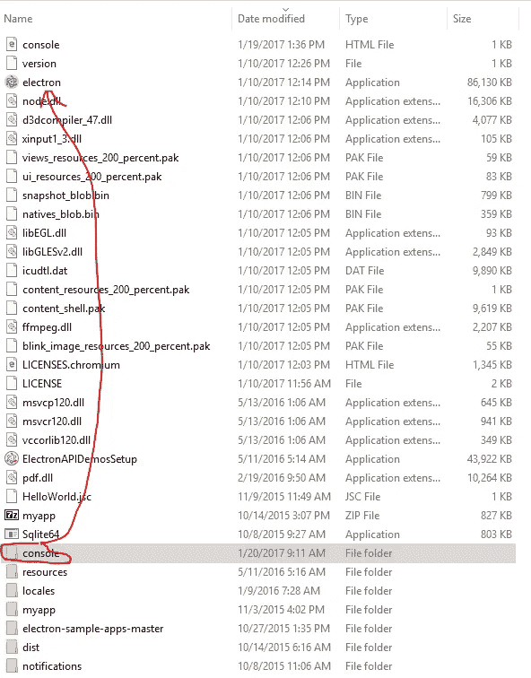

您应该会看到如下所示的内容:

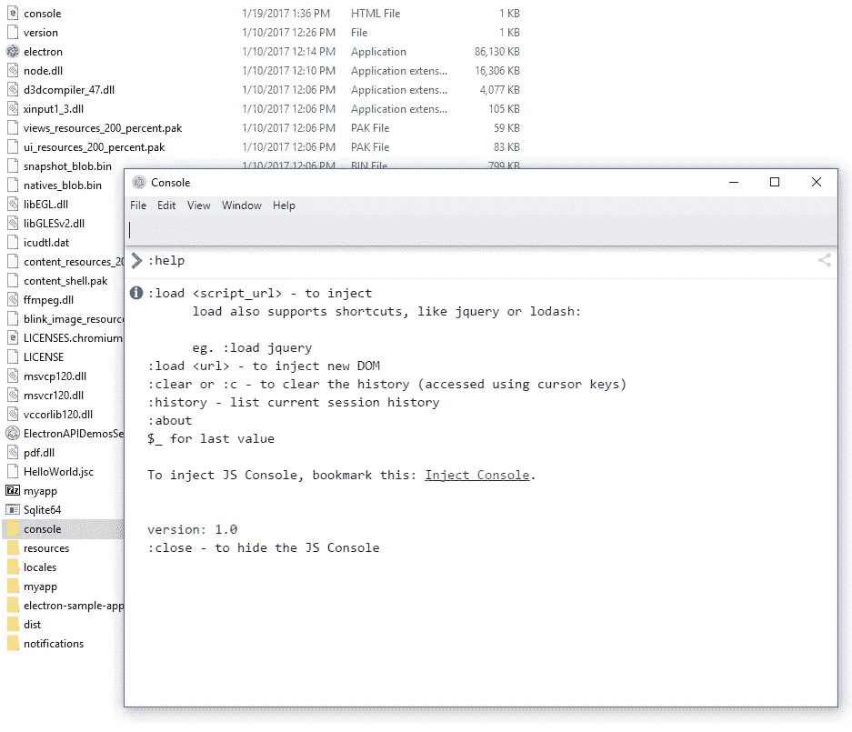

然后，您可以开始键入任何引用 Electron、Chrome 浏览器或 Node.js 对象的命令:

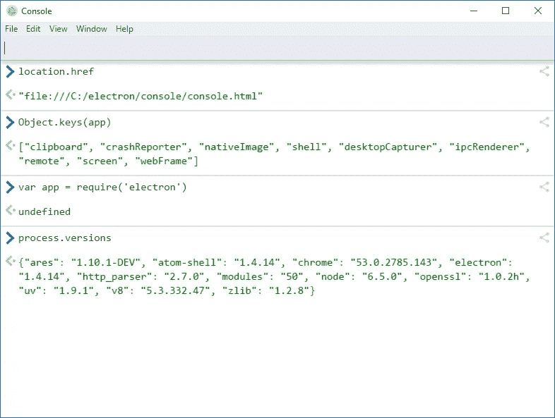

# NW.js 托管

在 NW.js 中托管也一样简单。从这里下载应用程序:

[](https://nwjs.io/) [## 西北大学

### nwjs

nwjs.io](https://nwjs.io/) 

与电子示例一样，创建一个本地文件夹并添加这两个文件:

## package.json

```
{
  "name": "console",
  "version":"1.0.0",
  "main": "console.html"
}
```

## console.html

```
<html>
<meta http-equiv="X-UA-Compatible" content="IE=Edge">
<head>
<title>Console</title>
</head>
<body>
</body>
<script src="[https://s3.amazonaws.com/mparsons/jsconsole/js/inject.js](https://s3.amazonaws.com/mparsons/jsconsole/js/inject.js)"></script>
</html>
```

同样，只需将文件夹拖到 ***nw*** 可执行文件上运行它，并开始键入命令来访问 nw。JS 环境:

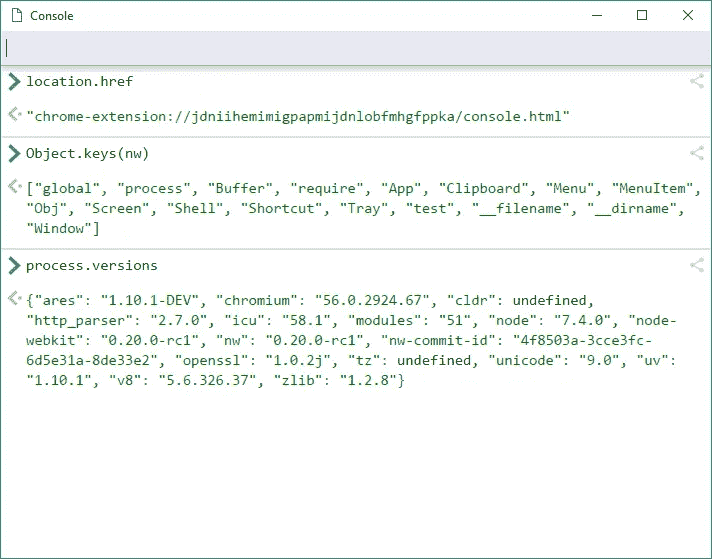

注意都是 NW。JS 和 Electron host Node.js，因此您可以使用通用控制台在这两个应用程序中针对 Node.js 上下文编写脚本:

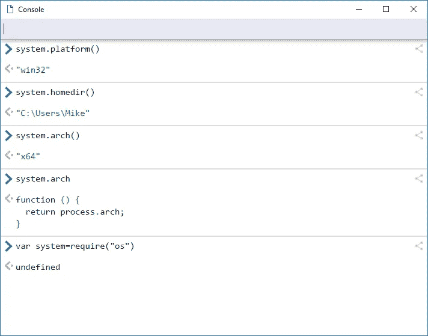

最后，我们来看看我最常使用的通用控制台…

# **在一个窗口的应用程序中托管控制台。**

你可能会说两者都是 NW。JS 和 Electron 是 Window 的应用程序，你是对的。然而，在许多情况下，Electron、NW.js 和 Node.js 在原生窗口功能方面都有所欠缺，特别是 COM 自动化和 Microsoft Office 集成。大多数企业仍在运行微软的 Excel、Word、Outlook 等软件，我想用我最喜欢的语言 JavaScript 来编写这些应用程序。虽然 Window 的开发者生态系统有大量的方法来构建和扩展 Office 应用程序，但它们通常需要大量的依赖关系和使用 C#或 Visual Studio 的技能，对我来说，如果我只想快速轻松地完成一些事情，这就有些过头了。因此，我们将在一个窗口的应用程序中托管通用控制台，使用一种已经存在于每个窗口的机器上的技术——窗口的脚本主机，特别是 HTML 应用程序，或 HTA:

[](https://en.wikipedia.org/wiki/HTML_Application) [## HTML 应用程序-维基百科

### 另一方面，HTA 作为完全受信任的应用程序运行，因此比普通的 HTML 文件拥有更多的特权…

en.wikipedia.org](https://en.wikipedia.org/wiki/HTML_Application) 

这就像在本地机器上创建一个名为 console.hta 的文本文件一样简单:

## console.hta

```
<html>
<meta http-equiv="X-UA-Compatible" content="IE=Edge">
<head>
<title>Console</title>
<HTA:APPLICATION ID="oHTA"
     APPLICATIONNAME="Console"
     BORDERSTYLE="normal"
     CAPTION="yes"
     CONTEXTMENU="no"  
     ICON="favicon.ico"
     INNERBORDER="no"
     MAXIMIZEBUTTON="yes"
     MINIMIZEBUTTON="yes"
     NAVIGABLE="yes"
     SELECTION="yes"
     SHOWINTASKBAR="yes"
     SCROLL="no"
     SCROLLFLAT="yes"
     SINGLEINSTANCE="yes"
     SYSMENU="yes"
     VERSION="1.0"
     WINDOWSTATE="normal"/>
</head>
<body>
</body>
<script src="[https://s3.amazonaws.com/mparsons/jsconsole/js/inject.js](https://s3.amazonaws.com/mparsons/jsconsole/js/inject.js)"></script>
</html>
```

就是这样！将此文件保存在本地计算机上，双击运行它:


它与其他环境中的工作方式相同，重要的区别是它现在可以通过 COM 集成访问整个窗口的生态系统。这意味着，你可以使用 Excel、Word、编写 Internet Explorer 脚本来抓取网站，或者使用具有 COM(或 OLE 自动化风格界面)的第三方应用程序，如 Adobe、AutoDesk、Microsoft Dynamics 等。的确，你会发现大多数 Window 的应用程序都可以这样访问和编程。在这个简单的例子中，我将加载 Excel 并使用 Excel 对象模型读取和写入一些简单的值。作为一项安全措施，Window 请求允许这样做:

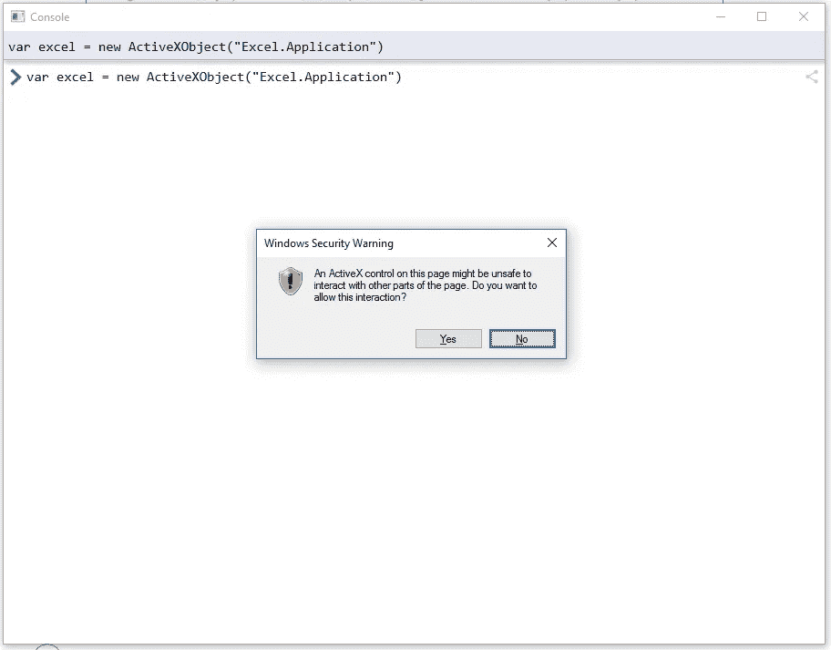

这显示了编写 Excel 脚本是多么容易:

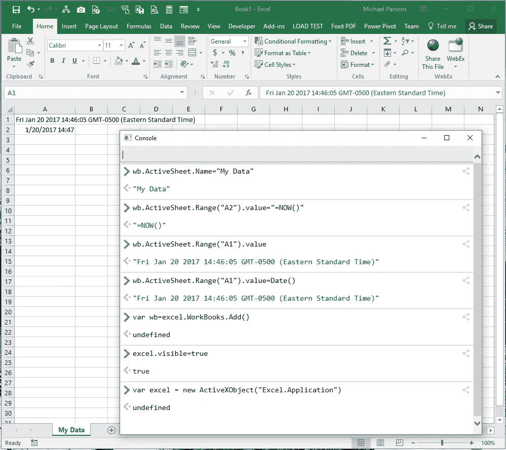

最后，在下一个示例中，我将从外部网站加载内容，并将值粘贴到电子表格中:

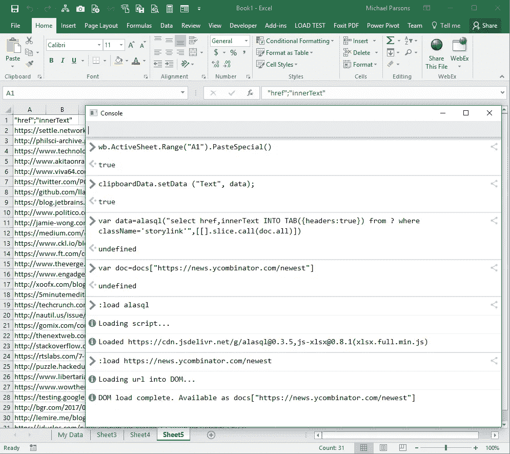

因此，执行此任务只需要以下 6 行代码:

```
//Load our data from the web
***:load*** [***https://news.ycombinator.com/newest***](https://news.ycombinator.com/newest)//Assign it to a variable for easy reference [Optional]
***var doc=docs["***[***https://news.ycombinator.com/newest***](https://news.ycombinator.com/newest)***"]***//load our web page scaping library
***:load alasql***//Run our query to scrape the data
***var data=alasql("select href,innerText INTO TAB({headers:true}) from ? where className='storylink'",[[].slice.call(doc.all)])***//copy it to the clipboard
***clipboardData.setData ("Text", data);***//Paste it into Excel
***wb.ActiveSheet.Range("A1").PasteSpecial()***
```

希望这展示了我们通用控制台的力量。你可以在这里获得一个早期版本，我希望能尽快在 Github 上记录和分享这些代码。

 [## 通用控制台

### 迈克·帕森斯

s3.amazonaws.com](https://s3.amazonaws.com/mparsons/jsconsole/index.html) 

如果你喜欢这篇文章，请给它一个推荐！

谢谢大家！

[](http://bit.ly/HackernoonFB)[](https://goo.gl/k7XYbx)[](https://goo.gl/4ofytp)

> [黑客中午](http://bit.ly/Hackernoon)是黑客如何开始他们的下午。我们是 [@AMI](http://bit.ly/atAMIatAMI) 家庭的一员。我们现在[接受投稿](http://bit.ly/hackernoonsubmission)，并乐意[讨论广告&赞助](mailto:partners@amipublications.com)机会。
> 
> 如果你喜欢这个故事，我们推荐你阅读我们的[最新科技故事](http://bit.ly/hackernoonlatestt)和[趋势科技故事](https://hackernoon.com/trending)。直到下一次，不要把世界的现实想当然！

