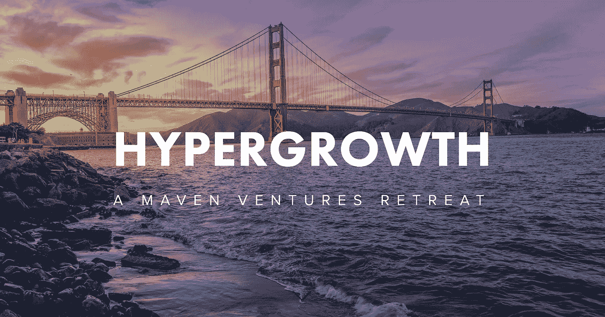

# 在 Maven 务虚会上解锁 Hypergrowth

> 原文：<https://medium.com/hackernoon/unlock-hypergrowth-at-the-maven-retreat-f22ffeb38217>

我们很高兴地宣布，9 月 23 日，我们将在旧金山的普雷西迪欧召开首届[超增长撤退**。**在本次独家活动中，与会者将学习如何带领自己的](http://www.mavenhypergrowth.com/#title-page)[初创公司](https://hackernoon.com/tagged/startup)从成长型企业[超高速增长](https://hackernoon.com/tagged/hypergrowth)到退出 Maven 团队和我们的[演讲者](http://www.mavenhypergrowth.com/speakers/)(一群在扩展消费软件业务方面才华横溢的顶级专家)。我们将重点介绍一些实用的技巧和战术，比如对消费者成长构成威胁的黑客攻击、病毒式营销以及能立即产生影响的网络效应。

Hypergrowth 务虚会不会是典型的午餐时间坐下来听一听的会议。我们承诺，与会者离开时会带着实用的建议和有意义的新关系，让他们的初创公司更加成功。过去几年，我们组织了几十场活动，将最好的消费者增长导师与我们的投资公司联系起来。这些活动教会了我们很多关于如何有效地将成长型公司与关键资源联系起来的知识，我们将在务虚会上利用这些知识。

**我们的承诺如下:**

1.  这是一场私密的活动，而不是一场传统的会议——在一个美丽的场所，有丰盛的食物和众多的客人。
2.  通过圆桌午餐、有效的网络休息和快乐时光招待会，与演讲者度过有意义的时光。
3.  致力于在活动中花费大量时间的专家。
4.  [目标增长内容](http://www.mavenhypergrowth.com/agenda/)，关乎每一位与会者，在其他任何地方都找不到。
5.  价格实惠，目标是覆盖我们的成本而不是产生利润。

我们的团队非常热衷于举办这次为期一天的务虚会。创始人可以离开一天，在他们最大的成长挑战方面获得帮助，同时获得在他们需要的领域有直接经验的导师的帮助。相对集中的 25 家 Maven 公司的投资组合，我们认为这是一个不可思议的机会，通过在我们的网络中为消费者软件初创公司创始人提供一些席位，来回馈和支持更广泛的 Maven 社区。如果你是一位创始人(或拥有一家投资组合公司)，有兴趣花一天时间与 Maven Ventures 一起开启你自己的初创公司的病毒式增长，我们邀请你加入我们的[。](http://www.mavenhypergrowth.com/joinus/) *有限的门票仍然可以买到，明天早鸟销售结束。*

这篇文章最初是在 JimScheinman.com 的[上发表的](http://jimscheinman.com/)

> [黑客中午](http://bit.ly/Hackernoon)是黑客如何开始他们的下午。我们是 [@AMI](http://bit.ly/atAMIatAMI) 家庭的一员。我们现在[接受投稿](http://bit.ly/hackernoonsubmission)并乐意[讨论广告&赞助](mailto:partners@amipublications.com)机会。
> 
> 如果你喜欢这个故事，我们推荐你阅读我们的[最新科技故事](http://bit.ly/hackernoonlatestt)和[趋势科技故事](https://hackernoon.com/trending)。直到下一次，不要把世界的现实想当然！

