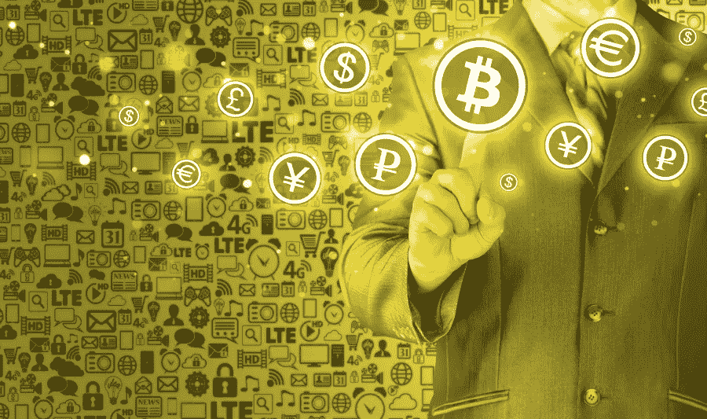

# 比特币是货币吗？

> 原文：<https://medium.com/hackernoon/unravelling-econ-pt-1-is-bitcoin-money-bc4e05b6a74d>

Economic Digitization

过去的两周让我非常困惑。每周二和周四，我都会坐在 FNCE 101(中级宏观经济学)教室里，试图理解利率是如何影响 GDP 的，为什么税收不会改变消费，为什么伯南克说保持经常账户赤字是件好事。问题是我是一个怀疑论者，在过去的几周里，我对我所学的一半都不相信。到目前为止，我还不能理解的是，为什么 GDP 如此重要，为什么美国可以运行一个看起来像庞氏骗局的东西，为什么生产率似乎有一个如此做作的定义。当我开始这一系列关于经济学的思考时，这最后三点将包含在未来的帖子中，并分享我对真正重要的事情的看法。如果你对宏观经济术语的含义感到困惑，我邀请你一起阅读；如果你不困惑，我仍然希望你能读读这篇文章，然后给我正确地解释一下经济学。

首先，我想谈谈钱，因为这是我所有问题的根源。一切总是用美元来定价；它是经济学的单位。当我们讨论经济学家的普遍迷恋(EUF)，或者称为国内生产总值(GDP)时，我们用美元，实际或名义来谈论它。真实和名义是不一样的，这一事实应该让人们意识到一些令人毛骨悚然的事情正在发生。国内生产总值意味着传达经济增长，是衡量商品和服务的生产。商品和服务是实实在在的有形物品，具有实用性，也就是说，它们有助于提高人们的满意度。当我们讨论它们的总量时，我们使用货币，因为这是我们比较它们价值的方式。问题是，货币没有内在价值，除了我们把它作为 T2 的中间物。法定货币这个术语特别贴切，因为美元、英镑、日元等。字面上是 fiats，也就是说，它们是来自权威机构的任意命令，该机构说，“你必须用美元向我纳税”(完全是时代错误)。由于税收必须以法定货币支付，而政府希望人们在需要商品和服务时接受法定货币，因此货币成为了新的交换手段。

顺便说一句，对于那些宣称货币和货币不同是因为货币(即黄金和白银)是价值储存手段而货币不是的人来说，享受为你的茶话会和第一版《阿特拉斯耸耸肩》金条精装本买单吧。在很大程度上，黄金和白银在历史上与美钞没有什么不同，因为它们唯一的价值是看起来很漂亮，很难从地下挖出来。你不能吃它们，也不能用它们做任何特别有用的东西(或者至少不能创造出比其他材料更有用的东西)。事实上，它们没有什么效用，所以我认为它们的内在价值很小。

更进一步，我认为美元本身不是一个价值，而是一个等号。我的意思是，一种货币的功能是一种平等的陈述，例如，1 美元等于 4 个口香糖球等于 6 个大鸡蛋，等于艾米·古特曼的 2.04 秒“劳动”(以 2015 年美元计算，假设每周工作 2000 小时)。当我们谈论 GDP 时，我们讨论的是一个国家一年中生产的所有商品和服务。也就是说，我们指的是一年中我们为对方做的或给对方的所有东西。我们可以称之为 18 万亿美元或 42 万亿分之一硬币，但这个数字的意义在于说我比你做的东西多，或者说我今年比去年做的东西多。这个问题是，它只是粗略地衡量了你赚了多少钱(实际 GDP ),但没有衡量质量的标准，更重要的是，我们真正衡量的是有形美元作为交换媒介的利用率。

货币的价值是用该货币进行的交易的价值。有人会说我错了，但我假设理论上一个货币单位的价值大致等于通过该货币/流通货币供应进行的交易。货币的目的是调节商品和服务的交易，每一个货币单位都是一种商品或服务的权利。如果没有人使用货币进行交易，或者被交换的商品和服务的数量(即经济活动)在减少，那么货币的价值就会下降。如果有更多的纸币存在，货币的价值就会下降，因为每一个单位在流通的货币总量中所占的比例会更小。然而，如果这些货币中的一部分根本没有被使用，那么它不一定会导致价值的明显下降，因为它实际上不是货币供应的一部分，因为它不能被交易。

因此，在所有这些建设之后，比特币即一种数字货币[出现了。前两条评论:1。考虑比特币属性的](https://hackernoon.com/tagged/bitcoin)[国税局](https://www.irs.gov/pub/irs-drop/n-14-21.pdf)很蠢，2。杰米·戴蒙(在某种程度上)是个白痴。比特币与一美元或一英镑真的没什么区别。它是人们进行交易的一种方式，它的价值来源于人们想用它的流通供给做多少交易。因为，像美元一样，它没有内在价值，也就是说，我不能把它作为食物来耕种，不能用它来建造东西，也不能用它来实现某种服务，比特币不是，也不应该被认为是财产；是钱。比特币的价值在于人们喜欢用它进行交易。开始时，我认为有五个主要部分在使用它:

技术极客:这些布道者看到了一个他们从未见过的技术突破，并受到这个新系统的启发。

分散主义者(无政府主义者？):这些人反对美联储管理世界的想法，想要一些纯央行的东西。分散主义者通常认为，与拥有一个中心节点相比，将数据分散到一个网络中会使系统更加安全。此外，他们通常不信任任何有能力独自维护网络的机构。

酷小孩:这些追随者不明白区块链是如何工作的，但是他们想成为潮流的一部分，看起来像潮流的引领者。

走私者:这些人发现了一个购买毒品而不受政府监控的好方法。

自由营销者(逃税者):这些人想要避税，不受限制地向国际汇款。

今天的问题是，许多最初的群体(走私者之外)并没有非常积极地将比特币兑换成商品和服务，或者至少兑换成另一种代表商品和服务的法定货币。所有将比特币视为高阿尔法细价股票的投资者(即投机者)和认为自己发现了下一次淘金热的矿工也加入了这场混乱。戴蒙可能有一个观点，那就是比特币实际上并没有被大量用于交易。人们认为这是一只股票，但股票是一家有收益的公司的股份，最终会将这些收益支付给你。比特币永远不会支付任何人任何东西，它是一串数字，让人们互相交易。

比特币的整体优势在于它让交易变得非常容易，但如果人们不开始使用它来支付东西，它将继续波动，价格最终会下降。目前，比特币是由意愿和它作为加密美元或储备货币的实际用途支撑起来的，大多数其他加密货币都是根据这种货币定价的。一旦它被用作适当的交换手段，价格就会稳定下来，因为没有人愿意听到今天汽油是 0.001 BTC，明天是 0.002 BTC。当价格波动造成如此大的不确定性和不稳定性时，业务就变得无法开展，因此货币停止交易。唯一的另一个选择是，像黄金一样，它成为对美元的对冲，但鉴于其波动性，由于缺乏作为价值交换媒介的使用，我认为这不会发生。

然而，如果普通大众看到比特币是一种伟大的交换媒介，并不再害怕最终可能取代纸币的数字货币，比特币的价格将因其有限的供应而飙升。

与比特币不同，以太坊实际上确实有一些内在价值，因为它可以制作许多东西。在某种意义上，以太坊本质上是一种像钢铁一样的商品，因为可以用它建立不同的智能合约。因此，与比特币不同的是，以太坊的理想价值来源于基于它构建的所有应用的需求。基于以太坊的智能合约的计算机处理，任何发生在以太坊网络上的交易，都有以以太坊支付的气价，所以只要人们想建造和使用 ERC20 代币以太坊就会有商品价值。以太坊对其网络内的交易拥有法定形式的垄断，这就是为什么它的价值与整个网络的价值紧密相连，包括 ERC20 代币的总和。问题是以太坊也被过度推测了(像我这样的人),并且经常被当作一种证券，但事实并非如此。以太坊的潜在垮台是，它正被用来通过 ico 创建数百种非法证券，因为创始人决定通过直接去找试图快速致富的赌徒(也包括我)来避开 SEC 法规和机构投资者。

如果好的产品和公司建立在以太坊上，它的价值会飙升，但如果 ico 退化成骗局，政府决定完全禁止，以太坊就在劫难逃。

让我知道你是否同意。