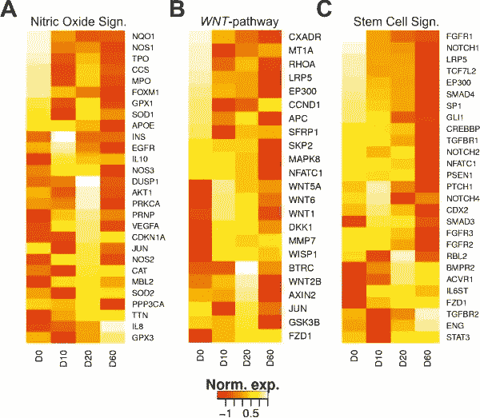
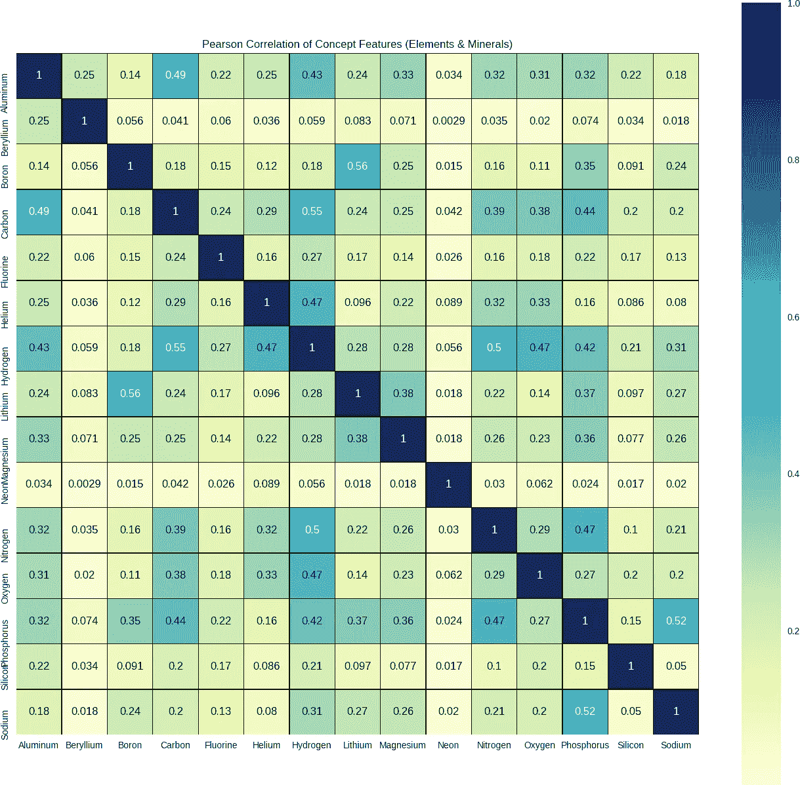
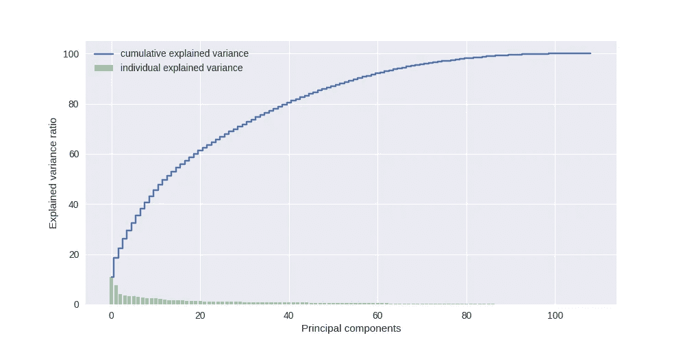
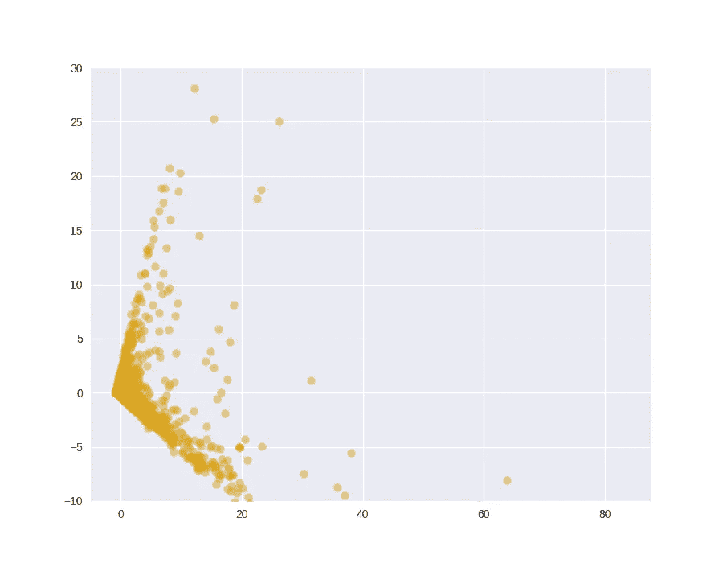
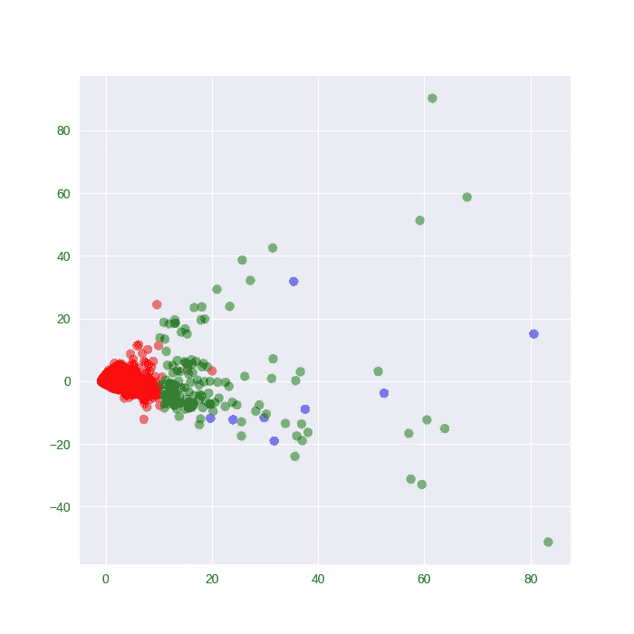
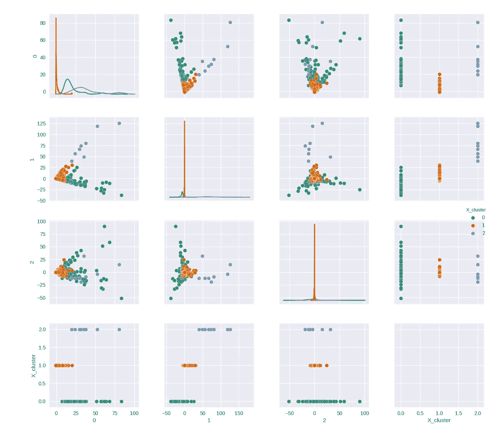
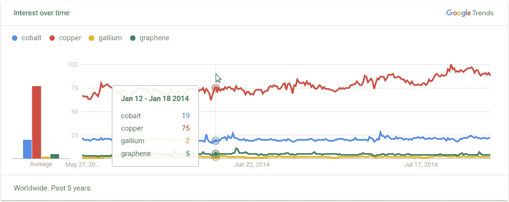
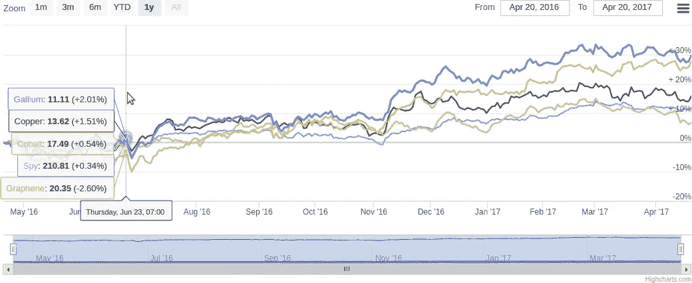

# 用向量空间人工智能 NLP/NLU 相关矩阵数据集生成 Alpha:股票与元素周期表

> 原文：<https://medium.com/hackernoon/unsupervised-machine-learning-for-fun-profit-with-basket-clusters-17a1161e7aa1>

我最终以 10%的优势击败了标准普尔 500。这听起来可能不多，但当我们处理大量资本和良好的流动性时，对于对冲基金来说，利润是相当可观的。更激进的方法带来了更高的回报。

这一切都是从我读了古尔·胡伯尔曼的一篇论文开始的，这篇论文题为“[传染性投机和癌症的治疗:一个非事件使股票价格飙升](https://www0.gsb.columbia.edu/faculty/ghuberman/research.html)”(与托默·雷格夫合著，金融杂志，2001 年 2 月，第 56 卷，第 1 期，第 387-396 页)。该研究描述了 1998 年发生在一家名为 EntreMed (ENMD 是当时的象征)的上市公司的一件事:

《纽约时报》周日发表的一篇关于治疗癌症新药的潜在发展的文章导致 EntreMed 的股票价格从周五收盘时的 12.063 英镑上涨到周一开盘时的 85 英镑，收盘时接近 52 英镑。在接下来的三周内，该指数收于 30 点以上。这种热情蔓延到了其他生物技术股。然而，癌症研究的潜在突破已经在《T2》《自然》杂志和各种流行报纸上报道了，包括《泰晤士报》!五个多月前。因此，公众的热情关注导致了股价的持续上涨，尽管并没有真正新的[信息](https://hackernoon.com/tagged/information)出现

在研究人员所做的许多有见地的观察中，有一个结论很突出:

“(价格)波动可能集中在有一些共同点的股票上，但这些不一定是经济基本面。”

我想知道是否有可能根据不同于通常使用的东西对股票进行分类。我开始挖掘数据集，几周后[我发现了一个数据集，其中包括描述股票和](https://vectorspace.ai/recommend/datasets) [Vectorspace AI](http://vectorspace.ai) 设计的周期表[元素](https://hackernoon.com/tagged/elements)之间“已知和隐藏关系”强度的分数。

有了计算基因组学的背景，这也提醒了我，基因和它们的细胞信号网络之间的关系是多么的不为人知。然而，当我们分析这些数据时，我们开始发现以前无法预测的新的联系和相关性:

Expression patterns of selected genes involved signaling pathways for cell plasticity, growth and differentiation — [https://www.researchgate.net/figure/263706740_fig4_Expression-patterns-of-selected-genes-involved-signaling-pathways-for-cell-plasticity](https://www.researchgate.net/figure/263706740_fig4_Expression-patterns-of-selected-genes-involved-signaling-pathways-for-cell-plasticity)

股票就像基因一样，受到一个巨大的网络的影响，这个网络由彼此之间的强弱隐藏关系组成。其中一些影响和关系是可以预测的。

我的目标之一是创建股票的多空集群或“篮子集群”,我可以用它们来对冲或获利。这将需要一种无监督的机器学习方法来创建股票集群，这些股票将彼此共享强关系和弱关系。这些集群将成为我的公司可以交易的股票“篮子”。

我从在这里下载[数据集开始。该数据集基于周期表中的元素和上市公司之间的关系。在未来，我想与加密货币合作，创造类似于这些人正在做的篮子](https://vectorspace.ai/recommend/datasets)[这里](http://vectorspace.ai/smart_token_baskets/smart-token-basket.html)，但这是一个未来的项目。

然后，我使用 Python 和一组常见的机器学习工具——scikit-learn、numpy、pandas、matplotlib 和 seaborn，开始了解我正在处理的数据集的形状。(为了做到这一点，我查看了一个名为“[主成分分析与 KMeans 可视化](https://www.kaggle.com/arthurtok/principal-component-analysis-with-kmeans-visuals)”的 Kaggle 内核。

输出:快速浏览前 5 行:

概念特征的皮尔逊相关性。在这种情况下，元素周期表中的矿物和元素:

输出:(针对这个可视化示例的前 16 个样本运行)。观察元素周期表中的元素与上市公司的关系也很有趣。在某种程度上，我希望根据这些数据与有趣的元素或材料的相关性，来预测一家公司可能取得的突破。

# 测量“解释方差”和主成分分析(PCA)

解释方差=(总方差-剩余方差)。值得关注的 PCA 投影分量的数量可以由所解释的方差度量来指导，这在 Sebastian Raschka 关于主分量分析的文章中也有很好的描述:[http://sebastianraschka . com/Articles/2015 _ PCA _ in _ 3 _ steps . html](http://sebastianraschka.com/Articles/2015_pca_in_3_steps.html)

输出:

从这个图表中我们可以看到，大量的方差来自于预测主成分的前 85%。这是一个很高的数字，所以让我们从低端开始，只为少数几个主成分建模。关于分析合理数量的主成分的更多信息可在[这里](http://setosa.io/ev/principal-component-analysis/)找到。

使用 scikit-learn 的 PCA 模块，让我们设置 n_components = 9。代码的第二行调用“fit_transform”方法，该方法用标准化的电影数据 X_std 拟合 PCA 模型，并对该数据集应用维数约减。

输出:

我们在这里甚至没有真正观察到星团的模糊轮廓，所以我们应该继续调整 n_component 值，直到我们看到我们喜欢的东西。这涉及到数据科学和艺术的“艺术”部分。

现在，让我们尝试 K-means，看看我们是否能够在下一节中可视化任何不同的集群。

# k 均值聚类

现在将使用 PCA 投影数据应用简单的 K 均值。

使用 [scikit-learn 的 KMeans()调用和“fit_predict”方法，我们计算聚类中心并预测第一和第三 PCA 投影的聚类指数(看我们是否能观察到任何可感知的聚类)。然后，我们定义自己的配色方案，并绘制如下散点图:](https://www.researchgate.net/file.PostFileLoader.html?id=52ba9fbfd3df3ea7388b4773&assetKey=AS%3A272185124425729%401441905398541)

输出:

这个 K-Means 图现在看起来更有希望，如果我们的简单聚类模型假设证明是正确的，我们可以通过这个彩色可视化方案观察到 3 个可区分的聚类。

当然，有许多不同的方法来聚类和可视化这样的数据集，如图所示[这里](https://www.google.com/search?q=clustering+visualization&source=lnms&tbm=isch&sa=X&ved=0ahUKEwjgtf6qspnUAhVLy1QKHbvJC0wQ_AUICigB&biw=1335&bih=1184&dpr=1.25)。

使用 seaborn 方便的 pairplot 功能，我可以以成对的方式自动绘制数据帧中的所有特征。我们可以对前三个投影进行成对绘制，并想象:

输出:

# 构建篮子集群

如何微调集群取决于您自己。这没有灵丹妙药，很大程度上取决于你所处的环境。在这种情况下，股票、权益和金融市场由隐藏的关系定义。

[一旦你对你的聚类感到满意，并设置了得分阈值来控制某些股票是否符合某个聚类的资格，你就可以**提取给定聚类的股票**并将其作为篮子进行交易或使用篮子作为信号。你可以用这种方法做的事情很大程度上取决于你的创造力，以及你使用深度学习变体优化每个集群的回报的能力，基于哪些概念或数据点，如公司的短期利益或浮存(公开市场上的可用股票)的大小。](https://www.researchgate.net/file.PostFileLoader.html?id=52ba9fbfd3df3ea7388b4773&assetKey=AS%3A272185124425729%401441905398541)

您可能会注意到这些集群作为篮子交易的一些有趣特征。有时，这与 S&P 或一般市场存在差异。这就为基于“信息套利”的套利提供了机会。一些聚类可以与谷歌搜索趋势相关联。

看到与本文中提到的材料及其供应链相关的集群可能会很有趣:“[放大 10 种材料及其供应链](https://www.fairphone.com/en/2017/05/04/zooming-in-10-materials-and-their-supply-chains/)”。使用数据集，我只对特征列标签进行了操作:“钴”、“铜”、“镓”和“石墨烯”，只是为了看看我是否可能发现在该领域工作或暴露于该领域风险的上市公司之间任何有趣的隐藏联系。这些篮子也与标准普尔(SPY)的回报进行比较。

通过使用历史价格数据，可以很容易地从 [Quantopian](https://www.quantopian.com) 、[numeri](https://numer.ai/)、 [Quandl](https://www.quandl.com/) 或雅虎财经等渠道获得这些数据，然后你可以汇总价格数据，生成使用 [HighCharts](https://www.highcharts.com/) 可视化的预期回报:

我从上述组合中获得的回报远远超过了 S&P，这意味着你将比 S&P 年率多 10%左右。我见过更激进的方法，年净增长率接近 70%。现在，我必须承认，由于我的工作性质，我还做了一些其他事情，但从我迄今为止的观察来看，至少围绕这种方法探索或包装新的定量模型可能是非常值得的，唯一的缺点是你可以将不同类型的信号传输到另一个系统。

产生短篮子集群可能比长篮子集群更有利可图。这种方法需要自己的文章，并在下一个黑天鹅事件之前。

如果你对机器学习感兴趣，那么超越共享已知和隐藏关系的上市公司之间的寄生、共生和同情关系可能会很有趣，也很有利可图。最后，一个人的盈利能力似乎完全取决于他们在生成这种数据集时，在提出功能标签或“概念”的强大组合方面有多聪明。

我对这种模型的下一次迭代应该包括一个单独的算法，用于自动生成特性组合或唯一列表。或许基于可能影响具有隐藏关系的股票组的接近实时的事件，只有配备了无监督机器学习算法的人类才能预测这些事件。

*   gaetanconsulting@gmail.com gatan r——瑞士日内瓦金融数据顾问

> [黑客中午](http://bit.ly/Hackernoon)是黑客如何开始他们的下午。我们是 [@AMI](http://bit.ly/atAMIatAMI) 家庭的一员。我们现在[接受投稿](http://bit.ly/hackernoonsubmission)，并乐意[讨论广告&赞助](mailto:partners@amipublications.com)机会。
> 
> 如果你喜欢这个故事，我们推荐你阅读我们的[最新科技故事](http://bit.ly/hackernoonlatestt)和[趋势科技故事](https://hackernoon.com/trending)。直到下一次，不要把世界的现实想当然！

