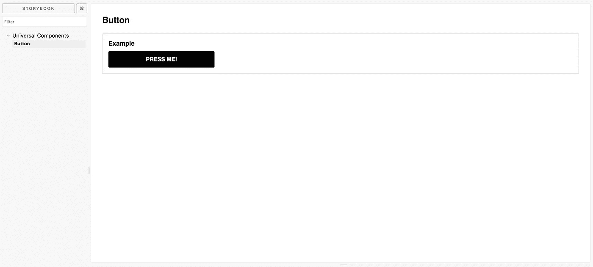
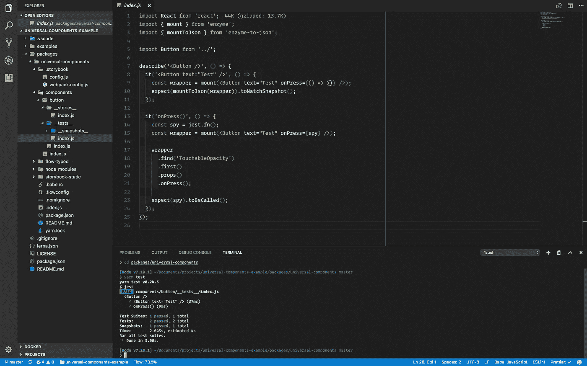

# 使用通用组件启动和运行

> 原文：<https://medium.com/hackernoon/up-and-running-with-universal-components-66678132cad>


Photo by [Patrick Fore](https://unsplash.com/photos/mMcqMYJfopo?utm_source=unsplash&utm_medium=referral&utm_content=creditCopyText) on [Unsplash](https://unsplash.com/?utm_source=unsplash&utm_medium=referral&utm_content=creditCopyText)

我最近[写了](https://labs.mlssoccer.com/the-road-to-universal-components-at-major-league-soccer-eeb7aac27e6c)为什么我们在美国职业足球大联盟选择通用组件，我收到了很多反馈，询问我们实际上如何实施我们的 UCs 系统的细节。

虽然对我们来说开源我们的 MLS 特定组件没有意义，但我不想让每个人都挂在我们如何实现 UCs 的问题上，所以我创建了一个[示例库](https://github.com/kkemple/universal-components-example)，并将在这篇文章中介绍如何设置您自己的 UC 系统。

> 部署的故事书可以在[这里](http://universal-components-example-storybook.surge.sh)找到。

# 选择解决方案

实施 UCs 时，您将面临的第一个挑战是您的库基于什么解决方案。目前有两种选择，`[react-native-web](https://github.com/necolas/react-native-web)` (RNW)和`[react-primitives](https://github.com/lelandrichardson/react-primitives)` (RP)。在美国职业足球大联盟，我们决定选择 RNW 有两个原因:

1.  它比 react-primitives 更成熟。这听起来可能很奇怪，因为两者在技术上都处于早期 alpha 阶段，但 RNW 目前与 React Native 旗鼓相当，并支持 React 16。([https://github.com/airbnb/react-sketchapp/issues/104](https://github.com/airbnb/react-sketchapp/issues/104))
    这意味着 RNW 将与`create-react-app`、`create-react-native-app`和`react-native init`一起开箱即用。CRA 和 CRNA 的例子都可以在我在本文开头提到的例子库中找到。
2.  RP 使用了`Touchable`原语，它在技术上并不直接映射到 RN。React Native 中有一个`Touchable` api，但它不是像`TouchableOpacity`或任何其他 React Native touchables 那样的组件。这需要更复杂的设置。

# 设置项目

我们将使用 [Lerna](https://github.com/lerna/lerna) 来设置一个 monorepo。这将使管理我们的通用组件包(以及我们将来可能创建的任何包)的部署变得更加容易。

首先我们需要安装 Lerna。

```
yarn add --global lerna
```

然后我们需要为我们的项目创建一个新的文件夹，从项目的根目录运行`yarn init`来创建一个新的`package.json`，然后运行`lerna init`来设置 Lerna。

这将创建一个基本的设置。您应该有一个如下所示的项目:

```
packages/
lerna.json
package.json
```

让我们在根目录下添加一个`.gitignore`,并确保忽略所有我们最终可能使用的`node_modules`目录。

```
**/node_modules/**
```

现在我们应该有一个这样的项目结构:

```
packages/
.gitignore
lerna.json
package.json
```

接下来我们需要创建我们的`universal-components`包。在`packages`目录中创建一个名为`universal-components`的新文件夹。然后将`cd`放入该目录，再次运行`yarn init`(对于这个包，使用您想要在应用程序中导入组件的名称)。

```
packages/
  universal-components/
    package.json
lerna.json
package.json
```

现在我们已经准备好了我们的包，我们需要设置通用组件。这意味着我们需要 [Babel](https://babeljs.io/) 支持测试/故事书的代码传输，以及 RNW 的别名。

首先让我们安装所有需要的`babel`依赖项:

```
// from within packages/universal-componentsyarn add -D babel-plugin-module-resolver babel-plugin-transform-class-properties babel-plugin-transform-es2015-modules-commonjs babel-preset-flow babel-preset-react babel-preset-stage-2 flow-bin
```

那可是好多模块啊！让我们看看它们各自的功能:

*   **babel-plugin-module-resolver**:用于别名和添加`.web.js`扩展支持
*   **babel-plugin-transform-class-properties:**用于添加对 React Native 中支持的类属性的支持。
*   **babel-plugin-transform-es 2015-modules-commonjs:**用于添加对导入/导出语句的支持，无需`.default`
*   **通天塔-预设-流量:**用于添加流量支持
*   **巴别-预设-反应:**用于添加反应支持
*   **babel-preset-stage-2** :用于添加`async/await`和`rest/spread`运算符之类的东西(受 React Native 支持)
*   **flow-bin** :用于对我们的组件运行流

接下来，我们需要在新的`universal-components`包中创建一个`.babelrc`文件，然后添加以下配置:

```
{
  "plugins": [
    "transform-class-properties",
    "transform-es2015-modules-commonjs",
    [
      "module-resolver",
      {
        "alias": {
          "react-native": "react-native-web"
        },
        "extensions": ["web.js", ".js"]
      }
    ]
  ],
  "presets": ["react", "stage-2", "flow"]
}
```

既然我们可以支持通用组件，我们需要安装 React:

```
yarn add -D react react-dom react-native-web prop-types
```

我们将它们添加为 `devDependencies`，因为我们不希望它们与我们的通用组件一起安装。在本地环境中，我们不想安装`react-native-web`，反之亦然。因此，我们将它们添加为`devDepenencies`，并将它们包含在我们的`package.json`文件的`peerDepencencies`部分中。这样，当 UC 包的用户安装时，他们将被警告所需的未满足的对等依赖。

> 我们没有添加`react-native`作为`devDependency`，因为我们使用的是 Storybook 的 web 版本，在这个环境中不需要 React Native。

```
// in packages/universal-components/package.json"peerDependencies": {
  "prop-types": ">=15",
  "react": ">=15",
  "react-dom": ">=15",
  "react-native": ">=0.42",
  "react-native-web": ">=0.0.129"
}
```

我们需要做的最后一件事是创建一个`components`目录，它将是我们通用组件的未来之家。🏠

完成后，您的项目应该如下所示:

```
packages/
  universal-components/
    components
    .babelrc
    package.json
    yarn.lock
lerna.json
package.json
```

好吧！现在我们准备开发我们的第一个通用组件！🎉

# 设置故事书

为了确保我们保持一个有组织的开发过程(并确保我们的组件在 web 上正常工作)，我们将使用 [Storybook](https://storybook.js.org/) 来隔离开发并获得关于组件外观和行为的实时反馈。

我们要做的第一件事是将 storybook 作为依赖项添加到我们的`universal-components`包中。

```
// from within packages/universal-componentsyarn add -D @storybook/react
```

接下来，我们需要为我们的故事书配置创建一个`.storybook`目录:

```
packages/
  universal-components/
    .storybook/
    components/
    .babelrc
    package.json
    yarn.lock
lerna.json
package.json
```

在`.storybook`内部添加一个`config.js`文件。这就是我们的基本故事书配置。在`config.js`内添加以下内容:

```
import { configure } from '@storybook/react';const req = require.context(
  '../components/', // path where stories live
  true, // recursive?
  /\__stories__\/.*.js$/, // story files match this pattern
);function loadStories() {
  req.keys().forEach(module => req(module));
}configure(loadStories, module);
```

重要的是我们配置 Storybook 在我们的`components`目录中查找`__stories__`目录并加载它们。

这让我们可以将我们的故事放在相关组件的旁边，这些组件很好，并且与默认的 [Jest](https://facebook.github.io/jest/) 配置很好地匹配(稍后将详细介绍测试)。

接下来，我们必须改变 Storybook 的默认 Webpack 配置，以便我们可以正确地解析导入的通用组件。在`.storybook`目录中创建一个`webpack.config.js`文件，并添加以下内容:

```
const path = require('path');
const webpack = require('webpack');
// use babel-minify due to UglifyJS errors from modern JS syntax
const MinifyPlugin = require('babel-minify-webpack-plugin');// get default webpack config for @storybook/react
const genDefaultConfig = require('@storybook/react/dist/server/config/defaults/webpack.config.js');const DEV = process.env.NODE_ENV !== 'production';
const prodPlugins = [
  new webpack.DefinePlugin({
    'process.env.NODE_ENV': JSON.stringify(
      process.env.NODE_ENV || 'development'
    ),
    'process.env.__REACT_NATIVE_DEBUG_ENABLED__': DEV,
  }),
  new webpack.optimize.OccurrenceOrderPlugin(),
  new MinifyPlugin(),
];module.exports = (baseConfig, env) => {
  const config = genDefaultConfig(baseConfig, env);
  const defaultPlugins = config.plugins;
  const overwrite = {
    devtool: 'inline-source-map',
    module: {
      rules: [
        {
          test: /\.js$/,
          exclude: /node_modules/,
          loader: 'babel-loader',
          query: { cacheDirectory: true },
        },
      ],
    },
    plugins: DEV ? defaultPlugins : prodPlugins,
  }; return Object.assign(config, overwrite);
};
```

现在，我们在 Storybook 的生产构建过程中不会遇到任何问题，并准备创建一个组件，但首先让我们在`package.json`中添加几个`script`条目，让我们的生活变得更轻松一些。

```
// in universal-components/package.json"scripts": {
  "storybook": "start-storybook -p 9001 -c .storybook",
  "build: "build-storybook"
  ...
},
```

让我们在 components 中为一个`Button`组件创建一个新目录:

```
components/
  button/
    __stories__/
      index.js
    index.js
```

在`button/index.js`中添加以下代码:

```
// @flowimport React, { Component } from 'react';
import {
  Platform,
  StyleSheet,
  Text,
  TouchableOpacity,
  View,
} from 'react-native';
import PropTypes from 'prop-types';export type ButtonProps = {
  backgroundColor: string,
  fontColor: string,
  onPress: () => void,
  size: string,
  style: StyleSheet.Styles,
  text: string,
};const getButtonPadding = (size: string): number => {
  switch (size) {
    case 'small':
      return 10;
    case 'medium':
      return 14;
    case 'large':
      return 18;
    default:
      return 14;
  }
};const getButtonFontSize = (size: string): number => {
  switch (size) {
    case 'small':
      return 10;
    case 'medium':
      return 16;
    case 'large':
      return 20;
    default:
      return 16;
  }
};export default class Button extends Component<ButtonProps, *> {
  static propTypes = {
    backgroundColor: PropTypes.string,
    fontColor: PropTypes.string,
    onPress: PropTypes.func.isRequired,
    size: PropTypes.string,
    style: PropTypes.oneOfType([
      PropTypes.array,
      PropTypes.object,
      PropTypes.string,
    ]),
    text: PropTypes.string.isRequired,
  }; render = (): React$Element<*> => {
    const {
      backgroundColor = 'black',
      fontColor = 'white',
      onPress,
      size = 'medium',
      style,
      text,
    } = this.props;
    const computedStyles = styles(backgroundColor, fontColor, size); return (
      <TouchableOpacity onPress={onPress}>
        <View style={[computedStyles.container, style]}>
          <Text style={computedStyles.text}>
            {text.toUpperCase()}
          </Text>
       </View>
      </TouchableOpacity>
    );
  };
}const styles = (
  backgroundColor: string,
  fontColor: string,
  size: string,
): StyleSheet.styles =>
  StyleSheet.create({
    container: {
    backgroundColor: backgroundColor,
    borderRadius: 3,
    padding: getButtonPadding(size),
  },
  text: {
    backgroundColor: 'transparent',
    color: fontColor,
    fontFamily: Platform.OS === 'web' ? 'sans-serif' : undefined,
    fontSize: getButtonFontSize(size),
    fontWeight: 'bold',
    textAlign: 'center', 
  },
});
```

现在我们有了一个按钮组件，让我们添加一个故事，这样我们就可以看到它的呈现。在`button/__stories__/index.js`增加以下内容:

```
import React from 'react';
import { storiesOf } from '@storybook/react';
import { View, Text, StyleSheet } from 'react-native';import Button from '../';storiesOf('Universal Components', module).add('Button', () => {
  return (
    <View style={styles.container}>
      <Text style={styles.title}>Button</Text>
      <View style={styles.example}>
        <Text style={styles.exampleTitle}>Example</Text>
        <View style={styles.exampleWrapper}>
          <Button
            text="Press Me!"
            onPress={() => alert('Button Pressed!')}
          />
        </View>
      </View>
    </View>
  );
});const styles = StyleSheet.create({
  container: {
    padding: 32,
  },
  example: {
    borderColor: '#dddddd',
    borderWidth: 1,
    display: 'inline-flex',
    flex: 0,
    padding: 16,
  },
  exampleTitle: {
    fontFamily: 'sans-serif',
    fontSize: 18,
    fontWeight: 'bold',
    marginBottom: 12,
  },
  exampleWrapper: {
    width: 300,
  },
  title: {
    fontFamily: 'sans-serif',
    fontSize: 24,
    fontWeight: 'bold',
    marginBottom: 24,
  },
});
```

设置好故事后，我们现在可以运行 storybook 并查看组件的运行情况。从`universal-components`目录运行`yarn storybook`。就是这样。您现在已经有了一个启动并运行的开发环境。🐎



Universal Components Storybook

# 设置测试

在 Storybook 中构建组件无疑减少了出错的机会，但是如果你想以编程的方式测试功能，你将需要设置测试。为了测试通用组件，您可以使用 React 社区中已经广泛使用的 [Jest](https://facebook.github.io/jest/) 和 [Enzyme](http://airbnb.io/enzyme/) 。

我们要做的第一件事是添加我们的测试依赖项:

```
// from universal-components directoryyarn add -D enzyme enzyme-to-json jest
```

现在我们有了测试依赖项，我们需要设置一些测试。在`components`的`button`目录中添加一个名为`__tests__`的新目录，并带有一个`index.js`文件。

```
components/
  button/
  __stories__/
    index.js
  __tests__/
    index.js
  index.js
```

将以下内容添加到`__tests__/index.js`:

```
import React from 'react';
import { mount } from 'enzyme';
import { mountToJson } from 'enzyme-to-json';import Button from '../';describe('<Button />', () => {
  it('<Button text="Test" />', () => {
    const wrapper = mount(
      <Button text="Test" onPress={() => {}} />
    );
    expect(mountToJson(wrapper)).toMatchSnapshot();
  });

  it('onPress()', () => {
    const spy = jest.fn();
    const wrapper = mount(<Button text="Test" onPress={spy} />); wrapper
      .find('TouchableOpacity')
      .first()
      .props()
      .onPress();

    expect(spy).toBeCalled();
  });
});
```

现在我们需要在`package.json`中添加一个`script`条目，这样我们就可以轻松地运行我们的测试。

```
// in universal-components/package.json"scripts": {
  "test": "jest",
  ...
},
```

随着一些测试的进行和我们的`package.json`的更新，我们现在可以运行`yarn test`来确保一切正常。



Jest Tests

# 部署

最后一步是部署故事书和我们的通用组件库。让我们从故事书开始。

我们已经添加了一个`script`来为生产(`"build": "build-storybook"`)构建故事书，但是我们仍然需要一种方法来部署我们的故事书，以便我们的通用组件库的用户知道他们可以使用什么。为此，我们将使用`[surge.sh](http://surge.sh/)`。

首先我们需要添加`surge`作为新的`devDependency`:

```
// from universal-components directoryyarn add -D surge
```

接下来我们需要添加一个`script`:

```
"scripts": {
  "deploy": "yarn build && surge ./storybook-static",
  ...
}
```

> 别忘了给你的`.gitignore`加上`packages/universal-components/storybook-static`！

最后但同样重要的是，我们需要发布我们的通用组件包。然而，在此之前，我们应该在我们的`universal-components`包中配置一个`.npmignore`，这样我们就不会部署任何不必要的文件。

```
node_modules
.storybook
.babelrc
```

前面我提到过，我们正在使用 Lerna 来简化软件包的发布。要发布包的新版本，从项目的根目录运行`lerna publish`(不是`universal-components`目录)。

就是这样！现在，您已经有了一个完整的通用组件工作流，并且正在运行！给自己一个鼓励，或者一个虚拟的击掌！✋

如果你对这个通用组件的实现有任何问题，欢迎在下面评论或者在[推特](https://twitter.com/kurtiskemple)上联系我，我的 DMs 永远是开放的！