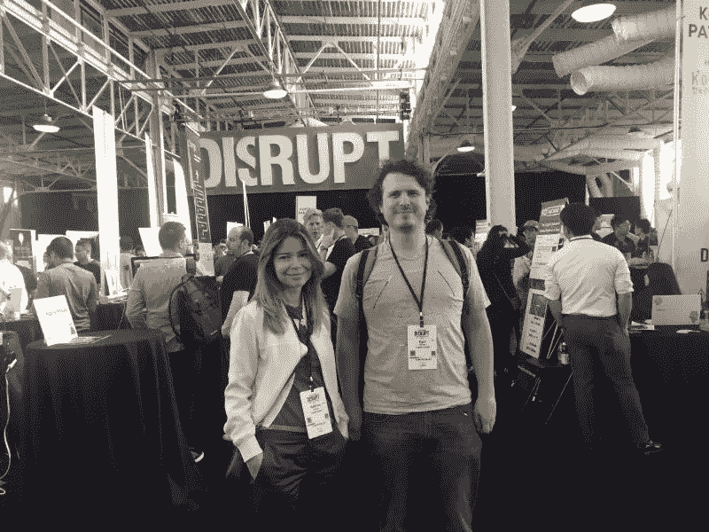
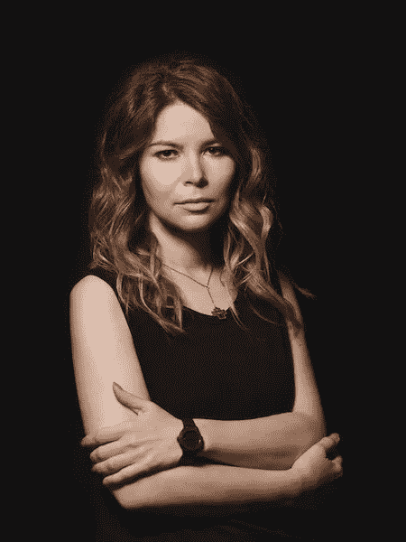
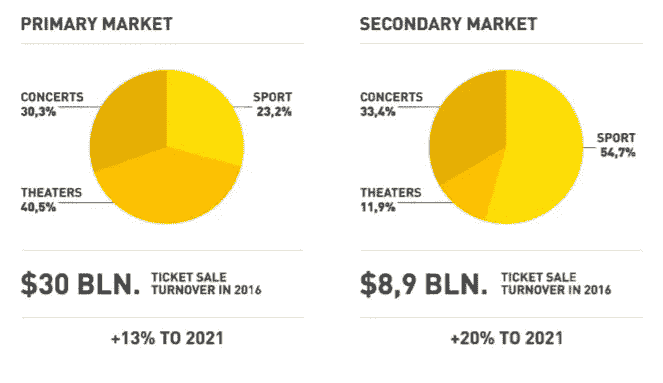
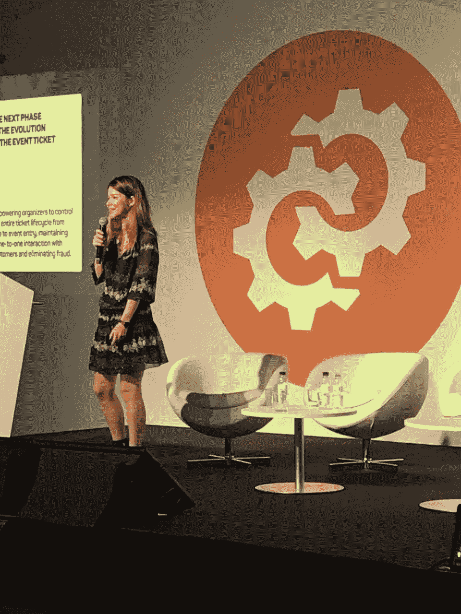

# 近距离和个人:与加密的采访。Tickets 的联合创始人 Katerina Kirillova

> 原文：<https://medium.com/hackernoon/up-close-and-personal-an-interview-with-crypto-tickets-cofounder-katerina-kirillova-121d7f1eb6cf>

## 又一天，又一个 ICO。但是对于密码来说。门票团队，这是几个月的不懈规划(希望)来实现。无论接下来会发生什么，对于共同创始人 Katerina Kirillova 来说，这都是一次伟大的经历！

PIcture credit: Crypto.Tickets | Cofounders Katerina Kirillova and Egor Egerev have been busy promoting Crypto.Tickets around the world in preparation for their ICO.

# 归咎于旅游业

票云，[密码背后的公司。Tickets ICO](https://crypto.tickets/?utm_source=Audrey&utm_medium=media&utm_campaign=campaign1) 成立于 2014 年，其理念是票务行业的全球分销系统可以让活动组织者将门票放在一个全球平台上，而不必在多个分销商之间分配库存。把它想象成活动组织者的 Expedia(毕竟两者都在卖门票)。

*“所有这些交换通常都是手动完成的。如果需求超过供给，动态定价几乎是不可能的。我们希望创建一个自动化平台，在这个平台上，计费、支付、价格飙升、分析、CRM 和会计可以在同一个环境中完成。”*Crypto 的联合创始人，Tickets Cloud 的合伙人 Katerina 说道。门票和莫斯科欧洲展和莫斯科票务论坛的首席执行官。

PIcture credit: Crypto.Tickets | ‘Kat’ is responsible for international marketing and strategy.

自推出以来，[门票云](https://ticketscloud.org/eng/index_v.html)分销平台已经产生了超过 100 万的销售额，并声称每月收入约为 200 万美元。为了寻找一种更好的方式来连接关键玩家和他们的观众，并提供更好的性能和用户体验，票证云团队提出了推出基于以太坊的加密的想法。门票(代币名称:TKT)。

# 为什么是区块链？

*“Crypto。Tickets 并不是第一个试图通过首次发行硬币*来筹集资金的公司，这是有道理的，因为这里有一个真实的用例，”*加拿大区块链协会的一位董事 [Phil Chevry](https://ca.linkedin.com/in/philippe-chevry-aba28a51) **评论道。

似乎这个新市场还没有一个明确的赢家；将当前的原型带到 MVP 阶段所需的 400 万美元中，Crypto。票单从投资人那里就成功融资 150 万美元，“pre-ICO”。

当被问及这是否只是从当前的“ [ICOmania](https://hackernoon.com/the-sad-state-of-ico-mania-and-its-consequences-fda7cbb9e825) 中获益的又一次机会主义举动时，卡特琳娜承认:*“区块链这个词被误用来制造炒作，*肯定是！*但对于我们这个行业所知的挣扎来说，这是一种救赎。有人担心票务世界会出现垄断，这可以通过一个分散的生态系统来解决。”*

*“我们试图通过为一级和二级市场交易创建后端解决方案来建立基础设施和规则，这样一切都可以透明和记录。条款和条件应该总是可见的。可追溯性、安全性、计费和支付都是可以通过使用区块链技术解决的问题。”*

The secondary market represents a big opportunity, according to Crypto.Tickets (Image taken from the white paper).

# “我们还没到那一步”

如果你对技术感兴趣，[新版本的白皮书刚刚发布](https://crypto.tickets/crypto.tickets%20whitepaper%20ENG.pdf)，给出了关于提议的解决方案的架构的更多细节，该解决方案大胆地在 2018 年中期推出 MVP，将基于以太坊的令牌与 [EON](https://eontechnology.org/solutions.html) 技术相结合。

*“以太坊仍然非常昂贵，无法支持目前所需的交易量”*Katerina 解释道。尽管这是该团队的第一个 ICO，但听到卡特琳娜解释麦当娜的演唱会门票如何在不到 10 分钟的时间内销售一空，让我觉得他们比自己知道的更有准备…

这种试图通过解决房间里的大象来区分的尝试，即[以太坊目前被限制在每秒 10 到 20 笔交易，而 Visa](https://www.influencive.com/ethereums-casper-almost-heres-need-know/) 则为 50，000 笔交易，这可能对 TKT 有利，也可能不利。

*“我们知道社区可能会认为 EON 没有以太坊的记录和社区，但我们和许多其他票务项目之间的主要区别是我们已经有了一个工作原型，到目前为止运行非常顺利。事实上，我们的俄罗斯支持者购买了他们的第一个密码。使用门票钱包原型的门票能够参加 10 月 5 日 *在莫斯科举行的* [我们的发布会。”](https://www.facebook.com/events/159008574678614/)*

> *“大型活动比最受欢迎的 ico 卖得还快！我们必须对此做出解释。”*

由于 EON 采用的是利益相关证明共识，我不禁想问他们是否会考虑在 Casper 之后迁移到以太坊:*“令牌将使用以太坊发行，因此如果以太坊转向利益相关证明，我们将有更多的选择。我们计划在明年第二季度如期发布 EON，并率先上市。然后，我们会看到以太坊的下一步是什么，并做出决定。”*

*从经济角度来看，像这样在以太坊上推出一款产品是绝对不可能的。大型活动比最受欢迎的 ico 更快售罄！我们必须对此做出解释。我们可能会迁移后 Casper，但现在，我们希望给我们的投资者一个机会，看到投资的快速回报。”*

# 通往 ICO 的坎坷之路

大约 25 人的团队不懈地致力于这个项目，平台上有 500 名新用户，每天有 200 至 300 名新人加入他们的电报频道，该团队预计将为 ICO 收集 6000 至 8000 名潜在参与者。这听起来很多，但硬性上限是一个雄心勃勃的 2300 万美元，最多 30 天。

*“我们有公关人员、设计师、营销人员、社区经理……但迄今为止我们看到的是，广告活动并不像人们可以信任的渠道那样有效。*[【coin telegraph】](https://cointelegraph.com/news/why-ticketing-industry-needs-blockchain)*比如给* [我们的媒介页](https://blog.crypto.tickets/?utm_source=Audrey&utm_medium=media&utm_campaign=campaign1)*这位联合创始人评论道，坚定而又谨慎。*

*考虑到行业认为如果你从一个成功的 ICO 中幸存下来(并且没有带着钱逃跑),你就是“有经验的”,知道如果有机会，什么团队会做得不同总是会带来有价值的见解。这次也不例外:*“很多，*开心地承认了卡特琳娜。我们最初的想法很模糊，不知道该去敲哪扇门寻求帮助。在做 ICO 时有很大的权衡，监管机构想知道他们是否应该禁止整个运动…我们希望在这个窗口关闭之前推出，但与我们习惯的相比，这不得不以更好的性能和规划为代价。”*

*“我们面临的另一个大问题与叙述有关。我们不得不在宣传活动中改变我们的演讲，因为我们意识到我们与观众互动的方式不够令人信服。在路演过程中，我们解释概念的方式和我们是谁都必须重新想象！我们还面临着巨大的语言挑战，因为我们说俄语，所以我们所有的材料都需要翻译，以覆盖更广泛的受众，这既耗时又增加了大量工作。”*

**“最后，我会更早开始与基金沟通。我们没有足够的时间来做好这件事，因为他们中的许多人要求三周的时间来评估我们的材料。我们接触的一些人实际上并没有什么可投资的！”**

# *没有免费的钱*

*一开始就很难找到卡特琳娜。我们曾通过电报聊过几次，但当我看到她的旅行日程安排时，一切都明白了:*“我已经在路上快一个月了。我目前在巴塞罗那，我们计划在那里设立一个展位并进行推介。老实说，这位年轻的母亲承认，我想念我的儿子、我的家人和我的同事。有时候我甚至意识不到自己现在处于哪个时区*！”*

**

*PIcture credit: Crypto.Tickets | Katerina Kirilliva pitching at Blockchain Solution Forum in Barcelona after this interview.*

*任何时候都有大约 180 个正在进行的 ico，每周都变得越来越难引起注意。*“回到 7 月份，在市场营销上投资 5 万美元可以给你带来 1000 万美元。三个月后，同样多的钱可能只会给你带来一个，而且很可能来自朋友和家人。**

**“与两三个月前相比，现在的 ico 数量确实增加了 10 倍！”*卡特琳娜表示同意。*“尽管我们有很好的基准。我们在区块链的主要竞争对手在几天内就筹集了 1500 万英镑，这是他们的上限。这些家伙刚从大学毕业，没有一个工作原型；他们有很好的团队和顾问，但没有市场经验。”**

*同时加密。成立于卢森堡的 Tickets 从他们的法律顾问那里得到了一张可以给该项目带来巨大优势的文件:确认他们的 TKT 令牌符合 SEC 的要求，并且不受安全法的约束，因为它们是系统内部使用的令牌(公用令牌)。还有人谈到为美国公民纳入一个外部 KYC 解决方案。如果成功的话，该软件将被用于向美国投资者公开发售。*

*至于未来会怎样，没有人知道，但这些人决心让社区保持关注，提供信息，并在 ICO 后开展营销活动，以实现预期的网络效应，并成为第一批企业客户。至于代币本身，如果达到 400 万的软上限，它们应该在销售结束后的一个月，即 11 月初，在交易平台上上市。*

**:总部位于多伦多的咨询公司 ConsenSys 在这里公布了一份区块链票务系统清单。
**: [菲尔·切弗瑞是 Crypto 的顾问。门票](https://blog.crypto.tickets/crypto-tickets-advisors-9b45e3bd6ea6)*

***关于作者** *(这是我用第三人称说自己的地方)* **:***

*奥黛丽·拉比是一位战略家、说书人、演说家和母亲。哦，还有蒙特利尔创新咨询公司纳什的首席执行官。*

******

> *[黑客中午](http://bit.ly/Hackernoon)是黑客如何开始他们的下午。我们是阿妹家庭的一员。我们现在[接受投稿](http://bit.ly/hackernoonsubmission)并乐意[讨论广告&赞助](mailto:partners@amipublications.com)机会。*
> 
> *如果你喜欢这个故事，我们推荐你阅读我们的[最新科技故事](http://bit.ly/hackernoonlatestt)和[趋势科技故事](https://hackernoon.com/trending)。直到下一次，不要把世界的现实想当然！*

**