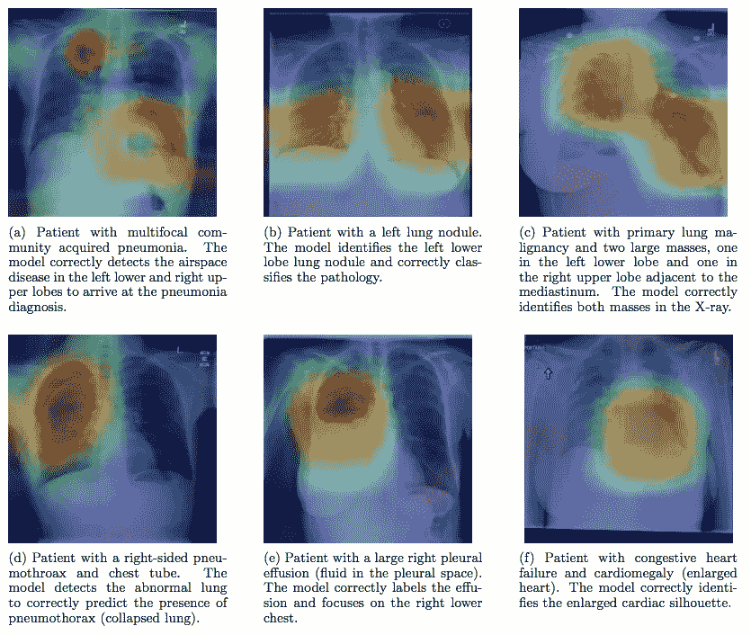
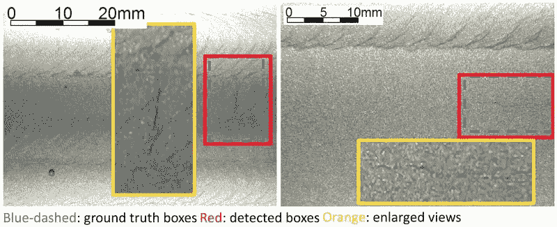
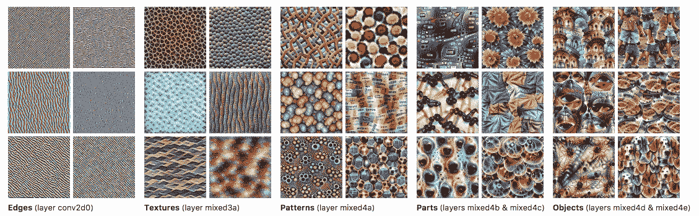

# 人工智能和深度学习的最新进展:12 月更新

> 原文：<https://medium.com/hackernoon/up-to-speed-on-ai-deep-learning-december-update-c9683fd3295>

## 分享一些关于深度学习的最新研究、公告和资源。

*由* [*萨克*](https://www.linkedin.com/in/isaacmadan) *(* [*邮箱*](mailto:isaac@venrock.com) *)*

继续我们的深度学习系列更新，我们收集了一些自我们上一篇帖子以来出现的令人敬畏的资源。如果你错过了，你可以在这里找到所有过去的更新。和往常一样，这个列表并不全面，所以如果有我们应该添加的东西，或者如果你有兴趣进一步讨论这个领域，请让我们知道。如果你是一名机器学习从业者或学生，在这里 加入我们的人才网 [**，获得绝佳的机器学习机会。**](https://docs.google.com/forms/d/e/1FAIpQLScSLc-772-6rsumQ2fCGqzNMjkqtpE2h3yIBLh5jgwEP-g0gA/viewform)

# 人工智能的新应用

***检测肺炎:*** [**CheXNet:斯坦福 ML 集团 Rajpurkar *等人*利用深度学习**](https://stanfordmlgroup.github.io/projects/chexnet/) 对胸部 x 光片进行放射科医师级别的肺炎检测。*我们开发了一种算法，可以在超过执业放射科医生的水平上从胸部 x 光片中检测肺炎。我们的模型 CheXNet 是一个 121 层的卷积神经网络，它输入胸部 x 光图像，并输出肺炎的概率以及定位图像中最能指示肺炎的区域的热图。*原文 [**此处**](https://arxiv.org/abs/1711.05225) 。

***检测核反应堆裂缝:*** [**NB-CNN:基于深度学习的利用卷积神经网络和朴素贝叶斯数据融合的裂缝检测**](http://ieeexplore.ieee.org/document/8074762/) 作者:普渡大学陈*等人*。*普渡大学正在开发的一个系统使用人工智能来检测核反应堆视频中捕捉到的裂缝，代表了一种未来的检查技术，有助于减少事故和维护成本。*

***自我学习机器人:*** [**人工智能研究人员离开埃隆马斯克实验室开始机器人初创**](https://www.nytimes.com/2017/11/06/technology/artificial-intelligence-start-up.html) 。 *Embodied Intelligence 将专注于复杂的算法，允许机器自行学习任务。使用这些方法，现有的机器人可以学习，例如，安装与他们过去安装的零件不太一样的汽车零件，在一桶随机的节日礼物到达仓库时对它们进行分类，或者执行机器传统上不能执行的其他任务。由 UC Berekeley 教授 Pieter Abbeel 和前 OpenAI 研究员、Rocky Duan 和前微软研究员张天豪创立。*

***人脸检测:*** [**苹果公司计算机视觉机器学习团队的一个用于人脸检测的 On-device 深度神经网络**](https://machinelearning.apple.com/2017/11/16/face-detection.html) 。*苹果在 iOS 10 开始使用深度学习进行人脸检测。随着 Vision 框架的发布，开发人员现在可以在他们的应用程序中使用这项技术和许多其他计算机视觉算法。我们在开发框架的过程中面临着巨大的挑战，因此我们可以保护用户隐私并在设备上高效运行。本文讨论了这些挑战，并介绍了人脸检测算法。*

***姑息治疗:*** [**用深度学习改进姑息治疗**](https://arxiv.org/abs/1711.06402) 斯坦福 ML /身体质量指数的 Avati *等人*。使用深度神经网络来识别可能从姑息治疗服务中受益的患者，并使他们引起医院的姑息治疗专业人员的注意，以便更好地拓展。

*   *提高住院患者临终关怀的质量是医疗保健机构的首要任务。*我们的预测使姑息治疗团队能够采取积极主动的方法来接触这些患者，而不是依赖治疗医生的转诊，或对所有患者进行耗时的图表审查。

***编码/算法设计:***[**dl paper 2 Code:Sethi*等人*从深度学习研究论文**](https://arxiv.org/abs/1711.03543) 中自动生成代码。*随着深度学习研究论文的丰富，现有作品的可复制性或采用性成为一个挑战。我们提出了一种新的可扩展方法 DLPaper2Code，用于提取和理解研究论文中可用的深度学习设计流程图和表格，并将它们转换为抽象的计算图。然后，提取的计算图被实时转换成 Keras 和 Caffe 中的可执行源代码。*

# 公告和研究

呼吁国际禁止人工智能武器化。*领先人工智能研究人员的公开信，要求加拿大政府紧急应对致命自主武器(通常被称为“杀手机器人”)的挑战，并在即将在日内瓦举行的联合国会议上在国际舞台上采取反对自主武器系统的领先地位。*

[**Google tensor flow 团队宣布 tensor flow Lite**](https://developers.googleblog.com/2017/11/announcing-tensorflow-lite.html)**。用于移动和嵌入式设备的轻量级解决方案。支持设备上机器学习模型的低延迟推断。轻量级、跨平台、快速。**

**[**SLING:Google 的 Michael Ringgaard 和 Rahul Gupta 的自然语言框架语义解析器**](https://research.googleblog.com/2017/11/sling-natural-language-frame-semantic.html) 。**

*   ***直到最近，最实用的* [*自然语言理解*](https://en.wikipedia.org/wiki/Natural_language_understanding)*【NLU】系统使用了一系列的分析阶段，从词性标注和依存解析到计算输入文本的语义表示的步骤。***
*   ***今天我们宣布*[*SLING*](https://github.com/google/sling)*，这是一个实验系统，用于将自然语言文本直接解析为语义框架图的表示。***
*   ***SLING 使用专用的* [*递归神经网络*](https://en.wikipedia.org/wiki/Recurrent_neural_network) *模型，通过对框架图的增量编辑操作，计算出输入文本的输出表示。***

**[**Google TensorFlow 团队推出 tensor flow 特色栏目**](https://developers.googleblog.com/2017/11/introducing-tensorflow-feature-columns.html) 。*我们将这篇文章致力于特性列——一种描述估计器训练和推断所需特性的数据结构。正如您将看到的，特性列非常丰富，使您能够表示各种各样的数据。***

**[**【一网打尽】—常*等*利用深度投影模型**](https://arxiv.org/pdf/1703.09912.pdf) 求解线性反问题。*我们提出了一个通用框架来训练一个单一的深度神经网络，解决任意线性逆问题。***

# **人工智能与企业软件**

**[**软件 2.0**](/@karpathy/software-2-0-a64152b37c35) 作者安德烈·卡帕西的特斯拉。软件 1.0 的“经典栈”是我们都熟悉的——它是用 Python、C++等语言编写的。相比之下，软件 2.0 是用神经网络权重写的。**

*   **事实证明，现实世界中的大部分问题都有一个特性，那就是收集数据比显式地编写程序要容易得多。未来的大部分程序员不维护复杂的软件库，不编写复杂的程序，也不分析它们的运行时间。他们收集、清理、操作、标记、分析和可视化输入神经网络的数据。**

**[**为企业考虑 tensor flow**](http://www.oreilly.com/data/free/considering-tensorflow-for-the-enterprise.csp)**作者**肖恩·墨菲(Sean Murphy)和艾伦·莱斯(Allen Leis of O'Reilly)。*从企业角度介绍深度学习，并概述 TensorFlow 库和生态系统。如果您的公司正在采用深度学习，这份报告将帮助您导航您必须做出的最初决定-从选择深度学习框架到将深度学习与其他已经到位的数据分析系统集成-以确保您正在构建一个能够处理您特定业务需求的系统。***

****

# **资源/教程**

**了解辛顿的胶囊网络。 [**第一部分:直觉**](/ai³-theory-practice-business/understanding-hintons-capsule-networks-part-i-intuition-b4b559d1159b) **和** [**第二部分:胶囊如何工作**](/ai³-theory-practice-business/understanding-hintons-capsule-networks-part-ii-how-capsules-work-153b6ade9f66) 作者 Max Pechyonkin。几周前，Geoffrey Hinton 和他的团队发表了两篇论文，介绍了一种基于所谓胶囊的全新类型的神经网络。除此之外，该团队还发布了一种算法，称为胶囊之间的动态路由，允许训练这样的网络。在这篇文章中，我将解释为什么这个新架构如此重要，以及它背后的直觉。在下面的文章中，我将深入技术细节。**

**[**胶囊网络(caps net)——教程**](https://www.youtube.com/watch?v=pPN8d0E3900&feature=youtu.be) 作者 Aurélien Géron。 *CapsNets 的解释，CapsNets 是一种热门的神经网络新架构，由深度学习的教父之一 Geoffrey Hinton 发明。***

**[**特征可视化**](https://distill.pub/2017/feature-visualization/) 由谷歌研究人员完成。*特征可视化解释——神经网络如何建立对图像的理解。越来越多的人意识到神经网络需要能够被人类理解。虽然特征可视化是一个强大的工具，但实际上让它工作涉及到许多细节。在本文中，我们将研究主要问题，并探索解决这些问题的常用方法。***

**[**ICML 2017:深度学习论文、讲座、教程**](https://www.twosigma.com/insights/icml-2017-a-review-of-deep-learning-paperstalks-and-tutorials) 综述，作者:两位适马的 Satrajit Chatterjee。*一名高二适马研究员概述了 2017 年 ICML 最有趣的深度学习研究。***

**[**强化学习:介绍**](http://incompleteideas.net/sutton/book/bookdraft2017nov5.pdf) **理查德·萨顿和安德鲁·巴尔托。第二版的完整草稿。对强化学习的深入、技术性和广泛的探讨。****

**[**力量&深度学习的极限**](https://www.youtube.com/watch?time_continue=1&v=0tEhw5t6rhc) 脸书人工智能研究主任 Yann LeCun。乐存在 *AI &未来工作*大会上的讲话。36 分钟视频。**

**[**理解阎石的《LSTM》及其图**](/mlreview/understanding-lstm-and-its-diagrams-37e2f46f1714) 。解释 LSTM 工作原理的伟大图表。**

**作者:艾萨克·马丹。艾萨克是文洛克公司的投资者。如果你对深度学习感兴趣，或者我应该在未来的简讯中分享一些资源，我很乐意收到你的来信。如果你是机器学习从业者或学生，请在这里 加入我们的人才网 [**，获得绝佳的机器学习机会。**](https://docs.google.com/forms/d/e/1FAIpQLScSLc-772-6rsumQ2fCGqzNMjkqtpE2h3yIBLh5jgwEP-g0gA/viewform)**

**[**创业请求**](http://www.requestsforstartups.com) 是一份由投资者、经营者和影响者提供的创业想法&观点的时事通讯。**

*****请轻点或点击“︎***【❤】*帮助向他人推广此作品。***

****