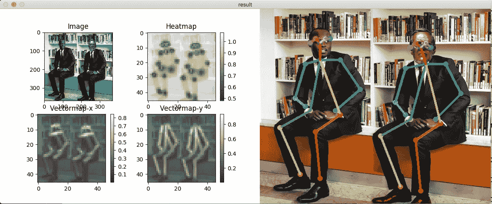
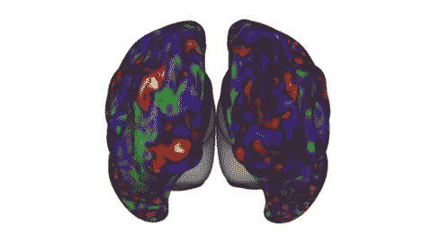

# 人工智能和深度学习的最新进展:11 月更新

> 原文：<https://medium.com/hackernoon/up-to-speed-on-ai-deep-learning-november-update-7b07c7b57cef>

## 分享一些关于深度学习的最新研究、公告和资源。

*由* [*萨克*](https://www.linkedin.com/in/isaacmadan) *(* [*邮箱*](mailto:isaac@venrock.com) *)*

继续我们的深度学习系列更新，我们收集了一些自我们上一篇帖子以来出现的令人敬畏的资源。如果你错过了，你可以在这里找到所有过去的更新。和往常一样，这个列表并不全面，所以如果有我们应该添加的东西，或者如果你有兴趣进一步讨论这个领域，请让我们知道。如果你是一名机器学习从业者或学生，在这里 加入我们的人才网 [**，获得绝佳的机器学习机会。**](https://docs.google.com/forms/d/e/1FAIpQLScSLc-772-6rsumQ2fCGqzNMjkqtpE2h3yIBLh5jgwEP-g0gA/viewform)

# 研究和公告

[**open pose:CMU 的身体、脸部、手的实时多人关键点检测库**](https://github.com/CMU-Perceptual-Computing-Lab/openpose) 。 *OpenPose 是一个使用 OpenCV 和 Caffe 用 C++编写的实时多人关键点检测和多线程的库。*

*   **一个扩展:** [***Openpose 来自 CMU，使用 Tensorflow 实现，具有快速推理的自定义架构***](https://github.com/ildoonet/tf-openpose) ***。*** *它为 CPU 或低功耗嵌入式设备上的实时处理提供了对网络结构的一些改变。*

***【读心术】AI:*** [**用于动态自然视觉的深度学习的神经编解码**](http://www.purdue.edu/newsroom/releases/2017/Q4/researchers-demonstrate-mind-reading-brain-decoding-tech-----.html) 由文*等*普渡工程。*研究人员展示了如何通过使用人工智能解读观看视频的人的 fMRI 扫描来解码人脑所看到的内容，这是一种读心术。* Youtube 视频 [**这里**](https://www.youtube.com/watch?v=Qh5_uMGXl1g) 。原文 [**此处**](https://academic.oup.com/cercor/article/4560155/Neural-Encoding-and-Decoding-with-Deep-Learning) 。

**胶囊间的动态路由**由谷歌大脑的 Hinton *等人*完成。杰弗里·辛顿的新论文。*胶囊是一组神经元，其活动向量表示特定类型的实体(如对象或对象部分)的实例化参数。我们证明了一个经过判别训练的多层胶囊系统在 MNIST 上达到了最先进的性能，并且在识别高度重叠的数字方面比卷积网络好得多。* PyTorch 实现的论文 [**此处**](https://github.com/gram-ai/capsule-networks) 。

[**DeepXplore:深度学习系统的自动化白盒测试**](https://arxiv.org/abs/1705.06640) 哥伦比亚工程的 Pei *等人*。

*   哥伦比亚大学和利哈伊大学的研究人员已经找到了一种方法，可以自动检查深度学习神经网络中数千到数百万个神经元的错误。他们的工具将令人困惑的真实世界输入到网络中，以揭露神经元集群有缺陷的推理的罕见实例。
*   *DeepXplore 通过在包括 ImageNet 和 Udacity 自动驾驶挑战数据在内的五个流行数据集上训练的数千个神经元，在最先进的 DL 模型中有效地发现数千个不正确的角落情况行为(例如，自动驾驶汽车撞上护栏和伪装成良性软件的恶意软件)。*

[**使用非并行数据的语音转换(即像凯特·温斯莱特一样说话)**](https://github.com/andabi/deep-voice-conversion) 由安和朴。*tensor flow 中用于语音转换(语音风格转换)的深度神经网络。* GitHub 回购。

[**优步 AI Labs 开源的深度概率编程语言**](https://eng.uber.com/pyro/)**Pyro。**网站和文档 [**此处**](http://pyro.ai/) 。

*   ***为什么要概率建模？*** *为无监督和半监督学习正确捕捉模型和预测中的不确定性，为 AI 系统提供陈述性先验知识。*
*   ***为什么(通用)概率程序？*** *为指定复杂模型提供一种清晰、高级但完整的语言。*
*   ***为什么深度概率模型？*** *从数据中学习生成性知识，具体化如何做推理的知识。*
*   ***为什么要通过优化来推断？*** *支持扩展到大数据，利用现代优化和变分推理的优势。*

# 资源、教程和数据

[**深 RL Bootcamp**](http://​This two-day long bootcamp will teach you the foundations of Deep RL through a mixture of lectures and hands-on lab sessions, so you can go on and build new fascinating applications using these techniques and maybe even push the algorithmic frontier.) 由 UC Berkeley 出品。*这个为期两天的训练营将通过讲座和动手实验室会议的混合来教你深度 RL 的基础，因此你可以继续使用这些技术构建新的迷人的应用程序，甚至可能推动算法的前沿。*精彩的主题、内容和演讲人——在线提供讲座和实验。

[**最新深度学习 OCR 用 Keras 和 Supervisely 在 15 分钟内**](https://hackernoon.com/latest-deep-learning-ocr-with-keras-and-supervisely-in-15-minutes-34aecd630ed8) 通过 Deep Systems。*本教程温和地介绍了如何在 15 分钟内使用深度学习构建现代文本识别系统。*

[**AMA 与 DeepMind 开发 AlphaGo**](https://www.reddit.com/r/MachineLearning/comments/76xjb5/ama_we_are_david_silver_and_julian_schrittwieser/) 的两名团队成员。 *AlphaGo Zero 使用了一种与典型(无模型)算法(如策略梯度或 Q 学习)完全不同的方法来进行深度学习。通过使用 AlphaGo 搜索，我们极大地改善了策略和自我游戏的结果，然后我们应用简单的、基于梯度的更新来训练下一个策略+价值网络。这似乎比渐进的、基于梯度的政策改进更稳定，后者可能会忘记以前的改进。*

**BTW:** [**如何阅读滑铁卢大学 S. Keshav 的一篇论文**](http://ccr.sigcomm.org/online/files/p83-keshavA.pdf) 。不是新发表的，但是非常有用，因为新的 ML 论文的数量持续快速增长。

作者:艾萨克·马丹。艾萨克是文洛克公司的投资者。如果你对深度学习感兴趣，或者我应该在未来的简讯中分享一些资源，我很乐意收到你的来信。如果你是机器学习从业者或学生，请在这里 加入我们的人才网 [**，获得绝佳的机器学习机会。**](https://docs.google.com/forms/d/e/1FAIpQLScSLc-772-6rsumQ2fCGqzNMjkqtpE2h3yIBLh5jgwEP-g0gA/viewform)

[**创业请求**](http://www.requestsforstartups.com) 是一份由投资者、经营者和影响者提供的创业想法&观点的时事通讯。

***请点击或点击“︎***【❤】*帮助向他人推广此作品。*

