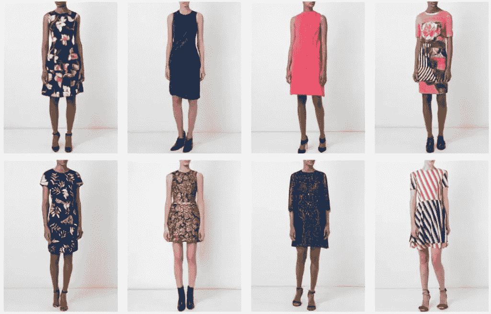
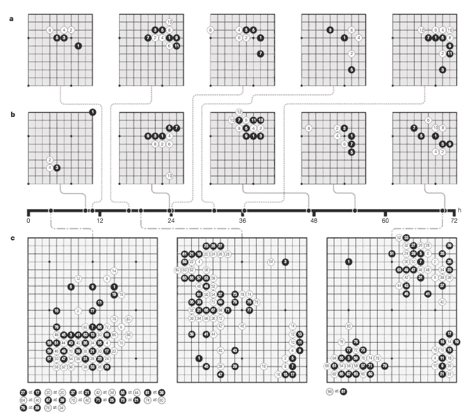
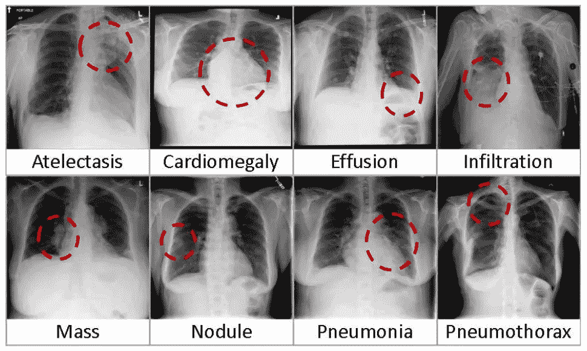

# 人工智能和深度学习最新进展:10 月更新，第 2 部分

> 原文：<https://medium.com/hackernoon/up-to-speed-on-ai-deep-learning-october-update-part-2-32e783d87210>

## 分享一些关于深度学习的最新研究、公告和资源。

*由* [*萨克*](https://www.linkedin.com/in/isaacmadan) *(* [*邮箱*](mailto:isaac@venrock.com) *)*

继续我们的深度学习系列更新，我们收集了一些自我们上一篇帖子以来出现的令人敬畏的资源。如果你错过了，你可以在这里找到所有过去的更新。和往常一样，这个列表并不全面，所以如果有我们应该添加的东西，或者如果你有兴趣进一步讨论这个领域，请让我们知道。

# 研究和公告

[**掌握无人知晓的围棋**](https://deepmind.com/blog/alphago-zero-learning-scratch/) 由 DeepMind 的 Silver *等人*完成。不需要先验知识的 AlphaGo 实现——系统会自我学习。*这里我们介绍一种完全基于强化学习的算法，不需要人类数据、指导或者游戏规则之外的领域知识。AlphaGo 成为了自己的老师:一个神经网络被训练来预测 AlphaGo 自己的走法选择，以及 AlphaGo 游戏的获胜者。*原文 [**此处**](https://www.nature.com/articles/nature24270.epdf?referrer_access_token=EtVDfUt9SqlM07ZlOyumXNRgN0jAjWel9jnR3ZoTv0PVW4gB86EEpGqTRDtpIz-22SehS6IfIWP6NGb0V5cWu5GSw1OmXIzlGgQOhXNzHHMPxmQuVcQWRzZHYYaEkYPgw24ivR5sNv5WiqTz-6iVQESP9ytDzz6NnwWCfOhvNAzQOiDLrNStiey8cut9i1WMzqckXmF0Fi6oaBLfGzTwUesM5uvMnDLxr2D7gZUTvyt-FmKq0GBqT-p0lfJ3lvfd&tracking_referrer=www.wired.co.uk) 。

[**介绍 Gluon:来自 AWS 和微软**](https://aws.amazon.com/fr/blogs/aws/introducing-gluon-a-new-library-for-machine-learning-from-aws-and-microsoft/) **的机器学习新库。微软和亚马逊用他们自己新的开源深度学习库来挑战谷歌的 TensorFlow 和脸书的 PyTorch。 *Gluon 提供了一个清晰、简洁的 API，用于使用一组预先构建、优化的神经网络组件来定义机器学习模型。***

[**人工智能可以对着装说好**](https://qz.com/1090267/artificial-intelligence-can-now-show-you-how-those-pants-will-fit/) **。** GANs 为电子商务生成服装照片。在线时尚科技初创公司 Vue.ai 正在出售一项技术，该技术可以分析服装，并自动生成任何尺寸、形状或穿着任何类型鞋子的人的服装图像(公司网站 [**此处**](https://vue.ai/) )。

[**介绍 NNVM 编译器:AWS 全新开放的 AI 框架端到端编译器**](https://aws.amazon.com/blogs/ai/introducing-nnvm-compiler-a-new-open-end-to-end-compiler-for-ai-frameworks/) 。*我们介绍 NNVM 编译器，它将高级计算图编译成优化的机器码。这解决了在许多人工智能框架和底层硬件架构上工作时出现的一些问题。*

[**英特尔 Nervana 神经网络处理器(NNP)重新定义人工智能芯片**](https://www.intelnervana.com/intel-nervana-neural-network-processors-nnp-redefine-ai-silicon/)nave en Rao。英特尔宣布专为人工智能设计的新处理器家族。

# 资源、教程和数据

[**ChestX-ray8:美国国家卫生研究院王*等*的医院级胸部 X 线数据库及常见胸部疾病弱监督分类定位基准**](https://www.nih.gov/news-events/news-releases/nih-clinical-center-provides-one-largest-publicly-available-chest-x-ray-datasets-scientific-community) 。研究人员发布用于机器学习的医疗数据集。美国国家卫生研究院临床中心最近向科学界发布了超过 100，000 张匿名的胸部 x 光图像及其相应的数据。NIH 汇编了超过 30，000 名患者的扫描数据集，其中包括许多晚期肺部疾病患者。原文 [**此处**](http://openaccess.thecvf.com/content_cvpr_2017/papers/Wang_ChestX-ray8_Hospital-Scale_Chest_CVPR_2017_paper.pdf) 。在和处的[和**框中可获得数据集。**](https://nihcc.app.box.com/v/ChestXray-NIHCC)

[**Spotify 的 Discover Weekly:机器学习如何找到你的新音乐**](https://hackernoon.com/spotifys-discover-weekly-how-machine-learning-finds-your-new-music-19a41ab76efe) 作者索菲亚·乔卡。个性化音乐推荐的机器学习方法解释。

[**可视化卷积神经网络**](https://www.oreilly.com/ideas/visualizing-convolutional-neural-networks) 亚伯达大学的贾斯汀·弗朗西斯。*使用 TensorFlow 和 TensorBoard 从头开始构建 convnets。*

[**梯度下降，神经网络如何通过 3Blue1Brown 学习**](https://www.youtube.com/watch?v=IHZwWFHWa-w) 。梯度下降如何工作的可消化的解释(Youtube 视频)。

[**抵御 AI 的生存威胁**](https://www.wsj.com/articles/protecting-against-ais-existential-threat-1508332313) 作者:OpenAI 的伊利亚·苏茨基弗和达里奥·阿莫代伊。讨论如何进行人工智能安全研究。*如何创造不对人类构成威胁的 AI？通过教它和人类一起工作。*

吴恩达有一款聊天机器人可以帮助治疗抑郁症。由吴恩达支持的新聊天机器人专注于改善心理健康的互动行为疗法。

作者:艾萨克·马丹。Isaac 是 Venrock 的投资者([电子邮件](mailto:isaac@venrock.com))。如果你对深度学习感兴趣，或者我应该在未来的简讯中分享一些资源，我很乐意收到你的来信。如果你是机器学习从业者或学生，请在这里 加入我们的人才网 [**，获得绝佳的机器学习机会。**](https://docs.google.com/forms/d/e/1FAIpQLScSLc-772-6rsumQ2fCGqzNMjkqtpE2h3yIBLh5jgwEP-g0gA/viewform)

**是一份由投资者、经营者和影响者提供的创业想法&观点的时事通讯。**

*****请点击或点击“︎***【❤】*帮助向他人推广此作品。***

****