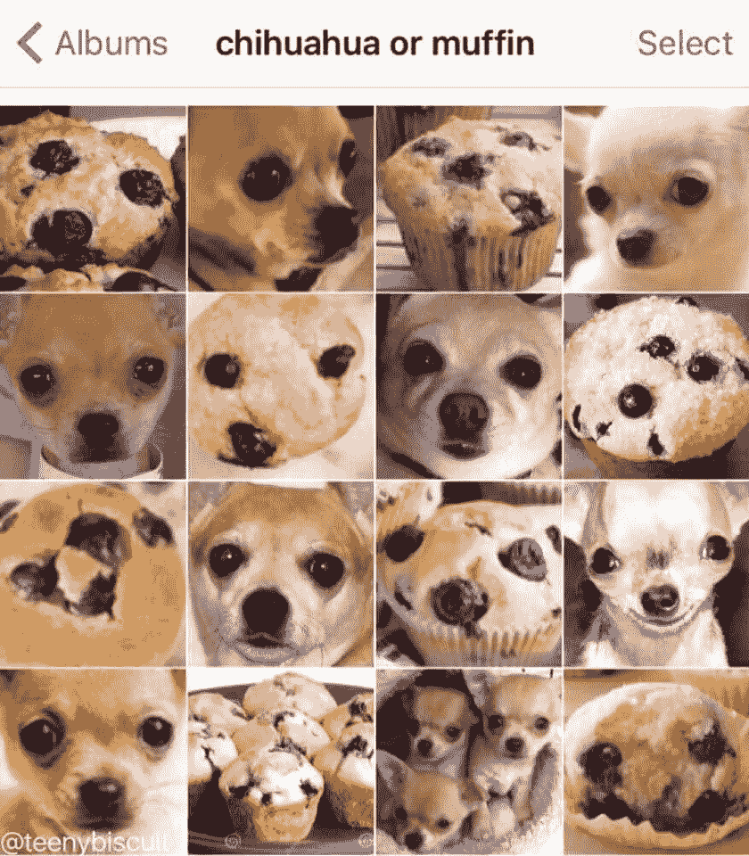

# 深度学习的最新进展:4 月更新

> 原文：<https://medium.com/hackernoon/up-to-speed-on-deep-learning-april-update-7a0f5d1c580a>

## 分享一些关于深度学习的最新研究、公告和资源。

*由* [*萨克*](https://www.linkedin.com/in/isaacmadan) *(* [*邮箱*](mailto:isaac@venrock.com) *)*

继续我们的深度学习系列更新，我们收集了一些自我们上一篇帖子以来出现的令人敬畏的资源。以防你错过，这里是我们以往的更新: [**三月第一部**](https://hackernoon.com/up-to-speed-on-deep-learning-march-update-part-2-4a07d99f2885) ， [**二月**](https://hackernoon.com/up-to-speed-on-deep-learning-march-update-355cb5944f9c#.dsw07hotj) ， [**十一月**](https://medium.com/p/c93663b59923/edit) ， [**九月第二部&十月第一部**](/the-mission/up-to-speed-on-deep-learning-september-part-2-and-october-part-1-d72d7e5df1ea#.bg88ojrbl) ， [**九月第一部**](/the-mission/up-to-speed-on-deep-learning-september-update-part-1-ca27a6ed03cd#.ocrcl97wd) ， [**八月第二部**](/the-mission/up-to-speed-on-deep-learning-august-update-part-2-bfb1554f885#.ps2tqe76u) **， **[**7 月第一部分**](/the-mission/up-to-speed-on-deep-learning-july-update-6c1d9e6741cf#.gcfr1dnjx) ，[**6 月**](/the-mission/up-to-speed-on-deep-learning-june-update-bb0f17ccaf0b#.2debdy7eb) ，以及我们 2016 年 4 月概述的 20+资源的 [**原集**](/life-learning/getting-up-to-speed-on-deep-learning-20-resources-efec21e0aaf9#.r91x02fcd) 。 和往常一样，这个列表并不全面，所以如果有我们应该添加的东西，或者如果你有兴趣进一步讨论这个领域，请让我们知道[。](mailto:hello@requestsforstartups.com)****

## 研究

[**通过 OpenAI 学习交流**](https://blog.openai.com/learning-to-communicate/) 。Pieter Abbeel 和他的团队概述了他们如何训练代理人发明他们自己的语言。这有助于我们实现真正的语言理解。原文[此处**此处**。](https://arxiv.org/abs/1703.04908)

[**Tacotron:谷歌的一个完全端到端的文本到语音合成模型**](https://arxiv.org/abs/1703.10135) 。*端到端的生成式文本到语音模型，直接从字符合成语音。*该系统听起来比传统方法更自然，速度也更快。音频样本 [**此处**](https://google.github.io/tacotron/) 。

[**深度照片风格转移**](https://arxiv.org/pdf/1703.07511.pdf) 作者付军栾*等人*康奈尔和 Adobe 的研究人员提出了一种增强照片风格转移的深度学习方法，即*将参考风格照片的风格转移到另一张输入图片上。*原文中的例子。

[**面具 R-CNN**](https://arxiv.org/pdf/1703.06870.pdf) 脸书。一个概念上简单、灵活、通用的对象实例分割框架。实例分割具有挑战性，因为它需要正确检测图像中的所有对象，同时还需要精确分割每个实例。

[**进化策略作为强化学习的可扩展替代**](https://blog.openai.com/evolution-strategies/)open ai。发现表明*进化策略(es)是一种几十年来一直为人所知的优化技术，在现代强化学习基准上与标准强化学习(RL)技术的性能相当，同时克服了 RL 的许多不便。*原文 [**此处**](https://arxiv.org/abs/1703.03864) 。

[**由 DeepMind 控制的**](https://arxiv.org/abs/1703.01988) 神经幕式。介绍*一种深度强化学习代理，它能够快速吸收新的经验并对其采取行动。*结果是一个比传统深度学习代理学习速度更快的系统。

## 公告

[**研究债务**](http://distill.pub/2017/research-debt/) 谷歌大脑的克里斯·奥拉和山·卡特。distilt 背后的团队解释了 distilt 生态系统-一个期刊、奖项和一套工具/基础设施，为机器学习研究的世界增加了更大的清晰度和解释。

[**脸书的 Visdom**](https://github.com/facebookresearch/visdom) 。分析实验结果和实验代码是棘手的，这个工具旨在使开箱即用的可视化和仪表板的构建更加容易。*一个灵活的工具，用于创建、组织和共享实时、丰富数据的可视化。支持 Torch 和 Numpy。*

[**开启我在 AI 工作的新篇章**](/@andrewng/opening-a-new-chapter-of-my-work-in-ai-c6a4d1595d7b) 作者吴恩达。百度人工智能团队负责人宣布离职，继续致力于人工智能工作。

[**《深度学习》，*完整网络版***](http://www.deeplearningbook.org/) 作者伊恩·古德菲勒、约舒阿·本吉奥、亚伦·库维尔。这本关于深度学习的综合书籍的在线版本现在可以免费获得全文。

[**美国艾误传疫情**](http://approximatelycorrect.com/2017/03/28/the-ai-misinformation-epidemic/) 作者扎卡里·利普顿。加州大学圣迭戈分校博士生&即将上任的 CMU 教授阐明了围绕人工智能的普遍错误信息，这是围绕该主题的兴趣和无知汇合的结果。

## 资源

[**把深度学习挤进手机**](https://www.slideshare.net/anirudhkoul/squeezing-deep-learning-into-mobile-phones) 微软的 Anirudh Koul。*如何运行深度神经网络在智能手机这样内存和能量受限的设备上运行。重点介绍了一些框架和最佳实践。*

[**看见理论**](http://students.brown.edu/seeing-theory/index.html) 布朗大学丹尼尔·库宁著。概率统计的可视化和交互式介绍，涵盖从基本概率到线性回归的主题。*该项目的目标是通过交互式可视化让更多的学生更容易获得统计数据。*

[**解剖强化学习**](https://mpatacchiola.github.io/blog/2017/03/14/dissecting-reinforcement-learning-5.html) 由马西米利亚诺·帕塔基奥拉。关于强化学习的 5 部分系列的最新部分——这一部分介绍了进化算法，特别是遗传算法。

奥莱利的尼克·克拉克将神经科学的想法应用于人工智能。杰弗里·辛顿关于神经科学和大脑对我们理解人工智能的相关性的采访。

[**奇思妙想的甘斯以及在哪里可以找到他们**](http://guimperarnau.com/blog/2017/03/Fantastic-GANs-and-where-to-find-them) 吉姆·佩拉尔瑙著。关于生成性对抗网络的相关主题、链接和资源的总结。

[**牛逼强化学习**](https://github.com/aikorea/awesome-rl) 作者 Hyunsoo Kim & Jiwon Kim。关于强化学习的优秀资源的集合，涵盖代码、理论、应用、演示等。

[**现在用 Adam Geitgey 的完全预配置的 VM**](/@ageitgey/try-deep-learning-in-python-now-with-a-fully-pre-configured-vm-1d97d4c3e9b) 尝试 Python 中的深度学习。回答这个问题，*我到底是如何在我的电脑上安装并运行这些开源库的？对于开始学习机器学习教程并希望简化设置过程的人来说，这是一个很好的资源。*

[**用深度学习对白细胞进行分类**](https://blog.athelas.com/classifying-white-blood-cells-with-convolutional-neural-networks-2ca6da239331) 由 Athelas 的 Dhruv Parthasarathy。演示如何利用深度学习将白细胞分类为单核或多核的教程。GitHub 回购[这里](http://assifying White Blood Cells With Deep Learning by Dhruv Parthasarathy of Athelas. GitHub repo here.)。

作者:艾萨克·马丹。艾萨克是文洛克公司的投资者([电子邮件](mailto:isaac@venrock.com))。如果你对深度学习感兴趣，我们很乐意[收到你的来信](mailto:hello@requestsforstartups.com)。

[**创业请求**](http://www.requestsforstartups.com) 是一份由投资者、经营者和影响者提供的创业想法&观点的时事通讯。

***请点击或点击“︎***【❤】*帮助向他人推广此作品。*

> [黑客中午](http://bit.ly/Hackernoon)是黑客如何开始他们的下午。我们是 AMI 家庭的一员。我们现在[接受投稿](http://bit.ly/hackernoonsubmission)并乐意[讨论广告&赞助](mailto:partners@amipublications.com)机会。
> 
> 如果你喜欢这个故事，我们推荐你阅读我们的[最新科技故事](http://bit.ly/hackernoonlatestt)和[趋势科技故事](https://hackernoon.com/trending)。直到下一次，不要把世界的现实想当然！

