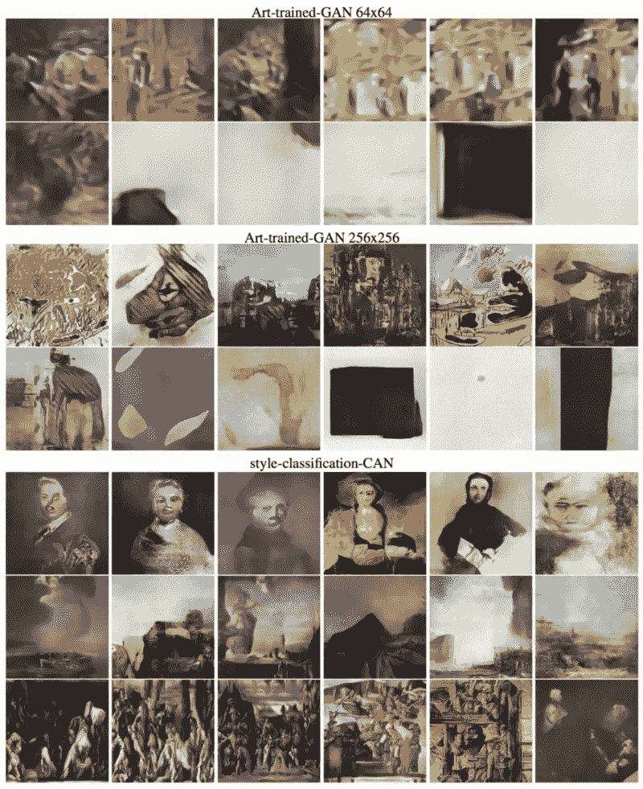
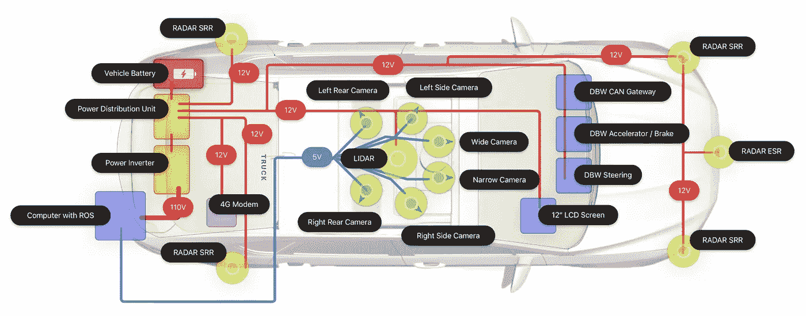

# 深度学习最新进展:7 月更新

> 原文：<https://medium.com/hackernoon/up-to-speed-on-deep-learning-july-update-4513a5d61b78>

## 分享一些关于深度学习的最新研究、公告和资源。

*由* [*萨克*](https://www.linkedin.com/in/isaacmadan) *(* [*邮箱*](mailto:isaac@venrock.com) *)*

继续我们的一系列深入学习更新，我们汇集了一些令人敬畏的资源，出现了自我们的上一篇文章。为免错过，以下是我们过去的更新:**6 月**[**1 部分**](https://hackernoon.com/up-to-speed-on-deep-learning-june-update-f6fcdea4f521)**[**2 部分**](https://hackernoon.com/up-to-speed-on-deep-learning-june-update-part-2-b4942c6812ad)**[**3 部分**](https://hackernoon.com/up-to-speed-on-deep-learning-june-11-18-update-88333284f8fe)8、[T21 4 部分](https://hackernoon.com/up-to-speed-on-deep-learning-june-update-part-4-487f8bae4e3) **)** 、[**5 月**](https://hackernoon.com/up-to-speed-on-deep-learning-may-update-a146d851f14f) 、[**第 2 部分**](/the-mission/up-to-speed-on-deep-learning-april-update-part-2-14ff1f8418a5)**)**[**3 月第 1 部分**](https://hackernoon.com/up-to-speed-on-deep-learning-march-update-part-2-4a07d99f2885)[**2 月第 1 部分**](https://hackernoon.com/up-to-speed-on-deep-learning-march-update-355cb5944f9c#.dsw07hotj)[**11 月第 2 部分**](https://medium.com/p/c93663b59923/edit)[9 月第 1 部分](/the-mission/up-to-speed-on-deep-learning-september-part-2-and-october-part-1-d72d7e5df1ea#.bg88ojrbl)[**9 月第 1 部分**](/the-mission/up-to-speed-on-deep-learning-september-update-part-1-ca27a6ed03cd#.ocrcl97wd) 、 **7 月** ( [**第 1 部分**](/the-mission/up-to-speed-on-deep-learning-july-update-6c1d9e6741cf#.gcfr1dnjx) 、 [**第 2 部分**](/the-mission/up-to-speed-on-deep-learning-july-update-part-2-baacc835d8ab#.n12qybgf6) **)、**[**6 月**](/the-mission/up-to-speed-on-deep-learning-june-update-bb0f17ccaf0b#.2debdy7eb) ，以及 [**原订**](/life-learning/getting-up-to-speed-on-deep-learning-20-resources-efec21e0aaf9#.r91x02fcd) 的 20+资源我们在 2016 年 4 月勾画。 和以往一样，这个列表并不全面，所以[如果有什么需要补充的，或者你有兴趣进一步讨论这个领域的话，请告诉我们](mailto:hello@requestsforstartups.com)。****

********

# ****研究和公告****

****[**【阿波罗】**](http://apollo.auto/) 被百度。新推出的用于构建自动驾驶汽车的源代码平台。****

****索尼 [**神经网络库**](https://nnabla.org/) 。索尼通过发布他们自己的开源深度学习框架来展示其对深度学习的兴趣。****

****[**CAN(创意对抗网络)Harshvardhan Gupta 解释**](https://hackernoon.com/can-creative-adversarial-network-explained-1e31aea1dfe8) 。脸书研究人员*提出了一种新的艺术生成系统，该系统通过观察艺术和学习风格来生成艺术；并且通过偏离所学的风格来增加所产生的艺术的激发潜力，从而变得有创造性。*本帖走马观花，详解。原文 [**此处**](https://arxiv.org/abs/1706.07068) 。****

****[**【可解释的人工智能】:破解 AI**](https://www.computerworld.com.au/article/617359/explainable-artificial-intelligence-cracking-open-black-box-ai/) 的黑匣子，乔治·诺特。深度神经网络目前的一个缺点和正在进行的研究领域是，它们是黑盒，这意味着它们的决策结果不容易被证明或解释。文章讨论了这一领域的各种尝试和正在进行的工作，包括加州大学伯克利分校&马克斯普朗克研究所在这篇原始论文 [**这里**](https://arxiv.org/pdf/1612.04757v1.pdf) 中描述的工作。****

****[**用认知心理学解读深度神经网络**](https://deepmind.com/blog/cognitive-psychology/)Deep mind。与上面的文章类似，DeepMind 的研究人员提出了一种新的方法，通过利用认知心理学的方法来解释/解释深度神经网络模型。例如，当儿童从一个例子中猜出一个单词的意思时(一次性单词学习)，他们使用了各种各样的归纳偏差，例如形状偏差。DeepMind 评估了他们模型中的这种偏见，以改善他们对引擎盖下发生的事情的解释。原文 [**此处**](https://arxiv.org/abs/1706.08606) 。****

****[**走向理解深度学习的泛化:损失景观透视**](https://arxiv.org/abs/1706.10239) 吴、等。深究问题，*深度神经网络为什么泛化能力好？*****

********

# ****资源、教程和数据****

****[**自动驾驶出租车的引擎盖下**](https://news.voyage.auto/under-the-hood-of-a-self-driving-car-78e8bbce62a6) 《远航》的奥利弗·卡梅隆。对驱动自动驾驶汽车的技术堆栈进行了有益的概述，深入研究了 Voyage 的计算、电力和线控系统。****

****[**HBO 的硅谷如何用移动 TensorFlow 打造《不是热狗》，Keras & React Native**](https://hackernoon.com/how-hbos-silicon-valley-built-not-hotdog-with-mobile-tensorflow-keras-react-native-ef03260747f3) 作者 Tim Anglade。一个关于硅谷电视节目如何制作他们的应用程序的演示，该应用程序能识别热狗和 T21 热狗。****

****[**Machine UI**](https://www.youtube.com/watch?v=N9q9qacAKoM) ，专为机器学习打造的全新 IDE，采用视觉模型表示。*视频*。****

****[**2017 年深度学习语义切分指南**](http://blog.qure.ai/notes/semantic-segmentation-deep-learning-review)qure . ai .语义切分最新技术综述。作为上下文，语义分割是在像素级别理解图像，也就是说，我们希望为图像中的每个像素分配一个对象类别。****

****作者:艾萨克·马丹。艾萨克是文洛克公司的投资者。如果你对深度学习感兴趣，或者我应该在未来的简讯中分享一些资源，我很乐意收到你的来信。****

******是一份由投资者、经营者和影响者提供的创业想法&观点的时事通讯。******

*********请点击或点击“︎***【❤】*帮助向他人推广此作品。*******

********