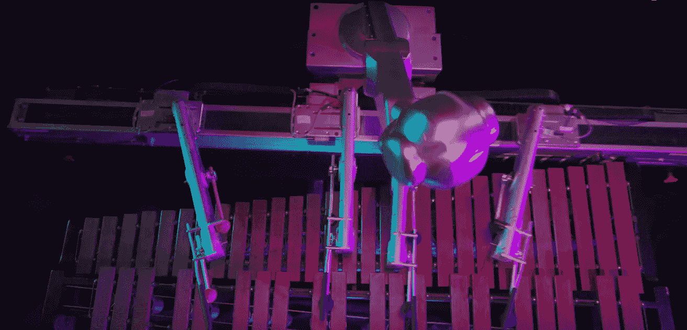
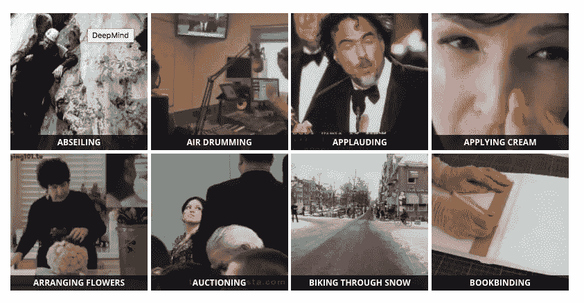

# 深度学习最新进展:6 月更新，第 3 部分

> 原文：<https://medium.com/hackernoon/up-to-speed-on-deep-learning-june-11-18-update-88333284f8fe>

## 分享一些关于深度学习的最新研究、公告和资源。

*由* [*萨克*](https://www.linkedin.com/in/isaacmadan) *(* [*邮箱*](mailto:isaac@venrock.com) *)*

继续我们的深度学习系列更新，我们收集了一些自我们上一篇帖子以来出现的令人敬畏的资源。万一你错过了，这里是我们过去的更新:**六月(** [**第一部**](https://hackernoon.com/up-to-speed-on-deep-learning-june-update-f6fcdea4f521) **，** [**第二部**](https://hackernoon.com/up-to-speed-on-deep-learning-june-update-part-2-b4942c6812ad) **)** ， [**五月**](https://hackernoon.com/up-to-speed-on-deep-learning-may-update-a146d851f14f) ，**四月** **(** [**第一部**](https://hackernoon.com/up-to-speed-on-deep-learning-april-update-7a0f5d1c580a) **，** [**第二部**](/the-mission/up-to-speed-on-deep-learning-april-update-part-2-14ff1f8418a5) [**十一月**](https://medium.com/p/c93663b59923/edit) ， [**九月第二部&十月第一部**](/the-mission/up-to-speed-on-deep-learning-september-part-2-and-october-part-1-d72d7e5df1ea#.bg88ojrbl) ， [**九月第一部**](/the-mission/up-to-speed-on-deep-learning-september-update-part-1-ca27a6ed03cd#.ocrcl97wd) ，**八月** [**第一部**](/the-mission/up-to-speed-on-deep-learning-august-update-part-1-25afc11aea6b#.2mv855gbu) **，** [**第二部**](/the-mission/up-to-speed-on-deep-learning-august-update-part-2-bfb1554f885#.ps2tqe76u)**， 和往常一样，这个列表并不全面，所以如果有我们应该添加的东西，或者如果你有兴趣进一步讨论这个领域，请让我们知道。**

# **研究和公告**

**[**通过互动学习说话**](http://research.baidu.com/learning-speak-via-interaction/) 由百度研究。通过与虚拟智能体交互来教人工智能智能体说话。这代表着在更接近复制人类学习方式方面的进步，也推进了我们展示通用人工智能的目标。*我们的人工智能代理学习以类似婴儿的互动方式说话。相比之下，传统的方法依赖于使用预先收集的训练集的大型语料库的监督训练，这是静态的，使得难以捕捉语言学习过程中的交互性质。*原文 [**此处**](https://arxiv.org/abs/1705.09906) 。**

**佐治亚理工学院的梅森·布里坦创作的《Deep Shimon:自己作曲的机器人》。*机器人西蒙创作并表演了他的第一个深度学习驱动的作品。在古典和爵士音乐的大型数据库上训练递归深度神经网络。基于该数据集中学习到的音乐单元之间的语义关系，Shimon 生成并演奏一首新的音乐作品。*视频 [**此处**](https://www.youtube.com/watch?v=j82nYLOnKtM) 。**

**[**好奇心驱动的探索通过自我监督预测**](https://www.technologyreview.com/s/607886/curiosity-may-be-vital-for-truly-smart-ai/?mc_cid=d4fe3c8190&mc_eid=5e123a678b)Pathak*等人*。加州大学伯克利分校的研究人员通过*内在好奇心模型*展示了人工好奇心，以控制视频游戏中的虚拟代理，并更快地了解其环境——这可以加速问题的解决。原文 [**此处**](https://arxiv.org/pdf/1705.05363.pdf) 和视频 [**此处**](https://www.youtube.com/watch?v=J3FHOyhUn3A) 。**

**[**精确、大批量 SGD:1 小时训练 ImageNet**](https://research.fb.com/publications/imagenet1kin1h/)由脸书研究。深度学习受益于海量数据集，但这意味着漫长的训练时间，从而降低了开发速度。*使用商用硬件，当从 8 个 GPU 移动到 256 个 GPU 时，我们的实现实现了 90%的扩展效率。该系统使我们能够高效率地在互联网规模的数据上训练视觉识别模型。*原文 [**此处**](https://research.fb.com/wp-content/uploads/2017/06/imagenet1kin1h5.pdf?) 。**

****

# **资源**

**[**用 TensorFlow**](https://www.youtube.com/watch?v=5e0TbyCkbCY) 温柔介绍深度学习，作者 Michelle Fullwood 在 PyCon 2017。*本次演讲旨在通过展示深度学习如何对核心机器学习概念进行操作，并让与会者开始使用谷歌的 TensorFlow 库对深度神经网络进行编码，来温和地弥合这一鸿沟。* 41 分钟视频。幻灯片 [**这里**](https://speakerdeck.com/pycon2017) 和 GitHub [**这里**](https://github.com/PyCon/2017-slides) 。**

**[**深度强化学习揭秘(第 0 集)**](/@m.alzantot/deep-reinforcement-learning-demystified-episode-0-2198c05a6124)Moustafa Alzantot。*对强化学习的基本描述，并举例说明它的用途。涵盖强化学习的基本术语，并提供关于 OpenAI gym 的快速教程。***

**[**神经网络和深度学习**](http://neuralnetworksanddeeplearning.com/) 迈克尔·尼尔森著。介绍神经网络和深度学习的免费在线书籍。**

**[**即使你的数据没有那么大，你也可能会使用深度学习。文章讨论并解释了*如果你仔细训练你的模型，你如何仍然可以在(一些)小数据设置中使用深度学习。*回应**](https://beamandrew.github.io/deeplearning/2017/06/04/deep_learning_works.html) **[*不要用深度学习你的数据没那么大*](https://simplystatistics.org/2017/05/31/deeplearning-vs-leekasso/) 杰夫·韭菜。****

**[**ArXiv 上发帖好，插旗尽管**](https://www.facebook.com/yann.lecun/posts/10154498539442143) 由 Yann LeCun。回应并反驳 [*巴尔宜兰大学的 Yoav Goldberg 对“自然语言的对抗性生成”*](/@yoav.goldberg/an-adversarial-review-of-adversarial-generation-of-natural-language-409ac3378bd7) 的对抗性评论，该评论对深度学习研究人员在 Arxiv 上积极发表文章提出异议。**

****

# **教程和数据**

**[**华盛顿大学计算神经科学 Coursera 课程**](https://www.coursera.org/learn/computational-neuroscience#) 。7 月 3 日开始，立即注册。了解大脑如何处理信息。*本课程介绍了基本的计算方法，用于理解神经系统的功能以及确定它们如何运作。我们将探索控制视觉、感觉运动控制、学习和记忆各个方面的计算原理。***

**[**核心 ML 与视觉:iOS 11 中的机器学习教程**](https://www.raywenderlich.com/164213/coreml-and-vision-machine-learning-in-ios-11-tutorial) 谭咏琪。iOS 11 引入了两个与机器学习相关的新框架，Core ML 和 Vision。本教程将带您了解如何使用这些新的 API 并构建一个场景分类器。**

**[**深度学习 CNN ' s in tensor flow with GPU**](https://hackernoon.com/deep-learning-cnns-in-tensorflow-with-gpus-cba6efe0acc2)作者科尔默里。在本教程中，您将学习卷积神经网络(CNN)的架构，如何在 Tensorflow 中创建 CNN，以及在图像标签上提供预测。最后，您将学习如何在 GPU 上运行模型，以便您可以花时间创建更好的模型，而不是等待它们收敛。**

**[**Google deep mind 的开源动力学数据集**](https://deepmind.com/research/open-source/open-source-datasets/kinetics/) 。人类行为的注释数据集——比如演奏乐器、握手和拥抱。 *Kinetics 是一个大规模、高质量的 YouTube 视频 URL 数据集，其中包括各种各样的人类焦点动作。该数据集包括大约 300，000 个视频剪辑，并且覆盖 400 个人类动作类，每个动作类至少有 400 个视频剪辑。***

**[**让我们用遗传算法进化出一个神经网络**](/@harvitronix/lets-evolve-a-neural-network-with-a-genetic-algorithm-code-included-8809bece164) 海岸线自动化的马特·哈维。*应用遗传算法进化网络，目标是在进行强力搜索所需时间的一小部分内获得最佳超参数。***

**作者:艾萨克·马丹。Isaac 是 Venrock 的投资者( [email](mailto:isaac@venrock.com) )。如果你对深度学习感兴趣，或者我应该在未来的简讯中分享一些资源，我很乐意收到你的来信。**

**[**创业请求**](http://www.requestsforstartups.com) 是一份由投资者、经营者和影响者提供的创业想法&观点的时事通讯。**

*****请点击或点击“︎***【❤】*帮助向他人推广此作品。***

****************

> **[黑客中午](http://bit.ly/Hackernoon)是黑客如何开始他们的下午。我们是这个家庭的一员。我们现在[接受投稿](http://bit.ly/hackernoonsubmission)并乐意[讨论广告&赞助](mailto:partners@amipublications.com)机会。**
> 
> **如果你喜欢这个故事，我们推荐你阅读我们的[最新科技故事](http://bit.ly/hackernoonlatestt)和[趋势科技故事](https://hackernoon.com/trending)。直到下一次，不要把世界的现实想当然！**

****