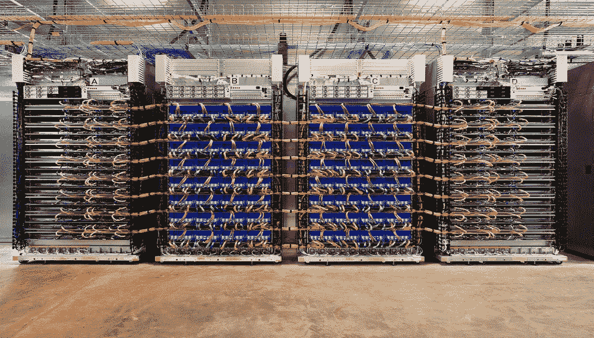
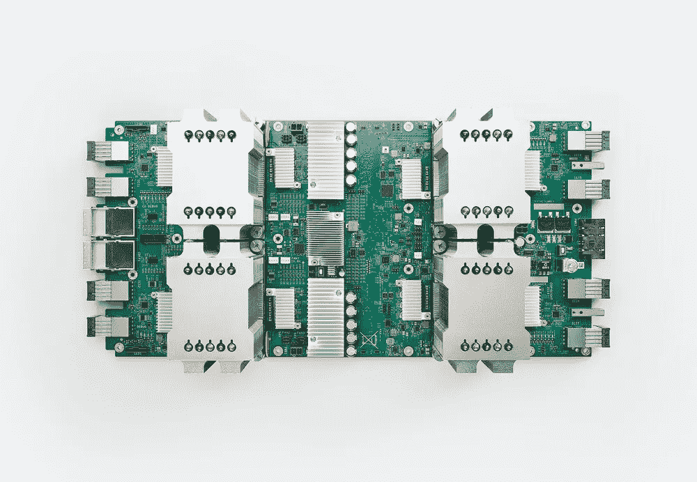
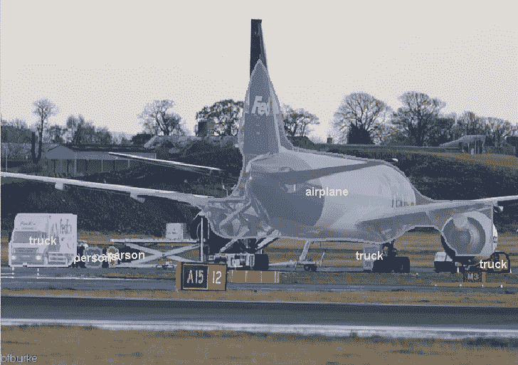
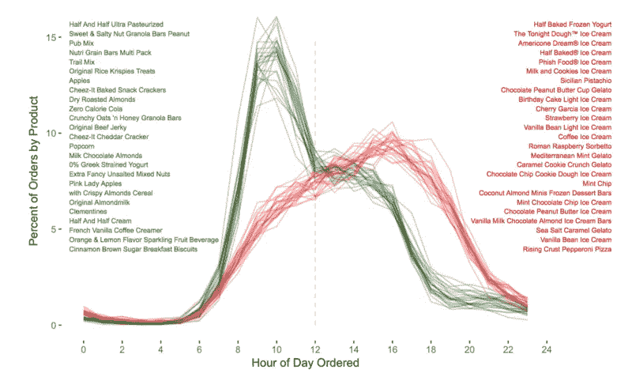

# 深度学习最新进展:6 月更新

> 原文：<https://medium.com/hackernoon/up-to-speed-on-deep-learning-june-update-f6fcdea4f521>

## 分享一些关于深度学习的最新研究、公告和资源。

*由* [*萨克*](https://www.linkedin.com/in/isaacmadan) *(* [*邮箱*](mailto:isaac@venrock.com) *)*

继续我们的深度学习系列更新，我们收集了一些自我们上一篇帖子以来出现的令人敬畏的资源。以防你错过，这里是我们以往的更新:[**5 月**](https://hackernoon.com/up-to-speed-on-deep-learning-may-update-a146d851f14f)[**4 月第二部分**](/the-mission/up-to-speed-on-deep-learning-april-update-part-2-14ff1f8418a5)[**4 月第一部分**](https://hackernoon.com/up-to-speed-on-deep-learning-april-update-7a0f5d1c580a)[**3 月第一部分**](https://hackernoon.com/up-to-speed-on-deep-learning-march-update-part-2-4a07d99f2885)[**2 月**](https://hackernoon.com/up-to-speed-on-deep-learning-march-update-355cb5944f9c#.dsw07hotj)[**11 月**](https://medium.com/p/c93663b59923/edit)[**9 月第二部分&10 月第一部分**](/the-mission/up-to-speed-on-deep-learning-september-part-2-and-october-part-1-d72d7e5df1ea#.bg88ojrbl) [**八月第一部**](/the-mission/up-to-speed-on-deep-learning-august-update-part-1-25afc11aea6b#.2mv855gbu) ， [**七月第二部**](/the-mission/up-to-speed-on-deep-learning-july-update-part-2-baacc835d8ab#.n12qybgf6) ， [**七月第一部**](/the-mission/up-to-speed-on-deep-learning-july-update-6c1d9e6741cf#.gcfr1dnjx) ， [**六月**](/the-mission/up-to-speed-on-deep-learning-june-update-bb0f17ccaf0b#.2debdy7eb) ，以及 [**原设定**](/life-learning/getting-up-to-speed-on-deep-learning-20-resources-efec21e0aaf9#.r91x02fcd) 的 20+资源我们在 2016 年 4 月份概述。 和往常一样，这个列表并不全面，所以如果有我们应该添加的东西，或者如果你有兴趣进一步讨论这个领域，请让我们知道。

# 公告

[**卷积序列到序列学习**](https://code.facebook.com/posts/1978007565818999/a-novel-approach-to-neural-machine-translation/) 盖林*等*。脸书团队展示了使用一种新颖的卷积神经网络(CNN)方法进行语言翻译，这种方法以 9 倍于递归神经系统的速度实现了最先进的准确性。GitHub 上提供的 fairseq 建模工具包(FAIR seq ),研究人员可以为翻译、文本摘要等构建自定义模型。GitHub 回购[此处 。原文](https://github.com/facebookresearch/fairseq) [**此处**](https://arxiv.org/abs/1705.03122) 。

[**英伟达 GPU Tech Conference 2017 分钟集锦**](https://www.youtube.com/watch?v=SvlEq2kTNKI) 作者 Engaget。NVIDIA 关于 AI &机器学习硬件进步的相关公告。视频。

[**TensorFlow 谷歌研究云**](https://www.tensorflow.org/tfrc/) 。面向全球顶尖研究人员的 1000 个云 TPU，加速深度学习研究。

Jeff Dean 和 Urs hlz le 在我们新的 Google Cloud TPUs 上构建和训练机器学习模型。*我们很高兴地宣布，我们的第二代张量处理单元(TPU)即将进入谷歌云，以加速广泛的机器学习工作负载，包括训练和推理。我们称之为云 TPU，它们最初将通过谷歌计算引擎提供。*

[**深度语音 2**](http://research.baidu.com/deep-voice-2-multi-speaker-neural-text-speech/) 被百度。使用较少训练数据的人类语音生成。*它只需要半个小时的音频就能学会一个人声音的细微差别，单个系统就能学会模仿上百种不同的说话者(* [*文章*](https://www.theverge.com/2017/5/25/15690578/baidu-deep-voice-2-text-to-speech) *)。*

# 研究

霍尔顿*等人*的 [**用于角色控制的相位函数神经网络**](https://arstechnica.com/gaming/2017/05/how-neural-networks-are-making-for-more-lifelike-video-game-animation/) 。爱丁堡大学的研究人员演示了使用神经网络来更真实地模拟角色在实时游戏环境中的移动方式，这些角色在虚拟场景中的移动数据集上进行了训练。原文 [**此处**](http://theorangeduck.com/media/uploads/other_stuff/phasefunction.pdf) 。

[**通过 OpenAI 学习**](https://blog.openai.com/robots-that-learn/) 的机器人。我们已经创建了一个机器人系统，完全在模拟中训练，并部署在一个物理机器人上，它可以在看到新任务完成一次后学习它。

[**利用机器学习探索神经网络架构**](https://research.googleblog.com/2017/05/using-machine-learning-to-explore.html) 谷歌的郭乐*等人*。*手动设计机器学习模型的过程很困难，因为所有可能模型的搜索空间可以组合起来很大。*谷歌展示了一种强化学习方法，用于自动化机器学习模型的设计，使它们更易于使用。

[**全卷积实例感知语义切分**](https://github.com/msracver/FCIS) 郝志琦*等*。实例分割的全卷积端到端解决方案，在 COCO segmentation challenge 2016 中获得第一名。在这里和可以看到实例分割工作中的样本图像[和**。原文**](https://github.com/msracver/FCIS) **[**此处**](https://arxiv.org/abs/1611.07709) 。**

[**对抗性神经机器翻译**](https://arxiv.org/abs/1704.06933) 吴立军*等*。*在本文中，我们研究了一种新的神经机器翻译学习范式(NMT)。我们没有像在以前的作品中那样最大化人工翻译的可能性，而是通过一种对抗性训练架构来最小化人工翻译和 NMT 模型*给出的翻译之间的差异，这种训练架构受到了最近成功的生成性对抗性网络的启发。

[**驯服递归神经网络更好地总结**](http://www.abigailsee.com/2017/04/16/taming-rnns-for-better-summarization.html) 斯坦福的 Abigail See。通过新颖的深度神经网络架构增强抽象的自动文本摘要。*在这项工作中，我们提出了一种新的架构，以两种正交的方式增强了标准的序列对序列注意模型。*原文 [**此处**](https://arxiv.org/pdf/1704.04368.pdf) 。

# 资源

[**AlphaGo，上下文**](/@karpathy/alphago-in-context-c47718cb95a5) 作者 OpenAI 的 Andrej Karpathy。深挖问题:*“alpha go 突破到什么程度？”“人工智能的研究人员如何看待它的胜利？”以及“胜利意味着什么？”*

[**人工智能概述及其在图像中的潜力&视频识别**](https://www.youtube.com/watch?v=qLCKtc9moks) 作者费-李非，谷歌云人工智能/人工智能首席科学家，斯坦福大学计算机科学副教授。

[**一种新型深度神经网络**](/towards-data-science/a-new-kind-of-deep-neural-networks-749bcde19108) 由 Eugenio Culurciello 提出。描述了适用于无监督学习的新型深度神经网络，如生成梯形网络、递归梯形网络和预测编码网络，以及它们与生成对抗网络的关系。论文深度预测编码网络 [**此处**](https://arxiv.org/abs/1605.08104) 。

[**导航无监督学习的前景**](/intuitionmachine/navigating-the-unsupervised-learning-landscape-951bd5842df9) 也是由 Eugenio Culurciello 所作。概述无监督学习方法，包括一般概念、自动编码器、聚类、生成模型等。

[**Roboschool**](https://blog.openai.com/roboschool/)by open ai。用于机器人模拟的开源软件，与 OpenAI Gym 集成。

[**基线:强化学习算法的高质量实现**](https://github.com/openai/baselines) 也由 OpenAI 提供。*一套高质量实现的强化学习算法。这些算法将使研究界更容易复制、提炼和识别新想法，并将创建良好的基线来建立研究。*

[**深入学习 15 门免费在线课程**](https://medium.freecodecamp.com/dive-into-deep-learning-with-these-23-online-courses-bf247d289cc0) 作者:David Venturi。各种深度学习课程综述&综述。

[**2017 年数据科学 15 大 Python 库**](/activewizards-machine-learning-company/top-15-python-libraries-for-data-science-in-in-2017-ab61b4f9b4a7) 作者 Igor Bobriakov。用于基础数据科学、可视化、机器学习、NLP、数据挖掘和统计的 Python 库概述。

# 教程和数据

[**300 万 Instacart 订单，由 Instacart 的 Jeremy Stanley 开源**](https://tech.instacart.com/3-million-instacart-orders-open-sourced-d40d29ead6f2) 。*这个匿名数据集包含来自 20 多万 Instacart 用户的 300 多万份杂货订单样本。我们希望机器学习社区将使用这些数据来测试模型，以预测用户在会话期间会再次购买、首次尝试或添加到购物车的产品。*

[**对非专家有效的 tensor flow(Google I/O ' 17)**](https://www.youtube.com/watch?v=5DknTFbcGVM)由 Google 提供。在本次讲座中，您将学习如何有效地使用 TensorFlow。TensorFlow 提供了像 Keras 和 Estimators 这样的高级接口，即使不是专家也可以使用。本次演讲将展示如何实现复杂的机器学习模型，并将其部署在任何支持 TensorFlow 的平台上。视频。

[**价值 1700 美元的伟大深度学习盒子:组装、设置和基准**](https://blog.slavv.com/the-1700-great-deep-learning-box-assembly-setup-and-benchmarks-148c5ebe6415) 作者 Slav Ivanov。从头开始构建深度学习桌面的演练。

作者:艾萨克·马丹。艾萨克是文洛克公司的投资者([电子邮件](mailto:isaac@venrock.com))。如果你对深度学习感兴趣，我们很乐意[收到你的来信](mailto:hello@requestsforstartups.com)。

[**创业请求**](http://www.requestsforstartups.com) 是一份由投资者、经营者和影响者提供的创业想法&观点的时事通讯。

***请点击或点击“︎***【❤】*帮助向他人推广此作品。*

> [黑客中午](http://bit.ly/Hackernoon)是黑客如何开始他们的下午。我们是 AMI 家庭的一员。我们现在[接受投稿](http://bit.ly/hackernoonsubmission)并乐意[讨论广告&赞助](mailto:partners@amipublications.com)机会。
> 
> 如果你喜欢这个故事，我们推荐你阅读我们的[最新科技故事](http://bit.ly/hackernoonlatestt)和[趋势科技故事](https://hackernoon.com/trending)。直到下一次，不要把世界的现实想当然！

