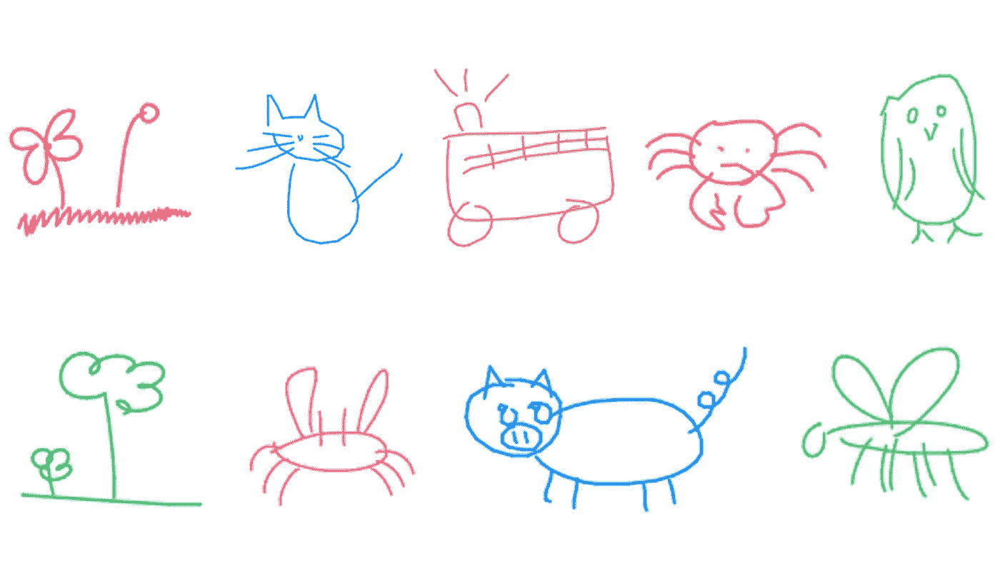
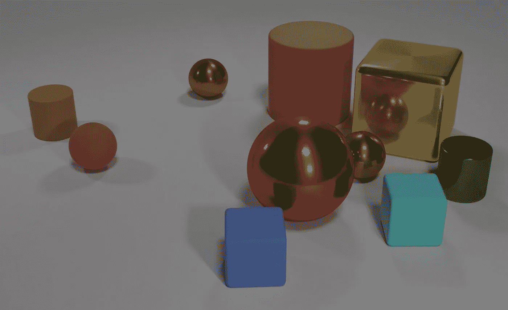
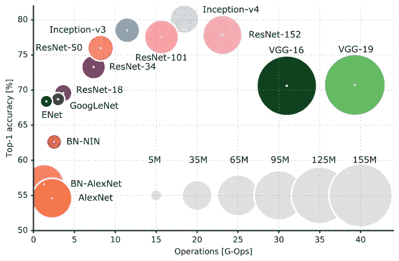
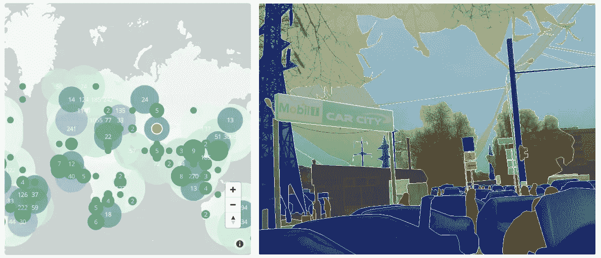

# 深度学习最新进展:6 月更新，第 2 部分

> 原文：<https://medium.com/hackernoon/up-to-speed-on-deep-learning-june-update-part-2-b4942c6812ad>

## 分享一些关于深度学习的最新研究、公告和资源。

*由* [*萨克*](https://www.linkedin.com/in/isaacmadan) *(* [*邮箱*](mailto:isaac@venrock.com) *)*

继续我们的深度学习系列更新，我们收集了一些自我们上一篇帖子以来出现的令人敬畏的资源。万一你错过了，这里是我们过去的更新:**六月(** [**第一部分**](https://hackernoon.com/up-to-speed-on-deep-learning-june-update-f6fcdea4f521)**)**[**五月**](https://hackernoon.com/up-to-speed-on-deep-learning-may-update-a146d851f14f)**四月** **(** [**第一部分**](https://hackernoon.com/up-to-speed-on-deep-learning-april-update-7a0f5d1c580a) **，** [**第二部分**](/the-mission/up-to-speed-on-deep-learning-april-update-part-2-14ff1f8418a5) **)** ， [**三月部分**](https://hackernoon.com/up-to-speed-on-deep-learning-march-update-part-2-4a07d99f2885) **[**九月第二部&十月第一部**](/the-mission/up-to-speed-on-deep-learning-september-part-2-and-october-part-1-d72d7e5df1ea#.bg88ojrbl) ， [**九月第一部**](/the-mission/up-to-speed-on-deep-learning-september-update-part-1-ca27a6ed03cd#.ocrcl97wd) ，**八月(** [**第一部**](/the-mission/up-to-speed-on-deep-learning-august-update-part-1-25afc11aea6b#.2mv855gbu) **，** [**第二部**](/the-mission/up-to-speed-on-deep-learning-august-update-part-2-bfb1554f885#.ps2tqe76u)**，**七月** ( [**第一部 **和往常一样，这个列表并不全面，所以如果我们有什么需要补充的，或者你有兴趣进一步讨论这个领域，请让我们知道****](/the-mission/up-to-speed-on-deep-learning-july-update-6c1d9e6741cf#.gcfr1dnjx)****[。](mailto:hello@requestsforstartups.com)********

# 研究和公告

[**康奈尔大学 Spring 和 Srivastava 通过随机哈希**](https://arxiv.org/abs/1602.08194) 实现可扩展和可持续的深度学习。*莱斯大学计算机科学家采用了一种广泛使用的快速数据查找技术，以削减深度学习所需的计算量——从而减少能量和时间。“这适用于任何深度学习架构，该技术呈次线性扩展，这意味着应用该技术的深度神经网络越大，计算方面的节省就越多，”Shrivastava 说。*新闻文章 [**这里**](https://phys.org/news/2017-06-scientists-slash-deep.html#jCp) 。

[**由 DeepMind 提出的一种关系推理的神经方法**](https://deepmind.com/blog/neural-approach-relational-reasoning/) 。关系推理是对事物之间的关系做出结论的过程，是人类智力的核心。*开发具有人类认知灵活性和效率的人工智能系统的一个关键挑战是让它们具有类似的能力——从非结构化数据中推理实体及其关系。这些论文展示了理解关系推理挑战的有希望的方法。原论文 [**此处**](https://arxiv.org/abs/1706.01427)[**此处**](https://arxiv.org/abs/1706.01433) 。*

# 资源

[**将深度学习应用于现实世界的问题**](/merantix/applying-deep-learning-to-real-world-problems-ba2d86ac5837) 梅兰蒂克斯的拉斯莫斯·罗特(Rasmus Rothe)著。在现实世界中使用深度学习时，必须阅读的关键知识。讨论预培训的价值、现实世界标签分布的注意事项以及理解黑盒模型。

[**CuPy**](https://cupy.chainer.org/) 通过首选网络。*用 NVIDIA CUDA 加速的开源矩阵库。*与 Numpy 兼容，或可直接替代 Numpy。GitHub 回购 [**此处**](https://github.com/cupy/cupy) 。

[**演讲人资源 2017**](http://aiconference.com/speaker-resources-ai-conference-2017/) 由 AI 大会。各种新闻文章、学术论文和由参与和热衷于人工智能的人们分享的数据集。(h/t [米歇尔·瓦伦丁](mailto:michelle.valentine@indexventures.com)

[**神经网络架构**](/towards-data-science/neural-network-architectures-156e5bad51ba)Eugenio culrciello 著。对深度学习背景下的&历史或神经网络架构的深入概述，涵盖 LeNet5、AlexNet、GoogLeNet、Inception，以及对未来发展方向的讨论。原文 [**此处**](https://arxiv.org/abs/1605.07678) 。

[**模型动物园**](https://github.com/rasbt) 塞巴斯蒂安·拉什卡。*Jupyter 笔记本中的独立 TensorFlow 模型集合*，包括分类器、自动编码器、gan 等。更广泛的回购对于塞巴斯蒂安的书也是有用的， [**这里**](https://github.com/rasbt/deep-learning-book) 。

# 教程和数据

[**Sketch-RNN:谷歌矢量绘图的生成模型**](https://github.com/tensorflow/magenta/tree/master/magenta/models/sketch_rnn#sketch-rnn-a-generative-model-for-vector-drawings) 。用于教学机器绘图的张量流递归神经网络模型。模型概述及其使用方法。通过谷歌 [**这里**](https://research.googleblog.com/2017/04/teaching-machines-to-draw.html) 和 [**这里**](https://arxiv.org/abs/1704.03477) 进行更深入的描述。

[**探索 LSTMs**](http://blog.echen.me/2017/05/30/exploring-lstms/) 埃德温陈。*事实证明，LSTMs 是神经网络的一个相当简单的扩展，它们是深度学习在过去几年中取得的许多惊人成就的背后。因此，我将尽可能直观地展示它们——以一种你可以自己发现它们的方式。*长短期记忆网络概述，以及使用它们的教程。

[**Vistas 数据集**](https://www.mapillary.com/dataset/vistas)by mappilate。*MVD 免费用于研究，是世界上最大的街道级图像人工标注语义分割训练数据集。主要用于训练深度神经网络，专注于 ADAS 和 autonomous 的对象检测、语义分割和场景理解。安德鲁·马霍*

作者:艾萨克·马丹。Isaac 是 Venrock 的投资者( [email](mailto:isaac@venrock.com) )。如果你对深度学习感兴趣，或者我应该在未来的简讯中分享一些资源，我很乐意收到你的来信。

[**创业请求**](http://www.requestsforstartups.com) 是一份由投资者、经营者和影响者提供的创业想法&观点的时事通讯。

***请点击或点击“︎***【❤】*帮助向他人推广此作品。*

> [黑客中午](http://bit.ly/Hackernoon)是黑客如何开始他们的下午。我们是这个家庭的一员。我们现在[接受投稿](http://bit.ly/hackernoonsubmission)并乐意[讨论广告&赞助](mailto:partners@amipublications.com)机会。
> 
> 如果你喜欢这个故事，我们推荐你阅读我们的[最新科技故事](http://bit.ly/hackernoonlatestt)和[趋势科技故事](https://hackernoon.com/trending)。直到下一次，不要把世界的现实想当然！

