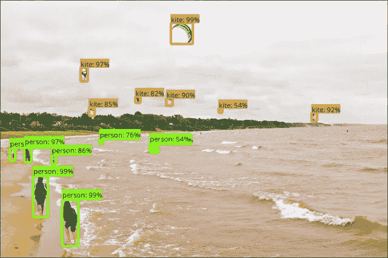

# 深度学习最新进展:6 月更新，第 4 部分

> 原文：<https://medium.com/hackernoon/up-to-speed-on-deep-learning-june-update-part-4-487f8bae4e3>

## 分享一些关于深度学习的最新研究、公告和资源。

*由* [*萨克*](https://www.linkedin.com/in/isaacmadan) *(* [*邮箱*](mailto:isaac@venrock.com) *)*

继续我们的深度学习系列更新，我们收集了一些自我们上一篇帖子以来出现的令人敬畏的资源。以防你错过，下面是我们以往的更新:**六月(** [**第一部**](https://hackernoon.com/up-to-speed-on-deep-learning-june-update-f6fcdea4f521) **，** [**第二部**](https://hackernoon.com/up-to-speed-on-deep-learning-june-update-part-2-b4942c6812ad) **，** [**第三部**](https://hackernoon.com/up-to-speed-on-deep-learning-june-11-18-update-88333284f8fe) **)** ， [**五月**](https://hackernoon.com/up-to-speed-on-deep-learning-may-update-a146d851f14f) ，**四月** **(** [**第一部**](https://hackernoon.com/up-to-speed-on-deep-learning-april-update-7a0f5d1c580a) [**二月**](https://hackernoon.com/up-to-speed-on-deep-learning-march-update-355cb5944f9c#.dsw07hotj) ， [**十一月**](https://medium.com/p/c93663b59923/edit) ， [**九月第二部分&十月第一部分**](/the-mission/up-to-speed-on-deep-learning-september-part-2-and-october-part-1-d72d7e5df1ea#.bg88ojrbl) ， [**九月第一部分**](/the-mission/up-to-speed-on-deep-learning-september-update-part-1-ca27a6ed03cd#.ocrcl97wd) ，**八月(** [**第一部分**](/the-mission/up-to-speed-on-deep-learning-august-update-part-1-25afc11aea6b#.2mv855gbu) **，** [**部分 和往常一样，这个列表并不全面，所以如果有什么我们应该添加的，或者如果你有兴趣进一步讨论这个领域，请让我们知道。**](/the-mission/up-to-speed-on-deep-learning-august-update-part-2-bfb1554f885#.ps2tqe76u)

# 研究和公告

[**模拟 3D 世界中的落地语言学习**](http://xxx.lanl.gov/pdf/1706.06551v1) 谷歌 DeepMind。教一个人工智能代理学习应用语言。*这里我们介绍一个智能体，它在一个模拟的 3D 环境中学习解释语言，在那里它会因为成功执行书面指令而得到奖励。代理人对语言的理解超越了其先前的经验，使其能够将熟悉的语言应用于不熟悉的情况，并解释全新的指令。*

[**一模一样学会谷歌的**](http://xxx.lanl.gov/abs/1706.05137) 。让深度学习模型很好地工作于特定任务，如语音识别、翻译等。会花很多时间研究架构调整。一个适用于各种任务的通用模型将会非常有用——Google 提供了一个这样的模型。*特别地，该单个模型同时在 ImageNet、多个翻译任务、图像字幕(COCO 数据集)、语音识别语料库和英语解析任务上被训练。*

[**tensor 2 tensor**](https://research.googleblog.com/2017/06/accelerating-deep-learning-research.html)由谷歌大脑。*tensor flow 中训练深度学习模型的开源系统。T2T 有助于为各种各样的 ML 应用程序创建最先进的模型，如翻译、解析、图像字幕等，使探索各种想法的速度比以前快得多。这个版本还包括一个数据集和模型库，包括最近几篇论文中的最佳模型。* GitHub 回购 [**此处**](https://github.com/tensorflow/tensor2tensor) 。

[**TensorFlow 物体检测 API**](https://research.googleblog.com/2017/06/supercharge-your-computer-vision-models.html) 由 Google 提供。去年，谷歌展示了物体检测的最新成果，赢得了 COCO 检测挑战赛，并在 NestCam 等产品中展示了他们的工作。他们现在正在开源这项工作:一个建立在 TensorFlow 之上的框架，使得构建、训练和部署对象检测模型变得容易。我们设计该系统的目标是支持最先进的模型，同时允许快速探索和研究。

[**MobileNets:高效设备视觉的开源模型**](https://research.googleblog.com/2017/06/mobilenets-open-source-models-for.html) 谷歌。考虑到计算能力和空间的限制，很难在移动设备上准确运行视觉识别模型。因此，MobileNets 是 TensorFlow 的移动优先计算机视觉模型的*家族，旨在有效地最大化准确性，同时注意到设备或嵌入式应用的有限资源。*

[**deeplearning.ai**](https://www.deeplearning.ai/) 作者吴恩达。吴恩达的新项目将于 2017 年 8 月推出。网站上还没有提供任何细节。

**Me trying to classify some random stuff on my desk:)**

# 资源、教程和数据

[**用 Dat Tran 的 Tensorflow 和 OpenCV**](/towards-data-science/building-a-real-time-object-recognition-app-with-tensorflow-and-opencv-b7a2b4ebdc32) 搭建实时物体识别 App。*在本文中，我将介绍如何使用 tensor flow(TF)的新对象检测 API 和 Python 3(特别是 3.5)中的 OpenCV 轻松构建自己的实时对象识别应用程序。重点将放在我创建它时所面临的挑战上。* GitHub 回购 [**这里**](https://github.com/datitran/Object-Detector-App) 。

[**深度学习不能做什么？**](http://rbharath.github.io/what-cant-deep-learning-do/) 作者 Bharath Ramsundar。一个 tweetstorm 列出了深度学习方法背后的一些已知失败。有助于理解未来的研究方向。

[**奥莱利为初学者准备的生成性对抗网络**](https://www.oreilly.com/learning/generative-adversarial-networks-for-beginners) 。*建立一个学习生成手写数字的神经网络。gan 是神经网络，它学习创建类似于某些已知输入数据的合成数据。* GitHub 回购 [**此处**](https://github.com/jonbruner/generative-adversarial-networks) 。

[**衡量 AI 研究进展**](https://www.eff.org/ai/metrics) 电子前沿基金会。跟踪 ML/AI 的最新发展水平并了解特定子领域的进展会变得复杂。*这个试点项目从人工智能研究文献中收集问题和指标/数据集，并跟踪它们的进展。*

艾萨克·马丹。艾萨克是文洛克公司的投资者。如果你对深度学习感兴趣，或者我应该在未来的简讯中分享一些资源，我很乐意收到你的来信。

[**创业请求**](http://www.requestsforstartups.com) 是一份由投资者、经营者和影响者提供的创业想法&观点的时事通讯。

***请点击或点击“︎***【❤】*帮助向他人推广此作品。*

> 黑客中午是黑客如何开始他们的下午。我们是这个家庭的一员。我们现在[接受投稿](http://bit.ly/hackernoonsubmission)并乐意[讨论广告&赞助](mailto:partners@amipublications.com)机会。
> 
> 如果你喜欢这个故事，我们推荐你阅读我们的[最新科技故事](http://bit.ly/hackernoonlatestt)和[趋势科技故事](https://hackernoon.com/trending)。直到下一次，不要把世界的现实想当然！

