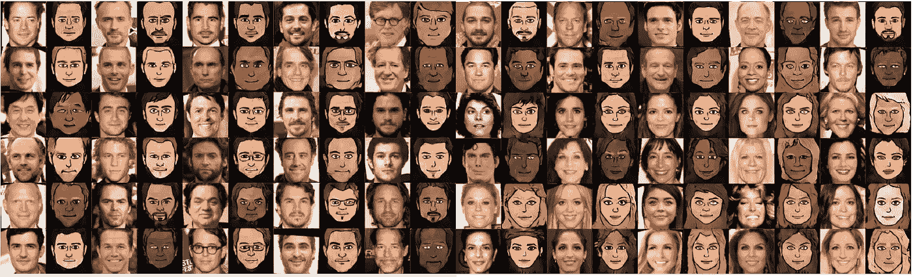

# 深度学习最新进展:二月更新

> 原文：<https://medium.com/hackernoon/up-to-speed-on-deep-learning-march-update-355cb5944f9c>

## 分享一些关于深度学习的最新研究、公告和资源。

艾萨克·马丹

继续我们的深度学习系列更新，我们收集了一些自我们上一篇帖子以来出现的令人敬畏的资源。以防你错过，这里是我们以往的更新:[**11 月**](https://medium.com/p/c93663b59923/edit) ，[**9 月第二部【T10 月第一部**](/the-mission/up-to-speed-on-deep-learning-september-part-2-and-october-part-1-d72d7e5df1ea#.bg88ojrbl) ，[**9 月第一部**](/the-mission/up-to-speed-on-deep-learning-september-update-part-1-ca27a6ed03cd#.ocrcl97wd) ，[**8 月第二部**](/the-mission/up-to-speed-on-deep-learning-august-update-part-2-bfb1554f885#.ps2tqe76u) **，**[**8 月第一部**](/the-mission/up-to-speed-on-deep-learning-august-update-part-1-25afc11aea6b#.2mv855gbu) ，[**7 月第二部**](/the-mission/up-to-speed-on-deep-learning-july-update-part-2-baacc835d8ab#.n12qybgf6) ，[和往常一样，这个列表并不全面，所以如果有我们应该添加的东西，或者如果你有兴趣进一步讨论这个领域，请让我们知道](/the-mission/up-to-speed-on-deep-learning-july-update-6c1d9e6741cf#.gcfr1dnjx)[。](mailto:hello@requestsforstartups.com)

## 研究

[**利用多尺度神经补片合成的高分辨率图像修复**](https://arxiv.org/pdf/1611.09969.pdf)USC 的朝阳*等人*。一种新的深度学习方法来有效填充图像中的大洞。GitHub repo [**此处**](https://github.com/leehomyc/High-Res-Neural-Inpainting) 。

谷歌的达尔*等人*的 [**像素递归超分辨率**](https://arxiv.org/pdf/1702.00783.pdf) 。谷歌大脑的研究人员展示了一种深度学习方法，可以从较低分辨率的像素化图像中生成较高分辨率的图像。

[**域名转移网络实现**](https://github.com/yunjey/dtn-tensorflow) 由 Yunjey Choi。TensorFlow 实现[无监督跨域图像生成](https://arxiv.org/abs/1611.02200) —生成以前未见过的实体的新图像，同时保留它们的身份。

## 公告

[**蒙特利尔大学深度学习暑期班和强化学习暑期班**](https://mila.umontreal.ca/en/cours/deep-learning-summer-school-2017/) 由 Yoshua Bengio 组织。一个会议*面向已经具备一些机器学习(可能但不一定是深度学习)基础知识并希望了解更多关于这个快速增长的研究领域的研究生、工业工程师和研究人员。*2017 年 6 月 26 日至 7 月 4 日。申请截止日期为 3 月 20 日，在此申请**。**

**[**AWS 深度学习 AMI，现在有了 AWS 的 Joseph Spisak 的 Ubuntu**](https://aws.amazon.com/fr/blogs/ai/the-aws-deep-learning-ami-now-with-ubuntu/) 。亚马逊宣布，你现在可以通过 Ubuntu 实例在云中运行深度学习，这些实例预装了流行的框架，如 TensorFlow、Caffe 等。**

**[**Google 宣布 TensorFlow 1.0**](https://developers.googleblog.com/2017/02/announcing-tensorflow-10.html) 。在 2 月中旬在山景城举行的 TensorFlow 开发者峰会上，谷歌宣布正式发布 tensor flow 1.0 版本。这个框架现在被 6000 多个开源仓库使用。**

## **资源**

**[**【生成性对抗网络(GANs)50 行代码(PyTorch)**](/@devnag/generative-adversarial-networks-gans-in-50-lines-of-code-pytorch-e81b79659e3f#.hlqwnbpqi) 由 Dev Nag，Wavefront 的 CTO。gan 的解释和简单的入门方法。GitHub 回购[这里的](https://github.com/devnag/pytorch-generative-adversarial-networks)**。****

****[**剖析强化学习**](https://mpatacchiola.github.io/blog/) 普利茅斯大学的 Massimiliano Patacchiola。对强化学习的深入解释，以及附带的 GitHub repo 中讨论的代码和资源—在此处 找到 [**。**](https://github.com/mpatacchiola/dissecting-reinforcement-learning)****

****[**用 99 行代码训练深度学习模型驾驶汽车**](https://hackernoon.com/training-a-deep-learning-model-to-steer-a-car-in-99-lines-of-code-ba94e0456e6a#.9c1zy38a6) 作者马特·哈维。使用 Udacity 自动驾驶汽车模拟器，在不到 100 行代码的情况下，为汽车训练一个通用的转向模型。****

****数据科学中心的 Mike Waldron 用简单的英语解释了 10 个深度学习术语。简单解释常见的深度学习术语，如*反向传播*和*梯度下降*。同样有用的还有来自同一网站的 [15 深度学习教程](http://www.datasciencecentral.com/profiles/blogs/15-deep-learning-tutorials)。****

****[**创造人类级 AI**](https://www.youtube.com/watch?v=ZHYXp3gJCaI)yo shua beng io(视频)。在未来生命研究所举办的有益人工智能 2017 大会上探索人类级人工智能的前进道路。还有，Yann LeCun 在同一个发布会上的 [**一条通往 AI 的道路**](https://www.youtube.com/watch?v=bub58oYJTm0) 。****

****[**深度强化学习:概述**](https://arxiv.org/abs/1701.07274) 李玉玺。深度强化学习的最新进展概述，以及背景解释。****

****[**学 TensorFlow 和深度学习，无博士**](https://cloud.google.com/blog/big-data/2017/01/learn-tensorflow-and-deep-learning-without-a-phd) 谷歌云平台的马丁·戈纳。面向开发者的深度学习基础和利用 TensorFlow 课程。****

****[**在 Quora 数据集上深度学习的重复问题检测**](http://www.erogol.com/duplicate-question-detection-deep-learning/) 由额仁高尔基。Quora 在一月下旬发布了他们的第一个公开可用的数据集[,让开发者感受到建立知识共享网络的挑战。这种探索采用深度学习方法来识别重复问题。](https://data.quora.com/First-Quora-Dataset-Release-Question-Pairs)****

****[**麻省理工学院**](https://www.youtube.com/watch?v=nFTQ7kHQWtc) 用于穿越时间操纵的递归神经网络(视频)。课程 6 第四讲。S094:麻省理工学院 2017 年冬季教授的自动驾驶汽车深度学习。课程网站 [**此处**](http://cars.mit.edu) 。第四讲幻灯片 [**这里**](https://goo.gl/qG4Ys9) 。****

****作者:艾萨克·马丹。艾萨克是文洛克公司的投资者。如果你对深度学习感兴趣，我们很乐意听到你的意见。****

****[**创业请求**](http://www.requestsforstartups.com) 是一份由投资者、经营者和影响者提供的创业想法&观点的时事通讯。****

*******请点击或点击“︎***【❤】*帮助向他人推广此作品。*****

********************************

> ****[黑客中午](http://bit.ly/Hackernoon)是黑客如何开始他们的下午。我们是 [@AMI](http://bit.ly/atAMIatAMI) 家庭的一员。我们现在[接受投稿](http://bit.ly/hackernoonsubmission)，并乐意[讨论广告&赞助](mailto:partners@amipublications.com)机会。****
> 
> ****如果你喜欢这个故事，我们推荐你阅读我们的[最新科技故事](http://bit.ly/hackernoonlatestt)和[趋势科技故事](https://hackernoon.com/trending)。直到下一次，不要把世界的现实想当然！****

********