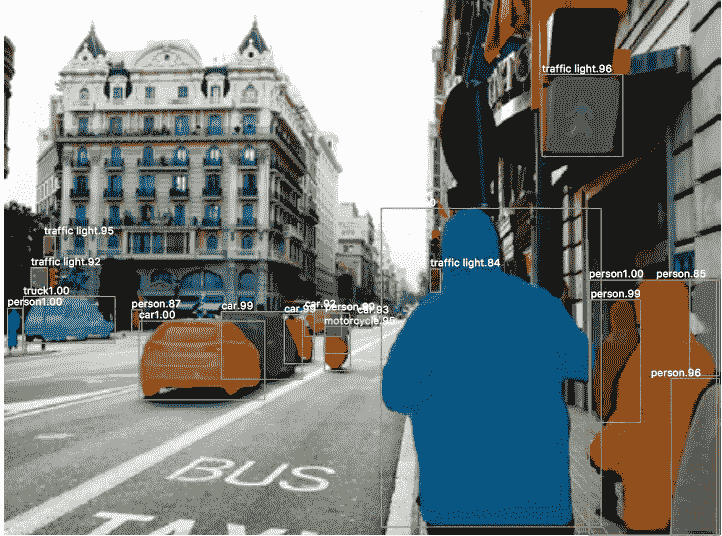
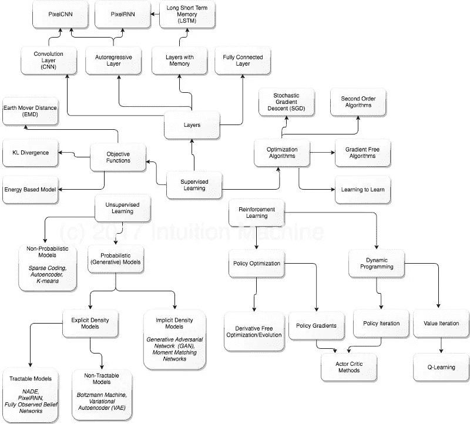
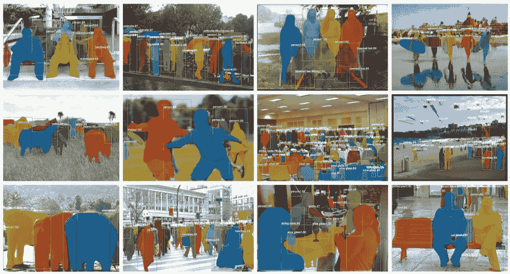

# 深度学习最新进展:可能会更新

> 原文：<https://medium.com/hackernoon/up-to-speed-on-deep-learning-may-update-a146d851f14f>

## 分享一些关于深度学习的最新研究、公告和资源。

*由* [*萨克*](https://www.linkedin.com/in/isaacmadan) *(* [*邮箱*](mailto:isaac@venrock.com) *)*

继续我们的深度学习系列更新，我们收集了一些自我们上一篇帖子以来出现的令人敬畏的资源。以防你错过，这里是我们以往的更新:[**4 月第二部**](/the-mission/up-to-speed-on-deep-learning-april-update-part-2-14ff1f8418a5)[**4 月第一部**](https://hackernoon.com/up-to-speed-on-deep-learning-april-update-7a0f5d1c580a)[**3 月第一部**](https://hackernoon.com/up-to-speed-on-deep-learning-march-update-part-2-4a07d99f2885)[**2 月**](https://hackernoon.com/up-to-speed-on-deep-learning-march-update-355cb5944f9c#.dsw07hotj)[**11 月**](https://medium.com/p/c93663b59923/edit)[**9 月第二部&10 月第一部**](/the-mission/up-to-speed-on-deep-learning-september-part-2-and-october-part-1-d72d7e5df1ea#.bg88ojrbl)[**9 月第一部**](/the-mission/up-to-speed-on-deep-learning-september-update-part-1-ca27a6ed03cd#.ocrcl97wd) **** [**8 月第一部**](/the-mission/up-to-speed-on-deep-learning-august-update-part-1-25afc11aea6b#.2mv855gbu) ，[**7 月第二部**](/the-mission/up-to-speed-on-deep-learning-july-update-part-2-baacc835d8ab#.n12qybgf6) ，[**7 月第一部**](/the-mission/up-to-speed-on-deep-learning-july-update-6c1d9e6741cf#.gcfr1dnjx) ，[**6 月**](/the-mission/up-to-speed-on-deep-learning-june-update-bb0f17ccaf0b#.2debdy7eb) ，以及我们在 2016 年 4 月概述的 20+资源中的 [**原集**](/life-learning/getting-up-to-speed-on-deep-learning-20-resources-efec21e0aaf9#.r91x02fcd) 。 和往常一样，这个列表并不全面，所以如果有我们应该添加的内容，或者如果你有兴趣进一步讨论这个领域，请让我们知道[。](mailto:hello@requestsforstartups.com)

## 公告和研究

[**韩忠发布**](https://caffe2.ai/blog/2017/04/18/caffe2-open-source-announcement.html) 由脸书发布。*开源第一个生产就绪版本 caffe 2——一个轻量级和模块化的深度学习框架，强调可移植性，同时保持可扩展性和性能。附带教程和示例，展示大规模学习。*部署在脸书。

[**用最少的训练数据进行语音合成**](https://lyrebird.ai/) 由 Lyrebird。蒙特利尔大学的博士生宣布，他们正在开发新的语音合成技术，除了其他功能外，这种技术允许我们用很少的数据复制某人的声音。

[**理解深度学习需要谷歌研究人员重新思考概括**](https://openreview.net/forum?id=Sy8gdB9xx&noteId=Sy8gdB9xx) 。ICLR 2017 年最佳论文 t *通过广泛的系统实验，我们展示了传统方法如何无法解释为什么大型神经网络在实践中推广良好，以及为什么理解深度学习需要重新思考推广。*

[**美国麻省理工学院研究人员合成的**](http://dai.lids.mit.edu/SDV.pdf) 数据仓库。描述了自动创建合成数据的*机器学习系统，其目标是实现数据科学工作，因为缺乏对真实数据的访问，否则这些工作可能不会开展。这种合成数据与真实用户产生的数据完全不同。*

## 资源

[**物体识别的现代史——đặng·哈·thếhiển.的信息图**](/@nikasa1889/the-modern-history-of-object-recognition-infographic-aea18517c318) 总结了物体识别中的重要概念，如包围盒回归和转置卷积，还概述了自 2012 年以来深度学习方法在物体识别中的历史。

[**深度学习路线图**](/intuitionmachine/the-deep-learning-roadmap-f0b4cac7009a) 卡洛斯·佩雷斯。一张对深度学习中的各种研究线索和进展进行分类的地图。这是一个有用的分类，因为您跟踪了该领域的发展。

[**深度学习的失败**](https://www.youtube.com/watch?v=jWVZnkTfB3c) (视频)Shai Shalev-Shwartz。关于*现有深度学习算法失败的三类问题的讲座。我们举例说明了这些失败的实际情况，并提供了解释困难来源的理论见解。*幻灯片[此处 T7](https://simons.berkeley.edu/sites/default/files/docs/6455/berkeley2017.pdf)。

麻省理工 [**深度学习简介**](http://introtodeeplearning.com/index.html) 。*为期一周的深度学习方法介绍，包括机器翻译、图像识别、游戏、图像生成等应用。这是一门协作课程，包含 TensorFlow 中的实验室、同行集思广益以及讲座。*提供所有讲座幻灯片和视频。

[**CNN 在图像分割中的简史:从 R-CNN 到 Mask R-CNN**](https://blog.athelas.com/a-brief-history-of-cnns-in-image-segmentation-from-r-cnn-to-mask-r-cnn-34ea83205de4) 作者 Dhruv Parthasarathy。应用于图像分割的 CNN 发展综述。

[**Arkadiusz Nowaczynski 通过图像分割对卫星图像进行深度学习**](https://deepsense.io/deep-learning-for-satellite-imagery-via-image-segmentation/) 。最近 Kaggle 竞赛的一个顶级表演团队讨论了他们对卫星图像图像分割的深度学习方法，并分享了学到的经验教训。

[**Keras cheat sheet**](https://s3.amazonaws.com/assets.datacamp.com/blog_assets/Keras_Cheat_Sheet_Python.pdf)by data camp。使用 Keras 库在 Python 中创建神经网络的六个步骤的备忘单。

## 教程

[**如何在 TensorFlow 中构建递归神经网络**](https://ai.icymi.email/how-to-build-a-recurrent-neuralnetwork-in-tensorflow/) 作者 Erik hallstrm .*这是一个在 TensorFlow 中实现递归神经网络(RNN)的简单概述。理论和实践都包括简明，最终结果是运行张量流 RNN 代码。*

[**通过注意力和基于记忆的界面的可解释性，使用悟空·莫汉达斯的 TensorFlow**](https://www.oreilly.com/ideas/interpretability-via-attentional-and-memory-based-interfaces-using-tensorflow) 。*使用 TensorFlow 对深度神经架构中基于注意力和记忆的接口进行了温和的介绍。整合注意力机制非常简单，可以为我们复杂的模型提供透明度和可解释性。* GitHub 回购 [**此处**](http://by Erik Hallström) 。

Rohan Kapur 的 [**递归神经网络& LSTMs**](https://ayearofai.com/rohan-lenny-3-recurrent-neural-networks-10300100899b) 。对 RNNs 的温和而详细的介绍。查看他们博客的其余部分，获得更多精彩的介绍性资源。

[**深度神经网络从无到有**](https://matrices.io/deep-neural-network-from-scratch/) 由 Florian Courtial。关于深度神经网络如何工作的教程和一个使用 TensorFlow 的 Python 实现。

**甘动物园。所有已命名的 GANs 列表及其各自的文件。**

**作者:艾萨克·马丹。艾萨克是文洛克公司的投资者。如果你对深度学习感兴趣，我们很乐意听到你的意见。**

**[**创业请求**](http://www.requestsforstartups.com) 是一份由投资者、经营者和影响者提供的创业想法&观点的时事通讯。**

*****请点击或点击“︎***【❤】*帮助向他人推广此作品。***

****************

> **[黑客中午](http://bit.ly/Hackernoon)是黑客如何开始他们的下午。我们是 [@AMI](http://bit.ly/atAMIatAMI) 家庭的一员。我们现在[接受投稿](http://bit.ly/hackernoonsubmission)，并乐意[讨论广告&赞助](mailto:partners@amipublications.com)机会。**
> 
> **如果你喜欢这个故事，我们推荐你阅读我们的[最新科技故事](http://bit.ly/hackernoonlatestt)和[趋势科技故事](https://hackernoon.com/trending)。直到下一次，不要把世界的现实想当然！**

****