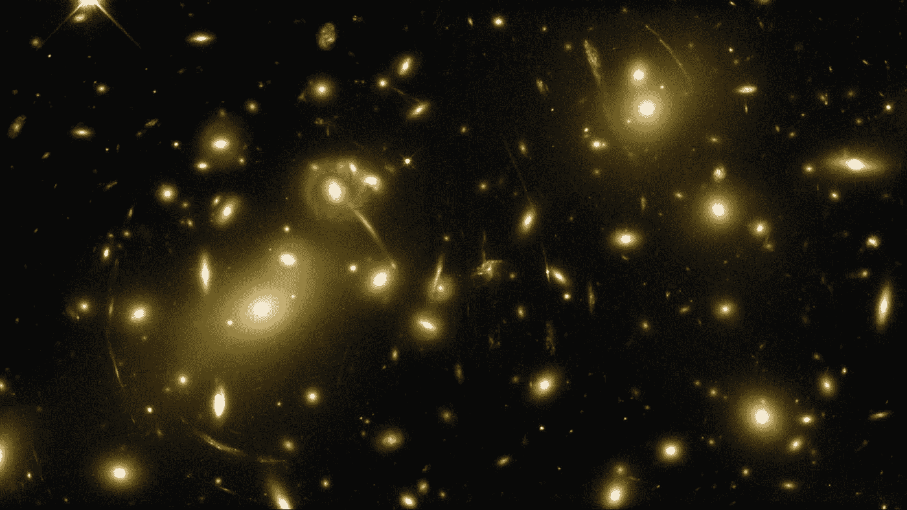
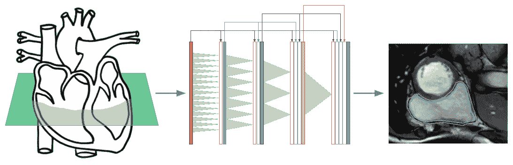

# 人工智能和深度学习的最新进展:10 月更新

> 原文：<https://medium.com/hackernoon/up-to-speed-on-deep-learning-october-update-815f5eef0e2b>

## 分享一些关于深度学习的最新研究、公告和资源。

*由* [*萨克*](https://www.linkedin.com/in/isaacmadan) *(* [*邮箱*](mailto:isaac@venrock.com) *)*

继续我们的深度学习系列更新，我们收集了一些自我们上一篇帖子以来出现的令人敬畏的资源。以防你错过，下面是我们以往的更新:[**8 月**](https://hackernoon.com/up-to-speed-on-deep-learning-august-update-8f119bd4bc87)[**7 月**](https://hackernoon.com/up-to-speed-on-deep-learning-july-update-4513a5d61b78)**6 月(** [**第一部分**](https://hackernoon.com/up-to-speed-on-deep-learning-june-update-f6fcdea4f521) **，** [**第二部分**](https://hackernoon.com/up-to-speed-on-deep-learning-june-update-part-2-b4942c6812ad) **，** [**第三部分**](https://hackernoon.com/up-to-speed-on-deep-learning-june-11-18-update-88333284f8fe) **，** [**第四部分** **四月** **(**](https://hackernoon.com/up-to-speed-on-deep-learning-june-update-part-4-487f8bae4e3) [**第一部分**](https://hackernoon.com/up-to-speed-on-deep-learning-april-update-7a0f5d1c580a) **，** [**第二部分**](/the-mission/up-to-speed-on-deep-learning-april-update-part-2-14ff1f8418a5) **)** ， [**三月第一部分**](https://hackernoon.com/up-to-speed-on-deep-learning-march-update-part-2-4a07d99f2885) ， [**二月**](https://hackernoon.com/up-to-speed-on-deep-learning-march-update-355cb5944f9c#.dsw07hotj) ， [**十一月**](https://medium.com/p/c93663b59923/edit) ，  [**第二部分**](/the-mission/up-to-speed-on-deep-learning-august-update-part-2-bfb1554f885#.ps2tqe76u) **)** ，**七月****第一部分** ， [**第二部分**](/the-mission/up-to-speed-on-deep-learning-july-update-part-2-baacc835d8ab#.n12qybgf6)**)**[**六月**](/the-mission/up-to-speed-on-deep-learning-june-update-bb0f17ccaf0b#.2debdy7eb) ， [**原设定**](/life-learning/getting-up-to-speed-on-deep-learning-20-resources-efec21e0aaf9#.r91x02fcd) 二十 和往常一样，这个列表并不全面，所以如果有我们应该添加的东西，或者如果你有兴趣进一步讨论这个领域，请让我们知道。

# 研究和公告

史蒂文斯理工学院的 Hitaj *等人*提出的 [**PassGAN:密码猜测的深度学习方法**](https://arxiv.org/abs/1709.00440) 。使用 GAN 根据之前泄露的密码语料库猜测 LinkedIn 密码——当与传统的密码猜测工具 HashCat 结合使用时，他们能够破解其数据集中 1.43 亿泄露密码的 27%。

我们离解决 2D 的 3D 人脸对齐问题还有多远？诺丁汉大学的阿德里安·布拉特和圣乔治·兹米罗普洛斯制作了一个由 23 万个 3D 面部标志组成的数据集。深入探讨深度学习在面部对齐或面部标志定位方面的应用，即识别图像中面部的几何结构。原文在此。

[**深度学习的信息论**](https://www.quantamagazine.org/new-theory-cracks-open-the-black-box-of-deep-learning-20170921)NAFTA Li tish by。对*信息瓶颈*的解释，作为对深度学习为什么有效的解释。Tishby 认为，深度神经网络根据一种叫做“信息瓶颈”的程序进行学习，这是他和两位合作者在 1999 年首次用纯理论的术语描述的。这个想法是，一个网络就像通过一个瓶颈挤压信息一样，去除了噪音输入数据中无关的细节，只保留了与一般概念最相关的特征。 Youtube 视频 [**此处**](https://www.youtube.com/watch?v=bLqJHjXihK8&feature=youtu.be) 。

[**深度神经网络在从面部图像**](https://osf.io/zn79k/) 中检测性取向方面比人类更准确斯坦福的 Kosinski *等人*。在一项引起互联网轰动的有争议的新研究中，研究人员声称人工智能可以用来准确检测某人的性取向。这项研究利用深度神经网络检查了超过 35，000 张公开的约会网站照片，这些照片显示了性取向。这项初步研究发表在《人格与社会心理学杂志》上，作者是斯坦福大学商学院教授 Michal Kosinski。

加州大学柏克莱分校的李柯 [**用强化学习学习优化**](http://bair.berkeley.edu/blog/2017/09/12/learning-to-optimize-with-rl/) 。深入探究机器学习的优化算法。*在当前的[机器学习]范式中有一个悖论:支持机器学习的算法仍然是人工设计的。这就提出了一个很自然的问题:我们可以学习这些算法吗？这可能开启令人兴奋的可能性:我们可以找到比手动设计的算法表现更好的新算法，这反过来可以提高学习能力。*

[**音乐生成的深度学习技术——索邦大学 Briot *等人*的调查**](https://arxiv.org/abs/1709.01620) 。*这本书是对使用深度学习(深度人工神经网络)生成音乐内容的不同方式的调查和分析。*

[**用卷积神经网络对强引力透镜进行快速自动化分析**](https://www.nature.com/articles/nature23463.epdf?referrer_access_token=uplEG40T7AzKfaPeAeKlndRgN0jAjWel9jnR3ZoTv0O4LAhrt7fpCgAOW22z2TXZZIfOPREG7W8fglNDja0fVcQmhyDtn1isVNmLeKFFa0f2PrKHYoflAWS-UfBur9c1e1svpzpBiaQ9Olk9nnTCkMrfkzZqqy3JDF_VU4yqcFSFYph0ag_cFmQASwVfV9ksDEH5N036s_6SekVDeM9oai1GKX4L_JmgVHazSqOTPrS1qYxajyc1ChobULn54DTV4dbRm17uij3x56UqYCi7cyvrsZMsklexVUc0B3hyPc9-eawY7jWwhkhgh97iBLnB&tracking_referrer=physicsworld.com) 斯坦福大学的 Hezaveh *等人*。深度学习在空间图像分析中的应用。*斯坦福大学的物理学家开发了一种利用神经网络分析遥远空间引力透镜的新技术(* [*主板*](https://motherboard.vice.com/en_us/article/a339zj/neural-networks-prove-to-be-a-key-technique-in-analyzing-gravitational-lenses) *)。*

# 资源、教程和数据

[**谷歌可教机器**](https://teachablemachine.withgoogle.com/) 。有趣、快速的机器学习入门方式。这个实验让任何人都可以通过有趣的动手方式探索机器学习是如何工作的。你可以在浏览器中教会一台机器使用你的相机，不需要编码。你在你的设备上本地训练一个神经网络，而不发送任何图像到服务器。所以它才会对你做出如此迅速的反应。

[**人力资源分析:利用机器学习预测员工流动**](http://www.business-science.io/business/2017/09/18/hr_employee_attrition.html) 作者马特·丹乔。教程&应用机器学习解决商业问题的例子。*随着机器学习(ML)的进步，我们现在可以获得更好的预测性能，并更好地解释哪些关键特征与员工流失有关。在本帖中，我们将使用两种前沿技术。*

[**用于机器学习的医疗数据**](https://github.com/beamandrew/medical-data) 哈佛大学的安德鲁·梁(Andrew Beam)。用于机器学习的公共可用医疗数据的精选列表。

[**心脏病诊断与深度学习**](https://blog.insightdatascience.com/heart-disease-diagnosis-with-deep-learning-c2d92c27e730) 由查克-侯绮思洞察。解释如何通过深度学习在心脏 MRI 成像中执行右心室的自动分割。

[**实时驾驶员睡意检测(睡眠检测)**](http://emaraic.com/blog/realtime-sleep-detection)Taha Emara。教程通过深度学习进行视频眼睛监控，可以用来检测司机的睡意。

Onfido 的 Peter Roelants 的 TensorFlow 中的 [**高级 API。*如何利用估计量、实验和数据集来训练模型。***](/onfido-tech/higher-level-apis-in-tensorflow-67bfb602e6c0)

[**简单解释:DeepMind 如何教会 AI 玩电子游戏**](https://medium.freecodecamp.org/explained-simply-how-deepmind-taught-ai-to-play-video-games-9eb5f38c89ee) 阿曼·阿加瓦尔著。全面分解&alpha go 工作原理的简化解释。

作者:艾萨克·马丹。Isaac 是 Venrock 的投资者([电子邮件](mailto:isaac@venrock.com))。如果你对深度学习感兴趣，或者我应该在未来的简讯中分享一些资源，我很乐意收到你的来信。

[**创业请求**](http://www.requestsforstartups.com) 是一份由投资者、经营者和影响者提供的创业想法&观点的时事通讯。

***请点击或点击“︎***【❤】*帮助向他人推广此作品。*

