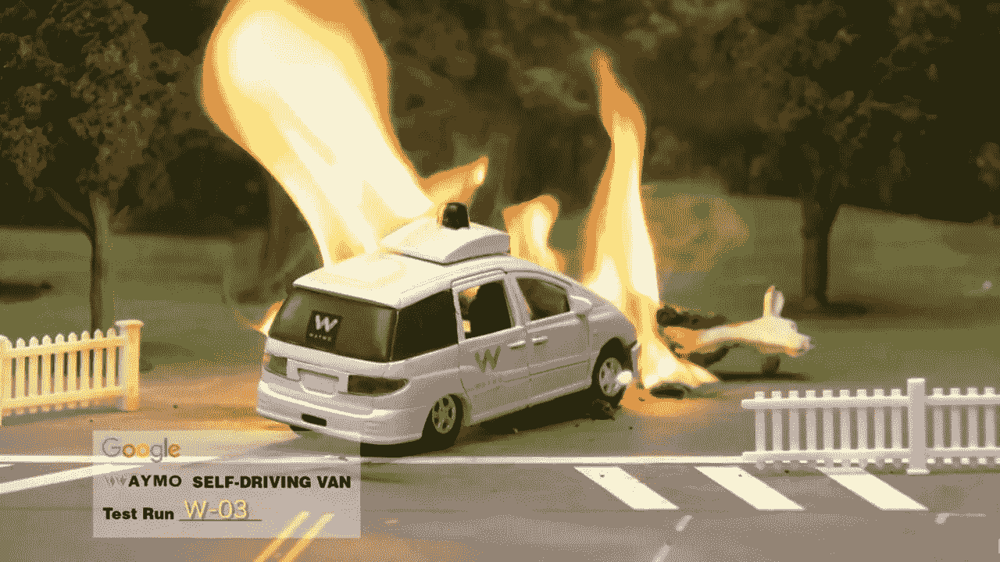
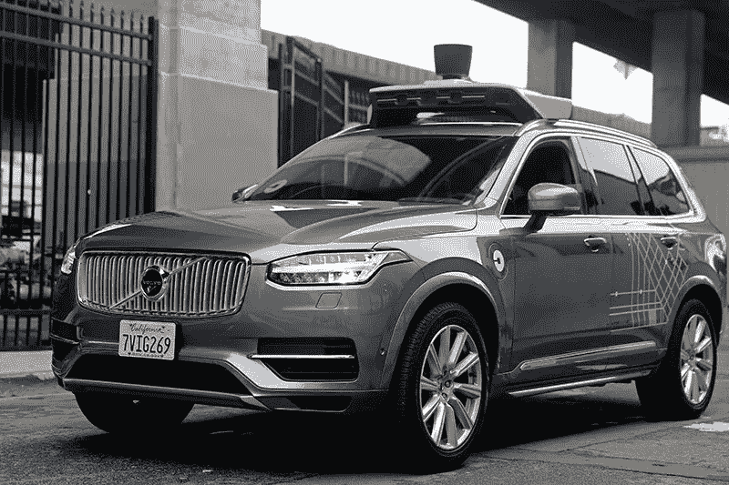
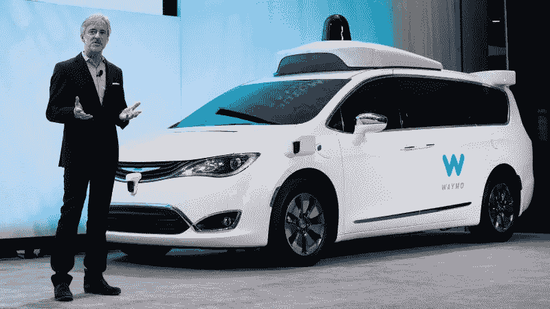

# 更新:谷歌偷了特斯拉，优步偷了谷歌

> 原文：<https://medium.com/hackernoon/update-google-stole-from-tesla-and-uber-stole-from-google-d249f89dc810>

## 你是不是和我一样迷茫…

点击下面的链接查看第 1 部分[这里](/@Drive_EV/a-former-tesla-employee-may-have-stolen-the-companys-autopilot-tech-3ac3e8655782#.w665m1cbz)

# Alphabet 的 Waymo 指控优步窃取商业机密。

Alphabet 的自动驾驶汽车部门 Waymo 正在起诉优步，指控其窃取商业秘密，侵犯其传感器技术的专利和不公平竞争。

Alphabet 是优步的投资者，很少提起诉讼，这一法律行动对 Alphabet 来说是一个不同寻常的举动，反映了自动驾驶技术的高昂成本和高风险。

优步的自动驾驶团队是围绕其去年以 6.8 亿美元收购 Otto 建立的。这家成立 6 个月的初创公司由安东尼莱万多夫斯基(Anthony Levandowski)创立，他曾是谷歌自动驾驶汽车团队的工程师，现在领导优步在自动驾驶汽车方面的努力。

Waymo 指控莱万多夫斯基和另外两名前员工在离开公司前窃取了数千份文件，包括其自动驾驶硬件的设计，声称他们打算在其他地方复制这项技术。

Waymo 正在寻求针对优步的禁令，以阻止其使用该技术，并寻求未指明的损害赔偿。目前尚不清楚该技术是否正在优步的自动驾驶汽车原型中使用，这些原型正在宾夕法尼亚州匹兹堡和亚利桑那州坦佩的道路上行驶，或者奥托的自动驾驶卡车车队中使用。

去年 12 月，谷歌成立八年的自动驾驶团队[从其 X 实验室剥离出来，成为 Alphabet 旗下自己的独立部门](https://www.ft.com/content/7c269112-c15b-11e6-81c2-f57d90f6741a)，更名为 Waymo。

Waymo 表示，它已经在自己的激光传感器系统(称为激光雷达)上投资了数千小时和数百万美元，其自动驾驶汽车在街道上行驶时，可以使用该系统“看到”周围的世界。这些传感器可以让车辆检测并避开障碍物和行人，这对许多自动驾驶汽车系统的功能至关重要，包括优步的系统。Waymo 将其竞争对手涉嫌窃取该技术的行为比作“从一家饮料公司窃取秘方”。

“我们的母公司 Alphabet 长期以来一直与优步在许多领域合作，我们并没有轻易做出这个决定，”Waymo 在一篇博客文章中说。“然而，鉴于我们的技术被窃取的压倒性事实，我们别无选择，只能捍卫我们对这一独特技术的投资和开发。”

优步和莱万多夫斯基没有立即回复置评请求。Waymo 的诉讼并不是优步第一次在自动驾驶汽车上遇到法律麻烦。去年年底，由于未能获得加州机动车管理局认为测试自动驾驶汽车所必需的许可，沃尔沃原型车被迫在旧金山上路。

> [黑客中午](http://bit.ly/Hackernoon)是黑客如何开始他们的下午。我们是 [@AMI](http://bit.ly/atAMIatAMI) 家庭的一员。我们现在[接受投稿](http://bit.ly/hackernoonsubmission)，并乐意[讨论广告&赞助](mailto:partners@amipublications.com)机会。
> 
> 如果你喜欢这个故事，我们推荐你阅读我们的[最新科技故事](http://bit.ly/hackernoonlatestt)和[趋势科技故事](https://hackernoon.com/trending)。直到下一次，不要把世界的现实想当然！

