# 加密货币交易策略——阶段性疯狂

> 原文：<https://medium.com/hackernoon/updated-crypto-strategy-bc424532d657>

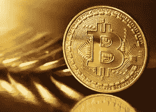

# 学习加密货币交易…学习方法/策略

我想在这篇文章的前面简单说一下如何学习技术分析。很多人关注学习指标。很少有人关注指标的应用。我个人用的指标很少。我是一个价格行动交易者，虽然有些指标有一定的价值。在加密货币交易中，我看到很多新手非常关注指标。指标膨胀是一个问题。我关注少数几个有价值的指标，这些指标有回溯测试数据显示它们有统计学优势。如果你有兴趣了解我是如何确定我使用的几个指标的，我推荐你去亚当·格里姆斯的自由交易课程。如果你想学习 TA，以及我为什么使用某些指标的推理，那就是要去的地方。那是学习基础知识的好地方。Babypips.com 的[也很优秀。](https://www.babypips.com/learn/forex)

# 先学基础

还有许多其他学习基础知识的好资源。 [Investopedia](https://www.investopedia.com/university/technical/) 有一个非常简单的课程，[Stockcharts.com](http://stockcharts.com/school/doku.php?id=chart_school:overview:technical_analysis)有一些很好的课程。有许多很棒的书可以用来学习基础知识或学习方法。[金融市场的技术分析](https://www.amazon.com/gp/product/0735200661/ref=as_li_tl?ie=UTF8&camp=1789&creative=9325&creativeASIN=0735200661&linkCode=as2&tag=thebusytrader-20&linkId=91445ebd3761e9a5b0eb55d5e80fd2f0)是学习 TA 的好方法。有一些优秀的博客，比如 Stockbee。在我的[资源部分](https://speculatefreedom.com/resources-2/)有一些我喜欢的交易书籍和博客的链接。是的，我的很多书和博客都是关于股票交易的。很多相同的原则也适用于加密交易。在我看来，真正的优秀交易者并不多，所以最好的资源还是在股票市场。

我博客的很多读者都是基层读者，所以我建议从那里开始，然后再回到这里学习我的方法。或者另找一种更符合自己性格的方法。QuickFingersLuc 和 T2 是我非常喜欢的两个名字。布莱恩·比米什的方法和我的相似。戴夫·兰德里的几个设置也极大地影响了我交易密码的方式。除了我的方法之外，我还交易 QFLs 方法，只是做了一些小小的改动。然而，这需要一篇单独的博客文章。这个帖子是为了我的面包和黄油方法。

# 我有一个视频来配合这个帖子:

# 为什么要进行加密货币交易？

我建议新手或账户余额较少的交易者考虑加密。波动性高得惊人。波动等于潜力。如果你能在这里成为一个成功的交易者，你在这里可以比在股票市场做得更好。你可以更快地增加你的帐户加密。

这些市场有很多业余爱好者，没有很多专业人士。如果你是认真的，这就等于机会。

有风险。高波动性确实意味着高风险。过去，这些交易所在黑客入侵、停机等方面存在许多问题。我发现这些市场有点像高科技版的杰西·利弗莫尔的投机商店，如果你曾经读过《T4》中一位股票操作者的回忆。

在开始之前，请做好调查。

# 先决条件

我以前推荐在看这个帖子之前先浏览一下我的[炒股方法系列](http://speculatefreedom.com/working-persons-position-trading-method/)，但是现在已经不要求了。我确实建议先学习 TA 的基础知识。请参阅我在顶部链接的资源。我的股票交易方法和加密货币交易方法有很多相似之处。我加入了布莱恩·比米什的方法和 Lucky36Luc 的方法。

# 工具

对于图表和警报，我使用 [Coinigy](https://www.coinigy.com/?r=a78d9c90) 。Coinigy 有服务器端警报。这个特性本身就让它物有所值。我从来没有错过这样的警报。我可以设置短信和/或电子邮件提醒。它功能强大，非常有用。Coinigy 目前正在研究扫描功能，这对我和许多其他加密货币交易商来说将是一件大事。

最近，我开始使用其他一些筛选工具。这些可以帮助筛选大量和越来越多的硬币，试图找到设置。我同时使用 [Strymex](http://strymex.com/screener) 和 [Tradingview](http://tradingview.com) 来搜索[“情节支点”](https://stockbee.blogspot.com/2010/02/what-are-episodic-pivots-and-how-to.html)。EPs 是我炒股多年的一个设置。类似于[杰西·斯汀的超级股票](https://www.amazon.com/gp/product/0615818455/ref=as_li_tl?ie=UTF8&camp=1789&creative=9325&creativeASIN=0615818455&linkCode=as2&tag=thebusytrader-20&linkId=7eafc87a14bae10f30c440d885ac0656)。我寻找平的死垒，它正在突破我所说的“低水平垒”，进入第一阶段的垒区。稍后我会详细介绍这一点。以下是我对 tradingview screener 的设置(% change > = 5 /市值 10K 变为 5B /相对成交量> =2):

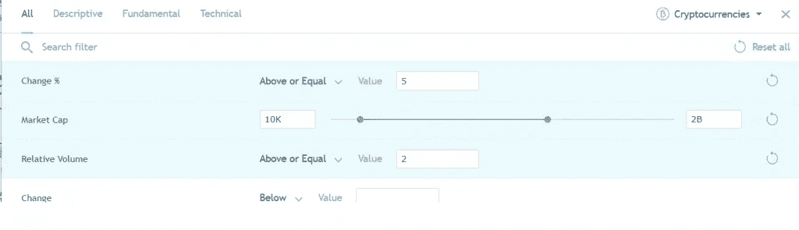

Strymex 设置类似。

QFL 均值回归法有许多筛选方法。这里是其中的一些，每天都有更多的冒出来。

[hodloo](https://qft.hodloo.com/)

[cryptomarketscanner](http://www.cryptomarketscanner.com/)

QFLs 的懈怠和不和谐也有人发帖设置。

# 我使用的交易所

我用 [GDAX](https://www.coinbase.com/join/587824ef2ee3cd01f77befb6) 买比特币，以太坊，莱特币。如果你只使用邮政，限制订单，没有费用。在 BTC/瑞士联邦理工学院，我会把一些转移到币安、Bittrex 或 T21 进行另类交易。币安是我的主要 alt 硬币交换。任何流行的 alt，我不能在币安交易，我在 Bittrex，或 Kucoin 交易。

正如我已经提到的，Coinigy 是大多数交易所的一个非常棒的交易工具。3Commas 是一个很好的竞争对手，我听说过它的优点，尽管我还没有尝试过。

有一批新的交易所很有前途。我看的是曹仁、COFI、[、科比尼奥](https://cobinhood.com/home)、[密码达什](https://www.cryptaldash.com/)。

Poloniex 和 Bittrex 的更新让我深受鼓舞。交易所最近已经开始升级他们的游戏，这对这个领域来说是一件好事。

# 交易大盘股

我主要以趋势跟踪者的身份交易大盘股。我试图顺应大趋势。当 BTC 长期处于牛市时，我会 100%投资 BTC 和/或瑞士联邦理工学院。许多替代交易对手仍然只与 BTC 进行交易，因此越来越多的替代交易对手也与 ETH 进行交易。当在交易所之间发送时，ETH 是一个很好的选择，因为它具有更低的交易成本和更快的交易时间。在 BTC 长期熊市期间，我关注 GDAX 上的 BTC、瑞士联邦理工学院、长期贸易公司、BCH 对美元的短期交易。

## 决定趋势

如何判断我们是处于熊市还是牛市？嗯，这是一个挑战。我使用的方法主要是长期趋势线。在某种程度上，长期均线可以起作用，但是均线滞后市场太多，所以信号很慢。这里有一个很好的系统，利用移动平均线来确定趋势。基本上，对于长期趋势，每周使用 17 均线和 43 均线，对于中期趋势，每天使用 20 均线和 50 均线，对于短期趋势，每天使用 20 均线。长期趋势是我们最感兴趣的。我们来看几个图表。

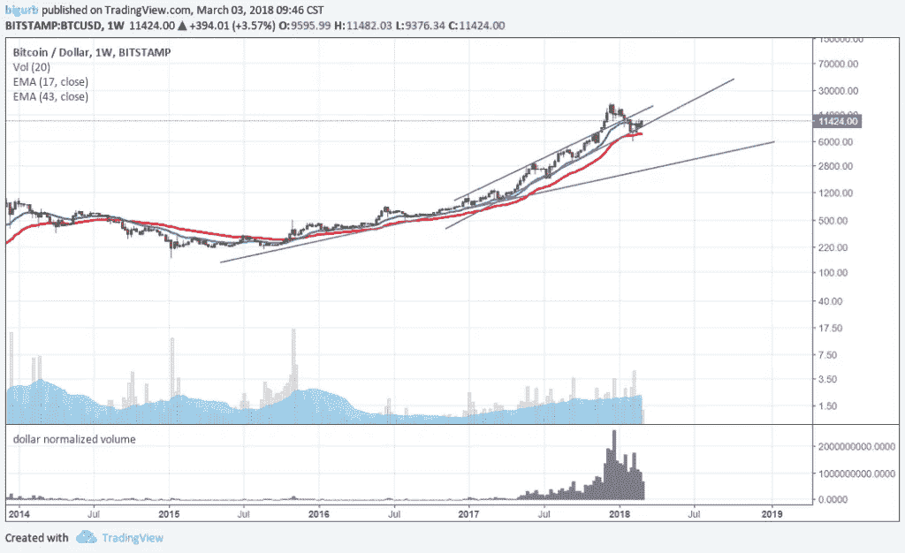

Here can see trend lines and EMAS both confirming the Long Term Trend.

Bearish medium term trend signals..

该日报最近变得悲观了。在此之前我进入了保本模式。这有很多原因，这就是为什么我不仅仅依靠均线和趋势线。一旦市场突破 2017 年上通道趋势线并呈抛物线状，我就开始变得非常谨慎。抛物线状喷出物总是以戏剧性的方式结束。很难确定它们的确切结束时间，但它们的结局总是很糟糕。有很多其他的方法可以用来保持正确的趋势。我需要一段时间来完成所有这些，所以我不会在这里深入讨论。我偶尔会在我的博客上发表一些关于我对当前市场的感觉和不和谐的帖子。这很难，但与市场同步是可能的。

## 时刻警惕风险…

保本是成功交易者的重要组成部分，事实上，我把它排在方法的第二位。你用来交易的方法是第一位的，你的重点应该是不断改进这个方法。交易一段时间，在市场低迷时期做一些小的增量变化。不断地重新评估和改进你的方法。不要太沉迷于交易者心理。如果你有可靠的方法，交易者心理就没那么重要了。

一旦确定了趋势，我就会根据市场情况进入 BTC/瑞士联邦交易所进行头寸交易或波动交易。从长期来看，我会在大盘股呆很长一段时间。然后我专注于 alt 寻币，这才是真正能赚钱的地方。在极端波动中锁定一些美元利润，尤其是抛物线波动。我喜欢分析底部(回调)，因为它们往往有许多相似的特征，如回调的深度和长度。BTC 在 2017 年经历了许多看起来极其相似的回调。我可以在每一个基地投入新的资金。很难抓住准确的底部，但如果牛市是机智的，我们可以使用一个相当大的止损，最终仍然看起来很稳定。

# 大盘股交易示例

## 比特币

BTC 我基本上是作为趋势跟踪者交易的。2017 年全年趋势强劲。2017 年末和 2018 年初，趋势发生了变化。每隔几天，我就调整我的买入水平，试图抓住下一个 30-40%-50%的回撤。BTC 在 2017 年多次回调。

拉起 BTC/美元图表，看看这些回调。他们表现出极其相似的特征。上升趋势线突破时的大幅抛售，随后的快速反弹让许多交易者认为危险已经过去(牛市陷阱)，随后是缓慢、稳定的回调。最后，投降式下跌发生，其中有一个急剧下降，然后是一个巨大的成交量快速反转。这就形成了一个 V 形底部。最后，底部的右侧很快被填满，很快就达到了新的历史高点。这些回调的平均持续时间约为 52 天(这是布莱恩·比米什(Brian Beamish)的数据，但你自己也能很容易地算出来)。

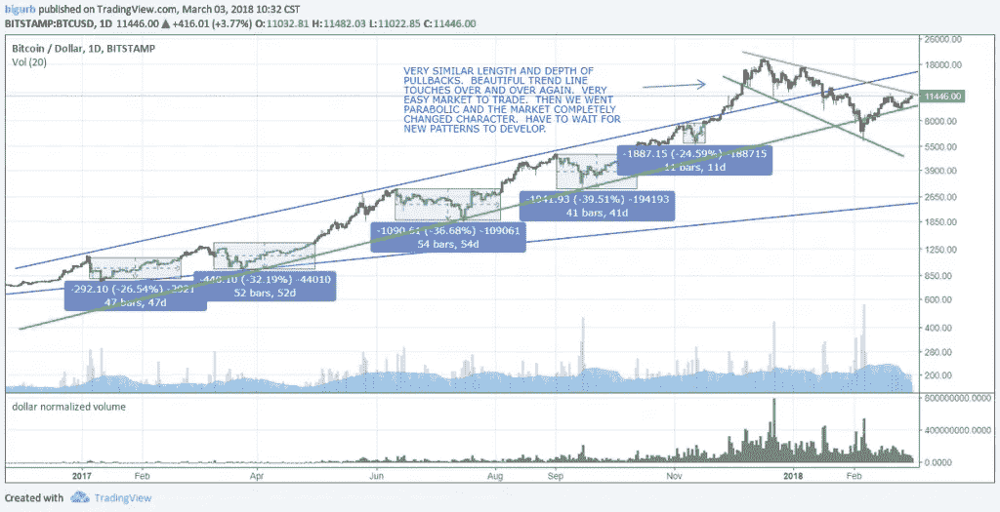

2017 年，我几乎参与了 BTC 的每一次回调。我在副业上的新资金会进入那里。没有销售，直到我们有了吹顶。然后我开始卸货。如果我们打破了底部趋势线，我也会在某个时候同样的退出现金。除非底部趋势被打破，否则没有理由退出。

## TA 很容易过于复杂..

许多技术分析是基于历史可能会重演的想法来分析过去某个市场和交易中发生的事情。这种情况一直持续到它不出现为止，BTC 在 2017 年末非常应该经历一次真正的熊市类型的调整，图表是抛物线形的，在这么长的时间里没有超过 50%的回调。市场停留在极端超买状态而没有明显回调的时间越长，市场改变特征的机会就越大。我的意思是提供一个更长更强烈的回调。有人会说是崩盘或熊市。

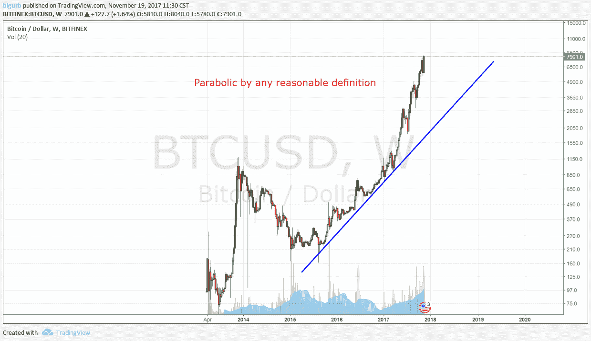

Parabolic by any reasonable definition

这是否意味着我们不能继续买入回调？不，在这种情况下，我们当然可以继续做多 BTC，但是建议使用止损，较小的仓位等等。记住，这个领域的大多数玩家不相信止损。被止损是痛苦的，但当它挽救了一个灾难性的损失时，你会感觉很棒。

## 以太币

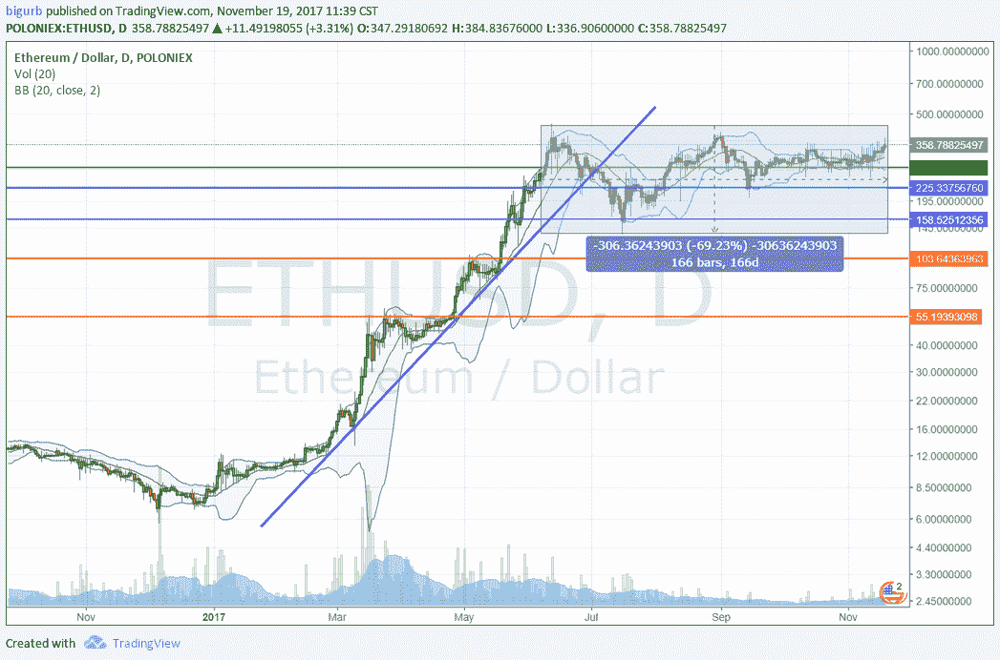

Example of ETH support levels

以太坊在 2017 年初进行了一次大规模的运行，随后是一次大规模的 70%的回调，迄今为止已经持续了 166 天。我喜欢在这些漫长无聊的基地里积累。这个底部持续的时间越长，跌破这个底部的可能性就越小。如果/当这个基础突破，一个大的运行是可能的。在水平支撑位买入并不花哨，也不复杂，但它是有效的，能带来巨大的风险/回报。买入突破更令人兴奋，但是风险/回报特性更差。我很少买突破，因为我是回调交易者。根据对以前回调的分析，在支撑位或预定深度的回调区域买入。许多硬币构建了这些漫长的盘整模式，你可以在盘整的底部附近设置订单进行累积。

当一个硬币有趋势时，买入趋势线是可行的，但是我不会在运行的时间越长时就越大。第一次触及趋势线可能是相当大的买入。ETH 是抛物线运动结束后会发生什么的一个很好的例子…

# 阶段分析，加密货币交易风格“阶段疯狂”

我发现阶段分析对加密交易非常有价值。这是一个很容易理解的概念。这个博客非常适合学习。我使用的术语略有不同。我使用低级基础，阶段 1 基础和阶段 2 基础。如果你继续阅读我过去的交易，你可能会发现我是如何使用它的。

我将用 XRP 作为我的阶段分析版本的例子。我并不是说我赞同 Ripple 或喜欢它的基本原理，但它确实有一个非常好的图表，反映了 alt 运行得非常好。

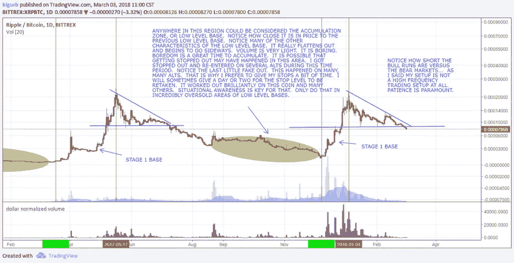

以下是我用一些数据写的一些帖子，这些数据是关于 BTC 和 alt 币熊市持续时间的。它能对你的视角有所帮助。

# [BTC 熊市数据](https://speculatefreedom.com/btc-bear-market-update-numbers-ponder/)

# [Alt 币熊市数据](https://speculatefreedom.com/alt-coin-bear-market-data/)

# Alt 硬币交易示例

我交易 alt 币的方式和交易 Big 币的方式是不一样的。低价竞标往往有很长一段时间表现不如两大巨头。较大的 alt 可以与其余 alt 解耦，并随时运行。他们不必等待 alt 牛市开始。NEO、IOTA、NANO 就是几个例子。其余的 alt，尤其是小型股，大部分时间都是同步运行的。有跑步者和落伍者在这里和那里解耦，但总的来说他们同步跑步。我将加密货币交易中的小盘股定义为在 coinmarketcap.com市值低于 50 的任何股票。小盘股是真正改变游戏规则的回报所在。风险要高得多，但是如果你采用适当的风险管理系统，你可以在一定程度上减轻风险。

如果你看我的[周设置](https://docs.google.com/spreadsheets/d/e/2PACX-1vR-NRhUwbmo9zw4FvJVRn6fZclJKs602x5uzFKQp23BWc5n18BWl13R6OttP20OSXW_ndA-Mb3gyhPd/pubhtml)，你会看到我目前最感兴趣的 alts。这并不意味着我拥有它们或将会交易它们。事实上，我不经常交易我的主要设置。我对小盘股的设置定义只提供了一个很窄的最佳进场窗口。

## 等待聚集区..

我尝试在低等级的基础上积累，但是我最喜欢的地方是第一阶段的基础。从这里开始，如果你能避免被止损，我们可以非常快速的解决交易，并获得巨大的收益。低水平的基础积累是巨大的，但这些基础可以持续非常长的时间，并在某种程度上成为死钱。第一阶段的基础是一个交易往往很快解决的地方，大仓位可以在这里进入，因为趋势继续对我们有利的可能性相对较高。

第一阶段的基础区域类似于戴夫·兰德里的第一次推力设置。我们试图在新的上升趋势中的第一次回调时进场。

## DBG 损失

[https://www.tradingview.com/x/UhKoWqZC/](https://www.tradingview.com/x/UhKoWqZC/)

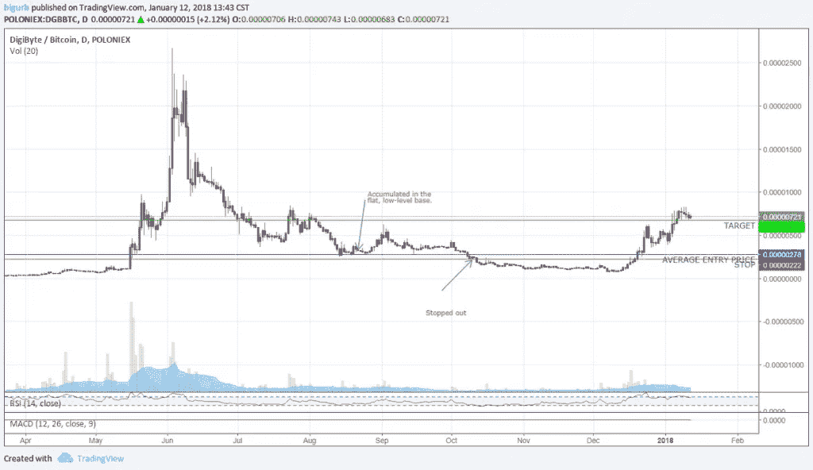

## DGB 赢了

[https://www.tradingview.com/x/DrTpdhgO/](https://www.tradingview.com/x/DrTpdhgO/)

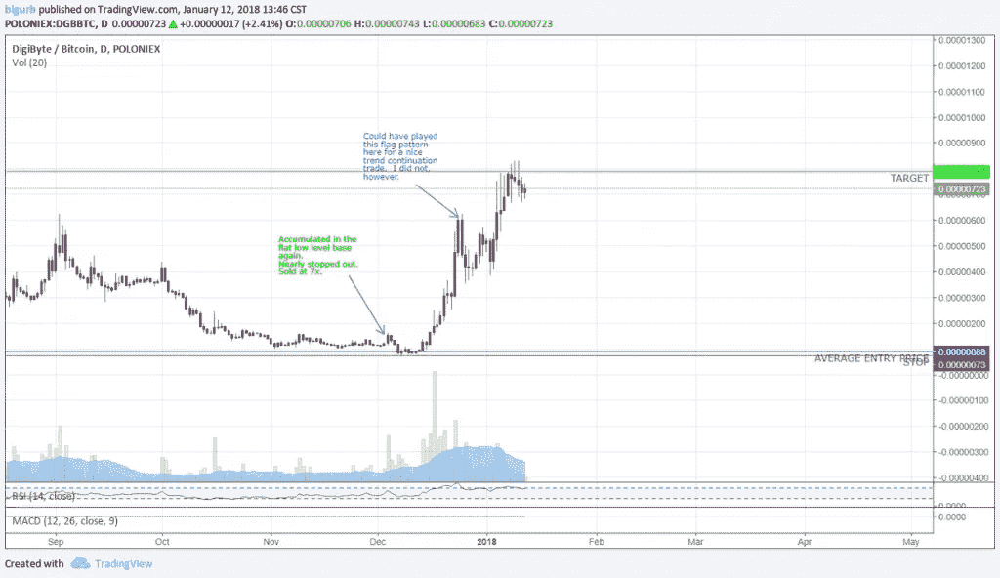

## BCN 赢了

[https://www.tradingview.com/x/KdRz7b15/](https://www.tradingview.com/x/KdRz7b15/)

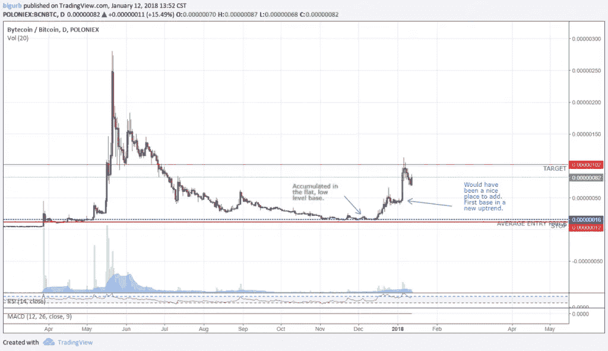

## XLM

【https://www.tradingview.com/x/nIefdXTD/ 号

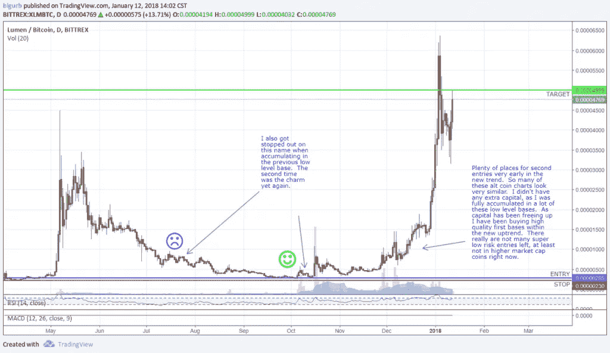

## XRP

【https://www.tradingview.com/x/OWyGCcuC/ 

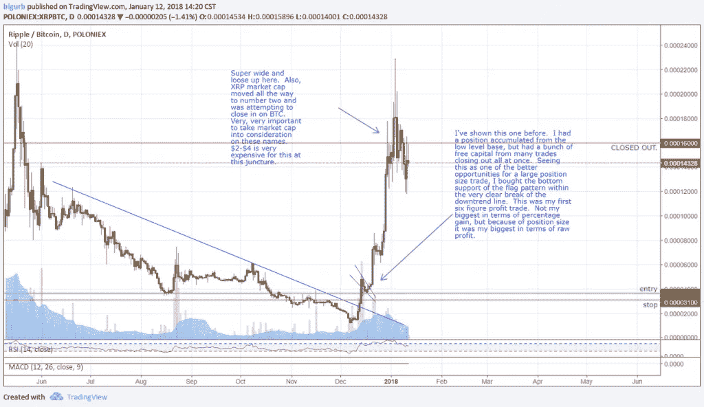

## LSK

[https://www.tradingview.com/x/bPUjf9qD/](https://www.tradingview.com/x/bPUjf9qD/)

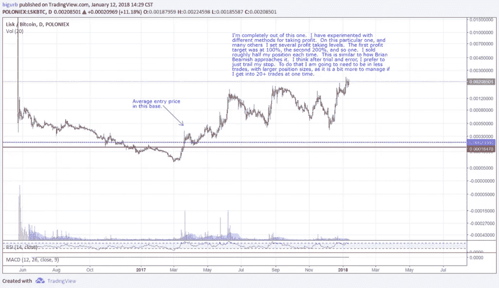

## 极微小

[https://www.tradingview.com/x/8GXz6Mb0/](https://www.tradingview.com/x/8GXz6Mb0/)

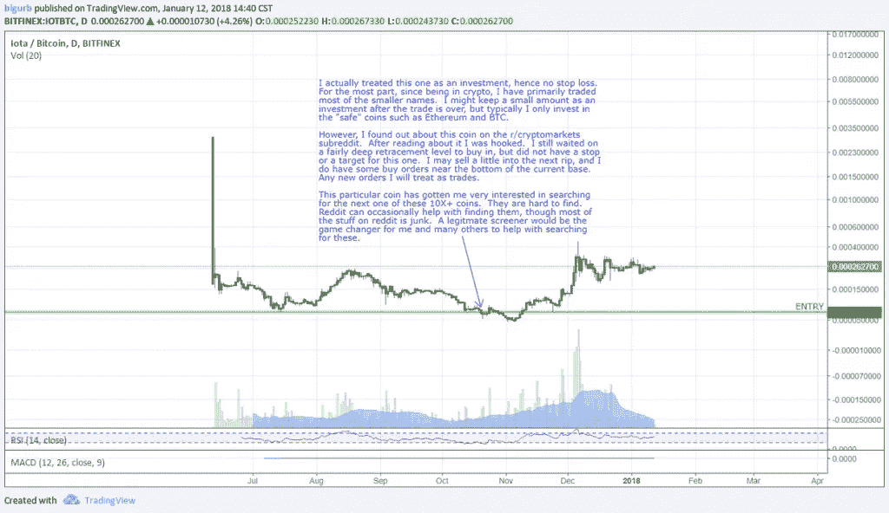

## DBC

[https://drive . Google . com/file/d/1 nwkx 6 _ xznlad 65 hhiqtenexe-wDgvYfI/view？usp =共享](https://drive.google.com/file/d/1nWkX6_XznlAD65HhIQTeneXe-wDgvYfI/view?usp=sharing)

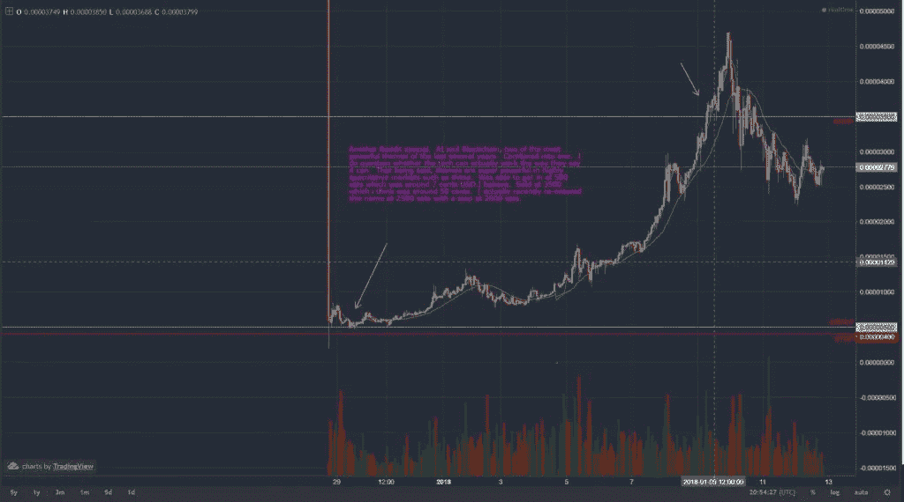

## 斯蒂姆

[https://www.tradingview.com/x/huRqo50C/](https://www.tradingview.com/x/huRqo50C/)

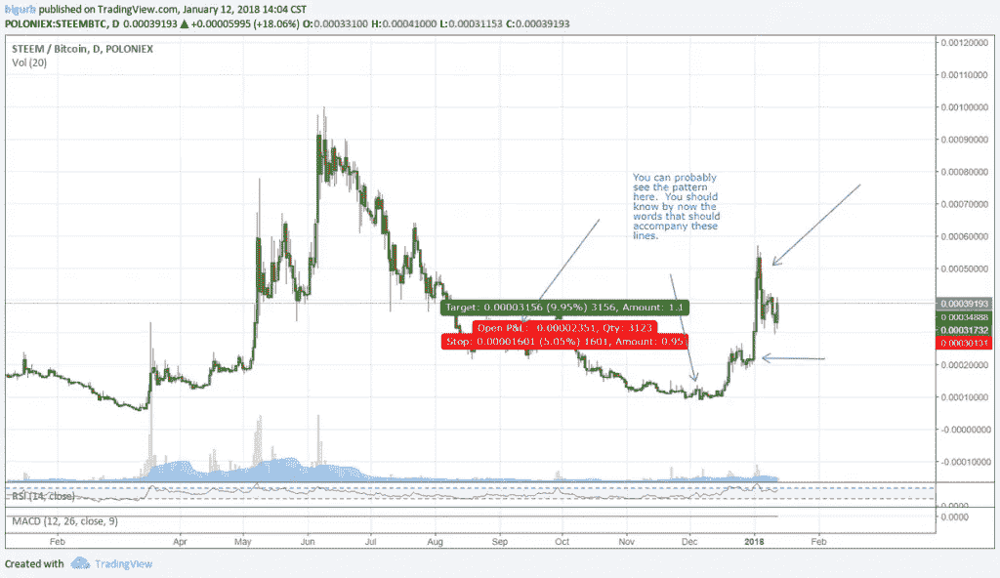

## 感应

[https://www.tradingview.com/x/vxuibkrG/](https://www.tradingview.com/x/vxuibkrG/)

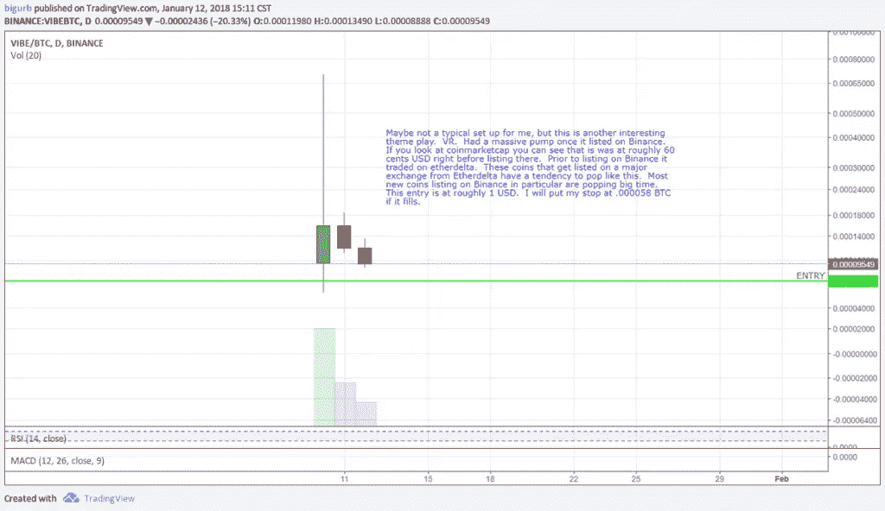

[见本帖。](https://docs.google.com/document/d/1hCscK4Tvy9stvILfUaXsov7qArZXRNvkLbR3BxY6754/edit?usp=sharing)

# 这是我理想的加密交易设置的简化版本..

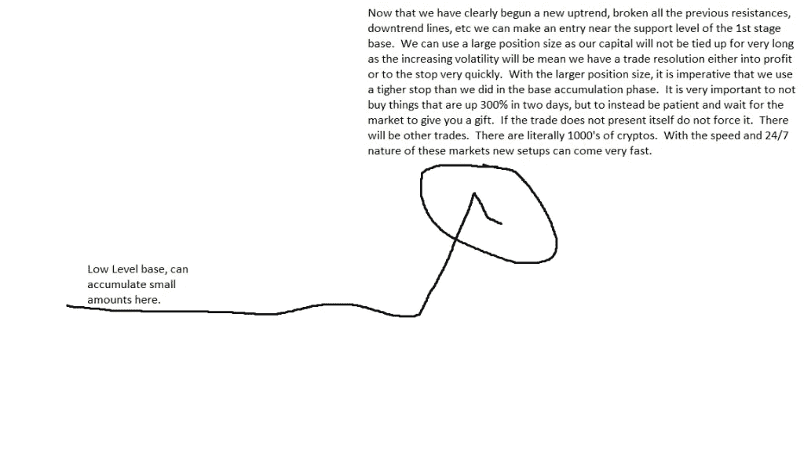

# 观察列表

我不能保证我会一直更新它们或者公开它们，[但是这里有我的观察列表](https://docs.google.com/spreadsheets/d/e/2PACX-1vQiD-oM2zE8w3Ni3xTfWgBR9t-D7tHot1fZ_s8U3W_nMOE3NmOwxF1K0nABCjUf_zjuaqQp2eRGE_xg/pubhtml)。

# 停止

查看我在资金管理上的帖子，深入了解在股票上设置止损点。然而，在加密中，由于波动性增加，你需要经常使用更大的止损点。简而言之，我总是试图让我的止损有至少 2:1 的风险回报比，尽管几乎总是我的风险回报更有利。所以，如果我的止损是 10%，我的第一个利润目标至少要达到 20%，尽管通常会更高。现在我尽可能不使用超过 20-30%的止损，因为整个行业的恶性调整会让你血本无归。20%很难，但比 50 %- 80%要好。

我希望我的车站在一个不太可能被撞的地方。低于一个非常强的支撑位，这个支撑位在硬币的正常波动范围之外。我盯着图表，衡量过去的回调，并试图低于大多数回调的深度。这并不总是可能的，但这是理想的情况。我经常会根据止损点的位置来调整我的目标。如果我不得不使用严格的止损，那么我会尽快获利了结。

当硬币上涨并达到利润目标时，我会提高止损。由于我加入了很多加密货币交易，我会随着平均价格的变化调整止损。

# 目标

目标通常是在止损后设定的。我并不总是使用目标。事实上，大多数时候我不知道。如果我这样做，我的第一个利润目标将是 20-1000 %,这取决于图表。一张有 100%以上波动历史的图表，我更倾向于使用更大的目标。显然，如果我设定 100%以上的利润目标，我不会使用 50%的止损。我几乎总是使用比 2:1 大得多的风险:回报比率，只要求我的最低比率是 2:1。

我经常在仓位对我有利的时候把止损点设得更高，就像戴夫·温岚做的那样。也就是说，我确实想从事一个有可能实现高额利润目标的行业。因此，我会在进入交易前考虑可能出现获利回吐的领域。

# 以常规为导向

重要的是要有一个规律，要有条理地最大限度地利用你的时间。现在有很多加密货币，试图找到理想的设置就像大海捞针一样。如果没有很好的筛选工具，就需要手动翻阅图表来找到它们。这不是一件坏事。它可以极大地帮助你阅读图表。看很多图表只能帮到你。

[以下是我目前的套路](https://docs.google.com/document/d/1-PdJUsvhcmgr_9cdbKcqY4ctP0J_-wWjMfW9ZmpgaAs/edit?usp=sharing):

## 每天地；天天地

*   浏览币安和库柯恩的警报。(我对这些交易所中的每一个 BTC 配对都发出了警报，我认为这可能会形成一个较低的基数。
*   浏览屏幕寻找设置(我有 Strymex 和 Tradingview 的屏幕，我试图模拟情节枢轴屏幕。)
*   看各种 subreddits，看 YouTube 视频等。可靠的消息来源。(这是 Jesse Stine 的外卖。他不筛选股票，而是让股票来找他。根据我的经验，这是有一定道理的。关键是要能够过滤掉大量的噪音。)
*   做日常 ICO 研究。详情在 Discord 服务器设置帖子。
*   浏览每周观察列表寻找设置

## 一周的

*   浏览前 100 个市值硬币。在 Coinigy 里调出图表。你能在这儿购买它吗？对我来说，答案通常是否定的。如果答案是肯定的，或者即使价格接近可购买的水平，那么对硬币的一些研究可能是必要的，如果还没有这样做的话。避免明显的骗局。问一些相关的问题:
*   需要用区块链吗？
*   还有哪些项目在做同样的事情，它们是否明显领先？
*   这个项目是在解决一个真正的问题吗？

理想情况下，该项目可以回答一些问题。如果不是，这不会完全消除可交易性，但它可能会调整头寸规模。这是可以接受的去可靠的来源，看看他们如何审查它。

*   制作一个最佳设置的观察列表。如果有，在最佳设置上设置警告和/或限价单。
*   从 ICO 电子表格中列出最佳 ICO 的观察列表。使用 80–90%+评级的阈值。将它们全部添加到观察列表中，并在 ICO 后检查它们。寻找可购买的区域。将良好的设置添加到每周观察列表中。
*   制作一个其他有趣的小盘股的观察列表。这些可以来自可靠的来源。浏览本周寻找设置。将良好的设置添加到每周观察列表中。
*   每周做 ICO 调研。参见 ICO 流程帖子。

# 短期加密货币交易

我偶尔接受短期均值回归交易。对于这些，我真的只是模仿 [quickfingersluc](https://steemit.com/@quickfingersluc) 。加入[松弛组](https://quickfingerstraders.slack.com/)并使用[各种可用的扫描仪](http://www.cryptomarketscanner.com/)会有所帮助。我对这个系统进行了相当大的修改。可能需要一篇单独博客文章来详细介绍这个系统。这些硬币中的大部分不能以大尺寸交易，所以对我来说，在长期交易中已经赚了大钱。

在熊市或潜在熊市期间，我也会根据仓位或趋势进行交易。在这种情况下，我对自己的资金管理更加严格了。

# 关于加密货币交易的一些最终想法…

*   缩小…很多交易者都非常关注短期。看大局，花很多时间在日线图上。除非你在研究买入水平或短线交易，否则不要花太多时间。
*   不要让太多的指标变得过于复杂。
*   不要总是从一种方法跳到另一种方法去寻找圣杯交易系统。
*   关注基本面和新闻。例如，最好不要交易一枚被除名的硬币。对于你打算投入大量资金的硬币，做一些项目的基础研究。我在《加密资产》这本书上有个帖子。这对基础研究非常有用。我知道我在这篇文章中没有涉及基本面，但是我确实考虑了基本面。我更关注图表，但我仍然是一个技术原教旨主义者。
*   休息一下。如果你遭遇了连败或感到筋疲力尽，暂时离开。如果你取得了惊人的连胜，休息一下也是一件好事。一些最严重的亏损紧随我最大的赢家之后。
*   研究过去的大赢家。我怎么强调都不为过。搬家前和搬家过程中的基本面和新闻事件是什么？搬迁前的图表是什么样的？是否有警告顶部的迹象？你明白了。
*   永远学习和进化。不断迭代你的策略。随着你对市场了解的越来越多，做出渐进的改变。阅读。书籍仍然是学习交易和许多技能的极好资源。
*   有时候最好的行动就是不行动。耐心点。不要满足于二级设置。等待高级设置。
*   要坚持。那些成功的交易者都有点固执，不会轻易放弃。

# 结束了

我想我已经涵盖了我的加密货币交易策略的症结所在。总有许多细微差别不可能适合一篇博文。有什么问题请提问。通常，最好的学习方法是自己进入图表。开始看过去的回调，看下一个低水平的基础可能在小盘股的什么地方形成，在过去什么地方有一些伟大的第一阶段进场，等等。改进系统。做你认为合适的改变。让它成为你自己的系统。在你认为合适的时候加入其他系统的元素。