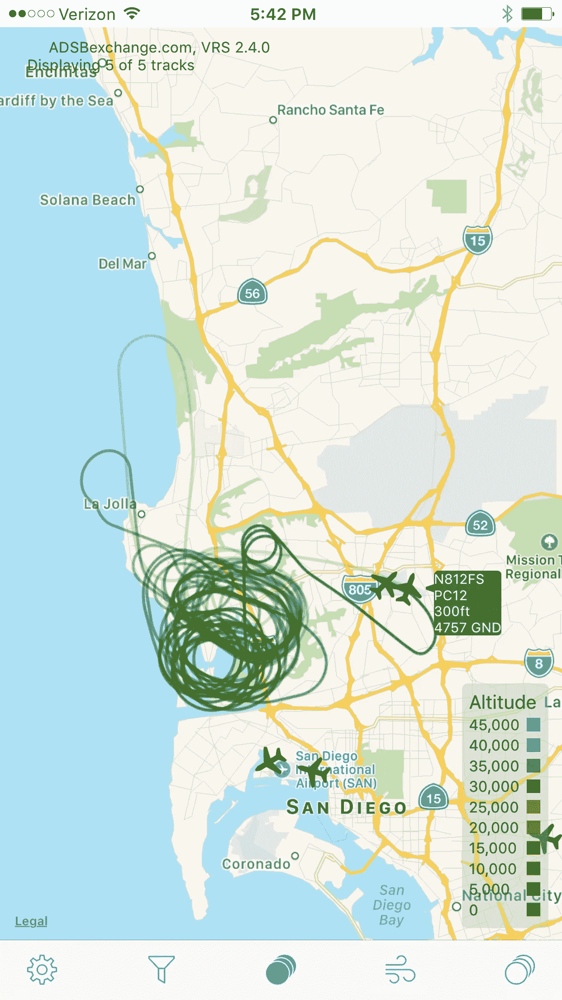
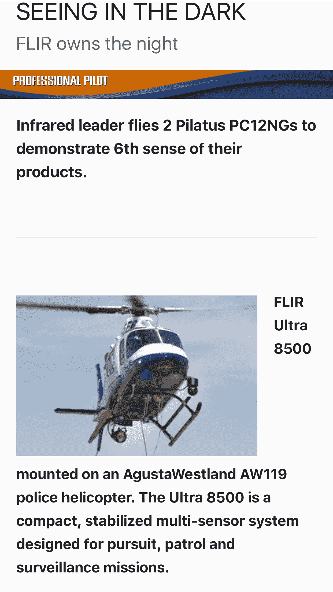
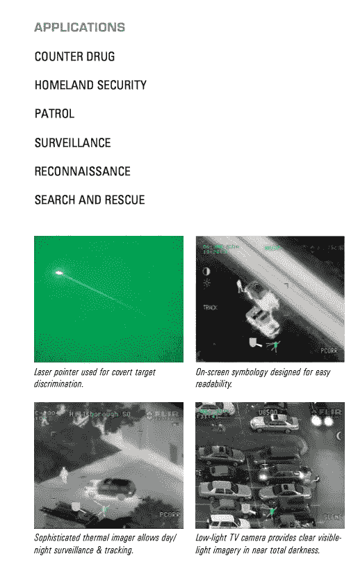
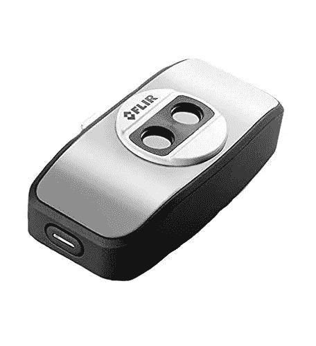

# 圣地亚哥的城市监控

> 原文：<https://medium.com/hackernoon/urban-surveillance-in-san-diego-683a1829a52e>

我正在测试一个显示 ADS-B 航班数据的 iOS 应用程序，昨天它显示了:

那就是**不正常**。我搜索了“N812FS”，找到了[这个](http://propilotmag.com/archives/2014/July%202014/A3_Flir_p3.html):

该报道解释说，这架涡轮螺旋桨飞机皮拉图斯·PC12 由 FLIR 系统公司拥有和驾驶

> …空中任务剖面分为 4 个不同的领域:演示、运输、货运和工程。Greg 说，大约 60%的航班属于演示类。最大巡航速度为 280 节，航程超过 1500 海里，短距起飞和着陆能力分别为 2650 英尺和 1850 英尺，他们可以将传感器带到世界上几乎任何地方，向潜在客户展示和讲述。

从[FLIR Ultra 8500](http://www.flir.com/surveillance/display/?id=64176)的产品页面我们了解到确实如此

> Ultra8500 是世界上销量第一的执法热成像仪，是一种紧凑、稳定的多传感器系统，专为追捕/巡逻和监视任务而设计。该型号基于 9”万向架设计，为特定的执法任务而配置。

所以基本上 FLIR(也就是这家公司)在几个街区上空盘旋几个小时，捕捉视频并展示它可以为潜在客户做些什么，大概是当地警察局。这是来自[产品表的一个片段:](http://www.flir.com/uploadedFiles/flirGS/Surveillance/Products/UltraForce_8500/flir-ultra8500-datasheet-ltr.pdf)

我有附在你手机上的 320 美元的版本，甚至它也有惊人的能力。

我猜空中版本可以很容易地发现种植房屋，现在加州已经合法化了大麻。更让我担心的是，由于温和的气候，许多当地的房屋根本没有墙壁绝缘，这意味着空气传播的前视红外可以穿透墙壁。如果你也在飞机上加一个[污物箱](https://en.wikipedia.org/wiki/Dirtbox_(cell_phone))，那就太可怕了。

> [黑客中午](http://bit.ly/Hackernoon)是黑客如何开始他们的下午。我们是 [@AMI](http://bit.ly/atAMIatAMI) 家庭的一员。我们现在[接受投稿](http://bit.ly/hackernoonsubmission)，并乐意[讨论广告&赞助](mailto:partners@amipublications.com)机会。
> 
> 如果你喜欢这个故事，我们推荐你阅读我们的[最新科技故事](http://bit.ly/hackernoonlatestt)和[趋势科技故事](https://hackernoon.com/trending)。直到下一次，不要把世界的现实想当然！

