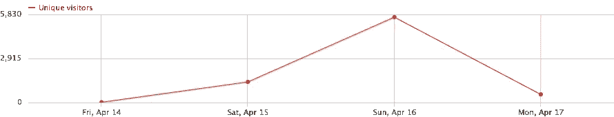

# URL roulette——24 小时黑客新闻

> 原文：<https://medium.com/hackernoon/urlroulette-24-hours-on-hacker-news-e272ef6637d8>

## 余波。

三周前，我的最新项目 [UrlRoulette](https://urlroulette.net/) 在[黑客新闻](http://news.ycombinator.com)首页上出现了大约 24 小时。每个人都喜欢统计数据，所以这里有一个在这段时间内发生的事情的快速总结。

Unique Visitors (Fri, April 14 to Mon, April 17)

CEST 时间周六晚上 7 点 35 分左右，我在黑客新闻上发布了[我的文章，并立即开始看到一些流量进来。经过大约 10 或 15 次投票，这篇文章登上了 HN 的头版，并一直停留到周日晚上。流量在第二天晚上达到峰值，大约每秒 1 个访问者，在黑客新闻播出后大约 24-30 小时开始放缓。](https://news.ycombinator.com/item?id=14122418)

当流量开始爆炸时，我删除了 UrlRoulette 的背景图像(大约 80 千字节，并更改了 HTML 以加载来自他们自己的内容交付网络的所有 CSS (Bootstrap，...)和 [JavaScript](https://hackernoon.com/tagged/javascript) (JQuery，...)。剩下的 HTML 代码只有大约 11 千字节大小，但仍然在周末产生了大约 800 兆字节的流量。

UrlRoulette 显示一个[谷歌](https://hackernoon.com/tagged/google)广告横幅。谷歌报告了约 14，000 次浏览，这带来了约 16€(约 14.2 美元)的收入。只够支付一年的 UrlRoulette.net 域名！:)

## 提交的 URL

UrlRoulette 让用户提交一个 URL，然后将他们重定向到前一个访问者的 URL。在《黑客新闻》中，大约有 13，000 个新网址被提交。

aaaaand…这是提交的前 10 个 URL 的列表:

*   [http://www.google.com/](http://www.google.com/)(187 份意见书)
*   [http://zombo.com/](http://zombo.com/)(46 份意见书)
*   [https://www.youtube.com/watch?v=dQw4w9WgXcQ](https://www.youtube.com/watch?v=dQw4w9WgXcQ)(41 份意见书)
*   [http://xkcd.com/](http://xkcd.com/)(40 份意见书)
*   [http://lemonparty.org/](http://lemonparty.org/)(**NSFW**，34 份意见书)
*   [http://meatspin.com/](http://meatspin.com/)(**NSFW**，30 份意见书)
*   [http://youporn.com/](http://youporn.com/)(**NSFW**，29 日提交)
*   [http://xvideos.com/](http://xvideos.com/)(**NSFW**，29 号意见书)
*   http://perdu.com[(24 件作品)](http://perdu.com)
*   https://github.com/(23 件作品)

许多提交的网址相当“平凡”(如 google.com)，我已经把它们添加到“禁止的网址”过滤器中。

## 下一步是什么？

我仍在筛选这 24 小时内获得的所有数据。UrlRoulette 有很多回头客，我相信人们喜欢 UrlRoulette 背后的想法。

我想做的是增加“每日文摘”的电子邮件列表，并获得更多的社交媒体曝光，以使 UrlRoulette 更广为人知。

## 结论

得到如此多的关注对我来说是一个惊喜。我至少有一个不眠之夜——担心诸如服务器性能和安全性之类的事情。最后，一切都比预期的要好。

事后看来，我后悔没有一些社交媒体的“分享按钮”，没有从一开始就在 UrlRoulette 上设置电子邮件注册表单。短暂的炒作当然帮助我引起了一些人的兴趣。一些人仍然定期访问和使用 UrlRoulette，人们也继续注册每日“十大网址”电子邮件摘要。

## 行动呼吁

*   点击心脏💚向*推荐这个故事*让更多人看到。
*   请在 [*脸书*](http://facebook.com/UrlRoulette-425345804511388/) 上分享这个故事。
*   请跟随我乘坐*中型*。
*   最后:自己试试 [UrlRoulette](https://urlroulette.net/) 吧！:)

> [黑客中午](http://bit.ly/Hackernoon)是黑客如何开始他们的下午。我们是 T21 家庭的一员。我们现在[接受投稿](http://bit.ly/hackernoonsubmission)并乐意[讨论广告&赞助](mailto:partners@amipublications.com)机会。
> 
> 如果你喜欢这个故事，我们推荐你阅读我们的[最新科技故事](http://bit.ly/hackernoonlatestt)和[趋势科技故事](https://hackernoon.com/trending)。直到下一次，不要把世界的现实想当然！

