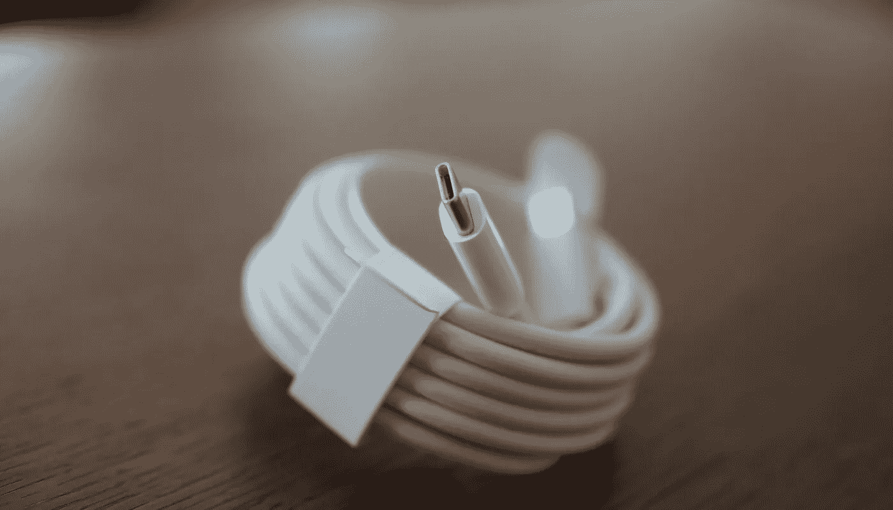

# USB-C 备忘单(规格和比较)

> 原文：<https://medium.com/hackernoon/usb-c-cheat-sheet-db85d6627401>

所以你有一个 USB-C 设备，可能是一个 Pixel 手机或 MacBook Pro，你现在处于通用连接的美妙世界，对吗？

免责声明:我收集这些信息是为了我自己的利益，我认为这些信息对其他人也会有用。使用风险自担。

[USB Type-C](http://www.usb.org/developers/usbtypec/) 是一个很棒的概念，但是有一些注意事项:

**USB-C 插头规格能承载什么？**

1.  雷电 3(是以下规格的超集)
2.  USB 2.0
3.  USB 3.0 (5Gbps) *—也称为 USB 3.1 Gen 1*
4.  USB 3.1 第二代(10Gbps)
5.  显示端口
6.  PCIe 第三代
7.  使用 Alt 模式的 HDMI 1.4b】(还没有 2.0b)
8.  USB 供电(PD)——*充电功率高达 100W*

**值得记住的是，USB-C 和 USB 3.x 不一样，USB-C 只是插头/连接器。**

**我需要什么电缆？**

这就是事情变得复杂的地方。USB-C 电缆几乎有无数种可能的规格组合。为了帮助您进行比较，请注意以下几点。

**动力输送**

使用“功率传输”规格，USB-C 可以携带高达 100W 的功率。然而，并不是所有的电缆都可以承载这么多，市场上大多数电缆的额定功率似乎高达 60W。这不足以为 2016 年末的 87W 苹果 MacBook Pro 供电，因为你需要一根更罕见的 100W 规格的电缆。

检查您的设备以查看它可以使用多少瓦特。

*请注意，大多数笔记本电脑/手机(如 2016 年末的 MacBook Pro)附带的充电电缆实际上是 USB 2.0，无法处理 USB 3.x 等更高的速度/能力。*

**USB-C 最大线缆长度**

USB-C 电缆对其长度非常敏感，因为通过它传输的高吞吐量规格容易受到信号衰减的影响(除非以光学方式传输)。

USB 2.0:4m
USB 3.1 Gen 1:2m
USB 3.1 Gen 2:1m
雷电 3—40 Gbps 的无源电缆:0.5m
雷电 20Gbps 的无源电缆:2m
雷电 3—40 Gbps 的有源电缆:2m — 60m(光纤)

**支持的协议**

雷电 3 是包含所有其他规格的杀手规格。因此，如果你想要一根通用电缆，你可能会想要其中的一根。然而，它们要贵得多，你仍然需要小心它们能承载多少能量。

除了标有 USB2.0 USB-C、USB 3.0 USB-C 等协议之外，我还没有找到一个明确的来源来说明哪些电缆支持哪些协议。

**结论**

雷电 3 电缆公司会以一定的价格为你提供一切，但如果你只关心充电，那么 USB2.0 就可以满足你的需求，让你的覆盖范围更远。

**更新**:我的朋友汤姆刚刚指出，你也应该得到[认证的电缆](https://www.usb.org/kcompliance/view/USB%20Type-C%20Cable%20Certifications.pdf)，因为不符合规格的电缆会[烧坏你的硬件](https://www.engadget.com/2016/02/03/benson-leung-chromebook-pixel-usb-type-c-test/)。

**更新 2** :我的朋友 Essa 给了我一个方便的链接，这导致了一个由谷歌工程师自己测试电缆创建的电子表格:[https://www . Reddit . com/r/nexus 6 p/comments/3 robzo/Google _ spread sheet _ for _ usbc _ cables _ with _ Benson/](https://www.reddit.com/r/Nexus6P/comments/3robzo/google_spreadsheet_for_usbc_cables_with_benson/)

*参考资料:* [*https://blog.startech.com/post/thunderbolt-3-the-basics/*](https://blog.startech.com/post/thunderbolt-3-the-basics/)[*http://www.hdmi.org/manufacturer/HDMIAltModeUSBTypeC.aspx*](http://www.hdmi.org/manufacturer/HDMIAltModeUSBTypeC.aspx)[*http://blog . fosketts . net/2016/10/29/total-nightmare-USB-c-thunderbolt-3/*](http://blog.fosketts.net/2016/10/29/total-nightmare-usb-c-thunderbolt-3/)[*https://www*](https://www.cnet.com/uk/how-to/usb-type-c-thunderbolt-3-one-cable-to-connect-them-all/)

> [黑客中午](http://bit.ly/Hackernoon)是黑客如何开始他们的下午。我们是 [@AMI](http://bit.ly/atAMIatAMI) 家庭的一员。我们现在[正在接受投稿](http://bit.ly/hackernoonsubmission)并乐意[讨论广告&赞助](mailto:partners@amipublications.com)机会。
> 
> 如果你喜欢这个故事，我们推荐你阅读我们的[最新科技故事](http://bit.ly/hackernoonlatestt)和[趋势科技故事](https://hackernoon.com/trending)。直到下一次，不要把世界的现实想当然！

