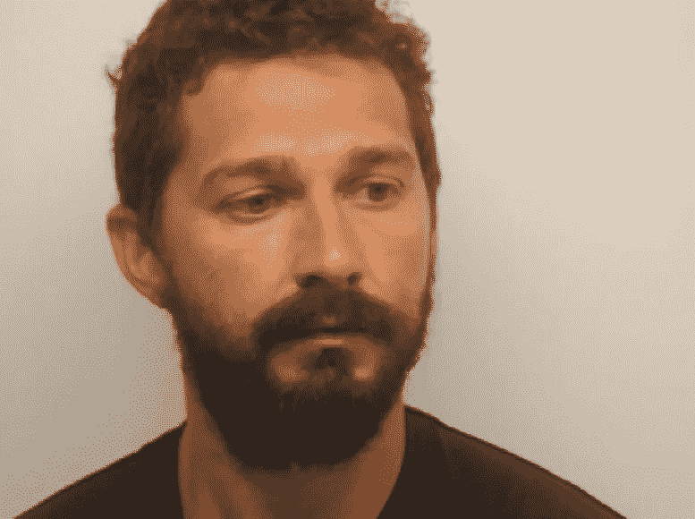
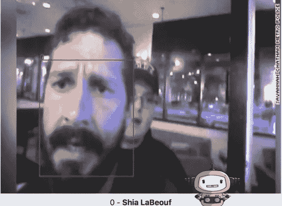

# 使用面部照片自动识别所有 bodycam 视频中的嫌疑人

> 原文：<https://medium.com/hackernoon/use-a-mugshot-to-automatically-identify-suspects-in-all-bodycam-video-31c389a1a5c7>

全国各地的警察部门正在制作越来越多的人体摄像镜头，像 [Axon](https://www.axon.com) (泰瑟枪)和其他制造商这样的公司正在开发软件，以帮助执法部门解决视频的大数据问题。

Bodycam 镜头经常被用作证据，或者至少作为某一组动作的证据。但它也可以用来帮助确定嫌疑人，拼凑更多的犯罪证据，并通常作为知识的来源。今天，仔细检查每一秒钟的监控录像来寻找已知的嫌疑犯的想法几乎是不可能的。这就是一些机器学习可以有所帮助的地方。

让我们来看看一种快速简单的方法来搜索大量的人脸视频。

让我们以这张面部照片为例。

[http://www.tmz.com/2017/07/11/shia-labeouf-arrest-bodycam-footage-savannah/](http://www.tmz.com/2017/07/11/shia-labeouf-arrest-bodycam-footage-savannah/)

我想让我的软件搜索我所有的人体摄像头和监控录像，看看这个人出现在哪里。对于这种系统的开发人员来说，这里有一个很好的、简单的入门方法。我们其他人也可以很容易地尝试一下。

1.  前往 [http://machinebox.io](http://machinebox.io) 并注册。按照简单的说明下载并运行 Facebox(最先进的面部识别)。大约 10 分钟
2.  使用控制台或 RESTful API 来教导 Facebox 这是`Shia LaBeouf`。大约 5 秒
3.  找到一些你想测试的人体摄像镜头。大约 3 分钟
4.  使用 Facebox 控制台或 RESTful API 发布一帧(或整个视频)。大约 1 分钟
5.  看看结果:

A screenshot of a UI I built to test images with Facebox

使用 Facebox 和一点整合工作，你可以建立软件，让执法机构快速找到给定嫌疑人出现的镜头。他们可能想通过人名进行搜索，或者通过使用[视觉相似搜索功能](https://blog.machinebox.io/visual-search-by-machine-box-eb30062d8abe)的样本图像进行搜索。他们甚至可能希望[向 Facebox](https://blog.machinebox.io/streaming-and-recognize-people-from-a-webcam-with-go-and-facebox-acea645b94ab) 传输实时镜头，以便在嫌疑人出现在安全摄像头的视野范围内时立即得到通知。

有了最先进的机器学习和面部识别，一个充满可能性的世界展现在眼前。