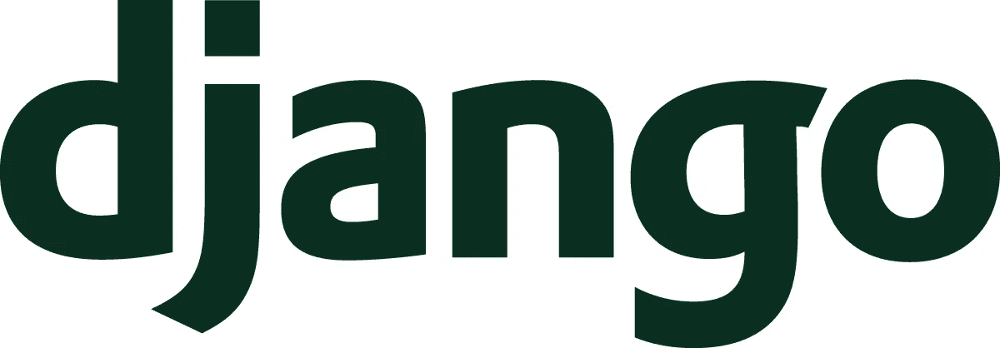

# 使用 Django 或最终建立一个 Django

> 原文：<https://medium.com/hackernoon/use-django-or-end-up-building-a-django-6cce65eb7255>

Django makes it easier to build better Web apps more quickly and with less code.

无论你是初学者还是专业的 web 开发人员，在你的 web 项目中使用 Django Python web framework，否则你最终将构建和组装一个 Django，并且你将会很难学会这一点。

这并不完全正确，如果你确定你的项目永远不会需要 Django 提供的所有东西，那就放心使用轻量级的吧。

许多开发人员，无论是初学者还是高级人员，都在努力挑选一个合适的框架来工作。有些人喜欢 Flask 的简单，这给了他们很大的自由，所以他们可以选择他们想要的东西。

这就是问题所在，你必须选择、决定、维护、粘合和组装大量的库来使你的项目工作，并且只要你的应用程序存在就要一直这样做。

在这篇文章中，我将把 Flask 设置为一个小型轻量级框架来对抗沉重的 unchained Django，并通过在场景中比较它们来讨论这个示例。

# 博客应用程序

现在，在 Web 框架中创建一个博客，就像一个 Hello World 程序，这是我们在大多数情况下比较它们的方式，而不涉及太多的细节。

让我们看看如何构建一个博客应用程序，一个博客 web 应用程序通常有:

*   进入
*   评论
*   管理面板
*   认证(会话、Cookies、密码加密、登录、注销等)
*   Atom 或 RSS 源
*   网站地图
*   页码
*   静态页面
*   表单处理
*   模板引擎
*   搜索
*   数据库(我喜欢 ORM 特性)
*   单元测试

这些都是许多类型的 web 应用程序的基础。

# 瓶

Web development, one drop at a time

Flask 与您的数据库没有任何关系，不知道什么是数据库，它提供了一种很好的方式将 URL 路由到您的视图/控制器，并返回 HTTP 响应，该响应可以包含一个以 Jinja 为引擎的 HTML 模板。就是这样。

剩下的周期就看开发者了。

下面是启动一个简单的博客 web 应用程序所需的东西。下面列出了启动和运行所需的物品:

*   一个数据库扩展，这样您就可以编写和定义您的用户和入口模型。
*   您可能想添加另一个名为 ORM 的东西，让您的生活更轻松。
*   如果您不需要在这个过程中弄脏自己，那么也可以考虑一个数据库迁移工具，这样您就不会最终编写原始 SQL 来修改数据库表。
*   认证扩展，flask 有一堆好的。选择一个同样适用于您的数据库层，并且对会话和 cookies 处理有良好感觉的。
*   您的数据库层最好也有一些分页助手，如果没有，不用担心，您可以自己编写它，进行优化，并与您选择的数据库层保持一致。
*   你想在搜索引擎中被索引，对吗？
*   RSS 或 Atom 提要。这是一个博客应用程序，如果你没有一个有什么意义。
*   静态/平面页面。你应该可以从你的管理面板改变它们。
*   哦，你需要一个管理面板。
*   你的管理面板应该可以很好地处理应用程序的所有扩展或重要部分，比如数据库层、认证、静态/页面。
*   表格，表格，表格！表单在 web 中起着很大的作用，找一个真正好的、灵活的扩展来使用。
*   搜索是另一个重要的层面，如果你的博客有一个简单的全文支持就太好了，否则一个简单的也可以，但是注意不要创建一个虚拟的或者无用的搜索功能，否则它会破坏而不是有用。
*   评论，要么找一个扩展，或者在很多情况下自己写。
*   单元测试真的很重要，你可以自己开发或者找一个很棒的 Flask ext 来让它很好地与上面所有的组件一起工作，或者试着这样做。

请再次注意，在许多情况下，您发现的所有扩展都需要很好地一起工作，并且您必须以这种方式组装它们，否则可能会发生不好的事情，并且您不想看到这样的事情。请记住，你可以用你的时间来添加更多的功能，并在你的生活中做其他令人惊叹的事情，而不是做大量耗时的工作，这些工作可以用其他工具更有效地处理。

现在，让我们看看如何让姜戈做到这一点。

# 姜戈

你只需要姜戈，就这样，祝你愉快。

是的，继续前进，无事可做。

# 即插即用

Flask 和 Django 都有很好的现成的博客网络应用程序，状态非常好。姜戈有百日草，弗拉斯克有弗拉斯克博客。(百日草成熟多了，功能齐全。)

在这篇文章中，我试图展示如何实现如此简单和基本的东西。

# 所以…？

这不是姜戈 vs 弗拉斯克或者谁是赢家的问题。工具是为某个目的而构建的，在很多情况下，工具不想互相替代，也不应该以这种方式来看待它们。

任何 web 框架都有自己的工作领域和功能，作为系统的开发人员或设计人员，您应该明智地选择合适的工具来完成这项工作。

Flask 是最小的，你当然可以用它来创建大的项目，但是你真的需要把大量的其他小程序粘在一起，这意味着更多的维护和工作。更多的工作，更多的工作，更多的工作。你必须找到好的，或者可靠的。每个部分都是单独开发的。如果任何一部分破裂，其他部分也可能开始出血。如果任何第三方库被放弃或者某个 bug 修复没有发布，那么你必须处理这个问题。

如果您选择了错误的工具来完成工作，并且在彼此的基础上构建模块，那么这个问题就存在了。

另一方面，Django 拥有许多类型的 web 应用程序所需的大部分东西，并且很好地涵盖了它们。

如果你的项目是一个不需要太多复杂性的小的单页应用程序，当然 Flask rocks 在这里。当我有很小很小的 web 应用程序时，我使用 Flask，这些应用程序只有一个很小的目的要服务和完成。另一方面，当复杂性更高、数据库很重要、需要表格、管理面板是必须的并且我的应用程序部分之间的完整性必须尽可能牢固时，Django 是我的选择。不仅是我的应用程序，其他第三方应用程序也遵循 Django 生态系统中的相同规则。

# 初学者和高级开发人员

在许多情况下，当别人向初学者推荐微框架时，他们会从微框架开始。主要是因为它很容易上手，或者更容易理解他们文档中的“快速入门”页面。

如果一个初学者想建立一个简单的博客网络应用程序，选择一个微框架将是一个巨大的错误，原因如上所述。这对他们来说增加了大量复杂的过程，一次又一次的困惑，在许多情况下，人们会放弃并寻找其他地方。他们花很多时间把东西粘在一起。有些人喜欢说这将使他们了解更多，并帮助他们发现引擎盖下是什么，事情是如何工作的，我不这样认为。这通常会让他们感到厌倦，讨厌整件事。

高级开发人员应该更多地了解初学者想要构建什么，然后向他们推荐合适的工具。

# 结论

使用合适的工具完成工作。

选择 **Django** 如果:

*   它让你的发展更快，让你的生活更轻松。
*   需要数据库、表单、认证、模板等。
*   令人敬畏的管理面板。
*   伟大的 REST API 框架。
*   您的数据库模式偶尔或频繁地改变。
*   很多东西都在这个项目中。
*   该项目将需要更多的东西，并需要快速扩展。
*   单元测试开箱即用，有大量额外的糖。
*   你不知道将来会需要的东西。

使用**烧瓶**或任何其他微框架，如果:

*   你不需要姜戈提供的东西。
*   就是这样。

**否则，你最终会建立一个姜戈。**

> [黑客中午](http://bit.ly/Hackernoon)是黑客如何开始他们的下午。我们是 [@AMI](http://bit.ly/atAMIatAMI) 家庭的一员。我们现在[接受投稿](http://bit.ly/hackernoonsubmission)并乐意[讨论广告&赞助](mailto:partners@amipublications.com)机会。
> 
> 如果你喜欢这个故事，我们推荐你阅读我们的[最新科技故事](http://bit.ly/hackernoonlatestt)和[趋势科技故事](https://hackernoon.com/trending)。直到下一次，不要把世界的现实想当然！

