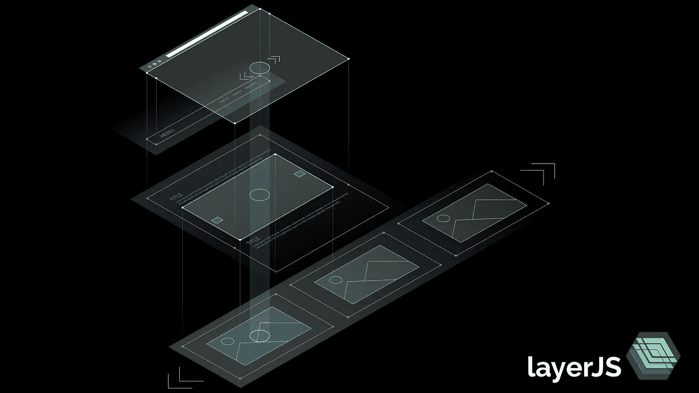

# 使用 HTML 链接触发动画过渡

> 原文：<https://medium.com/hackernoon/use-html-links-to-trigger-animated-transitions-712a5699767c>

layerJS 是用纯 HTML 创建动画交互式 web 用户界面的框架。现在可以通过 HTML 链接触发帧转换了。不需要编码。

[layerJS](https://hackernoon.com/tagged/layerjs) 是一个面向现代网站和 Webapps 的精简、开源的 UX 组合库。它让你用一个简单的通用概念使用一个单一的 [javascript](https://hackernoon.com/tagged/javascript) 库创建 UX 效果，如菜单、滑块、图层&灯箱、视差效果、页面滑动、缩放。

layerJS 引入了阶段框架概念。你的网站或应用程序的所有元素都放在框架中。舞台是容器，可以使用各种动画过渡将帧动态定位到其中。



Nested stages (white) and frames (red) to build a site with a floating menu and an included image slider.

通过将不同的块标记为框架或阶段，网站的结构和交互完全在 HTML 中定义。到目前为止，要在一个阶段中动态切换活动帧，必须调用 layerJS API。

在 0.3 版本中，也可以通过链接简单地触发帧转换。这允许您在 HTML 中定义用户界面的全部交互性，而无需编码。

以下示例是一个简单的内容滑块。滑块下方的两个按钮包含链接，这将触发滑块中的帧转换

```
<html><head>
  <script src="[https://cdn.layerjs.org/libs/layerjs/layerjs-0.4.1.js](http://cdn.layerjs.org/libs/layerjs/layerjs-0.3.0.js)"></script>
  <link href="[https://cdn.layerjs.org/libs/layerjs/layerjs-0.4.1.css](http://cdn.layerjs.org/libs/layerjs/layerjs-0.3.0.css)" type="text/css" rel="stylesheet" />
</head><body>
  <div lj-type="stage" style="width:100%;height:500px">
    <div lj-type="layer" lj-default-frame="frame1">
      <div lj-type="frame" lj-name="frame1">
        ... content of frame 1 ...
      </div>
      <div lj-type="frame" lj-name="frame2">
        ... content of frame 2 ...
      </div>
    </div>
  </div>
  <a href="#frame1">Frame 1</a>
  <a href="#frame2">Frame 2</a>
  <script>
    layerJS.init();
  </script>
</body></html>
```

这产生了一个简单的滑块，您可以在以后用 CSS 填充您的内容和样式。检查这个 [JSbin](https://jsbin.com/todeqi/edit?html,css,output) 来玩这个例子

路由器支持两种模式:

## 1.静态路由器

静态路由器允许您添加连接到状态的绝对 URL，这是一个指示哪些帧在哪些阶段是活动的列表。

```
layerJS.router.addStaticRoute("/frame1",["frame1"])
```

将添加一条静态路由，如果单击“/frame1”的链接，该路由将转换到 frame1。更复杂的情况是可能的

```
layerJS.router.addStaticRoute("/awesome",["stage1.layer1.frame2","stage2.layer2.frame6"])
```

如果用户转到/awesome，将触发层 1 和层 2 的过渡

## 2.哈希路由器

哈希路由器无需初始化即可工作。它将触发到链接 url 中的散列(#)符号后给定的帧的转换。链接到“#frame1”将触发到该帧所在的任何阶段/层中的 frame1 的过渡。

静态路由器和哈希路由器都可以一起使用。

## 过渡参数

通过将参数附加到链接，您可以定义如何动画过渡。目前，可以定义过渡持续时间和过渡类型:

> t -过渡持续时间(加“s”表示秒，加“ms”表示毫秒)
> 
> p -过渡类型(渐变、向左、向右、向上、向下)

使用链接

```
<a href="#frame1?p=right&t=4s">Frame 1</a>
```

在我们上面的例子中，将让过渡回到帧 1 向相反的方向移动，速度更慢。

请查看[层](http://layerJS.org)和层[维基](https://bitbucket.org/layerjs/layerjs/wiki/Home)了解更多。在 developers@layerjs.org[或脸书](mailto:developers@layerjs.org)或推特上让我们知道你的想法。

[](http://bit.ly/HackernoonFB)[](https://goo.gl/k7XYbx)[](https://goo.gl/4ofytp)

> [黑客中午](http://bit.ly/Hackernoon)是黑客如何开始他们的下午。我们是阿妹家庭的一员。我们现在[接受投稿](http://bit.ly/hackernoonsubmission)并乐意[讨论广告&赞助](mailto:partners@amipublications.com)机会。
> 
> 如果你喜欢这个故事，我们推荐你阅读我们的[最新科技故事](http://bit.ly/hackernoonlatestt)和[趋势科技故事](https://hackernoon.com/trending)。直到下一次，不要把世界的现实想当然！

[](https://goo.gl/Ahtev1)