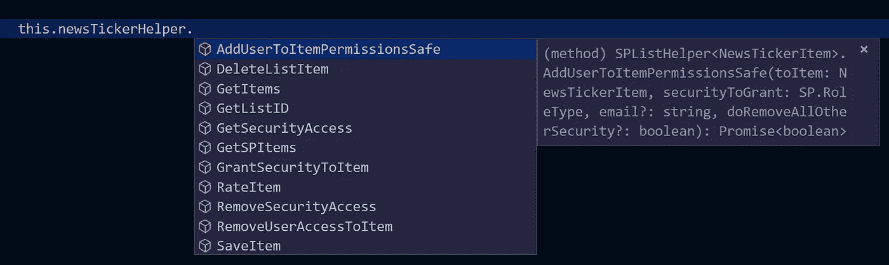
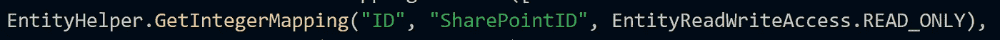
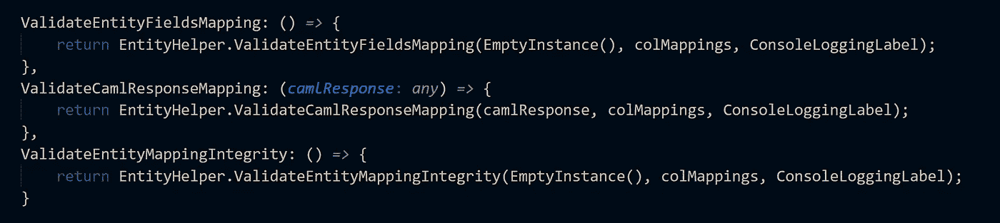

# 使用 TypeScript 支持 SharePoint 的有用实体映射…等等？？？

> 原文：<https://medium.com/hackernoon/useful-entity-mapping-supporting-sharepoint-using-typescript-and-more-90f4aef99782>

TL；DR——我用 TypeScript 编写了一个实体映射器，它利用了抽象类，非常适合 SharePoint。这种技术可能同样适用于其他后端领域。TypeScript 是这种工具的有力支持者。

# 历史

如果您只想获得代码，请跳过这一部分。

多年来，我们 SharePoint 开发人员一直在编写将 SharePoint 部分视为数据库的应用程序。对于许多不太了解它的人来说，SharePoint 是一个协作平台，支持各种协作，包括社交、工作流程、文档管理和相关的等等。

它还有一个“列表”的概念，很像一个数据库表。MSFT 提供了 API，让我们可以对它们执行常见的 CRUD 操作。然而，列表项实际上是比 DB 表更高级的实体。它们可以通过 API 来保护，它们可以被社会标记(评分和喜欢)。他们可以被批准，参与工作流程和其他 yadda yadda yaddas。SharePoint 也为列表项提供了非常实用的用户界面。

在 SharePoint 客户端开发的早期，我们倾向于使用像 [SPServices](http://sympmarc.github.io/SPServices/) 这样的[工具](https://hackernoon.com/tagged/tools)，由聪明绝顶的 Marc D Anderson 组装和管理。没有他的工具，你会写很多美元。ajax()调用端点，解析 XML 或 JSON 响应，希望它是格式良好的，等等。人们仍然在使用它。太棒了。

大约两年前，在微软发布“SharePoint 框架”(或者 SPFx，他们最新的一款 SP 开发工具)之前，我开始使用 TypeScript。那时没有抽象类，这影响了我使用它的方式。

# 基本模型和实体映射

当我必须编写一个使用 SharePoint 列表的终端用户特性时，我会从一种模型对象开始，由列表的列通知。我们可以创建一个 SharePoint 列表来支持滚动新闻滚动条，如下所示:

*   **标题**:字符串
*   **描述**:多行文本
*   **生效日期**:日期
*   **截止日期**:日期
*   **显示顺序**:数字

下面是这个列表的一个非常简单的类型脚本模型:

这给了我一个简单的存储桶来保存列表项，从那里，我可以完成所有的 UI 工作，并将其与列表同步(数据检索和将更新保存回列表)。同步过程基于连接到 SharePoint REST 端点的通用“调用 sharepoint api”类型函数。读取操作采取以下形式:

1.  调用通用的“调用 SharePoint API”函数。(一般是指它只接受一个端点 url 并执行 GET/POST；不是<t>通用)。</t>
2.  从“物理”的角度处理回答，意思是——它出错了吗？这是最低限度的有效反应吗？
3.  将有效响应(通常以 JSON 格式)返回给调用者。
4.  然后调用者将这个 JSON 字符串传递给一个工厂对象。工厂对象理解特定的 JSON 响应，并为我创建一个 TypeScript 对象。

这是工厂:

这就是基本的实体映射。CreateNewsItemFromJSON 是 NewsItem()对象的工厂。它将 JSON 响应映射回实体。其中，您可以看到 SharePoint 列名不一定与 TypeScript 字段名匹配。

我有点过于简化了，因为我实际上费了很大劲定义了一个接口来匹配 JSON 响应，所以我得到了一些很好的智能感知，因为我不需要依赖任何输入参数。

我花了一点时间在我的书 [*和另一本打字本*](https://goo.gl/fk12K2) *中谈到了这一点。*

# 更好的建模和映射

这很有效。我有我的模型实体，代码可以对它进行操作，而没有“天哪，这是一个共享列表，x0020 去哪里了？？？“这些东西被安全地藏在工厂方法中，并与应用程序的其他部分很好地隔离开来。

另一方面，我最终写了很多工厂对象。他们每个人都差不多。它们都有一个接受 JSon 参数的“createObjectFromJSon()”方法。我使用了接口来描述 JSON，所以这很有帮助，但是即使这样，你最终还是会得到很多重复的代码。这是一个复制/粘贴的烂摊子，远远没有干。

然而，当 TypeScript 中出现真正的泛型时，我已经忍受了一段时间。使用泛型非常有意义。SharePoint 列表支持的每个实体都可以参与相同的操作，例如:

*   创造
*   阅读
*   更新
*   删除

而且:

*   分配和删除安全性
*   用 1 到 5 的等级给这个项目打分
*   “喜欢”一个项目
*   获取其包含列表的 ID (Guid)

能做这样的事情不是很好吗？

TypeScript 泛型使之成为可能:

上面的小屏幕截图显示了一个“列表助手”对象能够对“新闻条目”执行所有这些操作

为了实现这一点，我必须用新的功能扩展这个模型。从上面的基本模型到我的代码库的当前状态，我没有一个很好的中间步骤，所以这个清单有点令人吃惊:

让我们把它分成更小的部分:

文件的顶部导入了一些对象和实用程序类:

*   **EntityHelper** :在模型中进一步使用的一些静态实用程序类的主页
*   **EntityReadWriteAccess** :表示某些属性是应该读写到 SharePoint 还是只是读取。例如，我们不想写回 SharePoint IDs。
*   **AbstractViewPortItem** :这包含了一系列对象(新闻条目、特色新闻、收藏等)共有的属性集合。
*   **SFInterfaces:** 定义了一些公共接口。

这是下一大块:

首先，它在清单的第 1 行为模型定义了一个接口。注意，它定义了一个接口，该接口扩展了另一个接口“**ISharePointListBackedEntity**”。这很重要，因为实现该接口的任何实体现在都可以使用上面显示的所有 SharePoint 列表操作。(如果你想深入了解抽象类的解释，[试试我不久前发布的这篇博文+视频组合](https://hackernoon.com/abstract-classes-in-typescript-text-video-cda9a4e6a56a))

它定义了核心模型属性，如标题、生效日期和截止日期等。

实体的构造函数在第 22 行调用超级的构造函数，然后给属性分配有用的默认值。

这是最后一块:

这段代码定义了一个静态方法 **GetSharePointMetadata()** 。正如您将看到的，通用 SP List Helper 使用此元数据在运行时在 SharePoint 列表的列和此实体的属性之间进行映射。

发生了很多事。我们先来看第 10 行。这定义了实际的映射，并通过填充一个数组 colMappings 来实现。下面是一个典型的映射:

这定义了名为“ID”的 SharePoint 列表列和模型属性“SharePointID”之间的映射。在运行时，代码将 SharePointID”列表列填充到模型的“SharePointID”属性中，以进行读取操作。可选的第三个参数，“EntityReadWriteAccess。READ_ONLY”表示写回 SharePoint 时忽略此映射。(缺省值是 Read 和 Write，这就是为什么在其他属性中看不到它的原因)。

低级映射是通过 EntityMapper 类上的静态方法集合来完成的。每种 SharePoint 数据类型都有一个关联的方法。这些 mapplet 函数了解如何将整数的 JSON 响应转换为类型脚本数字，将 SharePoint JSON MMS 对象转换为字符串数组等。

还有最后一个强制链接 SharePoint 列表本身的名称。这在第 8 行完成。

除了直接映射之外，还有一些最后的事情要做。

在第 4 行，我定义了一个“控制台日志标签”。助手使用它来发出带有标签的日志消息，以区别于可能注销到控制台的其他助手。

最后，有这样一行:

在运行时，为了验证映射的完整性，创建一个空实例是很有帮助的。该验证在运行时由以下函数实现:

通用实体助手在运行时调用这些验证函数，以帮助减少使用区分大小写的字段名和棘手拼写时出现的常见问题，当您被迫将 JSON 中的文本字符串与类属性或其他 [JavaScript](https://hackernoon.com/tagged/javascript) 变量进行匹配时，就会出现这些问题。如果我们试图将一个类属性“xyzzy”映射到一个不存在的 SharePoint 列表列，这些验证函数将抛出一个错误，反之亦然。它将捕获如下无效映射:

> *好*:
> 
> 实体助手。GetIntegerMapping("ID "，" SharePointID "，……)；
> 
> 不好:
> 
> 实体助手。GetIntegerMapping("ID "，" SharepointID "，……)；

在“好”的情况下，ID 映射到 SharePointID。

在这种情况下，SharepointID 拼写错误。运行时验证逻辑检测到这个问题，并向您发出警告。

基本思想是，我们可以创建一个 model.ts 文件，以一种更具声明性的方式将模型连接到 SharePoint 列表。通过设置具有映射(例如“VP _ Effective Date”←→“生效日期”)和适当的序列化/反序列化函数的 **colMappings** 数组，我们不再需要关心解析 JSON、构造正确命中 REST 端点的 URL 等等。就实体映射而言，有一个真实的来源。

能够在运行时验证映射是锦上添花。

# 实际效果

这里有一个简短的视频，展示了使用这样的工具是什么感觉:

使用这样的抽象类有几个非常好的结果:

*   强类型结果。
*   自动映射到 SharePoint 列表列。
*   一致的 CRUD+操作。总是“帮手。SaveItem()”或“helper。DeleteItem()”。
*   修复一个方法的错误就能修复所有方法。我记得在一个项目中，我在一个早期的工厂地图绘制器中犯了一个常见的错误。我必须对十几个工厂进行同样的更新，在我做的时候引入了一个新的错误，等等。
*   为一个模型实体添加新的功能意味着所有的模型实体都可以享受它。例如，当我开始做这个的时候，我只关注获取、保存和删除。有一次，我需要设置安全性。我用安全功能增强了核心 splisthelper 对象，现在所有模型都可以得到保护。

# 明智的后续步骤

这种实体映射代码是有机发展的，是一次很好的学习经历。它运行良好，但有一些明显的机会来改善它。

做这样的事情会很好:

基本上，使用 TypeScript Decorators 来指定实体映射，而不是我正在使用的静态方法。

我最近出版了一本关于 TypeScript 的书！这是免费的，你可以在这里获得:[https://www . git book . com/book/pagal vin/yet-another-typescript-book/details](https://www.gitbook.com/book/pagalvin/yet-another-typescript-book/details)