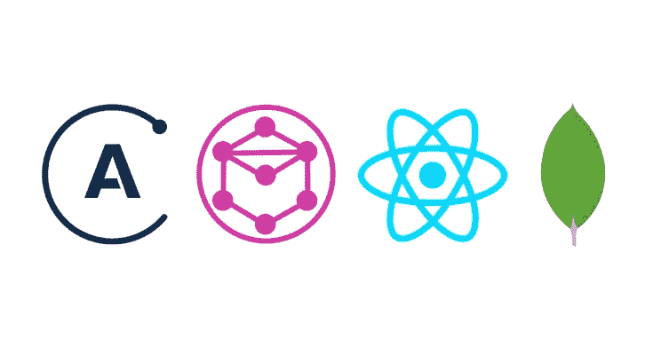

# Node.js / React 工程师的 150 多种有用资源

> 原文：<https://medium.com/hackernoon/useful-links-for-node-js-react-engineers-acc4ad286d60>

在过去的 8 个月里，我得到了很多有用的链接，我决定分享它。希望你能找到自己感兴趣的东西。

## [Node.js，React.js，Redux.js，Rx.js …](https://evheniy.github.io/)

# 我的文章

*   [**evheniy . github . io**:node . js，React.js，Redux.js，Rx.js …](https://evheniy.github.io/)
*   [YEPS——又一个事件许诺服务器](/@evheniybystrov/yet-another-event-promised-server-ee1b06506add)
*   [从头开始开源 node.js 包](/@evheniybystrov/open-source-node-js-package-from-scratch-fa48242a1bbd)
*   [使用 Docker 做正确的事情](/@evheniybystrov/making-right-things-using-docker-7296cf0f6c6e)
*   [后端开发——下一步是什么？](/@evheniybystrov/backend-development-what-next-f9a5f9b386d2)
*   [PHP 有什么问题](/front-end-hacking/what-is-wrong-with-php-6e3e08cfbfa8)

## [学习全栈 Web 开发的最佳 Udemy 课程](https://codeburst.io/best-udemy-courses-for-learning-full-stack-web-development-45e2bd3ec28b)

# 节点. js

*   [节点英雄](https://github.com/devSchacht/translations/tree/master/node-hero)
*   Node.js 入门:初学者指南
*   [一切关于节点。你想知道什么？](https://codeburst.io/all-about-node-js-you-wanted-to-know-25f3374e0be7)
*   [基础 Node.js 设计模式](https://blog.risingstack.com/fundamental-node-js-design-patterns/)
*   [如何用 Node.js 和 DynamoDB 创建一个 Alexa 技能](https://codeburst.io/how-to-create-an-alexa-skill-with-node-js-and-dynamodb-3c9d5e9661)
*   [编写 Node.js REST APIs 的 10 个最佳实践](https://blog.risingstack.com/10-best-practices-for-writing-node-js-rest-apis/)
*   [аутентификациявnode . jsсиспользованием护照. js](/devschacht/node-hero-chapter-8-27b74c33a5ce)
*   [使用 JSON Web 令牌保护 Node.js RESTful APIs】](https://medium.freecodecamp.org/securing-node-js-restful-apis-with-json-web-tokens-9f811a92bb52)
*   [使用 Node.js 的系统通知](https://davidwalsh.name/system-notifications-node/amp)
*   [node . js 中基于令牌的认证，使用护照、JWT 和 bcrypt](https://jonathas.com/token-based-authentication-in-nodejs-with-passport-jwt-and-bcrypt/)
*   [使用谷歌云实现无服务器 Node.js 功能](https://www.toptal.com/nodejs/serverless-nodejs-using-google-cloud)
*   [节点-API-样板文件](https://github.com/talyssonoc/node-api-boilerplate)
*   [大型公司如何大规模使用 node . js](https://nodesource.com/blog/how-massive-companies-use-node-js-at-scale)
*   [Node.js 最佳实践](https://github.com/i0natan/nodebestpractices/blob/master/README.md)
*   [检查表:节点。JS 生产最佳实践](http://goldbergyoni.com/checklist-best-practice-of-node-js-in-production/)
*   [使用节点](/northcoders/creating-a-project-generator-with-node-29e13b3cd309)创建项目生成器

 [## Nodejs -黑客正午

### 阅读黑客午间关于 Nodejs 的文章。黑客如何开始他们的下午？

hackernoon.com](https://hackernoon.com/tagged/nodejs) 

## HTTP/2

*   [JavaScript 如何工作:使用 SSE 深入研究 WebSockets 和 HTTP/2](https://blog.sessionstack.com/how-javascript-works-deep-dive-into-websockets-and-http-2-with-sse-how-to-pick-the-right-path-584e6b8e3bf7)
*   [HTTP/2 IN 节点。JS 核心](https://blog.yld.io/2017/11/03/http-2-in-node-js-core/#.WgV2h1z1WL7)
*   [使用 Node.js 的 HTTP/2 服务器推送](https://blog.risingstack.com/node-js-http-2-push/)

# 反应

*   [反应模式](http://reactpatterns.com/)
*   我希望在投入工作之前知道这些
*   [了解高阶元件](https://medium.freecodecamp.org/understanding-higher-order-components-6ce359d761b)
*   [深度反应高阶组件](/@franleplant/react-higher-order-components-in-depth-cf9032ee6c3e)
*   [用酶和摩卡测试反应成分](https://semaphoreci.com/community/tutorials/testing-react-components-with-enzyme-and-mocha)
*   [React Sight 是组件层次树的实时视图](https://github.com/React-Sight/React-Sight/blob/master/README.md)
*   [反应样板你应该知道的](http://www.designyourway.net/blog/resources/react-boilerplates/)
*   [构建 React 应用的 100%正确方法(或者为什么没有这种东西)](https://hackernoon.com/the-100-correct-way-to-structure-a-react-app-or-why-theres-no-such-thing-3ede534ef1ed)
*   [React 慢，React 快:在实践中优化 React 应用](https://marmelab.com/blog/2017/02/06/react-is-slow-react-is-fast.html)
*   [React 慢，React 快:在实践中优化 React 应用(其他视图)](/dailyjs/react-is-slow-react-is-fast-optimizing-react-apps-in-practice-394176a11fba)
*   медленный做出反应，быстрый:оптимизацияreact-приложения做出反应
*   [反应:використовуємо参考](https://codeguida.com/post/955)
*   [优化反应性能](/gitconnected/optimize-react-performance-c1a491ed9c36)
*   【React 入门:初学者指南
*   【React 组件测试指南
*   [如何使用 React 生命周期方法](http://www.andreasreiterer.at/web-development/reactjs-lifecycle-methods/)
*   [关于 React 路由器 4 的一切](https://css-tricks.com/react-router-4/)
*   [反应实现弹性堆栈效果的本机组件](https://github.com/monterosalondon/react-native-elastic-stack/blob/master/README.md)
*   [反应-原生-视差-卷轴](https://github.com/monterosalondon/react-native-parallax-scroll/blob/master/README.md)
*   [反应、内联功能和性能](https://cdb.reacttraining.com/react-inline-functions-and-performance-bdff784f5578)
*   【React 应用测试实用指南
*   [高性能反应:3 种新工具加速您的应用](https://medium.freecodecamp.org/make-react-fast-again-tools-and-techniques-for-speeding-up-your-react-app-7ad39d3c1b82)
*   [反应异步组件](https://github.com/ctrlplusb/react-async-component)
*   плацдарм для react-приложения
*   [反应过来的事情](https://github.com/rtivital/react-things/blob/master/README.md)
*   [使用 Redux、React 和 Immutable 进行测试优先开发的全面指南](https://teropa.info/blog/2015/09/10/full-stack-redux-tutorial.html)
*   [React-media 是 React](https://github.com/ReactTraining/react-media/blob/master/README.md) 的 CSS 媒体查询组件
*   [react-component-Boilerplate—react . js 组件的样板](https://survivejs.github.io/react-component-boilerplate/#/)
*   [你为什么更新](https://github.com/maicki/why-did-you-update)

 [## 黑客正午

### 阅读关于黑客中午反应的文章。黑客如何开始他们的下午？

hackernoon.com](https://hackernoon.com/tagged/react) 

# Redux

*   [Redux 如何让你成为更好的开发者](https://medium.cobeisfresh.com/how-redux-can-make-you-a-better-developer-30a094d5e3ec)
*   [хранилищедля·производительных](https://habrahabr.ru/post/318268/)
*   [扩展你的开发团队的 10 个重复技巧](https://blog.matters.tech/10-redux-tips-from-the-trenches-55e06ed1c0a8)
*   [在大型应用程序中使用 Redux 的五个技巧](https://techblog.appnexus.com/five-tips-for-working-with-redux-in-large-applications-89452af4fdcb)
*   [React/Redux 链接](https://github.com/markerikson/react-redux-links/blob/master/README.md)
*   [2017 年学习 React + Redux 的小技巧](https://www.robinwieruch.de/tips-to-learn-react-redux/#avoidBoilerplate)
*   [改善 Redux 架构的 10 个技巧](/javascript-scene/10-tips-for-better-redux-architecture-69250425af44)
*   [redux-auth](https://github.com/lynndylanhurley/redux-auth/blob/master/README.md)
*   [反应头盔](https://github.com/nfl/react-helmet/blob/master/README.md)
*   [测试 React 组件的最佳实践](/selleo/testing-react-components-best-practices-2f77ac302d12)
*   [redux Offline——为 Web 和 React Native 构建离线优先应用](https://github.com/redux-offline-team/redux-offline)

 [## Redux -黑客正午

### 阅读黑客正午关于 Redux 的文章。黑客如何开始他们的下午？

hackernoon.com](https://hackernoon.com/tagged/redux) 

# 冗余可观察的

*   [网飞 JavaScript Talks—RxJS+Redux+React =惊艳！](https://www.youtube.com/watch?v=AslncyG8whg)
*   [使用 redux-observable 处理 redux 中的异步逻辑](/dailyjs/using-redux-observable-to-handle-asynchronous-logic-in-redux-d49194742522)
*   [RxJS](https://xgrommx.github.io/rx-book/)

# 网络包

*   [2017 年如何从零开始设置 web pack+2.0](https://codeburst.io/easy-guide-for-webpack-2-0-from-scratch-fe508a3ce44e)
*   [如何在 2017 年从头开始设置 web pack+2.0—第二部分](https://codeburst.io/simple-beginner-guide-for-webpack-2-0-from-scratch-part-ii-66beb5dbccc2)
*   [如何在 2017 年从头开始设置 web pack+2.0—第三部分](https://codeburst.io/simple-beginner-guide-for-webpack-2-0-from-scratch-part-iii-d374c021f9fc)
*   [如何在 2017 年从头开始设置 web pack+2.0—第四部分](https://codeburst.io/simple-beginner-guide-for-webpack-2-0-from-scratch-part-iv-102efc01ffad)
*   [如何在 2017 年从头开始设置 web pack+2.0—第五部分](https://codeburst.io/simple-beginner-guide-for-webpack-2-0-from-scratch-part-v-495dba627718)
*   [从头开始设置 Webpack、Babel 和 React，重温](https://stanko.github.io/webpack-babel-react-revisited/)
*   [性能期货——捆绑](/@samccone/performance-futures-bundling-281543d9a0d5)
*   [分析&优化您的 Webpack 捆绑包](/@ahmedelgabri/analyzing-optimizing-your-webpack-bundle-8590818af4df)
*   [使用 React 和 Webpack 将性能提高 30%的两个技巧](http://engineering.teacherspayteachers.com/2017/08/16/two-tips-to-improve-performance-by-30-with-react-and-webpack.html)
*   [使用 webpack 优化您的应用捆绑包大小](https://hackernoon.com/optimising-your-application-bundle-size-with-webpack-e85b00bab579)
*   [настрокаweb pack 3+Babel+Dev-server。Что, как и почему?](https://school.makenow.com.ua/video/39)
*   [技术讲座回顾:如何提高大型项目中 Webpack 的性能](https://redfin.engineering/tech-talk-recap-how-to-improve-webpack-performance-in-large-projects-5435bb18dd18)
*   [使用 React 和 Webpack 进行简单的代码拆分](https://hackernoon.com/straightforward-code-splitting-with-react-and-webpack-4b94c28f6c3f)
*   [通过删除类名和使用范围隔离将 CSS 包的大小减少 70%](https://medium.freecodecamp.org/reducing-css-bundle-size-70-by-cutting-the-class-names-and-using-scope-isolation-625440de600b)
*   [开始使用 Webpack 工具箱](https://developers.google.com/web/tools/workbox/get-started/webpack)
*   [Webpack + React。уменьшитьбаандлв15раз](https://habrahabr.ru/post/308926/)

 [## 黑客正午

### 阅读 Hacker Noon 中关于 Webpack 的文章。黑客如何开始他们的下午？

hackernoon.com](https://hackernoon.com/tagged/webpack) 

# 渐进式网络应用程序(PWA)

*   [什么是 Progressive web App(为什么要关注)？](https://codeburst.io/what-is-progressive-web-app-and-why-should-you-care-e397e24b1257)
*   [ReactPWA](https://github.com/Gethyl/ReactPWA/tree/master/basic_react_pwa)
*   [开始使用 Webpack 的工具箱](https://developers.google.com/web/tools/workbox/get-started/webpack)
*   [用 Firebase、Polymerfire 和 Polymer 组件构建一个进步的 Web 应用](https://codelabs.developers.google.com/codelabs/polymer-firebase-pwa/index.html)
*   [渐进式网络应用的简要介绍，或 PWAs](https://tighten.co/blog/a-brief-introduction-to-progressive-web-apps-or-pwas)
*   [服务人员被抓](https://www.kollegorna.se/en/2017/06/service-worker-gotchas/)
*   [如何编写一个进步的 Web App 新闻网站](https://medium.freecodecamp.org/coding-a-newspaper-as-a-freakin-progressive-web-app-e456d4a2b9cd)
*   [用**React**构建渐进式 Web 应用](https://codebrahma.com/building-progressive-web-app-react/)
*   [React 渐进式网络应用—第一部分](/progressive-web-apps/react-progressive-web-apps-part-1-1cf381421672)
*   [**React** 渐进式网络应用—第二部分](/progressive-web-apps/react-progressive-web-apps-part-2-d55c6bd4b316)
*   [了解服务人员](http://blog.88mph.io/2017/07/28/understanding-service-workers/)
*   [低挂 PWA 果:舱单文件和服务人员预卡](https://www.loxodrome.io/post/easy-pwa/)
*   [渐进式网络应用(PWA)入门](https://codingthesmartway.com/getting-started-with-progressive-web-apps-pwa/)
*   [дляначинающихпрогрессивнымвеб-приложениям](https://habrahabr.ru/company/mailru/blog/334536/?mobile=no)
*   开发你第一个渐进式网络应用的 7 个工具
*   [维修工人入门指南](/samsung-internet-dev/a-beginners-guide-to-service-workers-f76abf1960f6)
*   [构建渐进式 Web 应用:**离线 Git 趋势应用第 1 部分**(概念和服务人员)](https://scotch.io/tutorials/build-a-progressive-web-app-offline-git-trending-app-part-1-concepts-and-service-workers)
*   [构建**离线 Git 趋势 PWA 第 2 部分**:缓存和离线](https://scotch.io/tutorials/build-an-offline-git-trending-pwa-part-2-caching-and-offline)
*   [构建**离线 Git 趋势 PWA 第 3 部分**:清单和通知](https://scotch.io/tutorials/build-an-offline-git-trending-pwa-part-3-manifest-and-notifications)
*   [сделать进步网络应用:новичка](https://habrahabr.ru/company/netologyru/blog/333544/)
*   [разработкавашегопервогого渐进式网络应用 c React](https://tuhub.ru/other/progressive-web-app-with-react/)
*   [如何将你的网站变成 PWA](https://mxb.at/blog/how-to-turn-your-website-into-a-pwa/)

# GraphQL

*   GraphQL 的全栈教程:【https://www.howtographql.com/ 
*   发射台:【https://launchpad.graphql.com 
*   [使用 React Native 进行 GraphQL 认证& Apollo【第 1/2 部分】](/handlebar-labs/graphql-authentication-with-react-native-apollo-part-1-2-9613aacd80b3)
*   [使用 React Native 进行 GraphQL 认证& Apollo【第 2/2 部分】](/handlebar-labs/graphql-authentication-with-react-native-apollo-part-2-2-13ac8c362113)
*   [在 Express 服务器上使用 Apollo 实现 GraphQL】](https://scotch.io/tutorials/implementing-graphql-using-apollo-on-an-express-server)
*   [开始使用 GraphQL](https://blog.pusher.com/getting-up-and-running-with-graphql/)
*   [graph QL 堆栈:一切是如何组合在一起的](https://dev-blog.apollodata.com/the-graphql-stack-how-everything-fits-together-35f8bf34f841)
*   [深入 GraphQL 第一部分:休息怎么了？](https://hackernoon.com/dive-into-graphql-part-i-whats-wrong-with-rest-709ebcb898dc)

 [## GraphQL -黑客正午

### 阅读 Hacker Noon 中关于 GraphQL 的文章。黑客如何开始他们的下午？

hackernoon.com](https://hackernoon.com/tagged/graphql) 

# 机器学习

*   [机器学习能为你做什么？](/building-crowdriff/what-can-machine-learning-do-for-you-7eabf2562c4)
*   [如何使用 ELASTICSEARCH 进行自然语言处理和文本挖掘—第一部分](http://dataconomy.com/2016/12/use-elasticsearch-nlp-text-mining%E2%80%8A-%E2%80%8Apart-1/)
*   [如何使用 ELASTICSEARCH 进行自然语言处理和文本挖掘—第二部分](http://dataconomy.com/2017/05/use-elasticsearch-nlp-text-mining-part-2/)
*   [ограниченияглубиногообученияибудущее](https://habrahabr.ru/post/335026/)
*   [ускорьтевашсактспомощьюмашинногообучения](https://habrahabr.ru/company/nixsolutions/blog/335122/)

 [## 机器学习-黑客正午

### 在黑客正午阅读关于机器学习的文章。黑客如何开始他们的下午？

hackernoon.com](https://hackernoon.com/tagged/machine-learning) 

# 码头工人

*   [Node.js，PM2，Docker&Docker-compose devo PS](/@adriendesbiaux/node-js-pm2-docker-docker-compose-devops-907dedd2b69a)
*   [开始使用 Docker 进行本地开发](https://perchrunway.com/blog/2017-01-19-getting-started-with-docker-for-local-development)
*   [如何使用 Docker 进行本地 web 开发:一个更新](http://tech.osteel.me/posts/2017/01/15/how-to-use-docker-for-local-web-development-an-update.html)
*   [为什么以及如何使用 Docker 进行开发](/travis-on-docker/why-and-how-to-use-docker-for-development-a156c1de3b24)

 [## 码头工人-黑客正午

### 阅读黑客中午关于码头工人的文章。黑客如何开始他们的下午？

hackernoon.com](https://hackernoon.com/tagged/docker) 

# 用户界面

*   [**登录&主屏幕**](https://dribbble.com/shots/1945593-Login-Home-Screen)
*   [用 CSS 自定义属性构建骨架屏幕](https://css-tricks.com/building-skeleton-screens-css-custom-properties/)
*   [бесплатныеадаптивныеhtml 5иcss3шаблоны](http://blog.liveedu.tv/%D0%B1%D0%B5%D1%81%D0%BF%D0%BB%D0%B0%D1%82%D0%BD%D1%8B%D0%B5-%D0%B0%D0%B4%D0%B0%D0%BF%D1%82%D0%B8%D0%B2%D0%BD%D1%8B%D0%B5-%D1%88%D0%B0%D0%B1%D0%BB%D0%BE%D0%BD%D1%8B/)
*   [魔幻动画 CSS3](https://minimamente.com/example/magic_animations/)
*   [免费&高级 HTML5 引导模板](https://freehtml5.co/)
*   [50 个免费响应的 HTML5 网页模板](https://speckyboy.com/free-responsive-html5-web-templates/)
*   [66 免费响应 HTML5 CSS3 网站模板 2017](https://dcrazed.com/free-responsive-html5-css3-templates/)
*   [100 个免费响应 HTML5 CSS3 网站模板](https://w3layouts.com/free-responsive-html5-css3-website-templates/)
*   [Rakib —免费单页多用途引导模板](https://devitems.com/item/rakib-free-one-page-multipurpose-bootstrap-template/)
*   [可用 HTML 元和链接标签列表](https://gist.github.com/kevinSuttle/1997924)
*   [竖井克星](https://autonome.github.io/silobuster/)
*   [normalize.css](https://www.npmjs.com/package/normalize.css/)

 [## UI -黑客正午

### 在黑客正午阅读关于 UI 的写作。黑客如何开始他们的下午？

hackernoon.com](https://hackernoon.com/tagged/ui) 

# 重火力点

*   [经验教训 Firebase 的云功能](https://blog.elegantmonkeys.com/lessons-learned-firebase-cloud-functions-419dbaf5907b)
*   【React 和 Firebase 入门
*   [如何使用 async/await 和 Firebase 数据库编写漂亮的 Node.js APIs】](https://medium.freecodecamp.org/how-to-write-beautiful-node-js-apis-using-async-await-and-the-firebase-database-befdf3a5ffee)
*   [如何使用 React 和 Firebase 创建 Reddit 克隆](https://www.sitepoint.com/reddit-clone-react-firebase/)

 [## 黑客正午

### 在黑客正午阅读关于 Firebase 的文章。黑客如何开始他们的下午？

hackernoon.com](https://hackernoon.com/tagged/firebase) 

# 备忘单

*   [完整的 HTML 备忘单](https://codeburst.io/the-complete-html-cheat-sheet-751fdae2480c)
*   [头部——对<头部>元件](https://gethead.info/)的自由引导
*   [最佳前端黑客备忘单—尽在一处](https://medium.freecodecamp.org/modern-frontend-hacking-cheatsheets-df9c2566c72a)
*   [Hover.css](http://ianlunn.github.io/Hover/)
*   [использовать2017 年](https://tproger.ru/translations/meta-tags-2017/)
*   [高级 SCSS，或者，你可能不知道你的样式表可以做的 16 件很酷的事情](https://gist.github.com/jareware/4738651)
*   [react-redux-cheatsheet](https://github.com/uanders/react-redux-cheatsheet/blob/master/README.md)

# 对前端有用

*   [какстатьхорошимпрограммитом:статьяот谷歌](https://tproger.ru/articles/google-guide-to-programming/)
*   [коллекцияпотрясающихменюдлясакта| html，CSSиJavaScript](http://nisnom.com/kollektsiya-potryasayushhih-menyu-dlya-sajta-html-css-i-javascript-jquery/)
*   [40+прелоадеры(加载器)длясакта| htmlиCSS](http://nisnom.com/preloadery-loader/)
*   [图表](https://frappe.github.io/charts/)
*   [前端清单](https://github.com/thedaviddias/Front-End-Checklist/blob/master/README.md)
*   [提高 JavaScript 性能的 20 个最佳实践](https://www.keycdn.com/blog/javascript-performance/)
*   [关键要求](https://css-tricks.com/the-critical-request/)
*   [代码示例在线](http://javascriptbook.com/code/)
*   скоростью
*   【GTmetrix、PageSpeed Insights、Pingdom Tools 和 WebPagetest 的区别
*   [如何针对网页和性能优化图像](https://kinsta.com/blog/optimize-images-for-web/)
*   [2017 年前端性能清单【PDF，Apple Pages】](https://www.smashingmagazine.com/2016/12/front-end-performance-checklist-2017-pdf-pages/)
*   [полезных](https://tproger.ru/digest/website-inspection-services/)

[https://hackernoon.com/tagged/frontend](https://hackernoon.com/tagged/frontend)

# [домашний](http://course.growthup.com/)