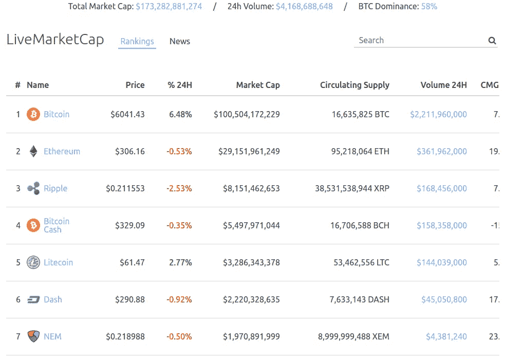
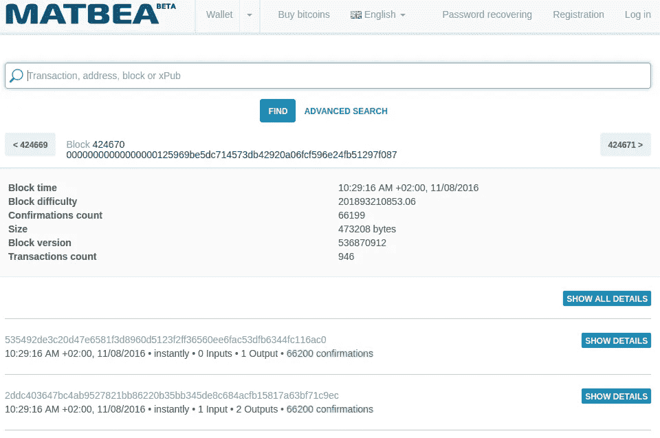
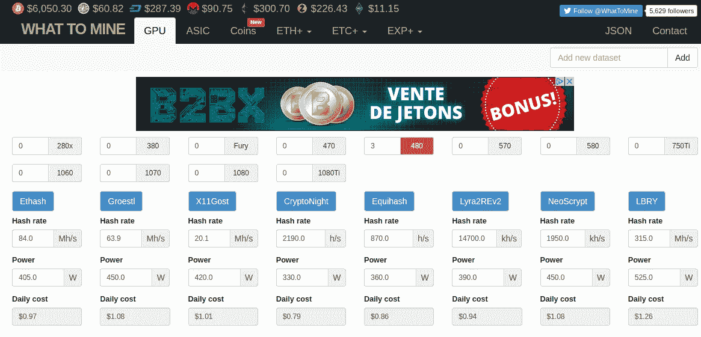
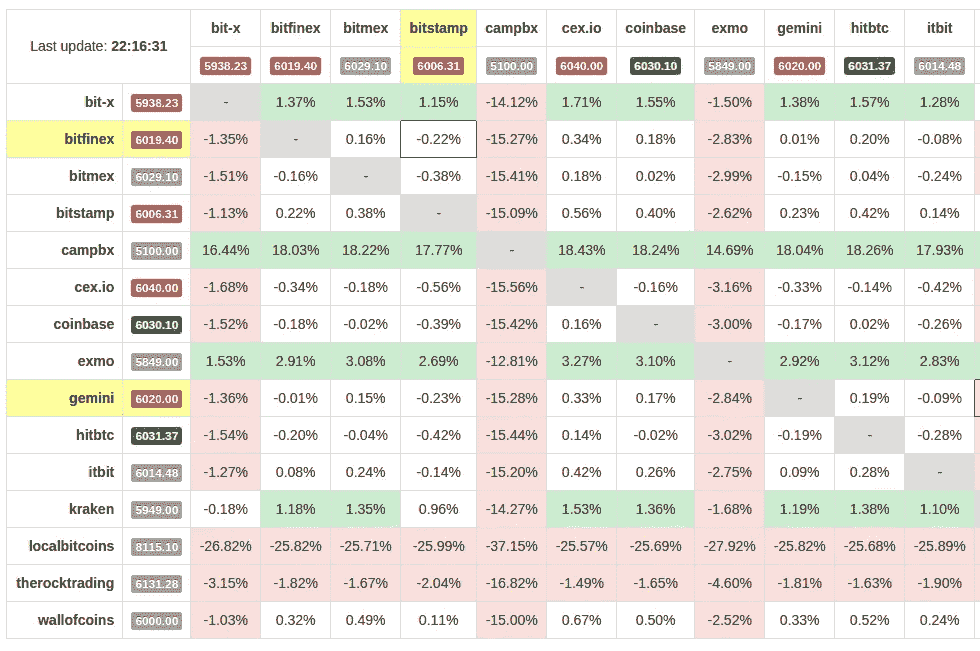

# 对所有加密货币爱好者有用的 7 项服务[更新]

> 原文：<https://medium.com/hackernoon/useful-services-for-all-cryptocurrency-enthusiasts-ad1f741a3a3>

在本文中，我将列出一些有趣而有用的服务，帮助您在购买加密货币、从仲裁中获利、选择加密货币进行开采或投资时降低费用。

# [LiveMarketCap](https://livemarketcap.com/) —追踪加密市场的最简单方法

LiveMarketCap.com[提供所有活跃加密货币的实时排名。这是一项新服务，提供最新的加密货币新闻、市场价格、图表和分析。还有一些重要的指标，如加密货币通胀和复合月增长率(CMGT)。](https://livemarketcap.com/)

在我看来，它是 CoinMarketCap 的更好的替代品，因为它有来自不同来源的最新消息，一些新的指标，而且(对我来说最重要的优势)它是 100%手机友好的。

# [Matbea](https://matbea.net/)——这项服务可以让你找出谁是比特币的前主人

使用 [Matbea](https://matbea.net/) 可以追踪比特币交易，找出地址所有者:是交易所平台、公司还是自然人。这是第一次像这样的免费服务。

据该网站称，他们认识超过 87 00 万个比特币地址的所有者，包括大公司和交易平台。例如，比特币基地(5 325 000 个地址)、Xapo (1 075 000 个地址)、Poloniex (715 000 个地址)、Localbitcoins (1 075 个地址)。

# [位图](http://bitmap.site/) —找到离你最近的比特币自动取款机

比特币 ATM 应用程序(在 iOS 和 Android 上可用)允许您找到比特币或其他加密货币 ATM 位置以及各种替代加密现金兑换服务。

使用这款应用程序，你只需轻触鼠标，就能找到一台买卖比特币的机器。它还能向用户提供机器的照片以及机器安装地点的工作时间。

2017 年 11 月，他们列出了全球约 1500 台自动取款机。

# [最具前景的加密货币](http://whattomine.com/)

这项服务为那些想要挖掘加密货币的人收集有用的数据。使用 [WhatToMine](http://whattomine.com/) ，你可以检查与以太坊或比特币相比，开采所选替代币的利润有多高。

# [比特币价格](http://data.bitcoinity.org/markets/arbitrage/USD) —比特币市场套利表

一项有用的服务，用于跟踪最大的交易平台(Bitfinex、Bitmex、Bitstamp、比特币基地、北海巨妖、Localbitcoins 等)之间有利可图的套利交易。它显示有关交易量、当前价格、波动性和其他有用数据的信息。

因此，你可以在不同的交易所找到最大的差价。这可能会带来一些利润。

**奖金:**

[Coinmap](http://coinmap.org) —不同国家接受加密货币的真实商店地图

[@ livemarketcap](https://twitter.com/livemarketcap)——每 20 分钟发一条关于加密货币的最新消息

你最好的链接是什么？感谢在评论中分享！

> 感谢阅读！如果你喜欢，请鼓掌支持👏👏👏还有分享帖子。欢迎在下面留下你的评论💭。

> ***丹*** *是区块链* ***开发商*******投资方*** *。**
> 
> **他是*[***LiveMarketCap.com***](https://livemarketcap.com)*的 CEO。它提供所有活跃加密货币的实时排名，包括最新的加密货币新闻、市场价格、图表和分析。**
> 
> **有反馈吗？关注 LiveMarketCap 上的* [*推特*](https://twitter.com/livemarketcap) *！👋**