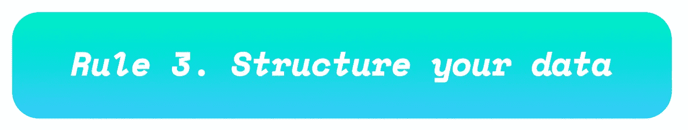

# 用户测试人工智能产品的最佳实践

> 原文：<https://medium.com/hackernoon/user-testing-for-ai-best-practices-a9ae0d54cfe2>

## 青蛙设计公司经验丰富的 UX 设计师、用户研究员和产品设计师的三条规则

> 如果你正在开发任何人工智能产品，你必须进行用户测试。要从用户测试中获得最高质量，请遵循以下三条规则:

> 无论你在测试什么，都必须在上下文中测试。在我在 [frog design](https://www.frogdesign.com/) 的工作中，我们的信仰是以人为中心的[设计](https://hackernoon.com/tagged/design)，所以我们对此非常重视，它保证了令人难以置信的结果。以下是一些上下文示例:

## **1 —测试汽车语音 UI:**

用一个“[驱动器沿着](https://hackernoon.com/tagged/drive-along)来做这件事用户正在驾驶；设计师坐在前排，手里拿着一个脚本，假装是人工智能。

## **2 —测试聊天机器人(1 级):**

在上下文中测试聊天机器人的第一步是简单地给用户发短信。设计师在一个房间里，假扮成人工智能。用户和第二个设计师在另一个房间回应人工智能。用户在大声思考，而设计师在记笔记。

## **3 —测试聊天机器人(2 级):**

一旦您对一般流程有所了解，就开始以更自然的异步方式与用户一起进行测试。允许用户去处理他们的日常生活，让他们随心所欲地与你的 Ai 互动。这里仍然没有一行 NLP 或 Ai 的文字。另一端的 Ai 是设计师。

## **4 —测试家用机器人:**

在家里做这个。找一个与你正在建造的机器人相似的现成机器人，把它带到人们的家中，让他们与它互动。被动观察。给他们任务。如果你有资源，修改机器人，使它更类似于你的设计。

> 在上面的例子中(汽车、聊天机器人和家庭机器人的语音用户界面),有不同的假设和期望，这也是我们在用户交互中所希望的。然而，其中一些约定必须随着时间的推移而展开。为了测试关于事件顺序、关系建立和特性发现的快乐路径的假设，随着时间的推移战略性地进行测试。依赖于时间的交互的一些例子:

**1–功能发现:**您希望从简单缓慢开始，一旦用户掌握了简单的功能，就教他们新的技巧。我们经常为此学习游戏设计。在大多数复杂的视频游戏中，你会经历一个探索按钮如何工作的入门阶段，然后随着时间的推移功能会逐渐显现出来。用户必须一点一点地理解你的心智模型。

**2–建立关系:**这需要时间。在我的工作中，我们经常整理出哪些问题让人觉得是侵犯性的，哪些是肤浅的，所以我们肯定会以正确的顺序问这些问题，这样人工智能就会表现出对社会规范的崇敬和尊重。例如，如果我们开发的聊天机器人是你的朋友，第一天可能会有一些肤浅的“了解你”的问题，为第一周更深层次的问题打下基础。

**3–昼夜节律:**人的情绪在早上和晚上是不一样的。以家庭机器人为例，家庭动态在一天中会发生剧烈变化。如果一个机器人真的要生活在家里，我们必须收集一天、一周、一个月等的数据。

> 用户测试会导致数据泛滥。如何组织由你自己决定，但是如果都是手写的便利贴，就不要指望能很容易地综合起来。一些羽绒和脏工具:

**1–彩色编码电子表格—** 预先写好你所有的信息；用颜色编码系统对它们进行分类；然后复制粘贴到您的文本线程，但也复制粘贴到本地日志。颜色编码系统可以让你立即看到图案，而不必编码或使用任何分析，但它会很快崩溃。当你一次只和少数用户迭代时，这很有用，但是你会很快超越它。

**2—API—**最近我们在东京测试一款应用。大家都用那边的消息应用线。我们使用 LINE 的 API 以编程方式将所有消息推送到一个 html 表中，这样我们就可以在一个地方看到所有不同用户对相同问题的结果。

3- IFTTT —如果是这个，那么就是那个应用。我自己仍在测试，但如果你用的是安卓手机，你可以让短信直接发送到电子表格中。一旦我有了步骤，我会写一篇关于这个主题的单独的“如何做”的文章！

4–基于节点的 facebook 部署和分析–有很多免费的基于节点的 facebook 应用程序。我目前正在研究光谱，我肯定会有后续文章分析其中一些。我喜欢的一个是[chatfuel.com](http://chatfuel.com)(非常快速地启动并运行——现在在上面制作我自己的[垃圾，但没有分析功能)，另一个极端是](https://www.facebook.com/TrashSeeHelpUs/)[http://botanalytics.co/](http://botanalytics.co/)——支持 11 个平台，但你必须在 Node.js 中编码，这与这篇文章的主旨相反。此外，正如所料，谷歌有一些开源的想法。他们是工具 [dialogueFlow](https://dialogflow.com/docs/integrations/facebook) 看起来不错，但我还没有太多的时间。如果你对此有什么看法，请给我发短信！

无论您做什么，都不要期望能够对非结构化的数据进行编码。与开发商交流。与数据科学家交流。在收集数据之前先对其进行结构化！

谢谢！
请👏👏👏喜欢这篇文章就鼓掌，这样别人也能找到！如果你想了解更多，请联系我——我可以应要求参加演讲活动。