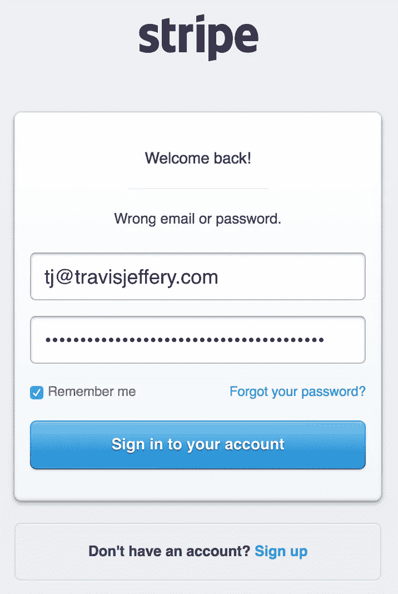
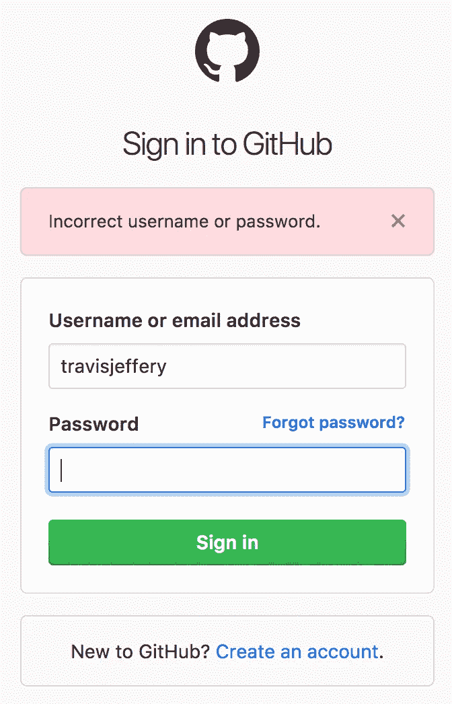
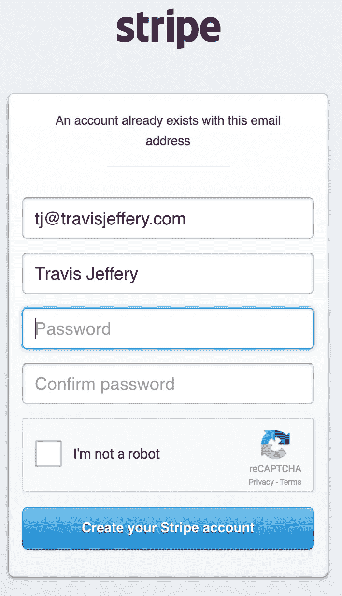
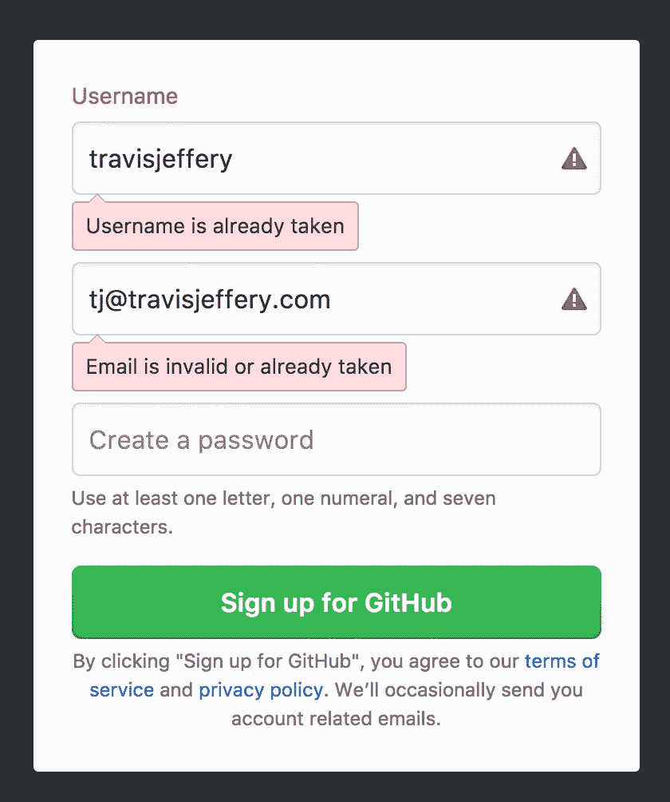

# “用户名或密码不正确”是胡说八道

> 原文：<https://medium.com/hackernoon/username-or-password-is-incorrect-is-bullshit-89985ca2be48>

有一个[安全](https://hackernoon.com/tagged/security)最佳实践，即登录时不应该说“密码不正确”。相反，他们应该说“*用户名*或密码不正确”。这个“最佳实践”就是扯淡。

比如 Stripe 和 GitHub 的登录就遵循了这种做法。

这个想法是，如果攻击者知道一个用户名，他或她可以使用 SQL 注入、暴力破解密码、网络钓鱼等手段集中攻击这个帐户。

问题来了。

Stripe’s sign up page.

Shit, y’all know my username… Guess I’m fucked. Not to mention you could’ve just gone to https://github.com/travisjeffery.

黑客所要做的就是注册以了解用户名是否有效。那为什么还要费心去混淆这个标志呢？只有最笨、最懒的黑客会被“用户名或密码不正确”阻止登录。你得不到安全，但你的客户却失去了清晰。

Stripe 在 reCAPTCHA 后面提交表单，以防止幼稚的脚本攻击他们的注册。然而，这已经被打破了多次( [1](https://www.blackhat.com/docs/asia-16/materials/asia-16-Sivakorn-Im-Not-a-Human-Breaking-the-Google-reCAPTCHA-wp.pdf) ， [2](https://github.com/eastee/rebreakcaptcha) )，很可能永远不会完美。即使 reCAPTCHA 是完美的，黑客也可以通过尝试注册来手动验证他们感兴趣的用户名，然后自动攻击登录页面。

为了防止攻击者知道一个帐户是否存在，你的注册必须只接受一个电子邮件地址，并且无论注册成功与否，在 UI 中不提供任何反馈。相反，用户会收到一封电子邮件说他们已经注册了。攻击者知道一个帐户是否存在的唯一方法是他们是否有权访问目标的电子邮件。

除此之外，“用户名或密码不正确”只是胡说八道。

–

请在 [@travisjeffery](https://twitter.com/travisjeffery) 打个招呼。

击中👏如果你觉得这有用，请分享。

感谢阅读。