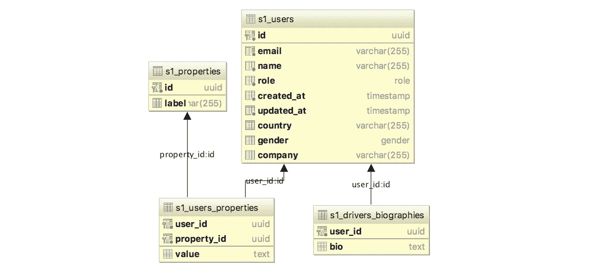
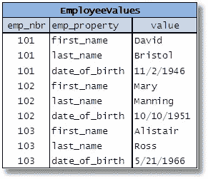

# 用户表变化

> 原文：<https://medium.com/hackernoon/users-table-mutations-209fa19412d6>

## 构建和修改用户表的三种方法

# 摘要

约翰·多伊刚刚开始了一份新工作，在一家类似优步的初创公司担任首席技术官。他将不得不扩大规模、颠覆和创新。但是现在，他需要一个用户表。

*   **第 1 天**:用户是具有 ID、电子邮件、密码、姓名和角色(客户、司机或管理员)的简单实体。
*   第 2 天 : John 给所有用户添加了一个电话号码。
*   **第 3 天**:新的用例，业务在增长。用户需要国家、性别和可选公司。
*   第四天:让我们只给驱动用户添加一个简介。
*   **第 5 天**:一些客户希望将自定义属性添加到他们的客户账户中。

约翰可以用无数种方式满足日常需求。让我们检查其中的 3 个场景(John 选择 PostgreSQL)。

# 第一个场景—大嘴水牛的路径


## 第一天

John 创建了一个包含 6 列的`users`表:**id***(*[*uuid*](https://www.clever-cloud.com/blog/engineering/2015/05/20/why-auto-increment-is-a-terrible-idea/)*，主键)* **电子邮件** *(varchar)* ，**密码** *(varchar)* ，**角色** *(枚举:客户、司机、管理员)* **created_at**

## 第二天

John 修改了`users`表并添加了一个 **phone** 列*(*[*varchar*](http://stackoverflow.com/questions/1846254/mysql-datatype-for-telephone-number-and-address)*，可空)。* **Phone** 可空:第一天创建的用户没有电话号码，John 可能永远也不会知道他们的电话号码。

## 第三天

约翰再次修改了`users`表，增加了**国家** *(varchar，nullable)* ，**性别** *(enum，nullable)* ，**公司** *(varchar，*[*nullable*](http://stackoverflow.com/a/1583691/978690)*)。*

## 第四天

传记只针对司机。至少有两种可能性:

1.  创建一个*可空的* **bio** *text* 列(对于非驱动程序为空)
2.  因为它仅用于驱动程序，所以创建一个`drivers_biographies`表，在`users`上有 FK，在**列有个人简介** *和文本*列。

每种可能性都有其利弊，John 选择添加一个新表，因为他不喜欢有太多的空值，并且他确信他永远不会向其他帐户类型添加传记。也许他错了。

## 第五天

客户现在可以要求他们的用户自定义字段。所以是某种*动态变量属性。* John *可以*根据需要在其 users 表上添加可空的新列(客户端请求用户的宠物名，John 添加了一个 pet_name 列)。但是对他来说这听起来不可扩展，也许他错了。

所以，他决定创建两个新表:`properties`和`users_properties`。`properties`表有两列:

*   **id**(uuid)
*   **标签** *(varchar)* 例如:“宠物名”

`users_properties`有 3 列:

*   **user_id** *(外键在* `*users*` *表上)*
*   **property _ id**(*`*users_properties*`*表*上的【外键】 )例:昵称的 id*
*   ***值** *(呃……什么？看情况。我猜是短信吧？！)**

*现在，每次客户请求其用户的新属性时，John 的应用程序都会在`properties`表中添加一个新条目。然后，对于每个具有自定义属性的新用户，在 users_properties 表中为其自己的属性添加一些行([类似 EAV 的](https://en.wikipedia.org/wiki/Entity%E2%80%93attribute%E2%80%93value_model)模式)。*

## *验尸 Mary Foobar 分析*

*这种方法似乎存在一些问题:*

*   ***公司**是可选列，大部分时间为空。现在只有一个，但是第 12 天呢？*
*   *`drivers_biographies`是一对一表，这就大材小用了。*
*   *将用户的数据混合在两个表中是一团乱麻。为什么有些字段(**公司**，**性别**)在`users`表中，而有些字段(**手机**，**宠物名**)在`users_properties`表中(模式不同)？John 的数据库架构可能被认为是不一致的。*
*   *向用户查询其属性将比平常更困难。*
*   *映射到对象(假设 John 使用这种东西)也会很复杂。*
*   *第 5 天有 4 个表，仅用于描述用户。*
*   *在`users`表中的每一个新列都必须是可空的:这些列是在第一次插入用户之后**添加的，这些用户没有值。***

**

*Quick and dirty implementation of the Bigmouth Buffalo’s Path.*

*也许约翰可以建造一个更好的建筑。*

# *第二个场景——蓝鱼的路径*

**

## *第一天*

*约翰很有远见。在水牛嘴的路径上，他创建了一个`users`表，表中有 **id** *、* **电子邮件**、**密码**和**角色** *。但是他也立即创建了一个`users_properties`表([实体-属性-值](https://en.wikipedia.org/wiki/Entity%E2%80%93attribute%E2%80%93value_model)模型)，类似于 [Wordpress](http://web-profile.net/wp-content/uploads/wordpress_db_schema.png) 方法。`users_properties`是一个包含 **user_id** (用户表*上的*外键)、 **key** ( *varchar)的表，例如:姓名、公司、电话等。*)，以及**值** ( *正文*)。**

## *第二、三、四、五天*

*John 很放松，他不需要改变它的表模式。它的程序只是在数据库中添加新用户和他们的新属性。他创建了一个管理面板来快速添加新的属性。*

## *验尸-玛丽·福巴分析*

*与以前的设计相比，有一个好处。解释和理解起来很简单，每个属性都位于一个唯一的表中。EAV 是一个众所周知的模式，即使约翰没有听说过，他也会自己发明它。描述用户元数据的表只有两个，不会再多了。但是也有一些警告:*

*   *简单的查询变得[复杂和不可读](http://www.antradar.com/blog-wordpress-and-the-curse-of-eav)，而传统的表只有一个属性列。`SELECT name FROM users WHERE age=50 AND gender='f'`变成了:*

```
*SELECT 
  name.meta_value AS name, 
FROM 
  users_properties age, 
  users_properties name, 
  users_properties gender
WHERE age.key = ’age’ 
AND age.value = ’50'
AND age.user_id = name.user_id
AND gender.user_id = age.user_id
AND gender.key = ’gender’ and gender.value = ’f’*
```

*   *这张表用肉眼看不清楚。SQL 是关于行和列的，这个模型被 EAV 破坏了。*

**

*Unreadable random table found on Google Images*

*   *重复数据更难检测，没有数据类型，没有数据层次，没有一致性，[等等。](http://dba.stackexchange.com/a/20763/68831)*

# *第三种情况—虹鳟鱼的路径*

**

## *第一天*

*和许多人一样，约翰几年前就对《NoSQL》产生了兴趣。他尝试并抛弃了 MongoDB，回到了它的初恋 PostgreSQL。他记得感觉无模式数据在某些情况下会有好处，特别是在可变的元数据中。所以这一次，John 用 **id** *，* **电子邮件**，**密码**，**角色**，**元数据**(*JSONB*)**created _ at**和 **updated_at** 创建了一个`users`表。它的元数据列是无模式的，他可以存储这样的对象:*

```
*{"phone": "+33612345678", "company": "My company", "gender": "f"}*
```

## *第二、三、四、五天*

*表模式不变。*

## *验尸-玛丽·福巴分析*

*与以前的路径相比，这种设计有一些好处:*

*   *仅用一个表来描述一个实体:用户。*
*   *查询很容易写:`select * from users where metadata->'age'=50`*
*   *每个用户在一行中读取数据很容易(平心而论，JSON 部分如果增长就有点难读了)。*
*   *对于用户定义的字段，避免使用 EAV。*

*也有一些警告:*

*   *John 应该记得在元数据上添加一个 [GIN 索引](https://www.postgresql.org/docs/current/static/gin.html)。*
*   *John 不应该在元数据中添加关系。对于 JSONB 列，很容易在该列中添加所有内容。如果 John 添加一个新实体，他必须创建一个新表，而不是添加一个子属性，如:*

```
*{ "bookings": [
  { "id": "aaa-bb-cc", "date": "2017–01–12", "duration": "10 days"},
  { "id": "xxx-yy-zz", "date": "2017–02–10", "duration": "1 day"},
]}*
```

# *最后的想法*

*在我的修补职业生涯中，我按照这三条路径(不完全是，但很相似)和其他一些路径创建了`users`表:我们可以考虑动态添加列和表，为另一个 DBMS 改变，等等。在过去的几个月里，我一直遵循第三条道路。我确信没有正确的方法，这条路也有许多隐藏的警告(我应该多读一些),但是对于我的日常工作来说，我可以接受。我通过删除元数据表，将一个包含 60 多个无用表的遗留系统迁移到了大约 10 个表。不确定反正是不是更好，我也不是说表越少越好，但是在这个特定的情况下，我觉得代码和数据库更容易读取、创建、更新和删除。我知道几个月后我会发现一条新的道路，并为我所做的感到羞愧。*

*   *虹鳟鱼的路径对用户表来说是可以的，我不认为每次都在每个表上到处添加 JSONB 是个好主意。仅存储元数据可能会有所帮助。**没有关系。***
*   *我没有谈到索引，这不是问题，但请到处使用索引。*
*   *我只谈了 PostgreSQL，也许 SQL 不是建立用户数据库的东西。*
*   *我仍然很惊讶，这么多年过去了，我竟然没有找到一个明显的建立用户表的最佳方法。我错过了什么吗？*

*请随意提出建议、反馈和批评。我很乐意了解更多。*

**

*Sorry for long post, here is a potato*

*[](http://bit.ly/HackernoonFB)**[](https://goo.gl/k7XYbx)**[](https://goo.gl/4ofytp)*

> *[黑客中午](http://bit.ly/Hackernoon)是黑客如何开始他们的下午。我们是 [@AMI](http://bit.ly/atAMIatAMI) 家庭的一员。我们现在[接受投稿](http://bit.ly/hackernoonsubmission)，并乐意[讨论广告&赞助](mailto:partners@amipublications.com)机会。*
> 
> *如果你喜欢这个故事，我们推荐你阅读我们的[最新科技故事](http://bit.ly/hackernoonlatestt)和[趋势科技故事](https://hackernoon.com/trending)。直到下一次，不要把世界的现实想当然！*

**