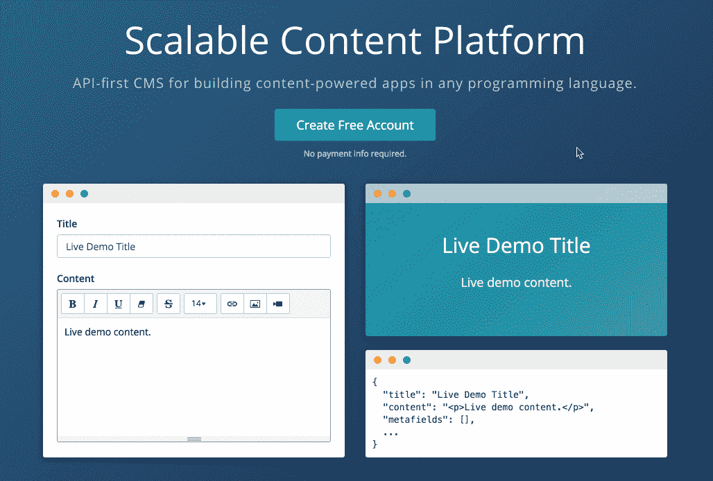
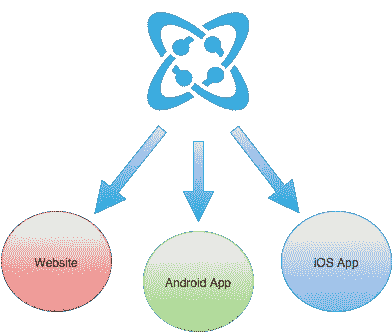

# 使用内容交付 API

> 原文：<https://medium.com/hackernoon/using-a-content-delivery-api-could-save-you-50-or-more-on-your-publishing-headaches-f335d62a6d0>

Publish it once. Deliver it globally.

# 生产，满足分配

许多企业可以分为两个主要部分:生产和销售。内容没什么不同。许多机构和营销部门正在生成大量内容，然后采取将所述内容插入到一个盒子中的历史路线，这是一种传统的安装内容管理系统。你的 WordPress 系统中的媒体库变得庞大和停滞不前，你最好将这些图像、文件和媒体保存到其他地方，因为 WordPress 是一个盒子，媒体在任何其他情况下都不可用。

你已经把生产搞下来了，让我们把销售搞下来吧。旧的思维方式会认为，制作的内容需要输入一个 CMS，以分发到网页或网站，而其他内容需要缩减，以发送到移动应用开发机构，以输入 iOS 和 Android 应用。当您在更大的内容管理堆栈中对微服务应用进行分层时，需要根据数字属性调整图像的大小，并且必须为新的应用集成重新构建为特定 web 应用构建的一次性 API。这是新的模型——构建您的应用程序。管理您的应用。你所需要的只是你的 GitHub Repo 和一个宇宙 JS 账户。

使用[内容交付 API](https://cosmicjs.com/) 有助于实现更加敏捷的开发周期、内容管理和迭代，以及交付、展示和与微服务应用堆栈中其他所需项目集成的终极灵活性，而基于云的 CMS 非常适合这一点。

# 在全球范围内提供内容非常简单:

1.标题
2。内容
3。出版

# 通过 CMS API 向全球交付内容

> 使用像 [Cosmic JS](https://cosmicjs.com/) 这样的[内容交付 JSON API](https://cosmicjs.com/) 可以解决很多耗时的问题。让我们在这里解决几个问题。

1.Cosmic JS 将内容存储为 JSON 对象，使其可以被任何联网设备在全球范围内读取
2。它的工作原理是将内容从代码中分离出来，允许您的内容被输入到任何应用程序中，而不管您是用哪种编程语言构建的。
3。像 WordPress 这样的系统将要求应用程序开发人员使用 PHP，而 Cosmic JS 通过让他们使用诸如 [Node.js、ReactJS、Vue.js、AngularJS、ReactNative](https://cosmicjs.com/apps) 等语言构建应用程序，让开发人员眼花缭乱。
4。内容编辑者可以体验一个构建良好的现代框架应用程序，他们仍然可以管理动态内容。
5。 [Cosmic JS](https://cosmicjs.com/) 作为一个[内容管理系统](https://cosmicjs.com/)，一个内容交付 API 以及一个服务器，通过托管媒体在任何给定的时间重新调整用途。借助 Imgix 图像处理等增值平台项目，为各种微服务应用提供媒体服务的灵活性变得轻而易举，并且比过去的开发周期耗时少得多。
6。Cosmic JS 是轻量级的，不需要安全更新，并且拥有四种用户权限:管理员、开发者、编辑和贡献者。
7。Cosmic JS 提供了额外的功能，如[本地化、Webhooks、一键式 SSL](https://cosmicjs.com/features) ，并且是可移植的、可扩展的和可重用的——您甚至可以将您的 bucket 下载到 bucket.json 文件中并随身携带。

如果你还没有，那就从[报名](https://cosmicjs.com/signup)参加[宇宙 JS](https://cosmicjs.com/) 开始吧。下面提供了有用的资源来简化您的开发操作。

> [宇宙 JS 网站](https://cosmicjs.com/)
> [宇宙 JS 博客](https://cosmicjs.com/blog)
> [宇宙 JS GitHub](https://github.com/cosmicjs)
> [宇宙 JS 应用](https://cosmicjs.com/apps)

[Cosmic JS](https://cosmicjs.com/) 是一个 API 首创的基于云的内容管理平台，可以轻松管理应用和内容。如果你对 Cosmic JS API 有任何疑问，请通过 [Twitter](https://twitter.com/cosmic_js) 或 [Slack](https://cosmicjs.com/community) 联系创始人。

[卡森·吉本斯](https://twitter.com/carsoncgibbons)是[宇宙 JS](https://cosmicjs.com/) 的联合创始人& CMO，宇宙 JS 是一个 API 第一的基于云的[内容管理平台](https://cosmicjs.com/)，它将内容与代码分离，允许开发者用他们想要的任何编程语言构建流畅的应用和网站。

> [黑客中午](http://bit.ly/Hackernoon)是黑客如何开始他们的下午。我们是 AMI 家庭的一员。我们现在[接受投稿](http://bit.ly/hackernoonsubmission)并乐意[讨论广告&赞助](mailto:partners@amipublications.com)机会。
> 
> 如果你喜欢这个故事，我们推荐你阅读我们的[最新科技故事](http://bit.ly/hackernoonlatestt)和[趋势科技故事](https://hackernoon.com/trending)。直到下一次，不要把世界的现实想当然！

