# 在 AWS 上运行免费的 VPN 服务器

> 原文：<https://medium.com/hackernoon/using-a-vpn-server-to-connect-to-your-aws-vpc-for-just-the-cost-of-an-ec2-nano-instance-3c81269c71c2>

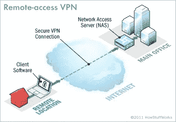

Source: [http://computer.howstuffworks.com/vpn3.htm](http://computer.howstuffworks.com/vpn3.htm)

AWS 在其核心服务中内置了一个令人敬畏的防火墙，可以很容易地用来确保只有某些端口对外界开放。我们可以采取的一个额外步骤是运行一个 VPN 服务器，作为我们受保护的 EC2 实例的网关。然后，我们可以关闭对 EC2 实例的直接 SSH 访问，还可以通过撤销对 VPN 服务器的访问来自由阻止对整个网络的访问。如果需要撤销前雇员的访问权限，后者非常有用。

下面的教程将带您完成设置 EC2 实例的步骤，该实例将运行 OpenVPN 服务器。然后将介绍如何通过 VPN 服务器授予和撤销访问权限。

## 步骤 1—创建 VPN 安全组

概述:安全组允许您的服务器在私有云中相互通信，同时向外界公开特定端口。我们将创建一个安全组，以允许 VPN 访问我们的 VPN 服务器。我们将假设您的所有其他 EC2 实例都是默认安全组的成员，并且默认安全组不允许来自外界的访问。

在[https://aws.amazon.com](https://aws.amazon.com)登录，在搜索框中键入 EC2，然后点击目标进入 EC2 仪表板。

从 EC2 仪表板中，单击*安全组*

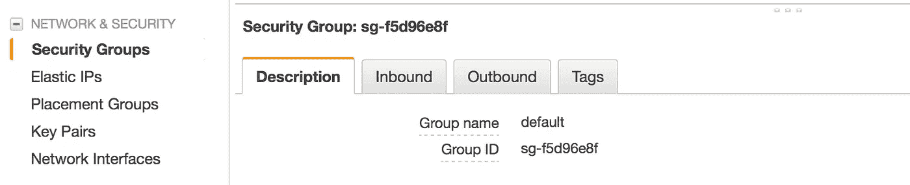

点击*创建安全组*

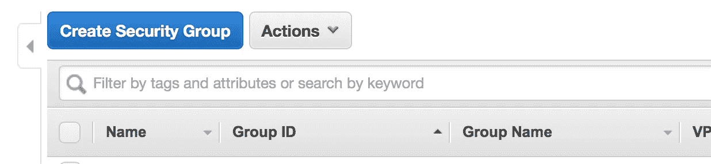

输入 *vpn* 的名称和描述，并指定端口 22、443、943 和 1194 上的入站规则。注意:端口 1194 的协议是 UDP。

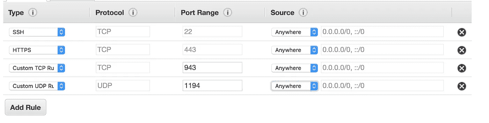

注意:如果您的团队使用的 IP 地址是静态的，那么您可以通过在您的规则的*源*中指定 IP 地址范围来添加另一层安全性。但是，如果您希望您的团队能够从不同的 IP 进行连接，因为他们可能在酒店、家中、咖啡馆等地工作，那么您会希望将*源*留空…

## 步骤 2 —创建 EC2 实例

返回 EC2 仪表板，然后点击*启动实例*

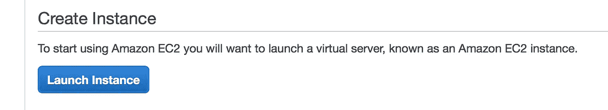

选择 Ubuntu(你当然可以选择几乎任何其他运行 OpenVPN 的操作系统，但本教程是为 Ubuntu 量身定制的)


选择 *t2.nano* 点击*查看并启动*


在下一个屏幕上，点击*编辑安全组*

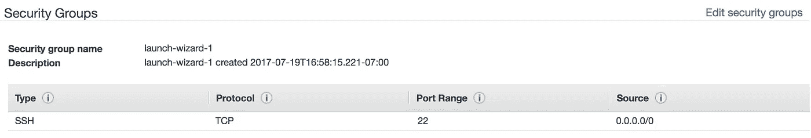

选择 *vpn* 和*默认*安全组，点击*审核并启动*

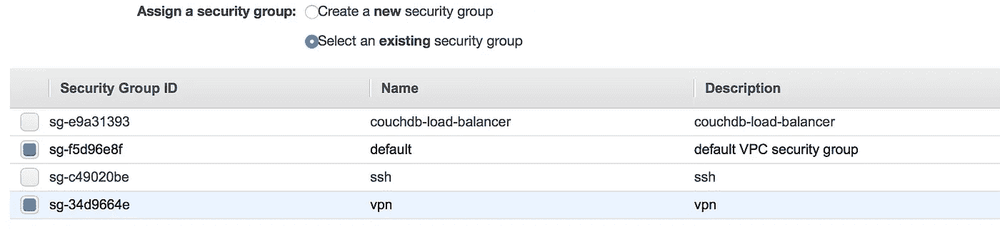

点击*启动，*选择您的密钥对，然后点击*启动实例*

## 步骤 3 —禁用源/目标检查

从实例列表中，选择 VPN 实例，然后选择*网络- >更改源/目标。从下拉菜单中选择*。然后点击*是，禁用*。这是必需的，否则，您的 VPN 服务器将无法连接到您的其他 EC2 实例。

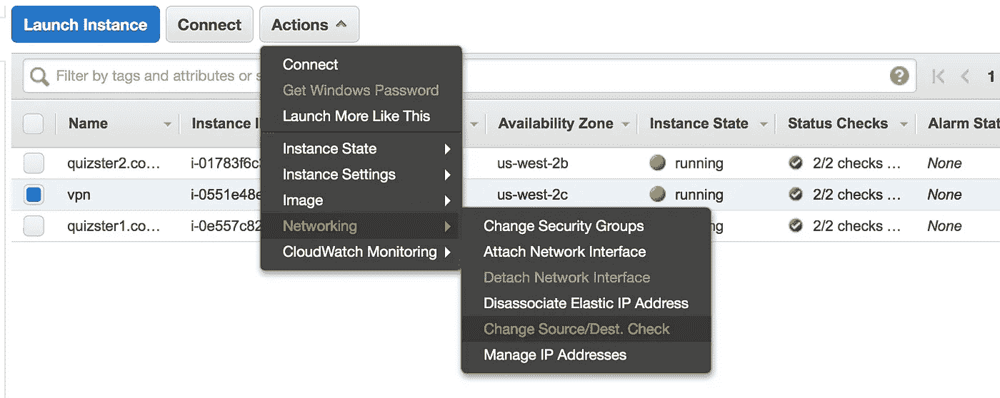

## 步骤 4—创建一个弹性 IP 地址

概述:当 EC2 实例停止并重新启动时，公共 IP 地址会发生变化。我们希望 VPN 服务器的 IP 地址保持静态，因此我们将使用弹性 IP 地址。

从 E2c 仪表板中，选择*弹性 IPs*

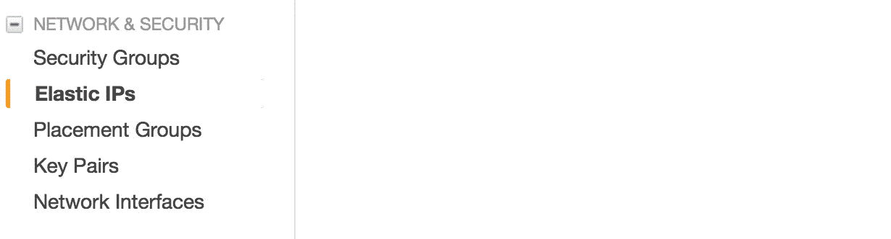

点击*分配新地址*

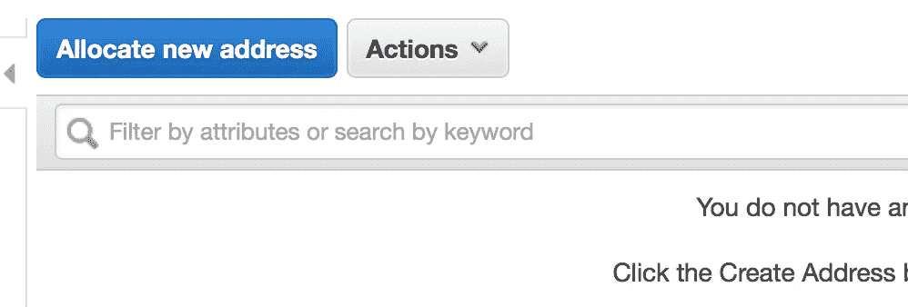

点击*分配*然后*关闭。*

记下您的弹性 IP 地址，因为这将是您的 VPN 服务器的公共 IP 地址。

然后选择弹性 IP，并从下拉菜单中单击*关联地址*。

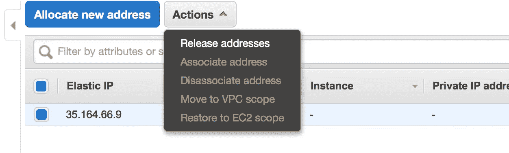

选择您刚刚创建的 EC2 实例并点击*关联*。

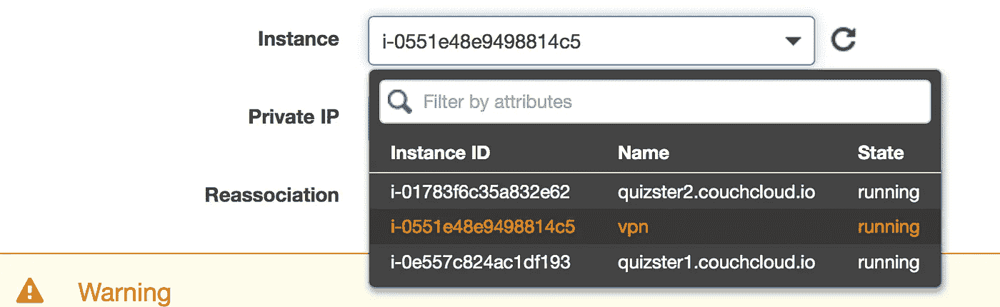

## 步骤 5—安装并配置 OpenVPN 服务器

SSH 到您的 VPN 服务器:

```
$ ssh ubuntu@PUBLIC-IP-OF-VPN-SERVER
```

下载我们的助手脚本并设置默认配置:

```
$ git clone [https://github.com/redgeoff/openvpn-server-vagrant](https://github.com/redgeoff/openvpn-server-vagrant)
$ cd [openvpn-server-vagrant](https://github.com/redgeoff/openvpn-server-vagrant)
$ cp config-default.sh config.sh
```

编辑 config.sh 并输入您的配置。注意:PUBLIC_IP 应该等于您在上面创建的弹性 IP 地址。

```
$ nano config.sh
```

切换到根目录

```
$ sudo su -
```

更新 Ubuntu，安装 OpenVPN。注意:系统会提示您两次，当您提示时，选择*保留当前安装的本地版本*

```
$ /home/ubuntu/openvpn-server-vagrant/ubuntu.sh 
$ /home/ubuntu/openvpn-server-vagrant/openvpn.sh
```

此时，OpenVPN 服务器正在运行。

## 步骤 6-添加路线

必须将路由添加到服务器，以便您小组的客户端知道将哪些流量路由到 VPN 服务器。

您可以通过返回到 EC2 实例列表，单击一个目标实例并识别私有 IP 来确定正确的子网。


您的网络将是私有 IP 的前两部分，后面加零，例如 172.31.0.0

在 VPN 服务器上编辑*/etc/openvpn/Server . conf*并添加如下内容:

```
push "route 172.31.0.0 255.255.0.0"
```

然后使用以下命令重新启动 VPN 服务器:

```
$ systemctl restart openvpn@server
```

## 步骤 7—授予对您的 VPN 的访问权限

注意:我们假设您仍然通过 SSH 登录到 VPN，并以 root 用户身份登录。

运行以下命令，并确保将下面的*客户端*替换为您的用户/客户端的唯一名称。

```
$ /home/ubuntu/openvpn-server-vagrant/add-client.sh client
```

然后，您将在以下位置找到配置文件

```
~/client-configs/files/client-name.ovpn
```

您需要将此文件提供给团队中将要连接到您的 VPN 的个人。SCP 下载这个很方便。来自 vpn 服务器的 ovpn 文件。

您的团队可以使用各种 VPN 客户端，如 [Tunnelblick](https://tunnelblick.net/) (OS X)和 [OpenVPN](https://openvpn.net/index.php/open-source/downloads.html) (Linux、iOS、Android 和 Windows)。安装其中一个客户端后，他们应该可以通过双击来设置 VPN 配置。ovpn 文件。

注意:一旦连接到 VPN，您的用户将希望使用您的 EC2 实例的私有 IP。您可能希望使用 Route 53 来创建路由到私有 IP 的子域记录。

## 步骤 8—撤销对您的 VPN 的访问

注意:我们假设您仍然通过 SSH 登录到 VPN，并以 root 用户身份登录。

运行以下命令，并确保将下面的*客户端*替换为您的用户/客户端的唯一名称。

```
$ /home/ubuntu/openvpn-server-vagrant/revoke-full.sh client
```

## 解决纷争

1.  如果您的 VPN 客户端报告一个 *TLS 握手失败*错误，那么这很可能是因为您的 VPN 安全组(步骤 1)不正确。确保您指定了正确的端口和协议，一个常见的问题是没有为端口 1194 指定 UDP。

# 关于作者

杰夫·考克斯是 [MSON](https://github.com/redgeoff/mson) 的创造者，这是一种新的声明式编程语言，它将允许任何人可视化地开发软件。他喜欢承担雄心勃勃但令妻子抓狂的项目，比如[创建数据库](https://github.com/delta-db/deltadb)和[分布式数据同步系统](https://github.com/redgeoff/spiegel)。你可以在 redgeoff.com[或联系他](https://redgeoff.com) [@CoxGeoffrey](https://twitter.com/coxgeoffrey) 或在 github 阅读他的更多帖子。