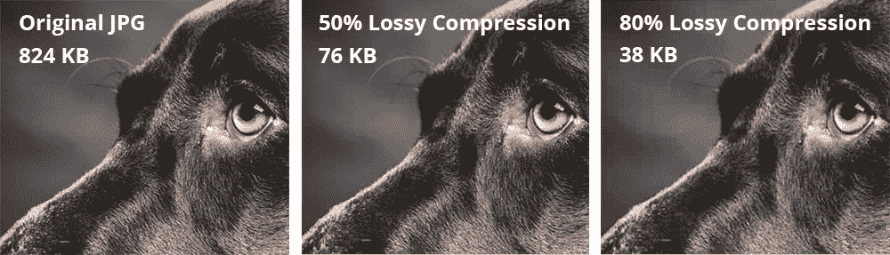
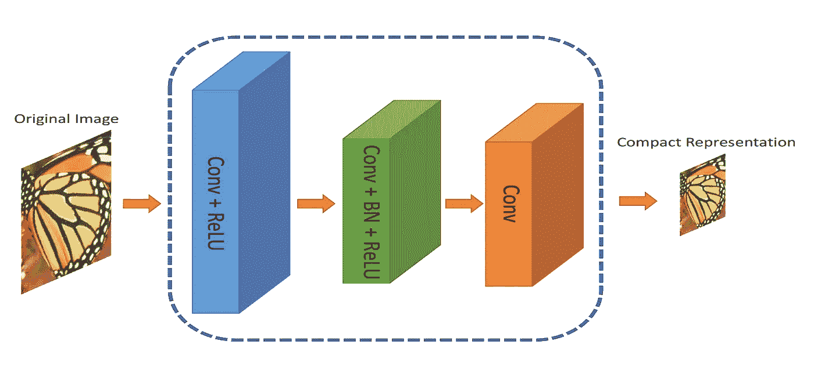
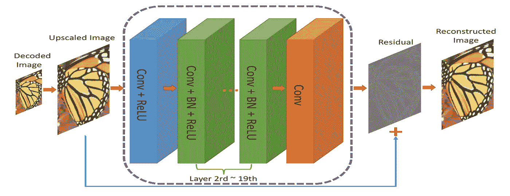
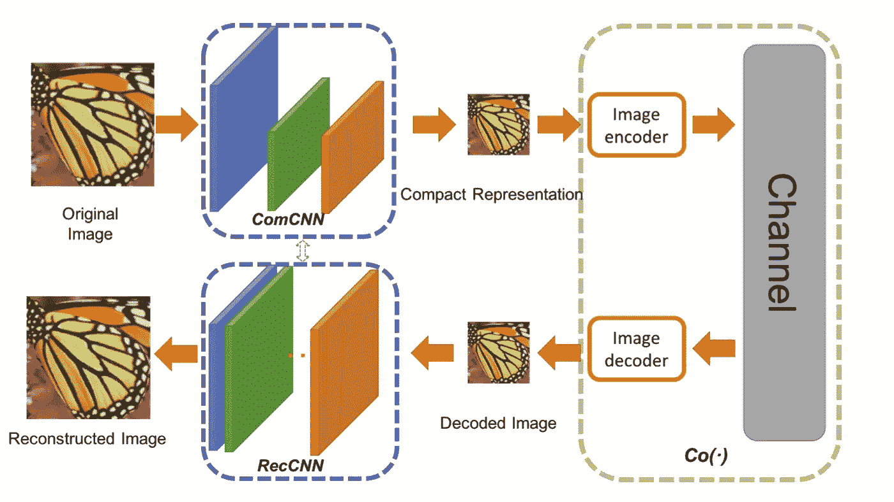
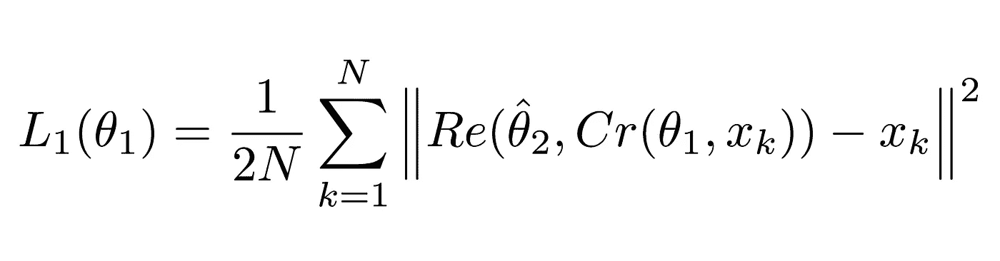
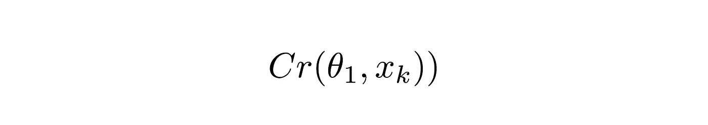
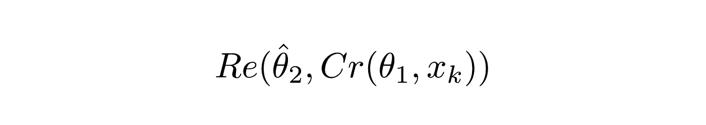
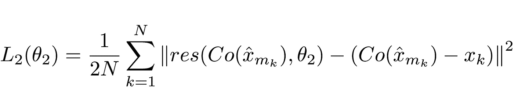

# 用人工智能超级压缩图像

> 原文：<https://medium.com/hackernoon/using-ai-to-super-compress-images-5a948cf09489>

像神经网络这样的数据驱动算法已经风靡全球。他们最近的激增是由几个因素造成的，包括廉价而强大的硬件，以及大量的数据。当涉及到像图像识别、自然语言理解等“认知”任务时，神经网络是当前最先进的。，但他们不必局限于这样的任务。在这篇文章中，我将讨论一种使用神经网络来压缩图像的方法，从而以相当快的速度实现图像压缩的艺术表现。

*本文基于* [*一种基于卷积神经网络*](https://arxiv.org/pdf/1708.00838v1.pdf) 的端到端压缩框架

本文假设对神经网络有所了解，包括**卷积**和**损失函数**。

# 什么是图像压缩？

图像压缩是转换图像以使其占用更少空间的过程。简单地存储图像会占用大量空间，因此有一些编解码器，如 JPEG 和 PNG，旨在减小原始图像的大小。

## 有损压缩与无损压缩

图像压缩有两种:**无损**和**有损。**顾名思义，在无损压缩中，可以恢复原始图像的所有数据，而在有损压缩中，一些数据会在转换过程中丢失。

例如，JPG 是一种有损算法，而 PNG 是一种无损算法

Figure 1.0: Comparison between lossless and lossy compression

请注意右边的图像有许多块状的 artifiacts。这就是信息丢失的方式。颜色相似的邻近像素被压缩为一个区域，这样可以节省空间，但也会丢失关于实际像素的信息。当然，JGEG、PNG 等编解码器使用的实际算法要复杂得多，但这是有损压缩的一个很好的直观示例。Losless 很好，但它最终会占用大量磁盘空间。

有更好的方法来压缩图像而不会丢失太多信息，但它们非常慢，并且许多方法使用迭代方法，这意味着它们不能在多个 CPU 核心或 GPU 上并行运行。这使得它们在日常使用中非常不实用。

# 进入卷积神经网络

如果有什么需要计算并且可以近似，就扔一个神经[网络](https://hackernoon.com/tagged/network)过去。作者使用了一个相当标准的卷积神经网络来提高图像压缩。他们的方法不仅可以与“更好的方法”相媲美(如果不是更好的话)，还可以利用并行计算，从而大幅提高速度。

背后的原因是卷积神经网络(CNN)非常擅长从图像中提取空间信息，然后以更紧凑的形式表示(例如，只存储图像的“重要”位)。作者希望利用 CNN 的这种能力来更好地呈现图像。

# 建筑

作者提出了一个双重网络。第一个网络，它将获取图像并生成一个紧凑的表示(ComCNN)。该网络的输出将由标准编解码器(例如 JPEG)处理。通过编解码器后，图像将被传递到第二个网络，该网络将“修复”来自编解码器的图像，尝试恢复原始图像。作者称之为重建 CNN (RecCNN)。这两个网络都是迭代训练的，类似于 GAN。

Figure 2.0 : ComCNN The compact representation is passed on to a standard codec

Figure 2.1 RecCNN. The output from ComCNN is upscaled and passed to RecCNN, which will attempt to learn a residual

编解码器的输出被放大，然后传递给 RecCNN。RecCNN 将尝试输出看起来尽可能与原始图像相似的图像。

Figure 2.2\. End to end framework to compress images. Co(.) represents an image compression algorithm. The authors used JPEG , JPEG2000, and BPG.

# 残余是什么？

残差可以被认为是“改善”编解码器解码的图像的后处理步骤。神经网络拥有大量关于世界的“信息”，可以做出关于“修复”什么的认知决策。这个想法是基于剩余[学习](https://hackernoon.com/tagged/learning)，你可以在这里深入阅读[。](https://arxiv.org/pdf/1708.00838v1.pdf)

# 损失函数

因为有两个网络，所以使用两个损失函数。第一个，对美国有线电视新闻网来说，标为 L1 的定义是:

Equation 1.0 Loss function for ComCNN

## 说明

这个等式可能看起来很复杂，但它实际上是标准(均方误差) **MSE** 。|| s 表示它们所包含的向量的“范数”。

Equation 1.1

Cr 表示 ComCNN 的输出。θ表示 ComCNN 的可训练参数，Xk 表示输入图像

Equestion 1.2

Re()表示 RecCNN。这个等式只是将等式 1.1 的值传递给 RecCNN。θ hat 表示 RecCNN 的可训练参数(hat 表示参数是固定的)

## 直观定义

等式 1.0 将使 ComCNN 修改其权重，使得在由 RecCNN 重新创建之后，最终图像将看起来尽可能接近真实的输入图像。

RecCNN 的第二个损失函数定义为:

Equation 2.0

## 说明

同样，该函数可能看起来复杂，但它是一个最标准的神经网络损失函数(MSE)。

Equation 2.1

Co()表示编解码器的输出。x 表示 ComCNN 的输出。θ2 表示 RecCNN 的可训练参数。res()只是代表网络已经学习到的残差。它只是 RecCNN 的输出。值得注意的是，RecCNN 是在 Co()和输入图像之间的差异上训练的，而不是直接来自输入图像。

## 直观定义

等式 2.0 将使 RecCNN 修改其权重，使得其输出看起来尽可能接近原始图像。

# 培训计划

模型被迭代训练，类似于 [GANs](https://hackernoon.com/can-creative-adversarial-network-explained-1e31aea1dfe8) 被训练的方式。一个模型的权重固定，而另一个模型的权重更新，然后另一个模型的权重固定，而第一个模型被训练。

# 基准

作者将他们的方法与现有方法进行了比较，包括简单的编解码器。他们的方法比其他方法执行得更好，同时在有能力的硬件上使用时保持高速。作者尝试只使用其中一个网络，他们注意到性能有所下降。

Figure3.0 SSIM(Structural Similarity index) Comparison. Higher values indicate better similarity to original. The authors’ work are in bold.

# 结论

我们研究了一种应用深度学习压缩图像的新方法。我们讨论了除了图像分类和语言处理等“常见”任务之外，将神经网络用于其他任务的可能性。这种方法不仅是最好的，而且可以以更快的速度处理图像。

如果你发现这篇文章的用途，请❤或👏🏻为了它。它对我来说意味着一切。如果您有任何改进、建议，或者希望我报道您认为有趣的出版物，请随时回复本文！。