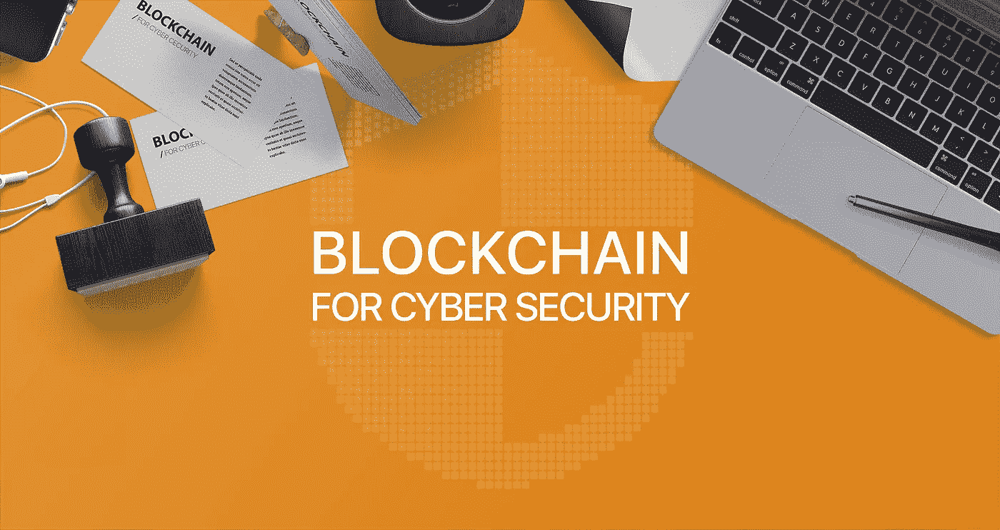
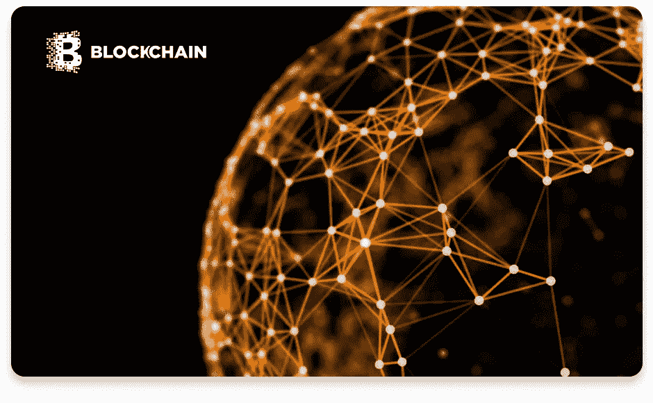
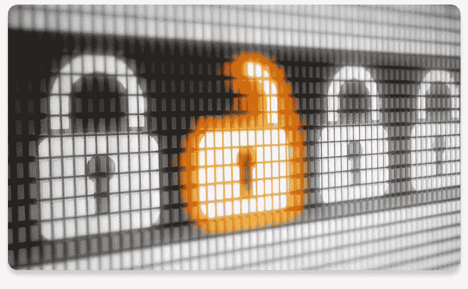

# 利用区块链技术提升网络安全

> 原文：<https://medium.com/hackernoon/using-blockchain-technology-to-boost-cyber-security-19b6ef4e6898>

在过去几年中，安全地在网络世界中导航已经成为一个真正的问题，看看最近世界各地的一些黑客攻击有多么激烈和复杂，似乎事情注定只会变得更糟。

尽管黑客的黑客技术越来越好，但对付他们的方法也在快速改进。事实上，我们已经有了一种几乎无法渗透的技术，称为[区块链](http://steelkiwi.com/blog/blockchain-what-are-they-and-how-it-can-be-used/)，它可以用来保护我们的数据免受网络攻击，并提高各行业的网络安全。

本文概述了区块链如何提高任何企业的在线安全性，确保数据不会被损坏、窃取或丢失。

## 区块链技术 101

区块链技术已经存在了不到十年，最初是作为一种存储和/或发送第一种加密货币[比特币](https://bitcoin.org/bitcoin.pdf)的方式引入的。然而，随着该技术逐渐在全球范围内传播，人们已经开始在众多行业中以各种方式使用它，包括作为提高网络安全的一种手段。

## 什么是区块链？

区块链是一种分布式网络，可以拥有遍布全球的数百万用户。每个用户都可以向区块链添加信息，区块链中的所有数据都通过[密码术](https://www.khanacademy.org/computing/computer-science/cryptography/crypt/v/intro-to-cryptography)得到保护。网络的每个其他成员负责验证添加到区块链的数据是真实的。这是通过一个由三个密钥(私人密钥、公共密钥和接收者密钥)组成的系统来完成的，该系统允许成员检查数据的真实性，同时确认数据来自谁。

## 区块链是如何形成的？

一条经过验证的数据形成一个块，然后必须将其添加到链中。为此，区块链用户必须使用各自的按键和强大的计算系统来运行算法，解决非常复杂的数学问题。当问题解决后，该块被添加到链中，并且它包含的数据将永远存在于网络中，这意味着它不能被更改或删除。

## 如何更新数据？

为了对特定的数据块进行更新，该数据的所有者必须在前一个数据块之上添加一个新的数据块，从而创建一个非常特定的代码链。如果任何东西，甚至像逗号一样小的东西，与它在前面的块中出现的方式不同，整个网络链也会相应地改变。这意味着对任何数据的每一次改动或更改都会被跟踪，绝对不会丢失或删除任何数据，因为用户可以随时查看数据块的以前版本，以确定最新版本中的不同之处。使用这种完整的记录保存形式，系统可以轻松检测到包含不正确或虚假数据的数据块，从而防止数据丢失、损坏和损坏。

## 分散存储、记录保存和点对点共享

关于区块链用户需要注意的另一件重要的事情是，如果他们想的话，他们可以将他们网络中的所有数据存储在他们的电脑上(他们中的很多人都这么做)。这导致了两件事。首先，他们可以通过出租“额外”的存储空间来赚钱，其次，他们可以确保供应链不会崩溃。例如，如果某个不是数据所有者的人(比如黑客)试图篡改某个数据块，整个系统会分析每一个数据块，找出与其他数据块(或大多数数据块)不同的数据块。如果系统发现这种类型的块，它简单地将其从链中排除，将其标识为假。

区块链技术的设计方式是没有中央权威或存储位置。网络上的每个用户都参与存储部分或全部区块链。每个人都有责任验证存储和/或共享的数据，以确保不会添加虚假数据，也不会删除现有数据。

## 防止欺诈和数据窃取

区块链技术提供了我们目前拥有的保护数据免受黑客攻击的最佳工具之一，可以防止潜在的欺诈并降低数据被盗或泄露的几率。

为了摧毁或破坏区块链，黑客必须摧毁全球网络中每个用户电脑上存储的数据。这可能是数百万台计算机，每台计算机都存储着部分或全部数据的副本。除非黑客能够同时瘫痪整个网络(这几乎是不可能的)，否则未受损的计算机(也称为“节点”)将继续运行，以验证并记录网络上的所有数据。随着网络用户数量的增加，像拿下整个链条这样的任务变得不可能。拥有更多用户的更大的区块链网络受到黑客攻击的风险要低得多，因为渗透这样一个网络需要的复杂性。

这种复杂的结构为区块链技术提供了迄今为止我们发现的最安全的在线存储和共享信息的方式。这就是为什么创新者已经开始在不同领域应用该技术来防止欺诈和增强数据保护。

## guardtime 如何使用区块链技术保护数据

Guardtime 已经成功利用区块链技术保护重要数据的安全。

该公司不再需要使用密钥进行验证。相反，它们将每一部分数据分发到整个系统的节点上。如果有人试图更改数据，系统会分析整个链，将它们与元数据包进行比较，然后排除任何不匹配的链。

这意味着消灭整个区块链的唯一方法就是摧毁每一个单独的节点。如果只有一个节点使用正确的数据保持运行，即使所有其他节点都受到威胁，整个系统也可以恢复。

Guardtime 系统的工作方式是，它总是能够检测到数据何时发生了变化，并不断验证这些变化。这确保了链中没有篡改数据块的离散方式，并且数据保持不被破坏。

# 防止分布式拒绝服务(DDoS)攻击

DDoS 攻击背后的[原理简单却极具破坏性。黑客可以使用几种技术来发起攻击，主要是向网站发送大量垃圾请求，增加流量，直到网站无法再满足这些请求。攻击一直持续到网站被请求淹没而崩溃。最近，DDoS 攻击发生的频率越来越高，](https://www.cnet.com/how-to/what-is-a-ddos-attack/)[影响到更大的公司](https://techcrunch.com/2016/10/21/many-sites-including-twitter-and-spotify-suffering-outage/)，如 Twitter、Spotify、SoundCloud 等等。

目前防范 DDoS 攻击的难点来自于现有的域名系统(DNS)。DNS 是部分分散的 IP 地址到域名的一对一映射，其工作方式很像互联网的电话簿。这个系统负责将人类可读的域名(如[steelkiwi.com](http://www.steelkiwi.com/))解析成机器可读的 IP 地址(由数字组成)。

事实上，它只是部分分散的，这意味着它仍然容易受到黑客的攻击，因为他们能够针对 DNS 的集中部分(存储大部分数据的部分)，并继续使一个又一个网站崩溃。

## 使用区块链防止 DDoS 攻击

实施区块链技术将完全分散 DNS，将内容分发到大量节点，使黑客几乎不可能攻击。域编辑权将只授予那些需要它们的人(域所有者),其他任何用户都不能进行更改，这大大降低了数据被未授权方访问或更改的风险。通过使用区块链来保护数据，系统可以确保它不会受到黑客的攻击，除非每个节点都被同时清除干净。

一些公司已经在该领域实施区块链，以防止 DDoS 攻击的发生。例如， [Blockstack](https://blockstack.org/) 为 DNS 提供了一个完全分散的选项。该公司背后的理念是通过消除所有第三方对 web 服务器、ID 系统和数据库的管理，使整个万维网去中心化。

如果目前的域名系统可以在区块链上运行，用户仍然可以注册域名，但是只有授权的所有者才能修改他们的域名。由于数据将存储在许多不同的节点上，并且网络上的每个其他用户都将在区块链上拥有整个数据的副本，因此几乎不可能完全侵入或破坏它。

[MaidSafe](https://maidsafe.net/) 是一家总部位于英国的类似公司。他们的目标也是去中心化网络，创造一个类似替代互联网的东西，在那里用户可以运行应用程序，存储数据，以及做他们通常在网上做的任何事情，但在一个更安全的环境中。注册这项服务时，用户可以选择将多少个人存储空间用于网络。该系统随后提供加密货币 [safecoin](https://maidsafe.net/safecoin.html) ，以补偿用户为网络提供的价值(空间)。放在 MaidSafe 网络上的每个文件都被加密、碎片化，并在用户之间共享。唯一能够使数据再次可读的人是数据的所有者，确保除了授权的所有者之外，任何人都不能访问数据。

## 区块链技术的创新应用

随着越来越多的人加入万维网和技术的不断发展，越来越多的数据产生，越来越多的黑客试图窃取或破坏这些数据。区块链背后的技术是多用途的，对互联网的未来非常有用，可以让用户更好地保护他们的数据。

区块链技术的创新用途已经成为加密货币以外的其他领域的一部分，对提高网络安全尤其有用。通过在网络上实施严格的加密和数据分发协议，任何企业都可以确保他们的信息保持安全完整，不会被黑客窃取。

如果我们已经成功地吸引了您对区块链未来网络安全宏伟前景的兴趣，请随时[联系我们的销售代表之一](http://steelkiwi.com/contacts/),询问他们如何将这项技术应用到您自己的业务中，从而使其成为您生活的一部分。