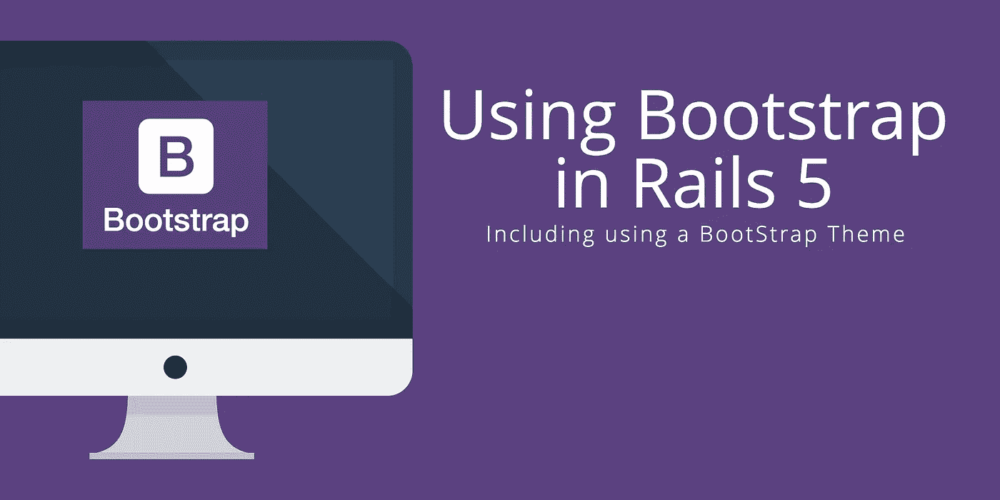
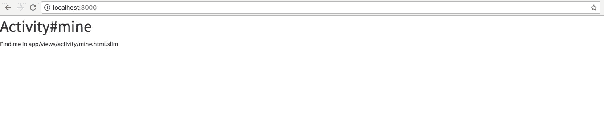
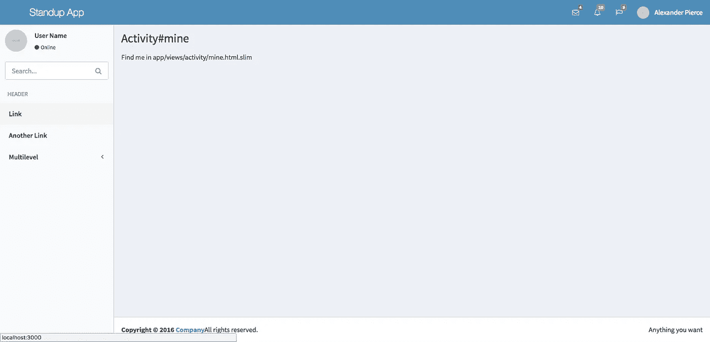

# 将引导程序集成到 Rails 5 中

> 原文：<https://medium.com/hackernoon/using-bootstrap-in-rails-5-969cbe423926>

## …以及如何使用引导主题



[Bootstrap](https://getbootstrap.com/) 是一个 HTML/CSS/JS 框架，可以快速简单地构建一个响应式网站。Bootstrap 使用网格布局系统，将页面分成若干行，每行包含 12 列。这现在允许您以一致的方式组织您的标记。

注意:本教程摘自我即将出版的书[中的一章，在 Rails 6](https://buildasaasappinrails.com) 中构建一个 SaaS 应用。这本书指导你从卑微的开始，通过部署一个应用到生产。这本书现在已经开始预售了，你可以马上拿到免费的一章！

此外，我的新项目[拉动式管理器](https://pullmanager.com)的测试版已经发布。如果您失去了对拉取请求的跟踪，让旧的请求留在身边，或者只是喜欢一个通过多个服务(Github、Gitlab 和 Bitbucket)聚集这些请求的仪表板，[查看一下](https://pullmanager.com)。

另外，我的新项目[拉管理器](https://pullmanager.com)的测试版也差不多准备好了。如果你失去了对拉取请求的跟踪，让旧的请求留在身边，或者只是喜欢一个通过多个服务(Github、Gitlab 和 Bitbucket)聚集这些请求的仪表板，[查看一下](https://pullmanager.com)。

Bootstrap 已经存在了很多年，也开发了一个主题生态系统。有高级和免费主题可供选择。就个人而言，在构建 SaaS 应用程序时，我喜欢将 [Inspinia](https://wrapbootstrap.com/theme/inspinia-responsive-admin-theme-WB0R5L90S) 用作高级主题，或者将 [AdminLTE](https://almsaeedstudio.com/themes/AdminLTE/index2.html) 用作免费主题。

出于本文的目的，由于它的开源和免费性质，我们将使用 AdminLTE 主题。随意使用任何其他主题。尽管类名和标记结构可能会因您所使用的主题而有所不同。

这篇文章还假设你已经用`rails new app_name`生成了一个新的 Rails 应用，并在默认端口 3000 上运行了一个`rails server`。

# 网格快速概览

在将 Bootstrap 集成到您的应用程序之前，让我们更详细地了解一下网格系统。如前所述，网格是一个 12 列系统，它响应视口或设备宽度。当您使用`<div class="row"></div>`在网格中创建一行时，您将能够用列填充该行。例如，如果您想要一个三列布局，它看起来会像这样...

```
<div class="row">
  <div class="col-lg-3">
    <h1>One</h1>
  </div>
  <div class="col-lg-3">
    <h1>Two</h1>
  </div>
  <div class="col-lg-3">
    <h1>Three</h1>
  </div>
</div>
```

在示例中，您可能会注意到列类名包含字母`lg`。这代表“大”,意味着这些列引用了大视口尺寸。有四种尺寸，每种对应最大的像素宽度。超小型设备手机(< 768px)。小型设备平板电脑(≥768px)。中型设备台式机(≥992 像素)。大型设备台式机(≥1200px)。

您可以在类名中使用多个列声明来指示网格根据视口的大小做什么。

```
<!-- Stack the columns on mobile by making one full-width and the other half-width -->
<div class="row">
  <div class="col-xs-12 col-md-8">One</div>
  <div class="col-xs-6 col-md-4">Two</div>
</div><!-- Columns start at 50% wide on mobile and bump up to 33.3% wide on desktop -->
<div class="row">
  <div class="col-xs-6 col-md-4">One</div>
  <div class="col-xs-6 col-md-4">Two</div>
  <div class="col-xs-6 col-md-4">Three</div>
</div>
```

要深入了解网格系统和 Bootstrap 的其他 CSS 功能，你可以访问[文档](http://getbootstrap.com/css/#grid)。

# 第一控制器，视图

如果这是一个新的应用程序，在您开始实现布局之前，我们需要实现一个路由和控制器来绕过默认的欢迎页面。您将在应用程序中使用控制器。

让我们停下来提一下，Rails 自带了内置的命令行生成器来生成控制器、模型和邮件。以及生成数据库迁移文件或甚至生成所有这些组合的支架。在我们的例子中，让我们关注控制器生成器。这个生成器的通用格式是`rails generate controller NAME [action action] [options]`。因此，我们的控制器生成的命令将看起来像:

```
rails generate controller Activity mine feed
  create  app/controllers/activity_controller.rb
   route  get 'activity/feed'
   route  get 'activity/mine'
  invoke  slim
  create    app/views/activity
  create    app/views/activity/mine.html.slim
  create    app/views/activity/feed.html.slim
  invoke  rspec
  create    spec/controllers/activity_controller_spec.rb
  create    spec/views/activity
  create    spec/views/activity/mine.html.slim_spec.rb
  create    spec/views/activity/feed.html.slim_spec.rb
  invoke  helper
  create    app/helpers/activity_helper.rb
  invoke    rspec
  create      spec/helpers/activity_helper_spec.rb
  invoke  assets
  invoke    coffee
  create      app/assets/javascripts/activity.coffee
  invoke    scss
  create      app/assets/stylesheets/activity.scss
```

让我们对路由文件进行一次快速编辑，以定义默认路由。我们将把`root to: 'activity#mine'`添加到路线文件的底部，如下所示:

```
Rails.application.routes.draw do
  get 'activity/mine' get 'activity/feed' root to: 'activity#mine'
end
```

# 应用程序布局

如果您使用的是 AdminLTE Bootstrap 主题，如果还没有下载的话，您应该下载它们。你可以从[这个链接](http://almsaeedstudio.com/download/AdminLTE-dist)或者从[主题预览](https://almsaeedstudio.com/themes/AdminLTE/index2.html)的支持页面下载。

下载并解压缩文件夹后，您会想要将一些文件复制到您的 Rails 应用程序中。您可以运行以下命令，或者通过操作系统的文件系统 GUI 复制文件。

```
cp ~/Downloads/AdminLTE-2.3.11/dist/css/AdminLTE.css app/assets/stylesheets/
```

下载位置可能因您的机器而异。此外，AdminLTE 路径中的版本号可能会根据您下载主题的时间而变化。使用您下载的文件夹。该命令将复制主 AdminLTE CSS 样式。AdminLTE 主题还带有不同颜色的皮肤。在这篇文章中，我将使用浅蓝色，但是你可以使用任何附带的颜色。以下命令将把皮肤 CSS 样式移动到您的应用程序中。

```
mkdir app/assets/stylesheets/skins
cp ~/Downloads/AdminLTE-2.3.11/dist/css/skins/skins-light-blue.css \
app/assets/stylesheets/skins
```

既然所需的文件已经存在，现在您将指示 Rails 应用程序使用这些文件。您将首先更改`assets/stylesheets/application.css`文件，只需要它自己和一个新的`style.scss`文件。

```
/*
 *
 *= require style
 *= require_self
*/
```

新的`style.scss`文件将包含引导库 CSS 文件和管理文件。

```
[@import](http://twitter.com/import) "bootstrap-sprockets";
[@import](http://twitter.com/import) "bootstrap";[@import](http://twitter.com/import) "AdminLTE";
[@import](http://twitter.com/import) "skins/skin-blue-light";
```

如果您重新加载 [http://localhost:3000](http://localhost:3000/) ，您现在会看到`activity#mine`页面的默认页面样式有了更新。它现在看起来应该更像下图:



正如你所看到的，虽然没有完整的布局，但样式已经更新。我们需要做更多的工作来实现整个布局。首先，让我们更新应用程序布局，使用一个瘦模板(取代`.erb`文件)和一些基本的引导样式:

```
#app/views/layouts/application.slim
doctype html
html
  head
    title Standup App
    = csrf_meta_tags
    = stylesheet_link_tag 'application', media: 'all', 'data-turbolinks-track': 'reload'
    = javascript_include_tag 'application', 'data-turbolinks-track': 'reload'
    = stylesheet_link_tag [
      href="[https://maxcdn.bootstrapcdn.com/font-awesome/4.7.0/css/font-awesome.min.css](https://maxcdn.bootstrapcdn.com/font-awesome/4.7.0/css/font-awesome.min.css)" ]body.fixed.skin-blue-light
    .wrapper
      = render 'layouts/navigation/layout'
      .content-wrapper
        = yield
      = render 'layouts/navigation/footer'#app/views/layouts/application.erb
<!DOCTYPE html>
<html>
  <head>
    <title>Standup App</title>
<%= csrf_meta_tags %>
<%= stylesheet_link_tag ‘application’, media: ‘all’, ‘data-turbolinks-track’: ‘reload’%>
<%= javascript_include_tag ‘application’, ‘data-turbolinks-track’: ‘reload’), false %>
<%= stylesheet_link_tag href="[https://maxcdn.bootstrapcdn.com/font-awesome/4.7.0/css/font-awesome.min.css](https://maxcdn.bootstrapcdn.com/font-awesome/4.7.0/css/font-awesome.min.css)" %>
  </head>
  <body class="fixed skin-blue-light"><div class="wrapper">
      <%= render 'layouts/navigation/layout'%><div class="content-wrapper">
          <%= yield %>
      </div>
      <%= render 'layouts/navigation/footer' %></div>
  </body>
</html>
```

这里有几点需要注意。首先，您可能会注意到`head`部分中以`=`开头的行。这是 slim templates 包含 ruby 输出的方式。这与在模板中使用`-`不同。单个连字符用于包含 ruby，但是没有输出，就像 if 语句一样。头部的输出包括 Rails 资产 javascript 和 CSS。我们还通过最后一个样式表包含帮助器包含了 FontAwesome 图标。

您可能还会注意到正文中一些非常具体的标记。这里，您将使用 AdminLTE 特定的类和 HTML 层次结构来设计 AdminLTE 主题中的应用程序。

最后，您将看到另外两个助手。`= render`助手，包括其他瘦文件。然后，`= yield`是 Rails 的模板方法，用于包含来自控制器的模板和调用的动作。

在深入研究布局中的特定部分之前，该部分中要做的最后一件事是修改`application.js`以包含主题工作所需的必要 javascript。您将从主题的文件夹中复制另一个文件，然后确保它在您的项目中被引用。

要复制 javascript 文件，您可以使用以下命令或使用您机器的文件 GUI:

```
cp ~/Downloads/AdminLTE-2.3.11/dist/js/app.js app/assets/javascripts/
```

此外，您还需要来自主题文件夹的第三方 javascript 文件:

```
cp ~/Downloads/AdminLTE-2.3.11/plugins/slimScroll/jquery.slimscroll.min.js \
vender/assets/javascripts/
```

您可能会注意到这个文件被复制到不同的位置。在 Rails 应用程序中，将第三方 javascript 放在`vender`文件夹中被认为是最佳实践。

现在，为了确保新复制的 javascript 文件包含在项目本身中，您将修改`application.js`文件:

```
//= require jquery
//= require jquery_ujs
//= require turbolinks
//= require bootstrap
//= require jquery.slimscroll.min
//= require_tree .
```

生成新的 Rails 应用程序时，默认包含前三行。这些行包括基本的 jQuery、工具和 Turbolinks。您将添加的行包括来自`bootstrap-sass`宝石的引导。还包括 AdminLTE 主题使用的 slimscroll 插件。最后一行是另一个 Rails 默认值。这意味着该文件将包含`app/assets/javascripts`文件夹及其子文件夹中的任何 javascript 文件。这一行就是复制的`app.js`文件和其他文件被包含进来的原因。

# 顶部导航

关于此应用程序中的导航，将有两个主要部分。顶部的导航栏和屏幕左侧的导航边栏。

在应用程序文件中，导航文件是通过在`navigation`文件夹(`= render 'layouts/navigation/layout'`)中呈现一个细长模板来包含的。在此文件中，您将包括顶部导航和侧面导航模板:

```
#app/views/layouts/navigation/_layout.slim
= render "layouts/navigation/header"
= render "layouts/navigation/sidebar"#app/views/layouts/navigation/_layout.erb
<%= render "layouts/navigation/header" %>
<%= render "layouts/navigation/sidebar" %>
```

这里需要注意的一点是模板文件名中下划线的使用。在 Rails 中，部分模板文件在文件名的开头用下划线标出。什么是偏音？片段只是将模板分解成小块的一种方式。这在诸如循环遍历一组项目的情况下发挥了更大的作用。在那里，您将使模板块显示项目信息的一部分。

包含的第一部分是`header`或顶部导航栏模板。这篇文章中采用的布局方法将包括示例标记。稍后，您将添加、移除或更改标记，以满足正在构建的应用程序的期望。以下是部分标题:

```
# app/views/layouts/navigation/_header.slim
header.main-header
  a.logo href="/"
    | Standup App  nav.navbar.navbar-static-top role="navigation"
    .navbar-custom-menu
      ul.nav.navbar-nav
        li.dropdown.messages-menu
          a.dropdown-toggle data-toggle="dropdown" href="#"
            i.fa.fa-envelope-o
            span.label.label-success 4
          ul.dropdown-menu
            li.header You have 4 messages
            li
              ul.menu
                li
                  a href="#"
                  .pull-left
                    img.img-circle [ alt=("User Image")
                    src="[http://placehold.it/160x160](http://placehold.it/160x160)" ]
                  h4
                    | Sender Name
                    small
                      i.fa.fa-clock-o
                      | 5 mins
                  p Message Excerpt
                | \...
            li.footer
              a href="#"  See All Messages
        li.dropdown.notifications-menu
          a.dropdown-toggle data-toggle="dropdown" href="#"
            i.fa.fa-bell-o
            span.label.label-warning 10
          ul.dropdown-menu
            li.header You have 10 notifications
            li
              ul.menu
                li
                  a href="#"
                    i.ion.ion-ios-people.info
                    | Notification title
                | \...
            li.footer
              a href="#"  View all
        li.dropdown.tasks-menu
          a.dropdown-toggle data-toggle="dropdown" href="#"
            i.fa.fa-flag-o
            span.label.label-danger 9
          ul.dropdown-menu
            li.header You have 9 tasks
            li
              ul.menu
                li
                  a href="#"
                  h3
                    | Design some buttons
                    small.pull-right 20%
                  .progress.xs
                    .progress-bar.progress-bar-aqua [ aria-valuemax="100"
                    aria-valuemin="0" aria-valuenow="20" role="progressbar"
                    style=("width: 20%") ]
                      span.sr-only 20% Complete
                | \...
            li.footer
              a href="#"  View all tasks
        li.dropdown.user.user-menu
          a.dropdown-toggle data-toggle="dropdown" href="#"
            img.user-image alt=("User Image") src="[http://placehold.it/160x160](http://placehold.it/160x160)"
            span.hidden-xs Alexander Pierce
          ul.dropdown-menu
            li.user-header
              img.img-circle [ alt=("User Image")
              src="[http://placehold.it/160x160](http://placehold.it/160x160)" ]
              p
                | Alexander Pierce - Web Developer
                small Member since Nov. 2012
            li.user-body
              .col-xs-4.text-center
                a href="#"  Followers
              .col-xs-4.text-center
                a href="#"  Sales
              .col-xs-4.text-center
                a href="#"  Friends
            li.user-footer
              .pull-left
                a.btn.btn-default.btn-flat href="#"  Profile
              .pull-right
                a.btn.btn-default.btn-flat href="#"  Sign out# app/views/layouts/navigation/_header.erb
<header class="main-header">
  <a class="logo" href="/">
Standup App
</a>
  <nav class="navbar navbar-static-top" role="navigation">
    <div class="navbar-custom-menu">
      <ul class="nav navbar-nav">
        <li class="dropdown messages-menu">
          <a class="dropdown-toggle" data-toggle="dropdown" href="#">
            <i class="fa fa-envelope-o">
            </i><span class="label label-success">4</span>
          </a>
          <ul class="dropdown-menu">
            <li class="header">
              You have 4 messages
            </li>
            <li>
              <ul class="menu">
                <li>
                  <a href="#"> </a>
                  <div class="pull-left">
                     </img>
                  </div>
                  <h4>
                    Sender Name
                    <small>
                    <i class="fa fa-clock-o">
                    </i>5 mins
                    </small>
                  </h4>
                  <p>
                    Message Excerpt
                  </p>
                </li>
              </ul>
            </li>
            <li class="footer">
              <a href="#"> See All Messages</a>
            </li>
          </ul>
        </li>
        <li class="dropdown notifications-menu"><a class="dropdown-toggle" data-toggle="dropdown" href="#">
            <i class="fa fa-bell-o">
            </i><span class="label label-warning">10</span>
          </a>
          <ul class="dropdown-menu">
            <li class="header">
              You have 10 notifications
            </li>
            <li>
              <ul class="menu">
                <li>
                  <a href="#">
                <i class="ion ion-ios-people info">
                </i>Notification title
                </a>
                </li>
              </ul>
            </li>
            <li class="footer">
              <a href="#"> View all</a>
            </li>
          </ul>
        </li>
        <li class="dropdown tasks-menu">
          <a class="dropdown-toggle" data-toggle="dropdown" href="#">
            <i class="fa fa-flag-o">
            </i><span class="label label-danger">9</span>
            </a>
          <ul class="dropdown-menu">
            <li class="header">
              You have 9 tasks
            </li>
            <li>
              <ul class="menu">
                <li>
                  <a href="#">
                  </a> 
                  <h3>
                    Design some buttons
                  <small class="pull-right">20%</small>
                  </h3>
                  <div class="progress xs">
                    <div aria-valuemax="100" aria-valuemin="0" aria-valuenow="20" class="progress-bar progress-bar-aqua" role="progressbar" style="width: 20%"><span class="sr-only">20% Complete</span></div>
                  </div>
                </li>
              </ul>
            </li>
            <li class="footer">
              <a href="#"> View all tasks</a>
            </li>
          </ul>
        </li>
        <li class="dropdown user user-menu">
          <a class="dropdown-toggle" data-toggle="dropdown" href="#">
            
          <span class="hidden-xs">Alexander Pierce</span>
          </a>
          <ul class="dropdown-menu">
            <li class="user-header">
               </img>
              <p>
                Alexander Pierce - Web Developer
                <small>Member since Nov. 2012</small>
              </p>
            </li>
            <li class="user-body">
              <div class="col-xs-4 text-center">
                <a href="#"> Followers</a>
              </div>
              <div class="col-xs-4 text-center">
                <a href="#"> Sales</a>
              </div>
              <div class="col-xs-4 text-center">
                <a href="#"> Friends</a>
              </div>
            </li>
            <li class="user-footer">
              <div class="pull-left">
                <a class="btn btn-default btn-flat" href="#"> Profile</a>
              </div>
              <div class="pull-right">
                <a class="btn btn-default btn-flat" href="#"> Sign out</a>
              </div>
            </li>
          </ul>
        </li>
      </ul>
    </div>
  </nav>
</header>
```

正如你在标题部分看到的。应用基本引导导航标记和样式。然后，AdminLTE 在其上应用样式，给应用程序一种仪表板的感觉。标题导航栏中有应用程序的标题、消息/通知下拉列表和访问应用程序其他部分的下拉列表。

# 侧边栏导航

包含的第二个模板是`sidebar`或侧面导航栏模板。这部分将采用相同的示例标记方法。

```
# app/views/layouts/navigation/_sidebar.slim
.main-sidebar
  .sidebar
    .user-panel
      .pull-left.image
        img.img-circle alt=("User Image") src="[http://placehold.it/160x16](http://placehold.it/160x16)" /
      .pull-left.info
        p User Name
        a href="#"
          i.fa.fa-circle.text-success
          | Online
    form.sidebar-form action="#" method="get"
      .input-group
        input.form-control name="q" placeholder="Search..." type="text" /
        span.input-group-btn
          button#search-btn.btn.btn-flat name="search" type="submit"
            i.fa.fa-search
    ul.sidebar-menu
      li.header HEADER
      li.active
        a href="#"
          span Linkli
        a href="#"
          span Another Link
      li.treeview
        a href="#"
          span Multilevel
          i.fa.fa-angle-left.pull-right
        ul.treeview-menu
          li
            a href="#"  Link in level 2
          li
            a href="#"  Link in level 2# app/views/layouts/navigation/_sidebar.erb
<div class="main-sidebar">
  <div class="sidebar">
    <div class="user-panel">
      <div class="pull-left image">
        
      </div>
      <div class="pull-left info">
        <p>
          User Name
        </p>
        <a href="#">
          <i class="fa fa-circle text-success">
          </i>Online
          </a>
      </div>
    </div>
    <form action="#" class="sidebar-form" method="get">
      <div class="input-group">
        <input class="form-control" name="q" placeholder="Search..." type="text" />
        <span class="input-group-btn">
        <button class="btn btn-flat" id="search-btn" name="search" type="submit">
        <i class="fa fa-search">
        </i></button></span>
      </div>
    </form>
    <ul class="sidebar-menu">
      <li class="header">
        HEADER
      </li>
      <li class="active">
        <a href="#">
      <span>Link</span>
      </a>
      </li>
      <li>
        <a href="#">
        <span>Another Link</span>
        </a>
      </li>
      <li class="treeview">
        <a href="#">
          <span>Multilevel</span>
          <i class="fa fa-angle-left pull-right">
          </i></a>
        <ul class="treeview-menu">
          <li>
            <a href="#"> Link in level 2</a>
          </li>
          <li>
            <a href="#"> Link in level 2</a>
          </li>
        </ul>
      </li>
    </ul>
  </div>
</div>
```

如你所见，侧边栏部分更小更简单。它包含一点用户信息、一个搜索输入和到应用程序其他部分的链接，您稍后将更改这些内容。

# 页脚

布局的最后一个主要部分是页脚。这将是简单而简短的。再次，这将是另一个部分。同样，该部分将位于`navigation`文件夹中。以下是简短的标记:

```
# app/views/layouts/navigation/_footer.slim
footer.main-footer
  .pull-right.hidden-xs
    | Anything you want
  strong
    | Copyright © 2016
    a href="#"  Company
  | All rights reserved.# app/views/layouts/navigation/_footer.erb
<footer class="main-footer">
  <div class="pull-right hidden-xs">
    Anything you want
  </div>
  <strong>
    Copyright © 2016
    <a href="#"> Company</a>
  </strong>
  All rights reserved.
</footer>
```

转到 [http://localhost:3000](http://localhost:3000/) ，你应该会看到这样的页面，或者如果你偏离了主题或布局风格，会看到类似的页面:



就是这样。这就是所有要复制的文件、要创建的文件和要添加的标记，以便为您的应用程序提供一个布局，您的单个控制器动作模板将呈现到该布局中。还不算太糟，是吧？

[](http://bit.ly/HackernoonFB)[](https://goo.gl/k7XYbx)[](https://goo.gl/4ofytp)

> [黑客中午](http://bit.ly/Hackernoon)是黑客如何开始他们的下午。我们是 [@AMI](http://bit.ly/atAMIatAMI) 家庭的一员。我们现在[接受投稿](http://bit.ly/hackernoonsubmission)并乐意[讨论广告&赞助](mailto:partners@amipublications.com)机会。
> 
> 如果你喜欢这个故事，我们推荐你阅读我们的[最新科技故事](http://bit.ly/hackernoonlatestt)和[趋势科技故事](https://hackernoon.com/trending)。直到下一次，不要把世界的现实想当然！

