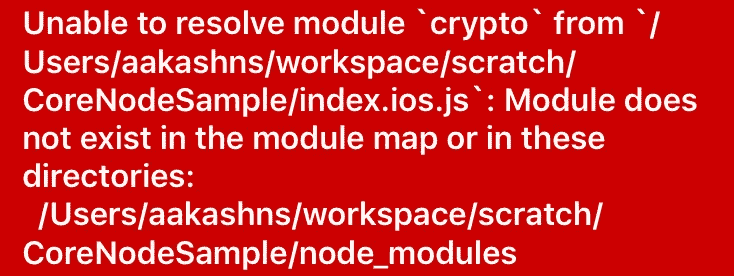
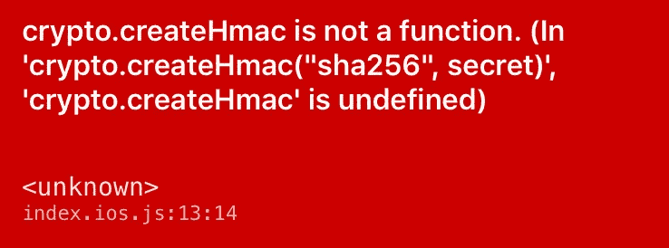
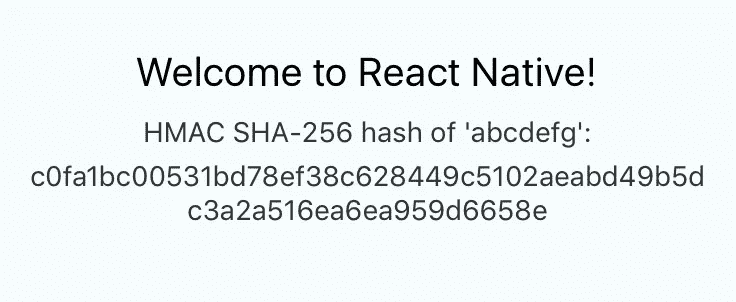

# 在 React 本地应用中使用核心节点 JS 模块

> 原文：<https://medium.com/hackernoon/using-core-node-js-modules-in-react-native-apps-64acd4d07140>

这里有一个你在使用 React Native 时可能会遇到的问题:假设你想使用`[crypto](https://nodejs.org/api/crypto.html#crypto_crypto)`模块创建一些散列。这样做似乎很自然:

Just import a module and create a hash, right? Right? Nope!

但是**这个不行，**因为`crypto`是核心的 Node JS 模块，也就是说很可能是捆绑了 Node JS 二进制的 C++代码，而不是 Javascript。React 本机打包程序不能将它[1]与您的应用程序的 Javascript 包打包在一起，所以您会得到一个运行时错误:`Unable to resolve module 'crypto'`。



这使得核心模块像`crypto`、`[stream](https://www.npmjs.com/package/stream)`等。以及依赖于它们的数千个 npm 模块无法从 React Native 使用。幸运的是，这个问题有一个解决方案，但是需要一些工作。

## 解决办法

如果你熟悉模块捆绑器 [Browserify](http://browserify.org/) ，你可能知道它允许你在使用 poly fills【2】的浏览器中使用核心节点 JS 模块，比如`crypto`。因此，让我们尝试创建一个独立的 Javascript 文件，其中包含用于`crypto`模块的 polyfill，并在我们的应用程序中使用它:

1.首先，安装`browserify`:

```
npm install -g browserify
```

2.创建一个导入`crypto`模块并简单导出的文件`crypto-in.js`:

3.使用`browserify`创建一个独立的 Javascript 包`crypto.js`:

```
browserify crypto-in.js -o crypto.js
```

这创建了一个文件`crypto.js`，它包含大约 21，500 行代码(包含 polyfills)。最后几行包含我们来自`crypto-in.js`的代码:

在这一点上，它可能看起来像我们完成了，但我们没有！如果您将应用程序代码中的行`const crypto = require('crypto');`替换为`const crypto = require('./crypto');`并尝试运行应用程序，您会得到以下错误:


原来单词`require`被 React 本机打包程序给予了特殊处理，并且您不能将其重新定义为其他意思，这正是 Browserify 试图在包中做的。如果你仔细观察`crypto.js`内部，你会注意到它总是传入一个自定义的`require`函数作为参数，而从来没有真正使用全局的`require`。有一个简单的方法可以解决这个问题，解释如下。

4.在文本编辑器中打开文件`crypto.js`，用其他东西替换单词`require`的所有实例，例如`reqqq`。确保它是唯一的，这样它就不会与任何现有的代码冲突，也不会把事情弄糟。

如果您现在保存`crypto.js`并重新加载应用程序，之前的错误将会消失，但会出现新的错误:



打包程序无法找到方法`createHmac`，因为`crypto`没有从`crypto.js`中正确导出。如果你看看这个包的最后几行，你会发现这是因为我们没有在全局`modules`对象上设置`module.exports`，而是在作为函数参数传入的其他对象上:

5.为了从`crypto.js`中正确导出`crypto`，我们需要对文件做一些修改:

*   在文件顶部添加语句`var crypto;`来声明一个新变量。
*   将语句`var crypto = require('crypto');`替换为`crypto = require('crypto');`来设置外部变量，而不是在函数体内创建局部变量。
*   将函数体外部的行`module.exports = crypto;`移动到文件的底部，使其引用全局`module`对象。

修改后，`crypto.js`应该是这样的:

**就这样！**如果你现在运行这个应用程序，它应该一切正常:



## 摘要

下面是在 React 本地应用中使用核心节点 JS 模块(如`crypto`(或依赖于它的东西))的步骤的简短总结:

1.  使用 [browserify](http://browserify.org/) 创建一个包含核心模块聚合填充的独立 Javascript 包(参见 [crypto-in.js](https://gist.github.com/aakashns/0542bbf75ccb0973b5297ed264127095) 和 [crypto.js](https://gist.github.com/aakashns/d0ba72025e29691baca3318c7e4a4c3b) )。
2.  用独特的东西替换包中关键字`require`的所有实例，例如`reqqq`，这样 React 本地包管理器就不用管它了。
3.  通过将`crypto`模块导入一个全局变量，并将全局变量`module.exports`设置为该变量，从包中正确导出该模块(参见修改后的 [crypto.js](https://gist.github.com/aakashns/1e1fc9f2daec75dfc229be7e8c2c10a2) )。

**警告:**由`browserify`生成的包可能非常大。例如，上面生成的文件`crypto.js`超过 500kb。所以要留意大捆的。考虑使用类似于 [Uglify](https://github.com/mishoo/UglifyJS) 的工具来缩小捆绑包并减小其大小。

## 参考

[1]—[https://github.com/facebook/react-native/issues/1871](https://github.com/facebook/react-native/issues/1871)
【2】—[https://github.com/substack/browserify-handbook#builtins](https://github.com/substack/browserify-handbook#builtins)
【3】—[https://github.com/facebook/react-native/issues/6253](https://github.com/facebook/react-native/issues/6253)

*感谢阅读！我希望这篇文章对你有所帮助。请随意留下评论或建议。我很想知道是否有更好的方法来做到这一点。*