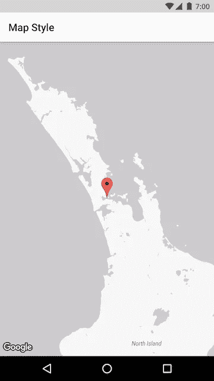
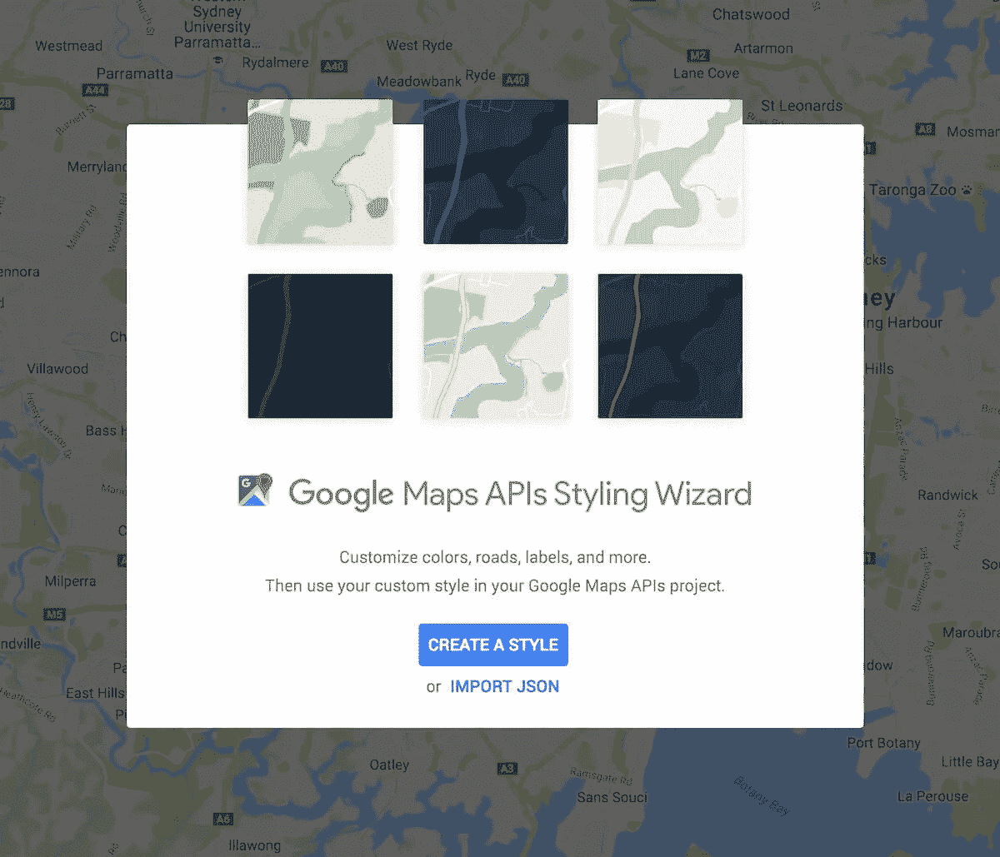
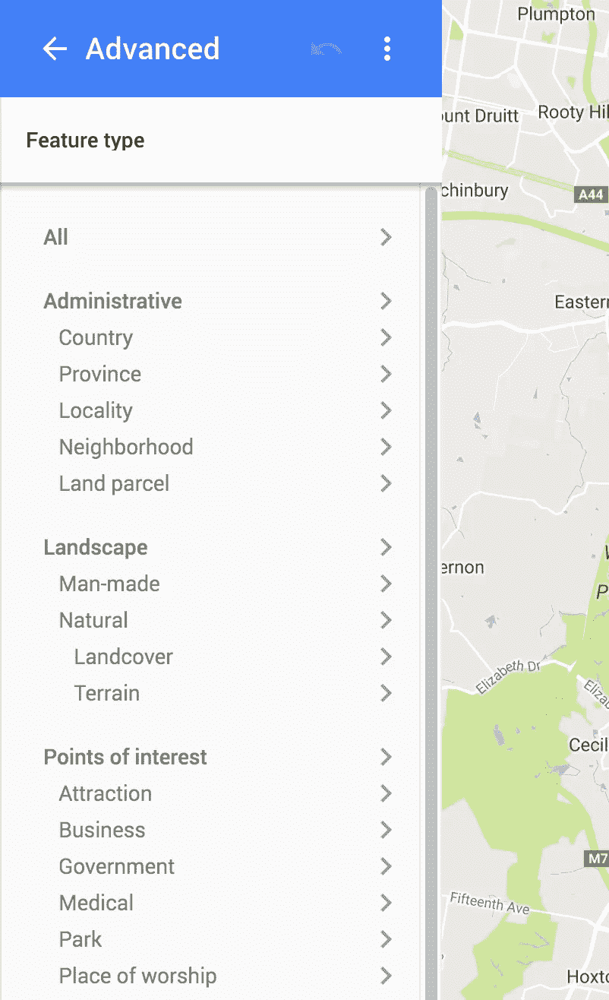
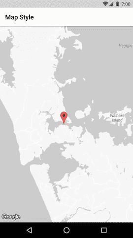

# 在谷歌地图 Android API 中使用自定义样式

> 原文：<https://medium.com/hackernoon/using-custom-styles-with-google-maps-android-api-e1e5ec3ac7e9>

Google Play Services 9.6.0 推出了期待已久的功能——自定义地图样式！

地图样式允许您自定义几乎所有地图要素的颜色、可见性和密度。

这个真的很厉害！你不仅可以改变风格以完全适应你的品牌，而且你可以**隐藏特定的地图元素**。

*   显示道路或公共交通是否会影响你的内容？隐藏你不需要的东西。
*   不想让商业 POI 的地图变得杂乱。把它们也藏起来。
*   想要在地图上高亮显示公园？给它们一个明亮的颜色，其他的都是灰色的。

如果您想在一天中的某个时间改变地图样式，或者当用户放大时，该怎么办？

完全有可能。

**地图风格可以随时改变。**

我决定看看我能做到什么程度。我的目标是实现一个带有“细节层次”地图的示例应用程序。即，随着用户放大，更多的地图特征变得可见。**查看样本项目** [***此处***](https://github.com/athornz/MapsStyleSample) ，否则继续阅读！



# 让我们开始吧！

JSON 中定义了地图样式[。以下是隐藏 POI、道路和交通要素的示例样式:](https://developers.google.com/maps/documentation/android-api/style-reference)

```
[
  {
    "featureType": "poi",
    "stylers": [
      {
        "visibility": "off"
      }
    ]
  },
  {
    "featureType": "road.highway",
    "stylers": [
      {
        "visibility": "off"
      }
    ]
  },
  {
    "featureType": "transit",
    "stylers": [
      {
        "visibility": "off"
      }
    ]
  }
]
```

你可以自己编辑 JSON，或者使用谷歌便利的[样式向导](https://mapstyle.withgoogle.com)。



Styling wizard — yes please!

样式向导附带了一些预构建的样式，包括夜间模式样式——请查看。

或者你可以切换高级模式来调整你的心的地图风格。有大量的选择。快乐造型！

完成后，您可以导出 JSON 以在您的应用程序中使用。



Styling wizard options — and lots of them!

# 应用样式

将样式应用到地图上非常简单。

存储样式的推荐方式是通过 Android 项目中的原始资源文件。

新的 *MapStyleOptions* 类提供了一个方便的方法来加载它，并且在 GoogleMap 类上有一个新的方法来设置样式。

```
MapStyleOptions style = MapStyleOptions.*loadRawResourceStyle*(this.context, R.raw.my_map_style);
map.setMapStyle(style);
```

或者如果你的地图样式以其他方式存储(也许作为一个 Firebase 远程配置)，你可以直接创建*地图选项样式*:

```
String myMapStyle = "[map style here]";
MapStyleOptions style = new MapStyleOptions(myMapStyle);
map.setMapStyle(style);
```

就是这样！您的地图现在有了自定义样式。发货吧！🛳

# MapStyleManager

为了实现细节层次的地图样式，我创建了一个自定义类—***MapStyleManager***。

这个类本质上设置了一个 *OnCameraMoveListener，*并在相机移动时为当前缩放级别设置合适的地图样式。

你可以在这里得到它的要点[。](https://goo.gl/UdMJ8u)

使用*地图样式管理器*就像添加地图样式和指定最小缩放级别一样简单。

当相机缩放级别达到该样式的最低级别时，将应用该样式。简单！

```
MapStyleManager styleManager = MapStyleManager.*attachToMap*(this, map);
styleManager.addStyle(0, R.raw.*map_style_1*);
styleManager.addStyle(10, R.raw.*map_style_2*);
styleManager.addStyle(12, R.raw.*map_style_3*);
```

结果如下:



不错吧？

它不像我希望的那样顺利。谷歌地图第一次加载样式时，样式之间的转换可能会有点不协调。如果有一个预加载样式的选项就好了。

# 这是一个总结！

这是对谷歌地图 Android API 自定义样式的简要概述。

我迫不及待地想看到漂亮的谷歌地图风格无处不在！

很高兴看到地图团队解决了一些长期存在的功能需求。继续努力谷歌！

如果你喜欢这篇文章，一定要给它一些👏在推特上关注我。

[](http://bit.ly/HackernoonFB)[](https://goo.gl/k7XYbx)[](https://goo.gl/4ofytp)

> [黑客中午](http://bit.ly/Hackernoon)是黑客如何开始他们的下午。我们是 [@AMI](http://bit.ly/atAMIatAMI) 家庭的一员。我们现在[接受投稿](http://bit.ly/hackernoonsubmission)并乐意[讨论广告&赞助](mailto:partners@amipublications.com)机会。
> 
> 如果你喜欢这个故事，我们推荐你阅读我们的[最新科技故事](http://bit.ly/hackernoonlatestt)和[趋势科技故事](https://hackernoon.com/trending)。直到下一次，不要把世界的现实想当然！

[](https://goo.gl/Ahtev1)