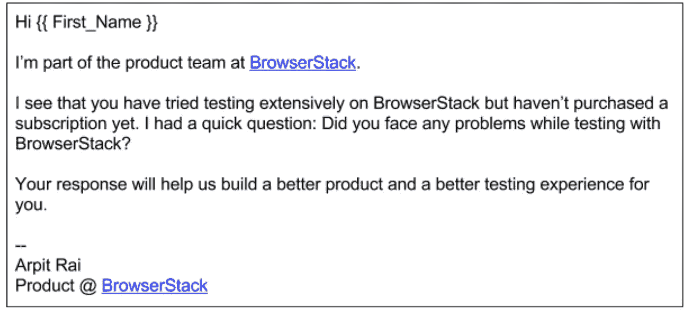
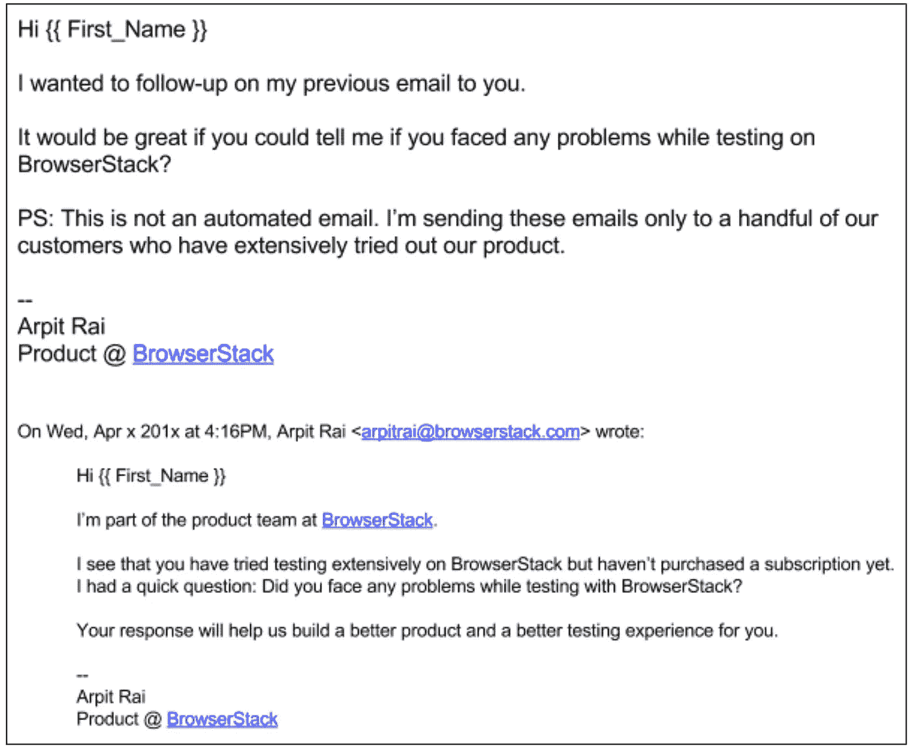

# 利用客户发展打造 SaaS 产品

> 原文：<https://medium.com/hackernoon/using-customer-development-to-build-your-product-1ef45b15e999>

注意:我在客户开发方面的经验主要来自 SaaS (B2B)的初创公司。因此，我的许多经验可能无法直接应用于 B2C 场景。

几个月前，我在 T2 举办了一个关于客户开发的研讨会，作为 T4 生产计划的一部分。这篇文章的大部分内容来自我为那次研讨会准备的笔记。

我将这篇文章分为以下三个部分:

*   什么是客户开发？
*   客户开发如何运作
*   结束语

在我在 BrowserStack 的产品和增长团队工作的两年里，我和数百名客户通过电话交谈。BrowserStack 的这一客户开发活动的主要目标是改进产品并构建新功能来推动公司的增长。

# 什么是客户开发？

客户开发当然不是问你的客户他们想要什么，然后建立它。

客户开发真正做的是帮助确定要解决的正确问题，这样你就能制造出客户会买的东西。此外，它还能帮助你验证你的假设和设想。这个想法是花更多的时间和你的客户交流，花更少的时间和金钱在工程和设计上。

我不能过分强调找出正确的问题来解决的重要性。BrowserStack 做对了。那里的首席执行官告诉我，解决方案相对容易，但确定要解决的正确问题并不容易。我完全同意。

总的来说，客户开发并不能为你提供所有关于构建什么的答案。但是它确实提供了对客户更好的理解，以及对他们努力解决的问题更敏锐的评价。你仍然需要一位创始人或产品经理来筛选所有信息，以确定哪些是相关的，对收到的输入进行优先排序，并决定如何将输入转化为有形的功能或产品。

# 客户开发如何运作？

## 1.从你的假设开始

开始客户开发流程的一个很好的切入点是你试图验证的一些假设。如果你从零开始开发一个新产品，你会对这个行业或者你认为你的潜在客户面临的问题有一些假设。那么，你合乎逻辑的下一步就是打电话给你的潜在客户，在你开始生产任何东西之前，尽可能多地了解他们的问题。这一步甚至适用于您试图为现有产品构建的小功能。

例如，在 BrowserStack 中，我们的一个假设是偶尔使用该产品是导致高流失率的最大因素之一。因此，在这种情况下，我们的客户开发活动侧重于了解客户的行为和日常活动，以及替代方案的可用性，因为他们取消了订阅。

## 2.识别您的用户

为了验证你的假设，如果你还没有产品，你需要和你的客户或潜在客户交谈。因此，让我们首先确定谁是你的理想客户，或者谁可能是你的理想客户。你应该能够通过以下参数的组合来定义你的理想客户:*行业、公司规模(基于员工数量或收入)、地区、角色/职能、头衔*。让我们把通过上述参数创建的不同的理想客户集合称为用户角色。例如，在 BrowserStack 中，其中一个角色是*企业【1000+员工】中的 *QA 经理*和*技术(软件)行业*中的*。

## 3.创建一个可与之交谈的用户列表

一旦你确定了你的用户角色，你就需要创建一个你可以与之交流的用户列表。如果您已经有了一个客户正在使用的产品，那么创建列表就不是问题。但是，请注意，你的免费和付费产品的用户角色可能是不同的，你需要根据你要解决的问题与相关的用户角色交流。如果你正在开发一个新产品，除了接触你的个人网络，你还可以在 LinkedIn 上搜索潜在的联系人，并通过 LinkedIn 或 Twitter 与他们取得联系。Quora 也可以是一个你可以找到可以交谈的人的地方。

一旦你开始这个练习，你会意识到人们实际上并不反对和你说话。他们做这件事有不同的原因。在 BrowserStack，人们喜欢这个产品，他们喜欢在他们的组织中宣传这个产品。谁不想成为在自己的公司里介绍和宣传一种神奇产品的人呢？我们在 BrowserStack 有很多这样的用户。安排与他们的通话轻而易举。有些人只是愿意帮忙。当你告诉其他人这项工作仅限于一定数量的人，他们的投入将有助于塑造产品或业务的未来时，他们会觉得很重要。

## 4.与你的用户取得联系

一旦你创建了这个用户列表，通过电子邮件联系他们，安排一个电话或面对面的会议。在你接触的客户中，愿意与你通电话的人的回复率取决于你如何向客户推销。对于自助销售(BrowserStack 就是这种情况)，我接触的大约 20%的免费用户(没有订阅的用户)愿意和我打电话。对于付费用户，回复率高达 50%到 70%。对于内部销售或现场销售(我目前工作的初创公司 [WebEngage](https://www.webengage.com) 就是这种情况)，几乎所有的客户都想与我交谈。

下面是我发给 BrowserStack 上一些没有购买订阅的注册用户的一封电子邮件的例子。一旦他们有了答复，我就成功地要求他们和我通电话，回答我根据他们的第一次答复提出的一些其他问题。

Example of an email I sent to customers at BrowserStack

比起面对面的会议，我更喜欢通过电话进行客户开发研究。我可以在通话过程中做笔记而不会分散客户的注意力，而在面对面的会议中做笔记可能会分散其他人的注意力。我也做过一些关于电子邮件的客户开发研究，但这些主要是针对我遇到的非常具体的问题。我个人不太喜欢网络调查。我认为，只有当您已经有了一些选项/解决方案，并且您只是在寻求客户的帮助来进行验证和优先排序时，才应该这样做。

如果你通过电话进行客户开发，考虑你的用户所在的时区，并根据他们的时区向他们建议时间段。使用 [LinkedIn](https://www.linkedin.com) 或 [Rapportive](https://chrome.google.com/webstore/detail/rapportive/hihakjfhbmlmjdnnhegiciffjplmdhin?hl=en) 来找出你的客户在哪里。还有，具体问他们的手机号码。我曾经遇到过有人因为忘记了或者错过了日历提醒而没有参加预定的电话会议。我现在倾向于直接问他们的手机号码，因为在这种情况下，打电话的几率要大得多。

最后，对于您发送的安排这些电话的电子邮件，请记住向那些没有回复您第一封电子邮件的人发送第二封电子邮件。我不能过分强调跟进的力量。我在 BrowserStack 的电话有一半是通过跟进安排的！不用说，电子邮件必须个性化。没有人喜欢参加一些普通的客户研究。

下面是我发给 BrowserStack 客户的一封跟进邮件的例子:

Example of a follow-up email I sent to customers at BrowserStack

## 5.问你的用户这些问题

在这一部分，我将回答一些我经常问客户的问题。这不是一个详尽的列表，您的确切问题列表将根据您试图验证的假设而有所不同。我通常会准备大约 15 到 20 个问题，需要在电话中回答。当然，我提问的顺序是动态的，完全取决于电话的进展。

根据我的经验，开放式问题比封闭式问题更有效。我倾向于不要求用户在选项中选择，或者他们对某个特定的解决方案有什么想法。我已经意识到，这样的封闭式问题只会让用户产生偏见，或者限制他们的思维。封闭式问题的一个例子是*你更喜欢 A 还是 B* ？我不会让用户在两个选项中做出选择，而是倾向于询问更多关于用户所面临问题的问题。

以下是我通常在客户开发电话中提出的一些基本问题:

*   关于公司(它做什么，行业，员工人数)
*   关于个人(目标、工作职责等。)
*   他们面临的最大挑战和其他问题
*   他们最后一次面对问题的时间以及他们面对问题的频率。这有助于您了解问题是偶然出现的还是持续存在的。围绕一个只能为用户偶尔解决问题的产品建立一个企业可能很难
*   这个问题如何影响他们的业务，或者这个问题花费了他们公司多少时间和金钱。这有助于理解问题的严重性。即使问题持续存在，如果没有花费客户大量的时间和金钱，他/她也不会热衷于解决问题
*   他们目前如何解决这个问题？即使用户声称这个问题是持久的，并且导致了大量的时间和金钱的损失，让我们来验证一下。如果问题足够大，用户可能已经有了某种缓解问题的解决方案。如果目前没有解决方案，那么问题是否像用户描述的那样严重？
*   他们当前解决方案的问题
*   如果有什么事情我没有问他们，我应该有

## 6.做笔记和总结

在通话过程中做大量笔记。把你的电话录音，这样你以后可以参考它们。通话结束后，立即总结通话中讨论的内容。当你开始在一天内打多个这样的电话时，就很难记住谁说了什么。

完成所有通话后，在一个地方创建所有通话记录的摘要。在总结中寻找模式，并尝试将这些模式转化为可靠的发现。根据这些发现，你将能够确定你的产品的行动计划。

当然，整个客户开发过程本质上是迭代的。你将采纳这些意见，开发一个产品或功能，或者制定一个策略并付诸实践，做更多的客户开发工作来验证你所开发的产品，等等。

最后，虽然客户开发过程在本质上是连续的，你几乎每天/每周/每两周都要与客户交谈，但大多数客户开发往往发生在你试图验证你的假设的初始阶段。

# 结束语

一旦你打了 10 到 15 个电话，你就会发现一些规律。后来的用户交互往往会产生类似的模式。因此，当你不再听到新事物时，你可能会决定结束你的假设的客户开发研究。

每次通话可能需要 30 到 45 分钟。我不建议在一天之内进行超过 4 次的客户开发电话或会议，因为这个过程会让人筋疲力尽。请记住，除了与客户交谈之外，您还需要在结束通话后立即做笔记并总结讨论内容。

如果你的产品已经上市几年了，你也可以考虑成立一个*客户顾问委员会*，你可以依靠它来测试你最初的假设和验证你的解决方案。当我在 BrowserStack 的时候，我们的竞争对手 [SauceLabs](https://saucelabs.com/) 已经组装好了这块板。这让他们的顾客觉得自己很重要。以至于他们中的一些人更新了他们的 LinkedIn 个人资料，提到他们是这个董事会的一员。

在 BrowserStack，我们利用客户开发来构建解决许多问题的功能，例如增加转化率、减少流失、修改定价等。在未来，我将讲述我们如何着手解决这些问题的一些细节，以及客户开发在解决这些问题中所扮演的角色。