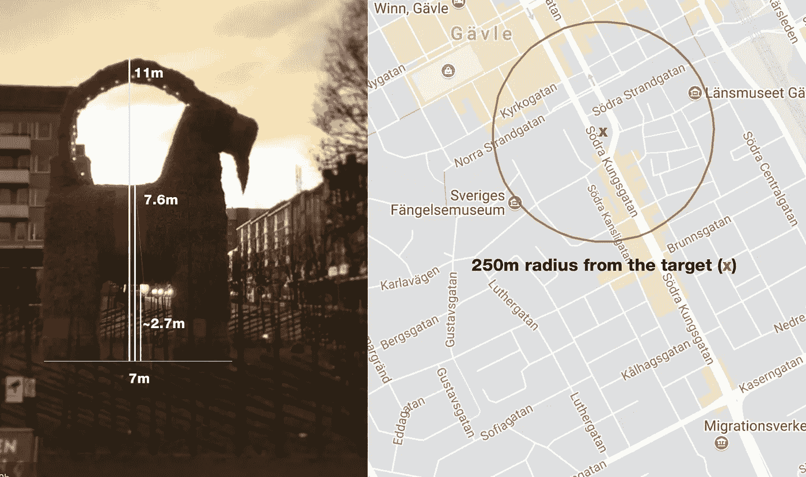
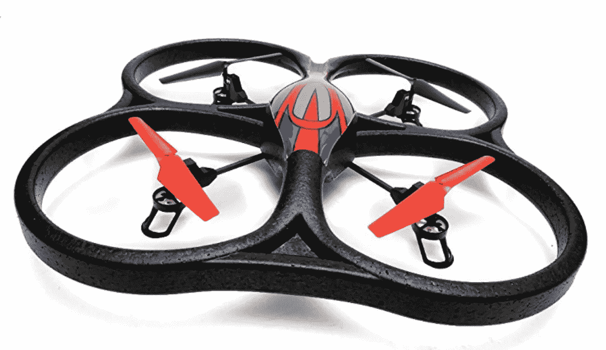
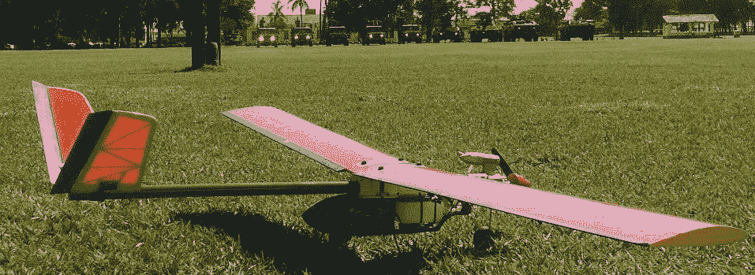

# 用无人机烧毁了格夫勒山羊

> 原文：<https://medium.com/hackernoon/using-drones-to-burn-down-the-g%C3%A4vle-goat-8dc7d66f120e>

## 无人驾驶飞机的潜在危险[思想实验]

开玩笑地，我在推特上发了一个想法，要攻击瑞典格夫勒由易燃材料制成的巨型山羊。如果你不知道什么是 vle 山羊，这里有一个来自汤姆·斯科特的视频可以解释它:

我开始思考，这真的可能吗？我能在网上专门买到 T2 无人机吗？这个话题并不新鲜，有些人已经在 DEF CON 上讨论了用无人机制造攻击的可行方法，以及一些防止攻击的方法，我怀疑 Gä vle goat 有没有。

我将考虑两种情况:第一种是使用市场上可以买到的小型四轴飞行器作为你的军队——**我将称之为蜂群行动**；第二种是使用自制的无人机，花费不到 300 美元，这将是**神风行动**。

# 达到目标

根据[这篇博客](http://merjuligavle.blogspot.com.br/)的描述，尺寸是:高 13 米(包括角)，肩高 7.6 米，也有 7 米长。重量 3.6 吨。并且近似位于 [+60.67283+17.146384/](https://goo.gl/maps/K43ovJmaGfm) 。

基于互联网上的公开信息，我们有可能利用这些图片来获取一些关于目标的情报。此外，帮助创建一个逃跑计划，在不暴露自己的情况下发动攻击的地方。此外，有了天气信息，这个半径可以更远，保证攻击者的安全。

## 蜂群行动

这个计划风险更大。你必须靠近目标，这可能会让你被捕，好的一面是着火的山羊会被看见。这个想法很简单:使用一群携带燃烧弹的无人机作为一个群体，集中攻击目标，这样失败的风险就很低。

V262 Cyclone UFO

你将需要三或四架无人机，携带一些有效载荷，携带一些燃料和点火的东西。这是我在 Reddit 的帮助下在亚马逊上找到的一个模型: [WL 玩具 V262](https://www.amazon.com/Cyclone-Channel-Quadcopter-2-4Ghz-Ready/dp/9269803716/ref=sr_1_2?s=toys-and-games&ie=UTF8&qid=1428354674&sr=1-2&keywords=v262) ，售价 62 美元，可以运到[瑞典](https://hackernoon.com/tagged/sweden)。

由于没有进行真正的测试，这个想法很简单，用冲击，一些燃料，和一个点火器，火就会开始，你会很高兴地看着这一切发生。这种型号有 150 米的射程，这意味着你甚至可以躲在桥边攻击。

## 神风行动

受日本神风特攻队的启发，目标是使用一架自主飞机通过潜入目标来攻击目标，使攻击者更容易保持匿名。

如果你想给自己造一架飞机，我建议用 Ararinha。这是一个简单的开源/硬件项目，由我所在的小组在巴西圣保罗大学创建，该小组的任务是创建自主飞行机器。

Ararinha plane, photo taken in Brazil.

Ararinha 的重量不到一公斤，因此可以用背包运输。它使用 [ardupilot](http://ardupilot.org) 进行控制，也能够远程控制。当时的平均速度是 80 公里/小时，有 40 分钟的自主时间，这**意味着它可以从距离目标**20 公里的半径范围内安全发射。

一个人在大约一周内制造这架飞机的成本不到 300 美元。原理图可以在[这里](http://gisa.icmc.usp.br/site/wp-content/uploads/2013/03/Desenhos.zip)找到，带逐步说明的视频可以在 [YouTube](https://www.youtube.com/channel/UCHorRBUAXNBf3JwQssfg-4Q) 找到。这是一架完全自主的飞机，你甚至可以在地图上设定一条路径，也可以降落在先前设定的目标上。[这是我第一次在公共场合脱下来的视频](https://www.youtube.com/watch?v=JzHYP9hT5p0)。

因为它已经使用气体作为燃料，不需要太多有效载荷。同样，使用这个计划也意味着你可以从更大的区域发起攻击，甚至是从海上！

## 最后的想法

令人印象深刻的是，在巴西，我足不出户，就能在不到两个小时的时间里策划一场恐怖袭击。

写下这一切时，我不可避免地要问自己:这是否也意味着使用自主武器的定点袭击可以由普通平民完成？你怎么想呢?