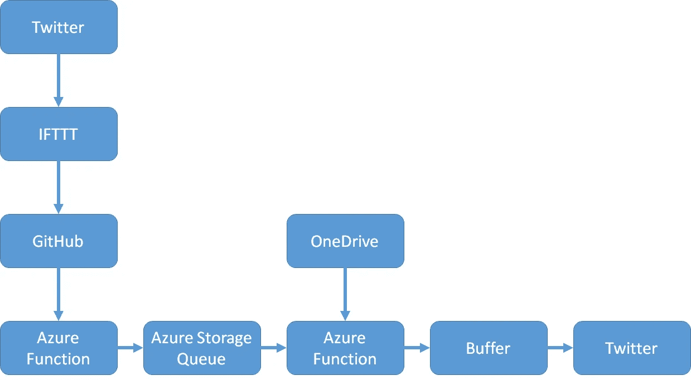
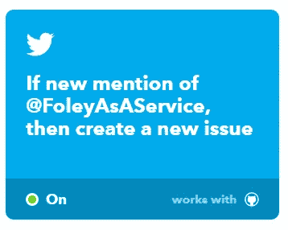
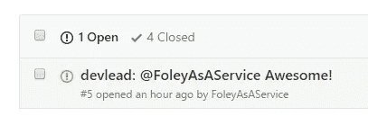
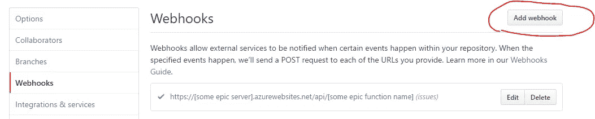
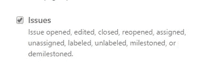
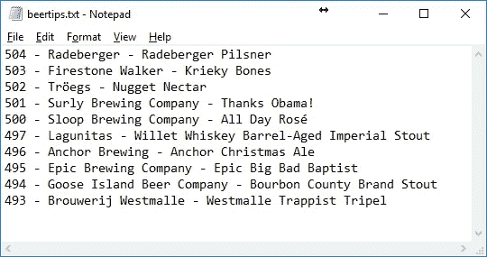
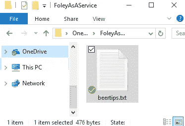
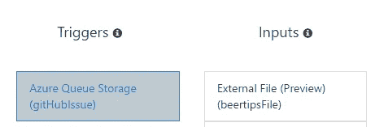
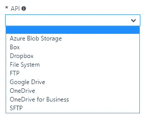

# ⚡Using 联邦航空局创建联邦航空局🍺

> 原文：<https://medium.com/hackernoon/using-faas-to-create-faas-bc554ccb7fa6>

## 使用 Azure Functions 又名 functions as a service 又名 FaaS 创建 FaaS 又名福利 as a service

最近我写了这篇博客

 [## FaaS 让 GitHub 状态变得简单

### 使用 Azure 函数自动化你的请求验证

hackernoon.com](https://hackernoon.com/github-statuses-made-easy-with-faas-fd9236a41925) 

当我发微博时，它得到了这样的回复

我的直觉告诉我必须这么做！

…而且必须以“企业的方式”来完成…所以今晚我给自己 10 分钟来做 A-Z 的所有事情(*博客文章不包括*)想出一个解决方案，8 分 56 秒后，我的概念验证开始运行&。
这是我想到的

很明显对吗？让我们一步一步地来看它，尽管它很疯狂——它实际上是一个很好的展示案例，展示了什么是非常容易做到的。

## 服务

那么福利提供的最好的服务是什么呢？显然是本周啤酒精选！所以为什么不开发一个 Twitter 机器人，给人们随机挑选啤酒！

## 推特

第一步，创建 epic twitter 账户:

 [## 福利即服务(@FoleyAsAService) | Twitter

### 福利即服务的最新推文(@FoleyAsAService)

twitter.com](https://twitter.com/FoleyAsAService) 

## IFTTT

Twitter APIs 很麻烦，让我们站在巨人的肩膀上，如果它很容易并且免费——一个付费的替代方案可能是 Azure Logic Apps，它有一个搜索 Twitter 触发器。

因此，当我新创建的帐户被提及时，一个设置小程序被触发。IFTTT 暂时不要发布到 Azure 函数，但是它们可能会产生 GitHub 问题！

## 开源代码库

IFTTT 获得一次提及的速度并不快，需要一分钟到一个小时，但当它最终获得提及时，它的效果非常好

你说这对我们有什么帮助？当问题产生时，GitHub 可以触发 Azure 函数。

只需选择个别事件并将其缩小到问题范围——我认为这太棒了！

## Azure 功能 1

我们的第一个 Azure 函数将只接收 GitHub webhook 事件，挑选所需的数据，解析 GitHub 注释，然后将其排队到 Azure 存储队列中

队列项 GitHubIssue 类只是一个概念，没有什么特别的，看起来像这样

## Azure 函数 2

我们的第二个函数订阅 Azure 存储队列，并在被触发时重用同一个 GitHubIssue 类来获取类型化消息。

现在有趣的是，NOSQL 是当今的热门词汇，我想要一个玛丽·乔可以轻松管理自己的解决方案…

…还有什么比使用记事本管理我们的啤酒选择更好的解决方案呢，你说这怎么可能呢？

显然，我们使用 OneDrive 来存储文件，可以从记事本轻松编辑！因为 Azure 现在在预览版中支持将参数绑定到 OneDrive 上的文件！所以我们需要做的就是读取文件中的行，并随机选择一行作为 tweet。不会说 Twitters API 太复杂，但时间紧迫，Buffer 提供了一个简单得多的 API，它只是一个 HTTP post，也让我可以转发带有评论的原始 tweet。

那么函数看起来是什么样的，对于仓促的工作来说，它实际上并没有那么糟糕( *IMHO* )。

它的绑定只是队列&外部文件进来

外部文件是在预览中，还没有普遍可用，但它已经支持几个服务，所以我可以看到这在未来变得非常有用！

## 结果呢

只要我没有用完信用点数，它就会在 60 分钟内返回给你一瓶啤酒

## 结论

一开始，我只是开玩笑，挑战自己 10 分钟能做多少事——我发现自己真的有点惊讶，原来复杂的事情竟然变得如此简单。显然代码需要重构、错误处理和测试——但是使用几个在线服务做一个概念验证是非常酷的。

所以谢谢你的主意，玛丽·乔！这是在 FaaS 的一次有趣的练习——福利服务🍺

## 更新

福利即服务在[视窗周刊第 506 集](https://twit.tv/shows/windows-weekly/episodes/506)上被特别报道

> [黑客中午](http://bit.ly/Hackernoon)是黑客如何开始他们的下午。我们是 [@AMI](http://bit.ly/atAMIatAMI) 家庭的一员。我们现在[接受投稿](http://bit.ly/hackernoonsubmission)并乐意[讨论广告&赞助](mailto:partners@amipublications.com)机会。
> 
> 如果你喜欢这个故事，我们推荐你阅读我们的[最新科技故事](http://bit.ly/hackernoonlatestt)和[趋势科技故事](https://hackernoon.com/trending)。直到下一次，不要把世界的现实想当然！

