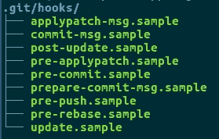

# 在 dockerized 环境中安装 git 挂钩

> 原文：<https://medium.com/hackernoon/using-git-hooks-in-a-dockerized-environment-55372c40815f>

Git [钩子](https://hackernoon.com/tagged/hooks)可以非常方便地保持提交日志的整洁。当你在一个[dockered 环境](https://hackernoon.com/how-we-happily-dockerized-our-development-environment-part-1-2-b05fd6927a53)中工作时，这里有一个在你的团队中安装和共享 git 钩子的方法

TL；DR:[github 上有一个演示项目](https://github.com/aherve/docker-githook-demo)

## 1.简而言之，Git 挂钩

Git 提供了一种在你做某件事之前运行命令的方法。例如，一个常见的用法是在您尝试提交某件事情之前运行您的 linters。如果 linter 检测到任何错误，那么在您真正提交您的工作之前，会要求您修复它。这通常会清除 git 日志中的提交，比如[“fixed lint”](https://github.com/search?utf8=%E2%9C%93&q=merge%3Atrue+fixed+lint&type=)。

如果你是这个概念的新手，你至少应该知道:

*   git 挂钩是 git 自动找到的脚本，如果它在`.git/hooks`目录下的话
*   git 挂钩是由您的计算机在本地运行的
*   当 git 挂钩失败时，您的 git 命令不会运行。

您可能想看看任何 git 项目中已经存在的 git 示例:

What you get after any `git init`

只需将`pre-commit.sample`复制到`pre-commit,`中，使其可执行，现在你已经安装了第一个工作的 git 钩子！

## 2.作为一个团队使用 githooks

现在你大概知道了，如果你把一些脚本放在你的`.git/hooks`目录里，那么你的队友就无法利用了。你基本上是唯一一个知道你的脚本的人，你不能保证你的团队的任何提交通过你刚刚写的 githook 测试。

当直接使用 npm/yarn 时，像 [husky](https://github.com/typicode/husky) 这样的工具可以帮助您自动安装 githooks。但现在是 2017 年，我们希望与码头工人合作，不是吗？

这是我们要做的:

*   在项目的根目录下创建一个`hooks`目录，放一些脚本在里面，并提交它们。
*   创建一个 docker 容器，其目的是创建一个官方钩子脚本到你的*本地* `.git/hooks`目录的符号链接
*   在你的主`docker-compose.yml.`中声明这个容器
*   当任何人运行`docker-compose up,`时，钩子容器将确保官方钩子正确地安装在你的配置中。

现在我们开始吧。

首先，我们创建一个 docker 容器，由一些`Dockerfile.githook:`定义

这背后的想法很简单。它基本上创建了一个容器，该容器将:

*   `cd /tmp/hooks && ls | xargs chmod +x`:去一些/tmp/hooks(关于这个特定目录的解释会在后面介绍)，找到脚本，并使它们可执行
*   `cd /tmp/.git/hooks && find ../../hooks -type f -exec ln -sf {} /tmp/.git/hooks/\;`现在转到某个`/tmp/.git/hooks`目录，找到可执行文件，并创建指向该目录的符号链接

所以这个容器基本上创建了从它自己的`/tmp/hooks`到它自己的`/tmp/.git/hooks.`的符号链接。我们需要做的最后一件事就是与容器共享我们自己的`.git/hooks`和`hooks`目录。这样，当容器创建它自己的符号链接时，它实际上会在我们的计算机上这样做。这正是我们想要的。

这可以通过使用`docker-compose.yml`文件中的卷来实现:

这将:

*   在主项目中声明一个`githook_installer`容器。
*   使用 busybox:一个知道基本 unix 命令微小映像，例如`ls, xargs, find, ln...`
*   将您的本地`.git`目录挂载到容器的`/tmp.git`目录中
*   将您的本地`./hooks`目录挂载到容器的`/tmp/hooks`目录中
*   每次运行时引导`docker-compose up.`注意，这实际上会在每次运行项目时创建符号链接。但是创建一堆已经存在的符号链接绝对不是问题；你甚至不会注意到它。

## 3.现在我们来演示一下，好吗？

我在 github 上为那些对结果感兴趣的人制作了一个演示

让我们在`./hooks`目录中创建一个疯狂的预提交脚本:

现在运行`docker-compose up,`，就像任何人在使用 docker 时都会做的那样。

试着做些什么。您将获得:

> 预提交钩子开始
> 好的，我将接受你在分支主机
> 上的提交
> 没有什么要提交的，工作目录清空

或者

> 预提交钩子开始
> Meh。也许下次吧

并不是说，如果您的提交被拒绝，那么 git 日志保持不变。

也许你现在想写一个更有用的前钩子。如果您在配置中创建了一些`linter`容器，这肯定是个好主意！

> [黑客中午](http://bit.ly/Hackernoon)是黑客如何开始他们的下午。我们是 [@AMI](http://bit.ly/atAMIatAMI) 家庭的一员。我们现在[接受投稿](http://bit.ly/hackernoonsubmission)并乐意[讨论广告&赞助](mailto:partners@amipublications.com)机会。
> 
> 如果你喜欢这个故事，我们推荐你阅读我们的[最新科技故事](http://bit.ly/hackernoonlatestt)和[趋势科技故事](https://hackernoon.com/trending)。直到下一次，不要把世界的现实想当然！

