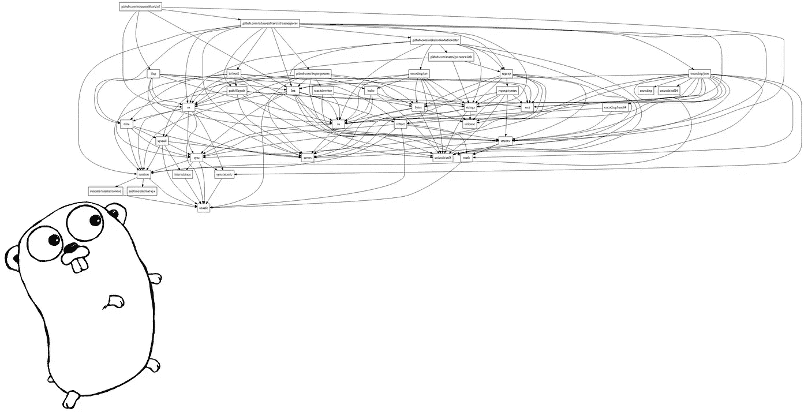

# 使用 Go dep 作为项目维护者

> 原文：<https://medium.com/hackernoon/using-go-dep-as-a-project-maintainer-641d1f3006d7>



A Go dependency graph, generated using [https://github.com/davecheney/graphpkg](https://github.com/davecheney/graphpkg).

在 Go 中管理依赖关系可能不是你首先要注意的事情，但是总有一天你可能不得不面对这个任务。在这篇文章中，我将从项目维护者的角度分享我使用 Go `dep`的第一步的一些观察。

Go dependency management，或者像我们地鼠所说的 *vendoring* ，有着相当漫长和稍微复杂的[历史](https://blog.gopheracademy.com/advent-2016/saga-go-dependency-management/)。随着 Go [dep](https://github.com/golang/dep) 社区现在似乎慢慢(？)但肯定会集中在一个标准上。因为在我参与的一个项目中，我无论如何都需要它，所以我认为在“真正”应用它之前，在沙盒环境中获得一些实践知识是有意义的。

好了，让我们直接进入主题:首先，我们必须安装 Go `dep,`，这里假设安装了 Go 的最新版本(我用的是 1.8):

```
$ go get -u github.com/golang/dep/cmd/dep
```

接下来，我们需要一个我们想要提供的[程序](https://hackernoon.com/tagged/program)，所以这里有一个简单的[例子](https://gist.github.com/mhausenblas/30e8dc5f7682888c10906cb0f8c471cb)使用 [Kubernetes Go 客户端](https://github.com/kubernetes/client-go/)创建一个集群外壳的原始版本(边注我使用 [Minishift](https://github.com/minishift/minishift) 来设置和运行 [Kubernetes](https://hackernoon.com/tagged/kubernetes) ):

目标是出售第 7 到 10 行中导入的包。所以，为了做到这一点，我在`main.go`文件所在的目录中执行了这些命令:

```
$ dep init
$ dep ensure k8s.io/client-go@^2.0.0
$ dep ensure github.com/chzyer/readline@1.4
```

注意，最后两行并不是严格要求的，因为`dep`足够聪明，可以自己计算出需要的版本。在我的例子中，我需要将`client-go`包固定在`2.0.0`版本上，以确保它能与我正在使用的 Kubernetes 版本兼容。

完成该步骤后，目录布局如下所示:

```
.
├── Gopkg.lock
├── Gopkg.toml
├── main.go
└── vendor
    ├── cloud.google.com
    ├── github.com
    ├── golang.org
    ├── google.golang.org
    ├── gopkg.in
    └── k8s.io
```

现在我处于`go build`或`go install`程序并执行它的位置。这里有一个重要的注意事项和潜在的陷阱:除非你在你的源代码中实际导入了一个特定的包，否则一个`dep ensure`不会将这个版本下载到`vendor/`子目录中。

回到最初的问题:作为一个项目维护者，我现在需要做些什么来使这个 vendored 设置在 repo 中可供其他人使用？由于我找不到围绕这个话题的最佳实践，我在 [Go Slack](https://invite.slack.golangbridge.org/) 社区的`#vendor`频道上跳了起来，友好的人们(特别感谢[彼得·波尔根](https://twitter.com/peterbourgon))提供了指导:

1.  在您的回购中，您至少应该包括`Gopkg.toml`和`Gopkg.lock`。
2.  您可以包含`vendor/`子目录，并且…
3.  …如果包含`vendor/`子目录:

*   你的回购变大:(
*   拉取请求的差异可能会变得更加复杂:(
*   保证可重现的构建，因为它将您从上游的变更中分离出来:)
*   它不需要你的回购用户执行额外的`dep ensure`来构建程序:)

总结:虽然 Go `dep`仍处于早期阶段，缺乏一些关于最佳实践的文档(显然一个 [FAQ](https://github.com/carolynvs/dep/blob/c20dddcdc17872f956391b1eda6cac9364cea4dc/FAQ.md) 即将推出)，但我发现它很容易使用，并且感觉我现在已经准备好使用它了。

编辑:正如 [Ahmet Alp Balkan](https://medium.com/u/2cac56571879?source=post_page-----641d1f3006d7--------------------------------) 所指出的，您可以通过 godoc.org 为包生成可视化的依赖图，例如[https://godoc.org/github.com/mhausenblas/cinf?import-graph&hide = 1](https://godoc.org/github.com/mhausenblas/cinf?import-graph&hide=1)

[](http://bit.ly/HackernoonFB)[](https://goo.gl/k7XYbx)[](https://goo.gl/4ofytp)

> [黑客中午](http://bit.ly/Hackernoon)是黑客如何开始他们的下午。我们是 [@AMI](http://bit.ly/atAMIatAMI) 家庭的一员。我们现在[接受投稿](http://bit.ly/hackernoonsubmission)，并乐意[讨论广告&赞助](mailto:partners@amipublications.com)机会。
> 
> 如果你喜欢这个故事，我们推荐你阅读我们的[最新科技故事](http://bit.ly/hackernoonlatestt)和[趋势科技故事](https://hackernoon.com/trending)。直到下一次，不要把世界的现实想当然！

